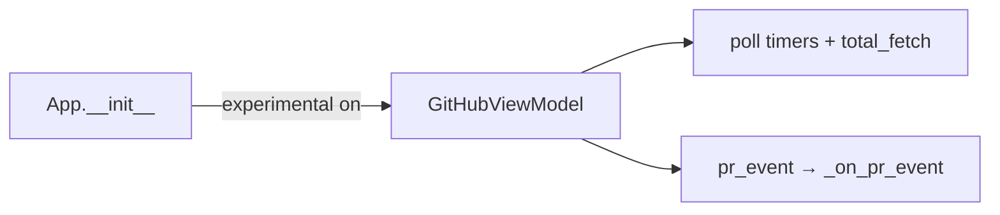

# Context: Iteration 0 — Fetch & show at startup (walking skeleton)

## Goal
The GitHub view-model is constructed when the app launches (experimental features on), so polling
and notifications run from the start — not only after the Pull Requests tab is clicked. The panel,
when first opened, renders cached PRs **instantly** with no "Loading…" flash.

## Tests to write
- App constructs the GitHub view-model at startup when experimental features are enabled: proves background fetch/notifications start without opening the tab.
- App does not construct the GitHub view-model when experimental features are disabled: proves we don't pay the cost when the feature is off.
- Opening the panel reuses the already-constructed view-model: proves no second VM / duplicate timers.
- Panel renders cached PRs immediately on construction and the loading label stays hidden: proves cache is shown, no flash.
- Panel shows the loading label only when there are no cached PRs and a token is configured: proves loading is reserved for genuinely-empty state.
- A `pr_event` emitted before the panel is opened still triggers a notification: proves notifications work tab-unopened.

## Files to touch
- [cli.py](worktree_manager/cli.py) — construct `self._github_vm` + connect `pr_event` in `App.__init__` when experimental; `_show_github_panel` reuses it.
- [github_panel.py](worktree_manager/ui/github_panel.py) — `__init__` syncs to current `vm.prs` instead of unconditionally showing the loading label.

## Design / pseudocode

#### `worktree_manager/cli.py`
```
App.__init__:
    self._store = ConfigStore(); ...
    if self._store.get_experimental_features():
        self._github_vm = GitHubViewModel(store=self._store)   # starts timers + first total_fetch
        self._github_vm.pr_event.connect(self._on_pr_event)    # notifications live from launch

_show_github_panel:
    if not hasattr(self, "_github_vm"):          # safety: experimental toggled on mid-session
        self._github_vm = GitHubViewModel(store=self._store)
        self._github_vm.pr_event.connect(self._on_pr_event)
    if "github" not in self._panel_cache:
        self._panel_cache["github"] = GitHubPanel(vm=self._github_vm)
    set_panel(...); sidebar.set_active_tab("github"); panel.show()
```

#### `worktree_manager/ui/github_panel.py`
```
__init__ (tail, replacing the unconditional loading block):
    vm.prs_updated.connect(self._on_prs_updated)
    ...
    if vm.token_state == CONFIGURED:
        if vm.prs:                 # cache already populated → instant render, no flash
            self._render_pr_list()
        else:
            self._pr_list.hide(); self._loading_label.show()
```

## Diagrams


## Relevant existing code

`App.__init__` ([cli.py:64](worktree_manager/cli.py#L64)) builds `self._store = ConfigStore()` then the sidebar with `on_github=self._show_github_panel`.

`_show_github_panel` today (lazy — the bug) ([cli.py:796](worktree_manager/cli.py#L796)):
```python
def _show_github_panel(self):
    if not hasattr(self, "_github_vm"):
        self._github_vm = GitHubViewModel(store=self._store)
        self._github_vm.pr_event.connect(self._on_pr_event)
    if "github" not in self._panel_cache:
        self._panel_cache["github"] = GitHubPanel(vm=self._github_vm)
    ...
```

`GitHubViewModel.__init__` already loads cache, emits `prs_updated`, and (if token configured) starts timers + `QTimer.singleShot(0, self.total_fetch)` ([github_vm.py:52-71](worktree_manager/github_vm.py#L52)). It handles `MISSING` token safely (no timers).

Panel tail today (the unconditional flash) ([github_panel.py:352](worktree_manager/ui/github_panel.py#L352)):
```python
if vm.token_state == TokenState.CONFIGURED:
    self._pr_list.hide()
    self._loading_label.show()
```

Existing tests to extend: [test_github_vm_bootstrap.py](tests/test_github_vm_bootstrap.py), [test_github_sidebar_wiring_qt.py](tests/test_github_sidebar_wiring_qt.py), [test_github_vm_notification_gating_qt.py](tests/test_github_vm_notification_gating_qt.py).

## Constraints / invariants
- The VM emits `prs_updated` from its constructor *before* the panel exists — the panel must **pull** `vm.prs` on construction, never rely on having received that past signal.
- Do not construct the VM twice (duplicate poll timers). `hasattr(self, "_github_vm")` guards the lazy path.
- No silent exceptions.

## Done when (gate items)
- [ ] With experimental on + token set, launching the app starts background fetching immediately (a `total_fetch` runs before the PR tab is ever clicked — confirm via the footer status text changing, or a logged fetch).
- [ ] A PR event (e.g. CI fail) fires a desktop notification **without** opening the Pull Requests tab.
- [ ] Opening the Pull Requests tab shows cached PRs instantly with **no** "Loading pull requests…" flash.
- [ ] With no cache yet (fresh state), opening the tab shows the loading label until the first fetch completes.
- [ ] With experimental off, no GitHub VM is created (no background GitHub network activity).

## TDD mode: Autonomous
TDD directly. Keep the ledger below as you go.

### Implementation Ledger — Iteration 0
- GitHub VM constructed at startup when experimental on: red → green ✓
- GitHub VM not constructed at startup when experimental off: red → green ✓
- Opening panel reuses the startup-constructed VM: red → green ✓
- Panel renders cached PRs immediately with no loading flash: red → green ✓
- Panel shows loading label when no cache and token configured: red → green ✓
- PR event before panel opened triggers a notification: red → green ✓

Production: `worktree_manager/cli.py` (bootstrap VM + connect `pr_event` in `App.__init__`),
`worktree_manager/ui/github_panel.py` (render from `vm.prs` on construct, loading only when empty).
Affected suites green: 58 passed.
