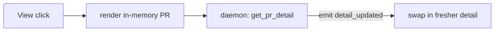

# Context: Iteration 1 — Instant, non-freezing PR detail (View)

## Goal
Clicking **↗ View** opens the PR detail **instantly** from the already-loaded in-memory object
(zero network), then silently refreshes just that one PR in the background and swaps in the fresher
data when it arrives. The window never freezes while the detail loads.

## Tests to write
- Selecting a PR sets it as the selected PR and emits the detail-updated signal synchronously, with no network call: proves instant render from memory.
- Selecting a PR then spawns a background refresh that re-emits detail-updated when fresh data arrives: proves silent refresh.
- A failed background detail refresh surfaces an error and does not crash or clear the shown PR: proves the previous detail stays visible.
- The detail pane keeps showing the previously selected PR until the refreshed data lands: proves no placeholder / no flicker.

## Files to touch
- [github_vm.py](worktree_manager/github_vm.py) — rewrite `select_pr` to render-from-memory then refresh in a daemon thread.
- [github_panel.py](worktree_manager/ui/github_panel.py) — `_on_pr_detail_updated` already re-renders from `vm.selected_pr`; ensure it tolerates being called twice (instant + refreshed) without losing the view.

## Design / pseudocode

#### `worktree_manager/github_vm.py`
```
select_pr(pr):
    if self._svc is None: return
    self.selected_pr = pr               # already carries checks/reviews/comments from the poll
    self.pr_detail_updated.emit()       # INSTANT render, no network
    self.mark_pr_comments_seen(pr)
    spawn daemon thread _refresh_selected(pr)

_refresh_selected(pr):
    try:
        refreshed = self._svc.get_pr_detail(pr.number, pr=pr)
    except PermissionError: set EXPIRED; stop timers; emit token_state_changed; return
    except Exception as exc: log + self.refresh_error.emit(str(exc)); return   # keep prev detail
    if self.selected_pr is not None and self.selected_pr.pr_key == pr.pr_key:
        self.selected_pr = refreshed
        self.pr_detail_updated.emit()   # swap in fresher data
```

#### `worktree_manager/ui/github_panel.py`
`_on_pr_detail_updated` (existing) reads `vm.selected_pr` and rebuilds the detail widgets — it is
idempotent, so calling it for the instant render and again for the refresh just re-renders in place.
Guard: if `vm.selected_pr is None` keep the list (it already does).

## Diagrams


## Relevant existing code

`select_pr` today — synchronous network on the UI thread (the freeze) ([github_vm.py:383](worktree_manager/github_vm.py#L383)):
```python
def select_pr(self, pr):
    if self._svc is None: return
    self.selected_pr = self._svc.get_pr_detail(pr.number, pr=pr)   # blocks UI thread
    self.pr_detail_updated.emit()
    self.mark_pr_comments_seen(pr)
```

`get_pr_detail(pr_number, pr)` does up to 4 HTTP calls (PR object, check-runs, reviews, comments) and returns a fully-populated `PullRequest` ([github_service.py:162](worktree_manager/github_service.py#L162)).

`_on_pr_detail_updated` rebuilds the detail UI from `vm.selected_pr` ([github_panel.py:615](worktree_manager/ui/github_panel.py#L615)).

Threaded+Signal idiom to copy ([github_vm.py:104-117](worktree_manager/github_vm.py#L104)):
```python
threading.Thread(target=self._run_total_fetch, daemon=True).start()
```

## Constraints / invariants
- `self.prs` items already hold full detail from the poll — the instant render must use the passed-in `pr` as-is, no fetch.
- Only swap in refreshed data if the user is still viewing the same PR (`selected_pr.pr_key` unchanged) — they may have hit Back or opened another.
- On refresh failure, **keep the currently-shown detail** (frontend decision 1); surface the error, don't clear.
- No silent exceptions.

## Done when (gate items)
- [ ] Clicking **↗ View** on a PR opens the detail pane **instantly** (no spinner, no freeze), even on a slow connection.
- [ ] Shortly after, the detail visibly updates if anything changed server-side (silent background refresh).
- [ ] The app stays interactive (can scroll / switch tabs) the entire time a PR detail is opening.
- [ ] Opening a second PR right after the first does not show stale data from the first once both refreshes settle.
- [ ] Regression: PR list still renders at startup from cache with no loading flash (Iteration 0).

## TDD mode: <set when built>
