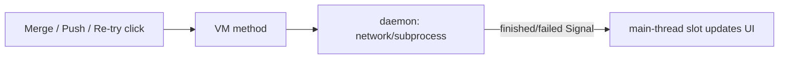

# Context: Iteration 2 — Non-freezing actions (Merge / Re-try / Push & Open PR)

## Goal
Merge, CI re-runs, and Push & Open PR all run **off the UI thread** so the app never freezes
mid-operation. The blocking `time.sleep` countdowns are replaced with a non-blocking delayed
refresh so GitHub's eventual consistency is still respected without locking the window.

## Tests to write
- Merging a PR runs the merge call on a background thread and emits a result signal: proves no UI-thread block.
- A successful merge schedules a delayed refresh (non-blocking) instead of sleeping: proves the countdown is gone.
- A failed merge emits an error signal carrying the message and re-enables the merge button: proves error handling.
- Re-trying failed CIs runs the POST(s) on a background thread and still schedules the quick re-fetch: proves async re-run.
- Opening a PR (push + create) runs push and create on a background thread and emits success or error: proves Push & Open PR never freezes.
- A push/create failure emits the error message and re-enables the button: proves inline error path.

## Files to touch
- [github_vm.py](worktree_manager/github_vm.py) — thread `merge_pr`; thread the POSTs in `retry_failed_cis`/`retry_all_cis`; add `open_pull_request(...)`; add result/error signals.
- [github_panel.py](worktree_manager/ui/github_panel.py) — `_on_merge_pr` and `_on_push_open_pr` drop their `time.sleep` loops and react to VM signals; button state driven by signals.

## Design / pseudocode

#### `worktree_manager/github_vm.py`
```
# new signals
merge_finished = Signal(object)          # pr_key on success
merge_failed   = Signal(object, str)     # (pr_key, message)
open_pr_finished = Signal()
open_pr_failed   = Signal(str)

merge_pr(pr, squash=True):
    if self._svc is None: return
    spawn daemon:
        try:
            self._svc.merge_pr(pr, squash=squash)
            self.pr_event.emit(pr.pr_key, "pr_merged", f'✅ "{pr.title}" merged')   # keep notification
            self.merge_finished.emit(pr.pr_key)
            QTimer.singleShot(RERUN_REFETCH_MS, self.total_fetch)   # non-blocking eventual-consistency wait
        except Exception as exc:
            log; self.merge_failed.emit(pr.pr_key, str(exc))

retry_failed_cis(pr) / retry_all_cis(pr):
    optimistic mark running (UI thread, instant) + emit ci_rerun event
    spawn daemon: run the rerun POST(s); on error emit refresh_error
    self._schedule_quick_fetch()   # already non-blocking

open_pull_request(title, body, base, branch, draft, repo_path):
    spawn daemon:
        try:
            base_url = derive api base for repo_path     # moved from panel helper
            self._svc.push_branch(branch, repo_path)
            self._svc.create_pull_request(title, body, base, branch, draft, base_url)
            self.open_pr_finished.emit()
            QTimer.singleShot(RERUN_REFETCH_MS, self.total_fetch)
        except Exception as exc:
            log; self.open_pr_failed.emit(str(exc))
```

#### `worktree_manager/ui/github_panel.py`
```
_on_merge_pr(pr):
    disable button, "Merging…"           # NO time.sleep loop
    vm.merge_pr(pr, squash)
# react to signals:
on merge_finished: show "✅ Merged", hide merge UI, _on_back()
on merge_failed(msg): show red error, re-enable button

_on_push_open_pr():
    read fields, disable button "Pushing…"   # NO time.sleep loop
    vm.open_pull_request(...)
on open_pr_finished: re-enable button, switch to My PRs tab (index 0)
on open_pr_failed(msg): show inline red error, re-enable button
```

## Diagrams


## Relevant existing code

`_on_merge_pr` today — blocking countdown on the UI thread ([github_panel.py:738](worktree_manager/ui/github_panel.py#L738)):
```python
for remaining in range(5, 0, -1):
    self._merge_status_label.setText(f"✅ Merged — refreshing in {remaining}s…")
    QApplication.processEvents()
    time.sleep(1)
self._vm.total_fetch()
```

`_on_push_open_pr` today — sync push+create+sleep on the UI thread (the freeze) ([github_panel.py:866](worktree_manager/ui/github_panel.py#L866)). Uses helper `_github_api_base(repo_path)` ([github_panel.py:37](worktree_manager/ui/github_panel.py#L37)) to derive the repo base URL — move/keep this so the VM can call it.

`merge_pr` today (sync) ([github_vm.py:407](worktree_manager/github_vm.py#L407)); `retry_failed_cis`/`retry_all_cis` ([github_vm.py:416](worktree_manager/github_vm.py#L416)) already call `_schedule_quick_fetch` ([github_vm.py:462](worktree_manager/github_vm.py#L462)) but run the POSTs inline. Service methods: `merge_pr`, `push_branch`, `create_pull_request`, `rerun_*` ([github_service.py:219-275](worktree_manager/github_service.py#L219)).

## Constraints / invariants
- Keep the existing `pr_merged` `pr_event` notification on successful merge (frontend decision 2).
- Keep the eventual-consistency delay, but as `QTimer.singleShot` — never `time.sleep` on the UI thread.
- Optimistic "mark running" on re-run stays on the UI thread for instant feedback; only the POST moves to a thread.
- Signals emitted from worker threads are delivered to slots on the main thread (Qt queued connection) — safe.
- No silent exceptions; failures must reach the user via the existing error labels.

## Done when (gate items)
- [ ] Clicking **Push & Open PR** never freezes the app — the window stays interactive while pushing/creating.
- [ ] On push/create failure, the inline red error shows and the button re-enables (no freeze, no stuck "Pushing…").
- [ ] Clicking **Merge PR** never freezes; on success it shows merged + returns to the list and the merge notification fires.
- [ ] Clicking **Re-try failed/all CIs** never freezes; checks visibly flip to running immediately and refresh shortly after.
- [ ] Regression: View still opens instantly (Iteration 1); list still renders from cache at startup (Iteration 0).

## TDD mode: <set when built>
