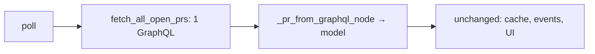

# Context: Iteration 4 — GraphQL poll consolidation

## Goal
Replace the per-PR REST detail fetch (`1 + 4×N` calls per poll) with a **single GraphQL query**
that returns every PR plus its checks, reviews, comments, and mergeability — mapped into the
existing `PullRequest`/`CICheck`/`Review`/`PRComment` model so nothing downstream changes.

## Tests to write
- The GraphQL query string requests all required fields (PR meta, mergeable/mergeStateStatus, reviews, comments, statusCheckRollup contexts with run_id): proves completeness.
- The GraphQL→model mapper lowercases check status/conclusion and maps a CheckRun node into a CICheck with run_id and check_suite_id: proves CI parity.
- The mapper maps the mergeable enum (MERGEABLE/CONFLICTING/UNKNOWN) to True/False/None and lowercases mergeStateStatus: proves mergeability parity.
- The mapper maps reviews and comments nodes into Review/PRComment objects: proves detail parity.
- A legacy StatusContext rollup node maps into a CICheck (no run_id) without error: proves both node types handled.
- The fetch path issues one GraphQL request for all PRs instead of per-PR REST detail calls: proves consolidation.

## Files to touch
- [github_service.py](worktree_manager/github_service.py) — add `fetch_all_open_prs(login) -> list[PullRequest]` issuing the GraphQL query; add a pure `_pr_from_graphql_node(node)` mapper.
- [github_vm.py](worktree_manager/github_vm.py) — `_run_total_fetch`/`_fetch_known_prs` use the single GraphQL call instead of `discover_open_prs` + per-PR `get_pr_detail`.

## Design / pseudocode

#### `worktree_manager/github_service.py`
```
GRAPHQL_QUERY = '''
{ viewer { login }
  search(query:"is:pr is:open author:@me", type:ISSUE, first:100){ nodes{ ... on PullRequest{
    number title body url state isDraft headRefName baseRefName headRefOid
    mergeable mergeStateStatus repository{ nameWithOwner }
    reviews(first:50){ nodes{ author{login} state } }
    comments(first:100){ nodes{ databaseId author{login} body createdAt } }
    commits(last:1){ nodes{ commit{ statusCheckRollup{ contexts(first:100){ nodes{
      __typename
      ... on CheckRun{ name status conclusion checkSuite{ databaseId workflowRun{ databaseId } } }
      ... on StatusContext{ context state } } } } } } }
  } } }
  rateLimit{ cost remaining } }'''

fetch_all_open_prs(self) -> list[PullRequest]:
    resp = POST https://api.github.com/graphql {query: GRAPHQL_QUERY}
    401 → PermissionError; raise_for_status; if json has "errors" → RuntimeError(first message)
    return [ self._pr_from_graphql_node(n) for n in data.search.nodes if n ]

_pr_from_graphql_node(node) -> PullRequest:
    checks = []
    for c in rollup contexts:
        if __typename == "CheckRun":
            checks.append(CICheck(name=c.name,
                status=c.status.lower(),
                conclusion=(c.conclusion.lower() if c.conclusion else None),
                check_suite_id=str(c.checkSuite.databaseId) if c.checkSuite else None,
                run_id=str(c.checkSuite.workflowRun.databaseId) if c.checkSuite and c.checkSuite.workflowRun else None))
        elif __typename == "StatusContext":
            checks.append(CICheck(name=c.context, status="completed",
                conclusion={"SUCCESS":"success","FAILURE":"failure","ERROR":"failure",
                            "PENDING":None,"EXPECTED":None}.get(c.state), check_suite_id=None, run_id=None))
    mergeable = {"MERGEABLE":True,"CONFLICTING":False,"UNKNOWN":None}[node.mergeable]
    return PullRequest(number, title, body, html_url=node.url,
        head_branch=headRefName, base_branch=baseRefName, head_sha=headRefOid,
        state=node.state.lower(), draft=isDraft,
        mergeable=mergeable, mergeable_state=node.mergeStateStatus.lower(),
        checks=checks,
        reviews=[Review(r.author.login, r.state) for r in reviews],
        comments=[PRComment(r.databaseId, r.author.login, r.body, r.createdAt) for r in comments])
```

#### `worktree_manager/github_vm.py`
```
_run_total_fetch:
    set total_fetch_running
    try:
        self.fetch_status_changed.emit("Fetching all PRs…")
        self.prs = self._svc.fetch_all_open_prs()          # ONE request
        self._known_prs = [p.pr_key for p in self.prs]     # keep for state pruning
        self.prs.sort(key=lambda p: p.pr_key)
        self._save_pr_cache(); self._emit_pr_events(self.prs)
        self._initial_load_done = True; self.prs_updated.emit()
        emit tracking status
    except PermissionError: EXPIRED path
    except Exception: refresh_error
    finally: clear running flag
# quick_fetch reuses the same single-call path
```

## Diagrams


## Relevant existing code

REST path being replaced: `discover_open_prs` ([github_service.py:45](worktree_manager/github_service.py#L45)) + `_fetch_known_prs` parallel per-PR `get_pr_detail` ([github_vm.py:158](worktree_manager/github_vm.py#L158)). `get_pr_detail` ([github_service.py:162](worktree_manager/github_service.py#L162)) and `_parse_run_id` regex ([github_service.py:151](worktree_manager/github_service.py#L151)) become unused for polling (keep `get_pr_detail` for the Iteration-1 single-PR refresh).

Model the mapper targets ([github_models.py](worktree_manager/github_models.py)) — `ci_status` keys on lowercase `conclusion=="failure"`/`None`, and `mergeability()` keys on lowercase `mergeable_state` ("dirty"/"behind"/"blocked"/"clean"…), so lowercasing is required for parity.

**Live-verified** (see main doc "API Verification"): query returns the fields at cost 1; enum spaces confirmed. Example CheckRun: `status=COMPLETED conclusion=FAILURE checkSuite.workflowRun.databaseId=26702825172`.

## Constraints / invariants
- Map must produce **exactly** the REST-shaped model: lowercase status/conclusion/mergeable_state; `mergeable` as bool/None; review state left UPPERCASE (model compares `=="APPROVED"`).
- Handle both `CheckRun` and `StatusContext` rollup node types.
- `mergeable=UNKNOWN→None` keeps the existing "preserve previous mergeable when None" logic meaningful — preserve it.
- Keep `get_pr_detail` for the single-PR background refresh from Iteration 1.
- On GraphQL `errors` in the body, raise (surface) — no silent pass.
- Re-probe the live query before finalizing if anything in the schema is uncertain.

## Done when (gate items)
- [ ] A poll fetches all PRs with one GraphQL request (verify via logging / the `rateLimit.cost` vs the old per-PR call count).
- [ ] PR list, CI badges, mergeable badges, reviews, and comments all show the same data as before the change.
- [ ] CI pass/fail, new-comment, review, conflict, and ready-to-merge **notifications** still fire correctly.
- [ ] **Re-try failed/all CIs** still works (run_id came through from `workflowRun.databaseId`).
- [ ] Regression: startup-from-cache, instant View, non-freezing actions, and persisted detail (Iterations 0–3) all still work.

## TDD mode: <set when built>
