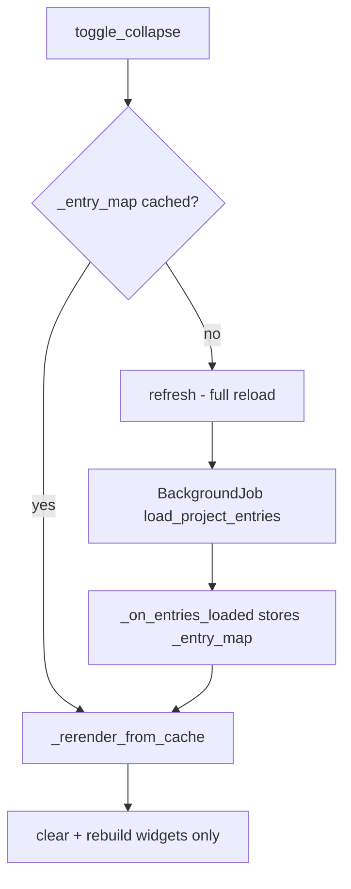

<!-- autobot-status
stage: 5
iteration: 0
gate: pending
mode: contract
updated: 2026-06-02
-->

# Project Caret No-Reload

## Overview
Clicking the caret (▶/▼) toggle on a project row in the Workspace Projects panel currently calls `refresh()`, which tears down all widgets and fires a full background `load_project_entries` job — re-reading every worktree's branch from git. The data is already in memory from the most recent load. The fix is to cache the last-loaded `entry_map` and, on toggle, re-render from cache instead of reloading. `refresh()` (full reload) is still called after mutations (create, edit, delete, branch-switch) where the data genuinely changes.

## UI / Flow

### Before (bug)
```
[Workspace Projects]
  ▼ my-app              ← click caret
    fix-auth  [fix/auth ▾]
    main      [main     ▾]

→ Loading spinner appears, full git read fires, panel rebuilds (slow, jarring)
```

### After (fix)
```
[Workspace Projects]
  ▼ my-app              ← click caret
    fix-auth  [fix/auth ▾]
    main      [main     ▾]

→ Row collapses/expands instantly from cached data, no spinner, no git I/O
```

### Collapsed state
```
[Workspace Projects]
  ▶ my-app              ← click caret again
  ▼ billing-svc
    main      [main     ▾]

→ my-app entries disappear instantly, billing-svc unchanged
```

## Architecture



Key change:
- [worktree_manager/ui/workspace_projects_panel.py:31](worktree_manager/ui/workspace_projects_panel.py#L31) — add `self._entry_map: dict | None = None` instance field.
- [worktree_manager/ui/workspace_projects_panel.py:116](worktree_manager/ui/workspace_projects_panel.py#L116) `_on_entries_loaded` — store `self._entry_map = entry_map` before rendering.
- [worktree_manager/ui/workspace_projects_panel.py:284](worktree_manager/ui/workspace_projects_panel.py#L284) `toggle_collapse` — replace `self.refresh()` with `self._rerender_from_cache()`.
- New method `_rerender_from_cache` — clears the scroll layout and re-calls `_add_project_row` for every project using the stored `_entry_map`. If `_entry_map` is `None` (first load not yet done), falls back to `refresh()`.
- [worktree_manager/ui/workspace_projects_panel.py:80](worktree_manager/ui/workspace_projects_panel.py#L80) `refresh()` — reset `self._entry_map = None` at the top so a full reload always discards the stale cache.

## Open Questions
None.

## Iteration Plan

User requested **Decide for me**. This is a **Small** feature — the walking skeleton delivers the whole fix in one iteration.

### Iteration 0 — Walking Skeleton
**Delivers:** Clicking the caret collapses/expands a project instantly using cached entry data — no spinner, no git I/O; full reload is preserved for mutations.
**Scope:**
- Add `self._entry_map: dict | None = None` to [worktree_manager/ui/workspace_projects_panel.py:31](worktree_manager/ui/workspace_projects_panel.py#L31).
- In [worktree_manager/ui/workspace_projects_panel.py:116](worktree_manager/ui/workspace_projects_panel.py#L116) `_on_entries_loaded`, set `self._entry_map = entry_map`.
- In [worktree_manager/ui/workspace_projects_panel.py:80](worktree_manager/ui/workspace_projects_panel.py#L80) `refresh()`, set `self._entry_map = None` before tearing down.
- Add `_rerender_from_cache()`: clear scroll layout, rebuild all project rows via `_add_project_row(project, self._entry_map)`.
- In [worktree_manager/ui/workspace_projects_panel.py:284](worktree_manager/ui/workspace_projects_panel.py#L284) `toggle_collapse`, replace `self.refresh()` with `self._rerender_from_cache()`.
**Out of scope:** Any other panel refresh paths (delete, create, edit, branch-switch all still call `refresh()` — correct since data changed).

---

## Behavioral Contract — Iteration 0

```python
"""Behavioral contract — Iteration 0: Project caret no-reload.

Toggling a project's caret collapses/expands from cache — no refresh job fires.
Run: python3.14 -m pytest tests/test_project_caret_no_reload_contract.py
"""
from unittest.mock import MagicMock, call

from PySide6.QtWidgets import QPushButton

from worktree_manager.ui.workspace_projects_panel import WorkspaceProjectsPanel


# ── helpers ───────────────────────────────────────────────────────────────────

def _project(name, paths):
    p = MagicMock()
    p.name = name
    p.entries = [MagicMock(worktree_path=path) for path in paths]
    return p


def _vm(projects=None):
    vm = MagicMock()
    vm._store.get_ui_pref.side_effect = lambda key, default=None: default
    vm._store.set_ui_pref.return_value = None
    vm._git.checked_out_branch.return_value = "main"
    vm.list_branches_for_worktree.return_value = ["main"]
    vm.load_projects.return_value = projects or []
    vm.load_project_entries.return_value = [
        {"worktree_path": e.worktree_path, "current_branch": "main", "branches": ["main"]}
        for p in (projects or [])
        for e in p.entries
    ]
    return vm


def _panel(qtbot, projects=None):
    projects = projects or [_project("alpha", ["/r/alpha"])]
    vm = _vm(projects)
    panel = WorkspaceProjectsPanel(
        parent=None, vm=vm, on_close=lambda: None,
    )
    qtbot.addWidget(panel)
    qtbot.waitUntil(lambda: not panel._loading, timeout=3000)
    return panel, vm


def _caret_btn(panel, name):
    return next(
        b for b in panel.findChildren(QPushButton)
        if name in b.text() and ("▼" in b.text() or "▶" in b.text())
    )


# ── 1 · No reload on caret click ─────────────────────────────────────────────

def test_caret_click_does_not_trigger_load_project_entries(qtbot):
    """Clicking the caret does NOT call vm.load_project_entries — data comes from cache."""
    panel, vm = _panel(qtbot)
    vm.load_project_entries.reset_mock()

    _caret_btn(panel, "alpha").click()

    vm.load_project_entries.assert_not_called()


def test_caret_click_does_not_show_loading_spinner(qtbot):
    """Clicking the caret leaves panel._loading False — no spinner fires."""
    panel, vm = _panel(qtbot)

    _caret_btn(panel, "alpha").click()

    assert not panel._loading


def test_caret_click_does_not_call_refresh_background_job(qtbot):
    """After caret click, no BackgroundJob for entry loading is started (_load_job unchanged)."""
    panel, vm = _panel(qtbot)
    job_before = panel._load_job

    _caret_btn(panel, "alpha").click()

    assert panel._load_job is job_before


# ── 2 · Collapse / expand correctness ────────────────────────────────────────

def test_caret_collapses_project_entries(qtbot):
    """After one caret click the project's entry rows are hidden (collapsed)."""
    panel, vm = _panel(qtbot)
    assert "alpha" in panel._collapsed or "alpha" not in panel._collapsed  # just warm up

    btn = _caret_btn(panel, "alpha")
    initial_collapsed = "alpha" in panel._collapsed
    btn.click()

    assert ("alpha" in panel._collapsed) != initial_collapsed


def test_caret_toggle_twice_restores_expanded(qtbot):
    """Clicking the caret twice leaves the project expanded again."""
    panel, vm = _panel(qtbot)
    btn = _caret_btn(panel, "alpha")
    btn.click()
    btn = _caret_btn(panel, "alpha")  # re-find after rerender
    btn.click()

    assert "alpha" not in panel._collapsed


def test_caret_persists_collapsed_state_to_store(qtbot):
    """The collapsed set is saved to the store on each toggle."""
    panel, vm = _panel(qtbot)
    _caret_btn(panel, "alpha").click()

    vm._store.set_ui_pref.assert_any_call("projects_collapsed", ["alpha"])


# ── 3 · Other projects unaffected ────────────────────────────────────────────

def test_collapsing_one_project_leaves_other_expanded(qtbot):
    """Toggling project A does not change project B's collapsed state."""
    projects = [_project("alpha", ["/r/alpha"]), _project("beta", ["/r/beta"])]
    vm = _vm(projects)
    panel = WorkspaceProjectsPanel(parent=None, vm=vm, on_close=lambda: None)
    qtbot.addWidget(panel)
    qtbot.waitUntil(lambda: not panel._loading, timeout=3000)

    _caret_btn(panel, "alpha").click()

    assert "beta" not in panel._collapsed


# ── 4 · Full refresh still loads data (mutations path) ───────────────────────

def test_refresh_calls_load_project_entries(qtbot):
    """refresh() (used after mutations) still calls vm.load_project_entries."""
    panel, vm = _panel(qtbot)
    vm.load_project_entries.reset_mock()

    panel.refresh()
    qtbot.waitUntil(lambda: not panel._loading, timeout=3000)

    vm.load_project_entries.assert_called_once()


def test_refresh_resets_entry_map_cache(qtbot):
    """refresh() clears _entry_map so the next render uses fresh data."""
    panel, vm = _panel(qtbot)
    assert panel._entry_map is not None  # populated after first load

    panel.refresh()
    # immediately after refresh() call (before job finishes) cache is cleared
    assert panel._entry_map is None
```

## ✋ Manual Testing Gate — Iteration 0

> STOP. Do not proceed until every item is confirmed by the user.

- [ ] Open the app, go to **Workspace Projects**. Click the caret (▼) on any project. → The project collapses **instantly** with no loading spinner and no delay.
- [ ] Click the caret (▶) again. → The project expands **instantly** showing its entries, still no spinner.
- [ ] With two projects visible, collapse one and verify the other is **unchanged**.
- [ ] Restart the app — previously collapsed projects are still collapsed (state persisted).
- [ ] Create a new project or edit an existing one. → The panel **does** reload normally (entries refresh after mutation).
- [ ] Switch a branch from the branch dropdown on an entry. → The panel still reloads correctly after the switch.

**Confirmed by user:** —
**How to confirm:** Perform each action, check each box. Reply "Iteration 0 confirmed" to complete the feature.
