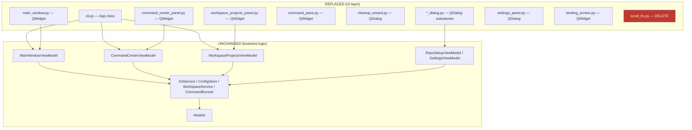

# PySide6 Migration

## Overview

Migrate the worktree-manager GUI from CustomTkinter (a Tkinter wrapper) to PySide6 (Qt6 bindings for Python). The app is an MVVM-structured desktop tool for managing git worktrees, a command center for running shell commands, and a workspace projects panel. The migration replaces every UI file while keeping all ViewModels, services, models, and business logic untouched. The goal is a native-feeling Qt app that is easier to style, theme, and maintain long-term than the CTk layer.

## UI / Flow

The app has a persistent sidebar on the left and a swappable main content area on the right. Three top-level views can be loaded into the main area: the worktree list, the command center, and the workspace projects panel.

### Main window skeleton

```
┌─────────────────────────────────────────────────────────────────┐
│  ┌──────────────┐  ┌──────────────────────────────────────────┐ │
│  │ Sidebar      │  │ Main Content Area                        │ │
│  │              │  │                                          │ │
│  │ [⊞ Command   │  │  Git Worktree Manager — <repo>           │ │
│  │   Center   ] │  │  ─────────────────────────────           │ │
│  │ [⊞ Workspace │  │  Worktrees          [+ New]  [⚙] [🧹]   │ │
│  │   Projects ] │  │                                          │ │
│  │ ▼ REPOS      │  │  ● (main)   14d ago                      │ │
│  │  ● my-repo   │  │  ○ feature  2h ago   [branch ▾] [✕]     │ │
│  │  ○ other     │  │  ○ fix/bug  3d ago ⚠ stale ...          │ │
│  │  ✕           │  │                                          │ │
│  │              │  │                                          │ │
│  │ [+ Add Repo] │  │                                          │ │
│  │ [↻ Refresh ] │  │                                          │ │
│  └──────────────┘  └──────────────────────────────────────────┘ │
└─────────────────────────────────────────────────────────────────┘
```

### Command Center panel

```
┌──────────────────────────────────────────────────────────────┐
│  Command Center                     [⚙ Commands] [+ Launch] [×]│
│  ┌────────────────────────────────────────────────────────┐   │
│  │ Filter running commands by name or repo…               │   │
│  └────────────────────────────────────────────────────────┘   │
│  ┌─────────────────────────────────────────────────────────┐  │
│  │ ● my-server  (my-repo / main)    [▶] [■] [⧉] [✕]       │  │
│  │ ┌───────────────────────────────────────────────────┐   │  │
│  │ │ stdout output scrollable text area                │   │  │
│  │ └───────────────────────────────────────────────────┘   │  │
│  └─────────────────────────────────────────────────────────┘  │
└──────────────────────────────────────────────────────────────┘
```

### Cleanup Wizard (modal dialog)

```
┌────────────────────────────────────┐
│  Cleanup Wizard                    │
│  ┌──────────────────────────────┐  │
│  │ Merged:                      │  │
│  │   → into main  [Select all]  │  │
│  │   ☑ feature/foo (merged…)    │  │
│  │ ────────────────────────────  │  │
│  │ Stale:         [Select all]  │  │
│  │   ☑ fix/bar   (30d, stale)   │  │
│  │ ────────────────────────────  │  │
│  │ Healthy:                     │  │
│  │   ☐ main/baz  (2h ago)       │  │
│  └──────────────────────────────┘  │
│  ☐ Admin Mode ⚠                    │
│  [Select All] [Cancel]   [Delete]  │
└────────────────────────────────────┘
```

## Architecture



**Key Qt mapping decisions:**

| CTk concept | Qt6 equivalent |
|---|---|
| `ctk.CTk()` | `QApplication` + `QMainWindow` |
| `ctk.CTkFrame` | `QWidget` or `QFrame` |
| `ctk.CTkToplevel` | `QDialog` (modal) or `QWidget` (floating) |
| `ctk.CTkScrollableFrame` | `QScrollArea` with a `QWidget` container |
| `ctk.CTkLabel` | `QLabel` |
| `ctk.CTkButton` | `QPushButton` |
| `ctk.CTkOptionMenu` | `QComboBox` |
| `ctk.CTkEntry` | `QLineEdit` |
| `ctk.CTkCheckBox` | `QCheckBox` |
| `ctk.CTkSegmentedButton` | `QButtonGroup` with radio buttons or a `QTabBar` |
| `ctk.CTkProgressBar` | `QProgressBar` |
| `ctk.StringVar` / `ctk.BooleanVar` | plain Python state + signal/slot wiring |
| `tkinter.messagebox` | `QMessageBox` |
| `tkinter.filedialog` | `QFileDialog` |
| `attach_scroll_fix()` | DELETE — Qt handles scroll natively |
| `.after(0, fn)` | `QTimer.singleShot(0, fn)` |
| `.pack()` / `.place()` | `QVBoxLayout` / `QHBoxLayout` / `QGridLayout` |
| `widget.trace_add("write", cb)` | Connect `QLineEdit.textChanged` etc. |
| `.configure(...)` | Direct property setters or stylesheets |

**Styling:** Use a single `QSS` stylesheet (Qt's CSS-like system) applied at app startup to replicate the dark/light appearance that CTk provided. The `appearance_mode = "system"` behavior maps to `QApplication.setStyle()` + palette.

## Iteration Plan

### Iteration 0 — Walking Skeleton
**Delivers:** The app launches with PySide6, shows the sidebar and the empty-state placeholder in the main area, and a repo can be added, saved, and switched between via the sidebar — no CTk imports survive.

**Scope:**
- Install PySide6, remove customtkinter from dependencies
- Delete `scroll_fix.py`
- Rewrite `cli.py` (`App` class + `main()`) using `QApplication` + `QMainWindow`
- Rewrite sidebar: repo list (collapsible), Add Repo button (via `QFileDialog`), Refresh button, Command Center button, Workspace Projects button
- Rewrite landing screen (empty state placeholder widget)
- Rewrite `main_window.py` (worktree list panel with branch switcher, New/Delete/Settings/Cleanup buttons — no dialogs wired yet, just stubs that print/pass)
- OS light/dark theme: apply `QApplication` palette from system at startup
- Add one `pytest-qt` smoke test: app launches without crashing

**Explicitly out of scope:** All dialogs (Create, Delete, Settings, RepoSetup, Cleanup, CommandCenter, WorkspaceProjects, AddCommand, ManageCommands, Launch) — those are wired in later iterations.

---

### Iteration 1 — Core Worktree Dialogs
**Delivers:** A user can create a new worktree, delete an existing one, and configure a newly-added repo — all from within the running Qt app.

**Scope:**
- `create_dialog.py` → `QDialog` (new branch / existing branch modes, copy-button helpers)
- `delete_dialog.py` → `QDialog` (also-delete-branch checkbox, uncommitted-changes warning)
- `repo_setup_dialog.py` → `QDialog` (worktree storage path picker)
- `settings_panel.py` → `QDialog` (storage path + stale days)
- Wire all four into `App` / `MainWindow`
- `pytest-qt` smoke tests for each dialog: opens without crash, cancel closes it, confirm calls the right VM method

**Builds on:** Iteration 0

---

### Iteration 2 — Command Center
**Delivers:** The Command Center panel is fully functional: users can manage saved commands, launch them against any repo/worktree, see live output, stop/restart/remove runs, and pop-out individual panes.

**Scope:**
- `command_center_panel.py` → `QWidget` (search filter, pane list, Launch + Manage Commands buttons)
- `command_pane.py` → `QWidget` (status dot, header buttons, scrollable output text, find bar)
- `command_popout.py` → `QDialog` (detached pane window)
- `manage_commands_dialog.py` → `QDialog` (per-repo command list, edit/delete inline)
- `add_command_dialog.py` → `QDialog` (repo picker, name, command text)
- `launch_dialog.py` → `QDialog` (repo/worktree/command picker with filter)
- Wire into `App._show_command_center()`
- `pytest-qt` smoke tests: panel loads, launch dialog opens/cancels, add-command dialog saves

**Builds on:** Iteration 1

---

### Iteration 3 — Cleanup Wizard & Workspace Projects
**Delivers:** The Cleanup Wizard correctly lists and deletes merged/stale branches with admin-mode support, and the Workspace Projects panel lets users create, open, and manage projects — completing the full feature set.

**Scope:**
- `cleanup_wizard.py` → `QDialog` (grouped branch list, checkboxes, admin mode toggle, progress loading state, select-all/subgroup buttons)
- `workspace_projects_panel.py` → `QWidget` (project list with collapsible groups, editor radio buttons, New dialog)
- `new_project_dialog.py` → `QDialog`
- `project_operations_dialog.py` → `QDialog`
- `landing_screen.py` → finalize (already stubbed in Iteration 0)
- Wire Cleanup Wizard into `App._show_cleanup()`
- Wire Workspace Projects into `App._show_workspace_projects()`
- `pytest-qt` smoke tests: cleanup wizard loads with candidates, workspace panel loads projects
- Full regression pass confirming Iterations 0–2 behaviour still works

**Builds on:** Iteration 2

---

## Iteration 0 — Walking Skeleton

### Phase 0.1 — PySide6 Dependencies & pytest-qt Wiring

**What it covers:** Install PySide6 + pytest-qt, configure pytest to use the PySide6 backend, verify the fixtures work end-to-end. No production widgets yet — just the foundation everything else builds on.

**Tests (Red) — write these first:**

```python
# tests/test_pyside6_setup.py
def test_pyside6_importable():
    """PySide6 is installed and importable."""
    import PySide6.QtWidgets  # noqa: F401


def test_qapplication_can_be_created(qapp):
    """pytest-qt's qapp fixture provides a real QApplication backed by PySide6."""
    from PySide6.QtWidgets import QApplication
    assert isinstance(qapp, QApplication)


def test_qtbot_can_add_widget(qtbot):
    """qtbot fixture works and can manage a QWidget lifecycle."""
    from PySide6.QtWidgets import QWidget
    w = QWidget()
    qtbot.addWidget(w)
    assert w.isHidden() or w.isVisible() or True  # smoke
```

**Production code (Green):**

Update `pyproject.toml`:

```toml
[build-system]
requires = ["setuptools>=68", "wheel"]
build-backend = "setuptools.build_meta"

[project]
name = "worktree-manager"
version = "0.1.0"
requires-python = ">=3.9"
dependencies = ["customtkinter>=5.2", "PySide6>=6.6"]

[project.optional-dependencies]
dev = ["pytest>=7", "pytest-qt>=4.2"]

[project.scripts]
worktree-manager = "worktree_manager.cli:main"

[tool.setuptools.packages.find]
where = ["."]
include = ["worktree_manager*"]

[tool.pytest.ini_options]
qt_api = "pyside6"
```

Install:

```
python3.14 -m pip install "PySide6>=6.6" "pytest-qt>=4.2"
```

**Done when:** `python3.14 -m pytest tests/test_pyside6_setup.py` passes with all three tests green, and `python3.14 -c "import PySide6.QtWidgets"` works.

---

### Phase 0.2 — LandingScreen Widget (Qt)

**What it covers:** Replace the CTk `LandingScreen` widget with a Qt `QWidget` that shows the empty-state message. Same behaviour as the current inline `_show_empty_main()` placeholder.

**Tests (Red) — write these first:**

```python
# tests/test_landing_screen_qt.py
from PySide6.QtWidgets import QLabel
from worktree_manager.ui.landing_screen import LandingScreen


def test_landing_screen_is_a_qwidget(qtbot):
    from PySide6.QtWidgets import QWidget
    w = LandingScreen()
    qtbot.addWidget(w)
    assert isinstance(w, QWidget)


def test_landing_screen_shows_empty_message(qtbot):
    w = LandingScreen()
    qtbot.addWidget(w)
    texts = [lbl.text() for lbl in w.findChildren(QLabel)]
    combined = "\n".join(texts)
    assert "No repo selected" in combined
    assert "Add Repo" in combined
```

**Production code (Green):**

Replace `worktree_manager/ui/landing_screen.py`:

```python
from PySide6.QtCore import Qt
from PySide6.QtWidgets import QLabel, QVBoxLayout, QWidget


class LandingScreen(QWidget):
    def __init__(self, parent=None):
        super().__init__(parent)
        layout = QVBoxLayout(self)
        layout.setAlignment(Qt.AlignCenter)
        label = QLabel(
            "No repo selected.\n"
            "Pick one from the sidebar or click + Add Repo."
        )
        label.setAlignment(Qt.AlignCenter)
        label.setStyleSheet("color: gray;")
        layout.addWidget(label)
```

**Done when:** `python3.14 -m pytest tests/test_landing_screen_qt.py` is green, and the file no longer imports `customtkinter` or `tkinter`.

---

### Phase 0.3 — Sidebar Widget (Qt)

**What it covers:** Replace the CTk sidebar (currently inline in `cli.py`) with a self-contained `Sidebar` Qt widget. Lists repos from the store, supports collapse, exposes click callbacks for every action.

**Tests (Red) — write these first:**

```python
# tests/test_sidebar_qt.py
from unittest.mock import MagicMock

from PySide6.QtCore import Qt
from PySide6.QtWidgets import QPushButton

from worktree_manager.ui.sidebar import Sidebar


def _make_store(repos=None, collapsed=None):
    store = MagicMock()
    store.all_repos.return_value = repos or {}
    store.get_ui_pref.side_effect = lambda key, default=None: (
        collapsed if key == "repos_collapsed" else default
    )
    return store


def _make_sidebar(qtbot, store, **overrides):
    callbacks = {
        "on_command_center": lambda: None,
        "on_workspace_projects": lambda: None,
        "on_add_repo": lambda: None,
        "on_refresh": lambda: None,
        "on_repo_selected": lambda path: None,
        "on_repo_delete": lambda path: None,
    }
    callbacks.update(overrides)
    sb = Sidebar(store=store, active_repo_path=None, **callbacks)
    qtbot.addWidget(sb)
    return sb


def _button_texts(widget):
    return [b.text() for b in widget.findChildren(QPushButton)]


def test_sidebar_has_top_action_buttons(qtbot):
    sb = _make_sidebar(qtbot, _make_store())
    texts = _button_texts(sb)
    assert any("Command Center" in t for t in texts)
    assert any("Workspace Projects" in t for t in texts)
    assert any("Add Repo" in t for t in texts)
    assert any("Refresh" in t for t in texts)


def test_sidebar_lists_configured_repos(qtbot, tmp_path):
    repo_a = tmp_path / "repo-a"
    repo_b = tmp_path / "repo-b"
    sb = _make_sidebar(qtbot, _make_store({str(repo_a): {}, str(repo_b): {}}))
    texts = _button_texts(sb)
    assert any("repo-a" in t for t in texts)
    assert any("repo-b" in t for t in texts)


def test_sidebar_marks_active_repo_with_filled_dot(qtbot, tmp_path):
    repo = tmp_path / "repo-a"
    store = _make_store({str(repo): {}})
    sb = Sidebar(
        store=store,
        on_command_center=lambda: None,
        on_workspace_projects=lambda: None,
        on_add_repo=lambda: None,
        on_refresh=lambda: None,
        on_repo_selected=lambda p: None,
        on_repo_delete=lambda p: None,
        active_repo_path=str(repo),
    )
    qtbot.addWidget(sb)
    texts = _button_texts(sb)
    assert any(t.startswith("● ") and "repo-a" in t for t in texts)


def test_sidebar_repo_button_invokes_on_repo_selected(qtbot, tmp_path):
    repo = tmp_path / "repo-a"
    clicked: list = []
    sb = _make_sidebar(
        qtbot, _make_store({str(repo): {}}),
        on_repo_selected=lambda p: clicked.append(p),
    )
    btn = next(b for b in sb.findChildren(QPushButton) if "repo-a" in b.text())
    qtbot.mouseClick(btn, Qt.LeftButton)
    assert clicked == [str(repo)]


def test_sidebar_delete_button_invokes_on_repo_delete(qtbot, tmp_path):
    repo = tmp_path / "repo-a"
    deleted: list = []
    sb = _make_sidebar(
        qtbot, _make_store({str(repo): {}}),
        on_repo_delete=lambda p: deleted.append(p),
    )
    del_btn = next(b for b in sb.findChildren(QPushButton) if b.text() == "✕")
    qtbot.mouseClick(del_btn, Qt.LeftButton)
    assert deleted == [str(repo)]


def test_sidebar_top_action_button_invokes_callback(qtbot):
    triggered: list = []
    sb = _make_sidebar(
        qtbot, _make_store(),
        on_command_center=lambda: triggered.append("cc"),
    )
    btn = next(b for b in sb.findChildren(QPushButton) if "Command Center" in b.text())
    qtbot.mouseClick(btn, Qt.LeftButton)
    assert triggered == ["cc"]


def test_sidebar_toggle_collapse_persists_to_store(qtbot):
    store = _make_store(collapsed=False)
    sb = _make_sidebar(qtbot, store)
    assert sb.repos_visible() is True
    sb.toggle_repos_section()
    assert sb.repos_visible() is False
    store.set_ui_pref.assert_called_with("repos_collapsed", True)


def test_sidebar_starts_collapsed_when_store_pref_is_true(qtbot):
    store = _make_store(collapsed=True)
    sb = _make_sidebar(qtbot, store)
    assert sb.repos_visible() is False


def test_sidebar_set_active_repo_updates_dot_marker(qtbot, tmp_path):
    repo_a = tmp_path / "repo-a"
    repo_b = tmp_path / "repo-b"
    sb = _make_sidebar(qtbot, _make_store({str(repo_a): {}, str(repo_b): {}}))
    sb.set_active_repo(str(repo_b))
    texts = _button_texts(sb)
    assert any(t.startswith("● ") and "repo-b" in t for t in texts)
    assert any(t.startswith("○ ") and "repo-a" in t for t in texts)
```

**Production code (Green):**

New file `worktree_manager/ui/sidebar.py`:

```python
from pathlib import Path

from PySide6.QtWidgets import (
    QHBoxLayout, QPushButton, QScrollArea, QVBoxLayout, QWidget,
)


class Sidebar(QWidget):
    def __init__(
        self,
        store,
        on_command_center,
        on_workspace_projects,
        on_add_repo,
        on_refresh,
        on_repo_selected,
        on_repo_delete,
        active_repo_path=None,
        parent=None,
    ):
        super().__init__(parent)
        self._store = store
        self._on_repo_selected = on_repo_selected
        self._on_repo_delete = on_repo_delete
        self._active_repo_path = active_repo_path
        self._repo_buttons: dict = {}

        self.setFixedWidth(220)

        outer = QVBoxLayout(self)
        outer.setContentsMargins(4, 8, 4, 12)
        outer.setSpacing(4)

        cc_btn = QPushButton("⊞ Command Center")
        cc_btn.clicked.connect(on_command_center)
        outer.addWidget(cc_btn)

        wp_btn = QPushButton("⊞ Workspace Projects")
        wp_btn.clicked.connect(on_workspace_projects)
        outer.addWidget(wp_btn)

        self._collapsed = bool(store.get_ui_pref("repos_collapsed", False))
        arrow = "▶" if self._collapsed else "▼"
        self._header_btn = QPushButton(f"{arrow} REPOS")
        self._header_btn.setFlat(True)
        self._header_btn.setStyleSheet(
            "text-align: left; color: gray; font-weight: bold;"
        )
        self._header_btn.clicked.connect(self.toggle_repos_section)
        outer.addWidget(self._header_btn)

        self._repo_scroll = QScrollArea()
        self._repo_scroll.setWidgetResizable(True)
        self._repo_scroll.setFixedHeight(220)
        self._repo_container = QWidget()
        self._repo_layout = QVBoxLayout(self._repo_container)
        self._repo_layout.setContentsMargins(0, 0, 0, 0)
        self._repo_layout.setSpacing(2)
        self._repo_layout.addStretch(1)
        self._repo_scroll.setWidget(self._repo_container)
        outer.addWidget(self._repo_scroll)
        self._repo_scroll.setVisible(not self._collapsed)

        outer.addStretch(1)

        add_btn = QPushButton("+ Add Repo")
        add_btn.clicked.connect(on_add_repo)
        outer.addWidget(add_btn)

        refresh_btn = QPushButton("↻ Refresh")
        refresh_btn.clicked.connect(on_refresh)
        outer.addWidget(refresh_btn)

        self.populate_repo_rows()

    def populate_repo_rows(self):
        while self._repo_layout.count():
            item = self._repo_layout.takeAt(0)
            w = item.widget()
            if w is not None:
                w.deleteLater()
        self._repo_buttons.clear()

        for path in self._store.all_repos().keys():
            name = Path(path).name
            is_active = (path == self._active_repo_path)
            row = QWidget()
            row_layout = QHBoxLayout(row)
            row_layout.setContentsMargins(0, 0, 0, 0)
            row_layout.setSpacing(2)

            label = ("● " if is_active else "○ ") + name
            btn = QPushButton(label)
            btn.setStyleSheet("text-align: left;")
            btn.clicked.connect(
                lambda _checked=False, p=path: self._on_repo_selected(p)
            )
            row_layout.addWidget(btn, 1)

            del_btn = QPushButton("✕")
            del_btn.setFixedWidth(28)
            del_btn.setStyleSheet(
                "background-color: #c0392b; color: white; border: none;"
            )
            del_btn.clicked.connect(
                lambda _checked=False, p=path: self._on_repo_delete(p)
            )
            row_layout.addWidget(del_btn)

            self._repo_layout.addWidget(row)
            self._repo_buttons[path] = btn

        self._repo_layout.addStretch(1)

    def set_active_repo(self, repo_path):
        self._active_repo_path = repo_path
        self.populate_repo_rows()

    def repos_visible(self):
        return self._repo_scroll.isVisible()

    def toggle_repos_section(self):
        self._collapsed = not self._collapsed
        self._store.set_ui_pref("repos_collapsed", self._collapsed)
        arrow = "▶" if self._collapsed else "▼"
        self._header_btn.setText(f"{arrow} REPOS")
        self._repo_scroll.setVisible(not self._collapsed)
```

**Done when:** All sidebar tests pass and the widget renders the expected button labels for an empty store, a single-repo store, and a multi-repo store.

---

### Phase 0.4 — MainWindow Widget (Qt — worktree list)

**What it covers:** Replace the CTk `MainWindow` with a Qt `QWidget` that lists worktrees, supports branch switching via `QComboBox`, and exposes header buttons for + New, ⚙ Settings, and 🧹 Cleanup. The dialog launches themselves are stubbed in this iteration (they just call the provided callback or `print()`); real dialogs arrive in Iteration 1.

**Tests (Red) — write these first:**

```python
# tests/test_main_window_qt.py
import time
from unittest.mock import MagicMock, patch

from PySide6.QtCore import Qt
from PySide6.QtWidgets import QComboBox, QLabel, QPushButton

from worktree_manager.main_window_vm import MainWindowViewModel
from worktree_manager.models import WorktreeModel
from worktree_manager.ui.main_window import MainWindow


def _make_vm():
    now = int(time.time())
    vm = MagicMock(spec=MainWindowViewModel)
    vm.load_worktrees.return_value = [
        WorktreeModel("/repos/proj", "main", True, now, False, False),
        WorktreeModel("/repos/proj-wt/fix-auth", "fix/auth", False, now - 3600, False, False),
    ]
    vm.list_branches_with_checkout_status.return_value = [
        ("main", True), ("fix/auth", True), ("hotfix/2.1", False),
    ]
    return vm


def _make_window(qtbot, vm=None, on_settings=None, on_cleanup=None, on_new=None):
    win = MainWindow(
        vm=vm or _make_vm(),
        repo_name="proj",
        on_settings=on_settings or (lambda: None),
        on_cleanup=on_cleanup or (lambda: None),
        on_new=on_new or (lambda: None),
    )
    qtbot.addWidget(win)
    return win


def _label_texts(widget):
    return [lbl.text() for lbl in widget.findChildren(QLabel)]


def _buttons(widget):
    return widget.findChildren(QPushButton)


def test_main_window_header_shows_repo_name(qtbot):
    win = _make_window(qtbot)
    assert any("proj" in t for t in _label_texts(win))


def test_main_window_has_new_settings_cleanup_buttons(qtbot):
    win = _make_window(qtbot)
    btn_texts = [b.text() for b in _buttons(win)]
    assert any("New" in t for t in btn_texts)
    assert any("⚙" in t for t in btn_texts)
    assert any("🧹" in t for t in btn_texts)


def test_main_window_lists_non_main_worktree_folder_names(qtbot):
    win = _make_window(qtbot)
    texts = _label_texts(win)
    assert any("fix-auth" in t for t in texts)
    assert any("(main)" in t for t in texts)


def test_main_window_shows_branch_dropdown_per_worktree(qtbot):
    win = _make_window(qtbot)
    combos = win.findChildren(QComboBox)
    # one per worktree (2 in the fixture)
    assert len(combos) == 2


def test_main_window_branch_dropdown_lists_all_branches(qtbot):
    win = _make_window(qtbot)
    combo = win.findChildren(QComboBox)[0]
    values = [combo.itemText(i) for i in range(combo.count())]
    assert "main" in values
    assert "fix/auth" in values
    assert "hotfix/2.1" in values


def test_main_window_switch_branch_calls_vm(qtbot):
    vm = _make_vm()
    win = _make_window(qtbot, vm=vm)
    win._switch_branch("/repos/proj-wt/fix-auth", "hotfix/2.1")
    vm.switch_branch.assert_called_once_with("/repos/proj-wt/fix-auth", "hotfix/2.1")


def test_main_window_switch_branch_shows_error_on_uncommitted(qtbot):
    vm = _make_vm()
    vm.switch_branch.side_effect = ValueError("uncommitted changes")
    win = _make_window(qtbot, vm=vm)
    with patch("PySide6.QtWidgets.QMessageBox.critical") as mock_err:
        result = win._switch_branch("/repos/proj-wt/fix-auth", "hotfix/2.1")
    mock_err.assert_called_once()
    assert result is False


def test_main_window_switch_branch_refreshes_on_success(qtbot):
    vm = _make_vm()
    win = _make_window(qtbot, vm=vm)
    initial = vm.load_worktrees.call_count
    win._switch_branch("/repos/proj-wt/fix-auth", "hotfix/2.1")
    assert vm.load_worktrees.call_count > initial


def test_main_window_new_button_invokes_callback(qtbot):
    called: list = []
    win = _make_window(qtbot, on_new=lambda: called.append("new"))
    btn = next(b for b in _buttons(win) if "New" in b.text())
    qtbot.mouseClick(btn, Qt.LeftButton)
    assert called == ["new"]


def test_main_window_settings_button_invokes_callback(qtbot):
    called: list = []
    win = _make_window(qtbot, on_settings=lambda: called.append("settings"))
    btn = next(b for b in _buttons(win) if "⚙" in b.text())
    qtbot.mouseClick(btn, Qt.LeftButton)
    assert called == ["settings"]


def test_main_window_cleanup_button_invokes_callback(qtbot):
    called: list = []
    win = _make_window(qtbot, on_cleanup=lambda: called.append("cleanup"))
    btn = next(b for b in _buttons(win) if "🧹" in b.text())
    qtbot.mouseClick(btn, Qt.LeftButton)
    assert called == ["cleanup"]


def test_main_window_stale_worktree_shows_warning(qtbot):
    vm = _make_vm()
    vm.load_worktrees.return_value = [
        WorktreeModel("/repos/proj-wt/old", "old", False, 0, True, False),
    ]
    win = _make_window(qtbot, vm=vm)
    texts = _label_texts(win)
    assert any("stale" in t for t in texts)
```

**Production code (Green):**

Replace `worktree_manager/ui/main_window.py`:

```python
import os
import time

from PySide6.QtWidgets import (
    QComboBox, QHBoxLayout, QLabel, QMessageBox, QPushButton, QScrollArea,
    QVBoxLayout, QWidget,
)

from worktree_manager.main_window_vm import MainWindowViewModel
from worktree_manager.models import WorktreeModel


def _fmt_age(ts):
    if ts == 0:
        return "no commits"
    diff = int(time.time()) - ts
    if diff < 3600:
        return f"{diff // 60}m ago"
    if diff < 86400:
        return f"{diff // 3600}h ago"
    return f"{diff // 86400}d ago"


class MainWindow(QWidget):
    def __init__(self, vm: MainWindowViewModel, repo_name: str,
                 on_settings, on_cleanup, on_new, parent=None):
        super().__init__(parent)
        self._vm = vm
        self._repo_name = repo_name
        self._on_settings = on_settings
        self._on_cleanup = on_cleanup
        self._on_new = on_new

        outer = QVBoxLayout(self)
        outer.setContentsMargins(16, 16, 16, 8)
        outer.setSpacing(4)

        header = QHBoxLayout()
        title = QLabel(f"Git Worktree Manager — {self._repo_name}")
        title.setStyleSheet("font-weight: bold; font-size: 16px;")
        header.addWidget(title)
        header.addStretch(1)
        settings_btn = QPushButton("⚙")
        settings_btn.setFixedWidth(36)
        settings_btn.clicked.connect(self._on_settings)
        cleanup_btn = QPushButton("🧹")
        cleanup_btn.setFixedWidth(36)
        cleanup_btn.clicked.connect(self._on_cleanup)
        header.addWidget(cleanup_btn)
        header.addWidget(settings_btn)
        outer.addLayout(header)

        sub = QHBoxLayout()
        sub_label = QLabel("Worktrees")
        sub_label.setStyleSheet("font-weight: bold;")
        sub.addWidget(sub_label)
        sub.addStretch(1)
        new_btn = QPushButton("+ New")
        new_btn.setFixedWidth(70)
        new_btn.clicked.connect(self._on_new)
        sub.addWidget(new_btn)
        outer.addLayout(sub)

        self._list_scroll = QScrollArea()
        self._list_scroll.setWidgetResizable(True)
        self._list_container = QWidget()
        self._list_layout = QVBoxLayout(self._list_container)
        self._list_layout.setContentsMargins(0, 0, 0, 0)
        self._list_layout.setSpacing(2)
        self._list_layout.addStretch(1)
        self._list_scroll.setWidget(self._list_container)
        outer.addWidget(self._list_scroll, 1)

        self.refresh()

    def refresh(self):
        while self._list_layout.count():
            item = self._list_layout.takeAt(0)
            w = item.widget()
            if w is not None:
                w.deleteLater()

        worktrees = self._vm.load_worktrees()
        branch_status = self._vm.list_branches_with_checkout_status()
        for wt in worktrees:
            self._add_row(wt, branch_status)
        self._list_layout.addStretch(1)

    def _add_row(self, wt: WorktreeModel, branch_status):
        row = QWidget()
        layout = QHBoxLayout(row)
        layout.setContentsMargins(0, 2, 0, 2)

        dot = QLabel("●" if wt.is_main else "○")
        dot.setFixedWidth(20)
        layout.addWidget(dot)

        wt_name = os.path.basename(wt.path) if not wt.is_main else "(main)"
        name_label = QLabel(wt_name)
        name_label.setFixedWidth(200)
        layout.addWidget(name_label)

        age = QLabel(_fmt_age(wt.last_commit_ts))
        age.setStyleSheet("color: gray;")
        age.setFixedWidth(80)
        layout.addWidget(age)

        if wt.is_stale:
            stale = QLabel("⚠ stale")
            stale.setStyleSheet("color: orange;")
            stale.setFixedWidth(70)
            layout.addWidget(stale)
        else:
            spacer = QLabel("")
            spacer.setFixedWidth(70)
            layout.addWidget(spacer)

        layout.addStretch(1)

        all_branches = [b for b, _ in branch_status]
        checked_out_set = {b for b, co in branch_status if co and b != wt.branch}

        combo = QComboBox()
        combo.addItems(all_branches)
        if wt.branch in all_branches:
            combo.setCurrentText(wt.branch)
        combo.setFixedWidth(160)

        def _on_change(new_branch, path=wt.path, c=combo, orig=wt.branch):
            if new_branch == orig:
                return
            if new_branch in checked_out_set:
                QMessageBox.critical(
                    self, "Cannot switch",
                    f"'{new_branch}' is already checked out in another worktree.",
                )
                c.blockSignals(True)
                c.setCurrentText(orig)
                c.blockSignals(False)
                return
            if not self._switch_branch(path, new_branch):
                c.blockSignals(True)
                c.setCurrentText(orig)
                c.blockSignals(False)

        combo.currentTextChanged.connect(_on_change)
        layout.addWidget(combo)

        if not wt.is_main:
            del_btn = QPushButton("✕")
            del_btn.setFixedWidth(28)
            del_btn.setStyleSheet("background-color: #c0392b; color: white; border: none;")
            del_btn.clicked.connect(lambda _checked=False, w=wt: self._open_delete(w))
            layout.addWidget(del_btn)

        self._list_layout.addWidget(row)

    def _switch_branch(self, worktree_path, new_branch):
        try:
            self._vm.switch_branch(worktree_path, new_branch)
            self.refresh()
            return True
        except ValueError as e:
            QMessageBox.critical(self, "Cannot switch branch", str(e))
            return False

    def _open_delete(self, wt: WorktreeModel):
        # Stubbed in Iteration 0 — real DeleteDialog arrives in Iteration 1.
        print(f"[stub] delete worktree: {wt.path}")
```

**Done when:** All `test_main_window_qt.py` tests pass; the widget renders without any tkinter/customtkinter imports; clicking + New / ⚙ / 🧹 invokes the right callback; branch dropdown switching invokes `vm.switch_branch`.

---

### Phase 0.5 — App (QMainWindow) Wiring

**What it covers:** Replace the procedural `App` class in `cli.py` with a Qt `QMainWindow` that hosts the sidebar on the left and a swappable content area on the right. Wires up Add-Repo via `QFileDialog`, repo deletion via `QMessageBox.question`, and stubs the Settings / Cleanup / Command Center / Workspace Projects show-methods. System theme is whatever Qt's default native style provides (which on macOS already follows OS appearance).

**Tests (Red) — write these first:**

```python
# tests/test_cli_qt.py
import sys
from unittest.mock import MagicMock, patch

import pytest
from PySide6.QtWidgets import QMainWindow

from worktree_manager.cli import App, parse_args, resolve_repo_path
from worktree_manager.git_service import GitService


# ── parse_args / resolve_repo_path: unchanged, copy of existing coverage ─────

def test_parse_args_no_argument():
    args = parse_args([])
    assert args.repo_path is None


def test_parse_args_with_path():
    args = parse_args(["/repos/proj"])
    assert args.repo_path == "/repos/proj"


def test_resolve_repo_path_valid(tmp_path):
    git = MagicMock(spec=GitService)
    git.is_valid_repo.return_value = True
    repo = tmp_path / "myrepo"
    repo.mkdir()
    assert resolve_repo_path(str(repo), git) == str(repo)


def test_resolve_repo_path_invalid(tmp_path, capsys):
    git = MagicMock(spec=GitService)
    git.is_valid_repo.return_value = False
    with pytest.raises(SystemExit):
        resolve_repo_path(str(tmp_path / "no"), git)
    assert "not a git repository" in capsys.readouterr().err.lower()


def test_resolve_repo_path_none_returns_none():
    assert resolve_repo_path(None, MagicMock(spec=GitService)) is None


# ── App: QMainWindow wiring ─────────────────────────────────────────────────

@pytest.fixture
def empty_store(tmp_path, monkeypatch):
    """Patch ConfigStore so all_repos returns empty and no file IO happens."""
    store = MagicMock()
    store.all_repos.return_value = {}
    store.get_ui_pref.side_effect = lambda key, default=None: default
    monkeypatch.setattr("worktree_manager.cli.ConfigStore", lambda *a, **kw: store)
    monkeypatch.setattr("worktree_manager.cli.GitService", lambda *a, **kw: MagicMock())
    return store


def test_app_is_qmainwindow(qtbot, empty_store):
    app = App(repo_path=None)
    qtbot.addWidget(app)
    assert isinstance(app, QMainWindow)


def test_app_window_title_set(qtbot, empty_store):
    app = App(repo_path=None)
    qtbot.addWidget(app)
    assert "Worktree Manager" in app.windowTitle()


def test_app_shows_landing_when_no_repo(qtbot, empty_store):
    from worktree_manager.ui.landing_screen import LandingScreen
    app = App(repo_path=None)
    qtbot.addWidget(app)
    assert isinstance(app._current_panel, LandingScreen)


def test_app_sidebar_present_when_no_repo(qtbot, empty_store):
    from worktree_manager.ui.sidebar import Sidebar
    app = App(repo_path=None)
    qtbot.addWidget(app)
    assert isinstance(app._sidebar, Sidebar)


def test_app_loads_main_window_when_repo_configured(qtbot, empty_store):
    from worktree_manager.models import RepoConfig
    from worktree_manager.ui.main_window import MainWindow

    cfg = RepoConfig(
        repo_path="/repos/proj", worktree_storage="/repos/proj-wt",
        stale_days=30, last_editor="cursor", last_editor_mode="reuse",
        last_opened="2026-05-19T10:00:00",
    )
    empty_store.get_repo.return_value = cfg
    empty_store.all_repos.return_value = {"/repos/proj": cfg}

    with patch("worktree_manager.main_window_vm.MainWindowViewModel") as MockVM:
        MockVM.return_value.load_worktrees.return_value = []
        MockVM.return_value.list_branches_with_checkout_status.return_value = []
        app = App(repo_path="/repos/proj")
        qtbot.addWidget(app)
        assert isinstance(app._current_panel, MainWindow)


def test_app_pick_repo_uses_qfiledialog(qtbot, empty_store):
    app = App(repo_path=None)
    qtbot.addWidget(app)
    with patch("PySide6.QtWidgets.QFileDialog.getExistingDirectory",
               return_value="") as mock_dlg:
        app._pick_and_add_repo()
    mock_dlg.assert_called_once()


def test_app_pick_repo_rejects_non_git_with_messagebox(qtbot, empty_store, tmp_path):
    app = App(repo_path=None)
    qtbot.addWidget(app)
    app._git.is_valid_repo = MagicMock(return_value=False)
    with patch("PySide6.QtWidgets.QFileDialog.getExistingDirectory",
               return_value=str(tmp_path)):
        with patch("PySide6.QtWidgets.QMessageBox.critical") as mock_err:
            app._pick_and_add_repo()
    mock_err.assert_called_once()


def test_app_confirm_delete_repo_yes_removes_from_store(qtbot, empty_store):
    from worktree_manager.models import RepoConfig
    cfg = RepoConfig(
        repo_path="/repos/proj", worktree_storage="/repos/proj-wt",
        stale_days=30, last_editor="cursor", last_editor_mode="reuse",
        last_opened="2026-05-19T10:00:00",
    )
    empty_store.all_repos.return_value = {"/repos/proj": cfg}
    app = App(repo_path=None)
    qtbot.addWidget(app)
    from PySide6.QtWidgets import QMessageBox
    with patch("PySide6.QtWidgets.QMessageBox.question",
               return_value=QMessageBox.Yes):
        app._confirm_delete_repo("/repos/proj", is_active=False)
    empty_store.delete_repo.assert_called_once_with("/repos/proj")


def test_app_confirm_delete_repo_no_keeps_store_intact(qtbot, empty_store):
    app = App(repo_path=None)
    qtbot.addWidget(app)
    from PySide6.QtWidgets import QMessageBox
    with patch("PySide6.QtWidgets.QMessageBox.question",
               return_value=QMessageBox.No):
        app._confirm_delete_repo("/repos/proj", is_active=False)
    empty_store.delete_repo.assert_not_called()


def test_app_show_command_center_is_stubbed_no_crash(qtbot, empty_store):
    """Iteration 0: real Command Center arrives in Iteration 2; method must exist
    and either no-op or show a 'coming soon' message without raising."""
    app = App(repo_path=None)
    qtbot.addWidget(app)
    app._show_command_center()  # must not raise


def test_app_show_workspace_projects_is_stubbed_no_crash(qtbot, empty_store):
    app = App(repo_path=None)
    qtbot.addWidget(app)
    app._show_workspace_projects()  # must not raise
```

**Production code (Green):**

Replace `worktree_manager/cli.py`:

```python
import argparse
import sys
from pathlib import Path

from PySide6.QtWidgets import (
    QApplication, QFileDialog, QHBoxLayout, QMainWindow, QMessageBox,
    QWidget,
)

from worktree_manager.config_store import ConfigStore
from worktree_manager.git_service import GitService


def parse_args(argv):
    parser = argparse.ArgumentParser(description="Git Worktree Manager")
    parser.add_argument("repo_path", nargs="?", default=None,
                        help="Path to the main git worktree")
    return parser.parse_args(argv)


def resolve_repo_path(path, git):
    if path is None:
        return None
    if not git.is_valid_repo(path):
        print(f"Error: '{path}' is not a git repository.", file=sys.stderr)
        sys.exit(1)
    return path


class App(QMainWindow):
    def __init__(self, repo_path=None, parent=None):
        super().__init__(parent)
        self.setWindowTitle("Git Worktree Manager")
        self.resize(900, 520)
        self.setMinimumSize(700, 400)

        self._store = ConfigStore()
        self._git = GitService()
        self._active_repo_path = None
        self._current_panel = None

        central = QWidget()
        self._central_layout = QHBoxLayout(central)
        self._central_layout.setContentsMargins(0, 0, 0, 0)
        self._central_layout.setSpacing(0)
        self.setCentralWidget(central)

        from worktree_manager.ui.sidebar import Sidebar
        self._sidebar = Sidebar(
            store=self._store,
            on_command_center=self._show_command_center,
            on_workspace_projects=self._show_workspace_projects,
            on_add_repo=self._pick_and_add_repo,
            on_refresh=self._refresh,
            on_repo_selected=self._switch_repo,
            on_repo_delete=lambda p: self._confirm_delete_repo(
                p, is_active=(p == self._active_repo_path),
            ),
            active_repo_path=None,
        )
        self._central_layout.addWidget(self._sidebar)

        if repo_path:
            self._load_repo(repo_path)
        else:
            self._show_empty_main()

    # ── panel swap helpers ──────────────────────────────────────────────────

    def _set_panel(self, widget):
        if self._current_panel is not None:
            self._central_layout.removeWidget(self._current_panel)
            self._current_panel.deleteLater()
        self._current_panel = widget
        self._central_layout.addWidget(widget, 1)

    def _show_empty_main(self):
        from worktree_manager.ui.landing_screen import LandingScreen
        self._set_panel(LandingScreen())

    # ── repo lifecycle ──────────────────────────────────────────────────────

    def _pick_and_add_repo(self):
        path = QFileDialog.getExistingDirectory(self, "Select git repo")
        if not path:
            return
        if not self._git.is_valid_repo(path):
            QMessageBox.critical(self, "Error", f"'{path}' is not a git repository.")
            return
        self._load_repo(path)

    def _switch_repo(self, repo_path):
        self._load_repo(repo_path)

    def _load_repo(self, repo_path):
        cfg = self._store.get_repo(repo_path)
        if cfg is None:
            # RepoSetupDialog arrives in Iteration 1; for now just refuse silently
            QMessageBox.information(
                self, "Setup required",
                f"'{Path(repo_path).name}' is not configured yet. "
                "Setup dialog ships in Iteration 1.",
            )
            return
        self._show_main(repo_path)

    def _show_main(self, repo_path):
        from worktree_manager.main_window_vm import MainWindowViewModel
        from worktree_manager.ui.main_window import MainWindow

        self._active_repo_path = repo_path
        self._sidebar.set_active_repo(repo_path)

        vm = MainWindowViewModel(
            repo_path=repo_path,
            config_store=self._store,
            git_service=self._git,
        )
        repo_name = Path(repo_path).name
        self._set_panel(MainWindow(
            vm=vm, repo_name=repo_name,
            on_settings=lambda: self._show_settings(repo_path),
            on_cleanup=lambda: self._show_cleanup(vm),
            on_new=lambda: self._show_new_worktree(vm),
        ))

    def _confirm_delete_repo(self, repo_path, is_active):
        name = Path(repo_path).name
        extra = (
            "\n\nThis is the currently open repo. Removing it will return you to the empty screen."
            if is_active else ""
        )
        ans = QMessageBox.question(
            self, "Remove repo",
            f'Remove "{name}" from the app?\n\n{repo_path}{extra}\n\nFiles on disk are not affected.',
        )
        if ans != QMessageBox.Yes:
            return
        self._store.delete_repo(repo_path)
        if is_active:
            self._active_repo_path = None
            self._sidebar.set_active_repo(None)
            self._show_empty_main()
        else:
            self._sidebar.populate_repo_rows()

    def _refresh(self):
        self._sidebar.populate_repo_rows()
        if self._current_panel is not None and hasattr(self._current_panel, "refresh"):
            self._current_panel.refresh()

    # ── stubs for dialogs/panels arriving in later iterations ───────────────

    def _show_settings(self, repo_path):
        QMessageBox.information(self, "Settings", "Ships in Iteration 1.")

    def _show_cleanup(self, vm):
        QMessageBox.information(self, "Cleanup Wizard", "Ships in Iteration 3.")

    def _show_new_worktree(self, vm):
        QMessageBox.information(self, "New Worktree", "Ships in Iteration 1.")

    def _show_command_center(self):
        QMessageBox.information(self, "Command Center", "Ships in Iteration 2.")

    def _show_workspace_projects(self):
        QMessageBox.information(self, "Workspace Projects", "Ships in Iteration 3.")


def main():
    args = parse_args(sys.argv[1:])
    git = GitService()
    repo_path = resolve_repo_path(args.repo_path, git)

    qt_app = QApplication.instance() or QApplication(sys.argv)
    window = App(repo_path=repo_path)
    window.show()
    sys.exit(qt_app.exec())


if __name__ == "__main__":
    repo_root = Path(__file__).resolve().parent.parent
    if str(repo_root) not in sys.path:
        sys.path.insert(0, str(repo_root))
    main()
```

**Done when:** All `test_cli_qt.py` tests pass; `python3.14 -m worktree_manager.cli` launches a real window with the sidebar visible and the landing screen in the content area.

---

### Phase 0.6 — Cleanup: Delete `scroll_fix.py` + Broken Legacy Tests

**What it covers:** Remove the dead `scroll_fix.py` module (Qt handles scroll natively) and delete the CTk-based legacy tests for the files we just rewrote. These tests assert against CTk widget trees and instantiate the now-Qt `App`/`MainWindow` with CTk patterns — they cannot be salvaged in place.

**Tests (Red) — write these first:**

```python
# tests/test_iteration_0_cleanup.py
"""Iteration 0 cleanup: assert that dead modules and obsolete tests are gone."""
import importlib
import os
import pathlib

import pytest


def test_scroll_fix_module_removed():
    with pytest.raises(ModuleNotFoundError):
        importlib.import_module("worktree_manager.ui.scroll_fix")


@pytest.mark.parametrize("relpath", [
    "tests/test_hover_scoped_scroll.py",
    "tests/test_main_window_iter0.py",
    "tests/test_sidebar_redesign.py",
    "tests/test_sidebar_stable_repo_list.py",
    "tests/test_workspace_projects_sidebar_wiring.py",
])
def test_legacy_ctk_test_file_removed(relpath):
    repo_root = pathlib.Path(__file__).resolve().parents[1]
    assert not (repo_root / relpath).exists(), \
        f"{relpath} still exists — delete it as part of Iteration 0 cleanup"


def test_no_ui_file_imports_customtkinter():
    """Iteration 0's rewritten UI files must not import customtkinter."""
    import worktree_manager.cli as cli_mod
    import worktree_manager.ui.landing_screen as ls_mod
    import worktree_manager.ui.main_window as mw_mod
    import worktree_manager.ui.sidebar as sb_mod
    for mod in (cli_mod, ls_mod, mw_mod, sb_mod):
        src = pathlib.Path(mod.__file__).read_text()
        assert "customtkinter" not in src, f"{mod.__name__} still imports customtkinter"
        assert "import tkinter" not in src, f"{mod.__name__} still imports tkinter"


def test_app_can_be_constructed_and_destroyed_cleanly(qtbot, monkeypatch):
    """End-to-end smoke: App constructs, shows, and tears down without raising."""
    from unittest.mock import MagicMock
    store = MagicMock()
    store.all_repos.return_value = {}
    store.get_ui_pref.side_effect = lambda key, default=None: default
    monkeypatch.setattr("worktree_manager.cli.ConfigStore", lambda *a, **kw: store)
    monkeypatch.setattr("worktree_manager.cli.GitService", lambda *a, **kw: MagicMock())
    from worktree_manager.cli import App
    app = App(repo_path=None)
    qtbot.addWidget(app)
    app.show()
    qtbot.waitExposed(app)
    app.close()
```

**Production code (Green):**

Delete these files:

```
worktree_manager/ui/scroll_fix.py
tests/test_hover_scoped_scroll.py
tests/test_main_window_iter0.py
tests/test_sidebar_redesign.py
tests/test_sidebar_stable_repo_list.py
tests/test_workspace_projects_sidebar_wiring.py
```

Also: scan `worktree_manager/ui/cli.py` (already rewritten in Phase 0.5) and all other rewritten Iter 0 UI files to confirm there are no leftover `from worktree_manager.ui.scroll_fix import attach_scroll_fix` lines. (Untouched UI files like `command_center_panel.py` keep their existing `attach_scroll_fix` imports — they will be deleted when those files are rewritten in Iterations 1–3. They still need to import successfully *if* something imports them; nothing in Iteration 0 imports them, so this is fine.)

Update `tests/test_cli.py`: rename to `tests/test_cli_legacy.py.bak` is NOT desirable — instead, **delete `tests/test_cli.py` entirely**, since `tests/test_cli_qt.py` (from Phase 0.5) now covers `parse_args`, `resolve_repo_path`, and the App lifecycle.

**Done when:** `python3.14 -m pytest tests/test_iteration_0_cleanup.py` passes; deleted test files are gone; `python3.14 -m pytest tests/` runs cleanly with no `ImportError`s related to `scroll_fix`. (Other unrelated test failures unrelated to Iter 0 work are acceptable to surface here.)

---

## ✋ Manual Testing Gate — Iteration 0

> STOP. Do not proceed to Iteration 1 until every item below is checked off by the user.

- [ ] Run `python3.14 -m worktree_manager.cli` from the `worktree-manager/` directory. A native Qt window titled "Git Worktree Manager" appears, sized roughly 900×520.
- [ ] The window has a fixed-width sidebar on the left containing: ⊞ Command Center, ⊞ Workspace Projects, a ▼ REPOS section header, + Add Repo, ↻ Refresh.
- [ ] The right side shows the landing message: "No repo selected. Pick one from the sidebar or click + Add Repo." in gray, centered.
- [ ] Click "▼ REPOS" — the arrow changes to ▶ and the (empty) repo scroll area collapses. Click again — it expands. Close and re-open the app — the collapse state was persisted.
- [ ] Click "+ Add Repo". A native folder picker opens. Cancel it — nothing happens. Pick a non-git folder — a red error dialog says "'<path>' is not a git repository."
- [ ] Pick a real git repo for the first time. An info dialog says "Setup dialog ships in Iteration 1." (RepoSetupDialog isn't wired yet — that's expected.)
- [ ] Manually configure a repo by editing `~/.config/worktree-manager/config.json` (or whatever path `ConfigStore` writes to) so that the repo has a worktree storage entry, then restart the app. The repo now appears in the sidebar with a ○ next to its name.
- [ ] Click the repo button in the sidebar. The landing screen disappears and the right side shows the Worktree Manager panel with header "Git Worktree Manager — <repo-name>", a + New button, a ⚙ Settings button, a 🧹 Cleanup button, and the worktree list.
- [ ] The worktree list shows one row per worktree with: dot (● for main, ○ for others), folder name (or "(main)"), age label, optional "⚠ stale", a branch dropdown, and (for non-main) a red ✕ button.
- [ ] Open the branch dropdown for a non-main worktree, select a different branch that is NOT checked out elsewhere — the branch is switched, the list refreshes, the row now reflects the new branch.
- [ ] Open the branch dropdown and select a branch that IS already checked out in another worktree — an error message appears and the dropdown reverts to the original branch.
- [ ] Click + New / ⚙ / 🧹 — each shows an info dialog saying "Ships in Iteration N" (no crashes).
- [ ] Click the red ✕ next to a repo in the sidebar — a Yes/No confirmation appears. Click No — nothing happens. Click Yes — the repo disappears from the sidebar; if it was the active one, the landing screen returns.
- [ ] Switch your OS appearance between Light and Dark mode while the app is open — the app's colors update to match (Qt's native style handles this on macOS).

**How to confirm:** Run the app, perform each action above, and check off each item manually.
Reply "Iteration 0 confirmed" (or describe any failures) before I write the plan for Iteration 1.

---

## Iteration 1 — Core Worktree Dialogs

### Phase 1.1 — RepoSetupDialog (Qt)

**What it covers:** Replace `RepoSetupDialog` (CTkToplevel) with a Qt `QDialog`. Shows the default storage path pre-filled in a `QLineEdit`, a Browse button that opens `QFileDialog`, and Cancel / Confirm buttons. Confirm calls `vm.confirm(storage_path=..., callback=...)`. No `MainWindow`/`App` wiring yet — that lands in Phase 1.5.

**Tests (Red) — write these first:**

```python
# tests/test_repo_setup_dialog_qt.py
from unittest.mock import MagicMock, patch

from PySide6.QtCore import Qt
from PySide6.QtWidgets import QDialog, QLineEdit, QPushButton

from worktree_manager.setup_settings_vm import RepoSetupViewModel
from worktree_manager.ui.repo_setup_dialog import RepoSetupDialog


def _make_vm(default_path="/repos/proj-worktrees"):
    vm = MagicMock(spec=RepoSetupViewModel)
    vm.default_storage_path.return_value = default_path
    return vm


def test_repo_setup_dialog_is_qdialog(qtbot):
    vm = _make_vm()
    d = RepoSetupDialog(parent=None, vm=vm, on_confirm=lambda: None)
    qtbot.addWidget(d)
    assert isinstance(d, QDialog)


def test_repo_setup_dialog_prefills_default_path(qtbot):
    vm = _make_vm(default_path="/repos/myrepo-worktrees")
    d = RepoSetupDialog(parent=None, vm=vm, on_confirm=lambda: None)
    qtbot.addWidget(d)
    entry = d.findChild(QLineEdit)
    assert entry.text() == "/repos/myrepo-worktrees"


def test_repo_setup_dialog_has_cancel_and_confirm_buttons(qtbot):
    vm = _make_vm()
    d = RepoSetupDialog(parent=None, vm=vm, on_confirm=lambda: None)
    qtbot.addWidget(d)
    btn_texts = [b.text() for b in d.findChildren(QPushButton)]
    assert "Cancel" in btn_texts
    assert "Confirm" in btn_texts


def test_repo_setup_dialog_cancel_closes_without_calling_vm(qtbot):
    vm = _make_vm()
    called = []
    d = RepoSetupDialog(parent=None, vm=vm, on_confirm=lambda: called.append("ok"))
    qtbot.addWidget(d)
    cancel = next(b for b in d.findChildren(QPushButton) if b.text() == "Cancel")
    qtbot.mouseClick(cancel, Qt.LeftButton)
    vm.confirm.assert_not_called()
    assert called == []


def test_repo_setup_dialog_confirm_calls_vm_with_entry_text(qtbot):
    vm = _make_vm()
    called = []
    d = RepoSetupDialog(parent=None, vm=vm, on_confirm=lambda: called.append("ok"))
    qtbot.addWidget(d)
    entry = d.findChild(QLineEdit)
    entry.setText("/somewhere/else")
    confirm = next(b for b in d.findChildren(QPushButton) if b.text() == "Confirm")
    qtbot.mouseClick(confirm, Qt.LeftButton)
    vm.confirm.assert_called_once()
    kwargs = vm.confirm.call_args.kwargs
    assert kwargs["storage_path"] == "/somewhere/else"
    # callback wiring — vm gets called with the on_confirm function
    assert callable(kwargs["callback"])


def test_repo_setup_dialog_browse_button_updates_entry(qtbot):
    vm = _make_vm()
    d = RepoSetupDialog(parent=None, vm=vm, on_confirm=lambda: None)
    qtbot.addWidget(d)
    browse = next(b for b in d.findChildren(QPushButton) if b.text() == "Browse")
    with patch("PySide6.QtWidgets.QFileDialog.getExistingDirectory",
               return_value="/picked/path"):
        qtbot.mouseClick(browse, Qt.LeftButton)
    entry = d.findChild(QLineEdit)
    assert entry.text() == "/picked/path"


def test_repo_setup_dialog_browse_cancel_leaves_entry_unchanged(qtbot):
    vm = _make_vm(default_path="/orig")
    d = RepoSetupDialog(parent=None, vm=vm, on_confirm=lambda: None)
    qtbot.addWidget(d)
    browse = next(b for b in d.findChildren(QPushButton) if b.text() == "Browse")
    with patch("PySide6.QtWidgets.QFileDialog.getExistingDirectory", return_value=""):
        qtbot.mouseClick(browse, Qt.LeftButton)
    entry = d.findChild(QLineEdit)
    assert entry.text() == "/orig"
```

**Production code (Green):**

Replace `worktree_manager/ui/repo_setup_dialog.py`:

```python
from PySide6.QtWidgets import (
    QDialog, QFileDialog, QHBoxLayout, QLabel, QLineEdit, QPushButton,
    QVBoxLayout,
)

from worktree_manager.setup_settings_vm import RepoSetupViewModel


class RepoSetupDialog(QDialog):
    def __init__(self, parent, vm: RepoSetupViewModel, on_confirm):
        super().__init__(parent)
        self.setWindowTitle("Worktree Storage")
        self.setModal(True)
        self._vm = vm
        self._on_confirm = on_confirm

        outer = QVBoxLayout(self)
        outer.setContentsMargins(24, 20, 24, 16)
        outer.setSpacing(8)

        title = QLabel("Where should worktrees be stored?")
        title.setStyleSheet("font-weight: bold;")
        outer.addWidget(title)

        row = QHBoxLayout()
        self._entry = QLineEdit(vm.default_storage_path())
        self._entry.setMinimumWidth(300)
        row.addWidget(self._entry, 1)
        browse = QPushButton("Browse")
        browse.setFixedWidth(80)
        browse.clicked.connect(self._browse)
        row.addWidget(browse)
        outer.addLayout(row)

        btns = QHBoxLayout()
        cancel = QPushButton("Cancel")
        cancel.clicked.connect(self.reject)
        btns.addWidget(cancel)
        btns.addStretch(1)
        confirm = QPushButton("Confirm")
        confirm.clicked.connect(self._confirm)
        btns.addWidget(confirm)
        outer.addLayout(btns)

    def _browse(self):
        path = QFileDialog.getExistingDirectory(
            self, "Choose worktree storage folder",
        )
        if path:
            self._entry.setText(path)

    def _confirm(self):
        self._vm.confirm(storage_path=self._entry.text(), callback=self._on_confirm)
        self.accept()
```

**Done when:** `python3.14 -m pytest tests/test_repo_setup_dialog_qt.py` is green and the module imports neither `customtkinter` nor `tkinter`.

---

### Phase 1.2 — SettingsDialog (Qt)

**What it covers:** Replace `SettingsPanel` with `SettingsDialog` (Qt `QDialog`). Shows the current worktree storage path (`QLineEdit` + Browse) and the stale threshold in days (`QSpinBox`), plus a Save button. Cancel just closes. Save calls `vm.save(worktree_storage=..., stale_days=...)`. The class is also re-exported from the existing module name `settings_panel` so existing imports keep working until Phase 1.5 finalises the wiring; the file is replaced in place.

**Tests (Red) — write these first:**

```python
# tests/test_settings_dialog_qt.py
from unittest.mock import MagicMock, patch

from PySide6.QtCore import Qt
from PySide6.QtWidgets import QDialog, QLineEdit, QPushButton, QSpinBox

from worktree_manager.setup_settings_vm import SettingsViewModel
from worktree_manager.ui.settings_panel import SettingsDialog


def _make_vm(storage="/repos/proj-wt", stale_days=30):
    vm = MagicMock(spec=SettingsViewModel)
    vm.worktree_storage = storage
    vm.stale_days = stale_days
    return vm


def test_settings_dialog_is_qdialog(qtbot):
    d = SettingsDialog(parent=None, vm=_make_vm())
    qtbot.addWidget(d)
    assert isinstance(d, QDialog)


def test_settings_dialog_prefills_storage_and_stale_days(qtbot):
    vm = _make_vm(storage="/x/y", stale_days=14)
    d = SettingsDialog(parent=None, vm=vm)
    qtbot.addWidget(d)
    entry = d.findChild(QLineEdit)
    assert entry.text() == "/x/y"
    spin = d.findChild(QSpinBox)
    assert spin.value() == 14


def test_settings_dialog_save_calls_vm_with_current_values(qtbot):
    vm = _make_vm()
    d = SettingsDialog(parent=None, vm=vm)
    qtbot.addWidget(d)
    d.findChild(QLineEdit).setText("/new/storage")
    d.findChild(QSpinBox).setValue(7)
    save = next(b for b in d.findChildren(QPushButton) if b.text() == "Save")
    qtbot.mouseClick(save, Qt.LeftButton)
    vm.save.assert_called_once_with(worktree_storage="/new/storage", stale_days=7)


def test_settings_dialog_cancel_does_not_call_vm(qtbot):
    vm = _make_vm()
    d = SettingsDialog(parent=None, vm=vm)
    qtbot.addWidget(d)
    cancel = next(b for b in d.findChildren(QPushButton) if b.text() == "Cancel")
    qtbot.mouseClick(cancel, Qt.LeftButton)
    vm.save.assert_not_called()


def test_settings_dialog_browse_updates_entry(qtbot):
    vm = _make_vm(storage="/orig")
    d = SettingsDialog(parent=None, vm=vm)
    qtbot.addWidget(d)
    browse = next(b for b in d.findChildren(QPushButton) if b.text() == "Browse")
    with patch("PySide6.QtWidgets.QFileDialog.getExistingDirectory",
               return_value="/chosen"):
        qtbot.mouseClick(browse, Qt.LeftButton)
    assert d.findChild(QLineEdit).text() == "/chosen"
```

**Production code (Green):**

Replace `worktree_manager/ui/settings_panel.py`:

```python
from PySide6.QtWidgets import (
    QDialog, QFileDialog, QHBoxLayout, QLabel, QLineEdit, QPushButton,
    QSpinBox, QVBoxLayout,
)

from worktree_manager.setup_settings_vm import SettingsViewModel


class SettingsDialog(QDialog):
    def __init__(self, parent, vm: SettingsViewModel):
        super().__init__(parent)
        self.setWindowTitle("Settings")
        self.setModal(True)
        self._vm = vm

        outer = QVBoxLayout(self)
        outer.setContentsMargins(24, 20, 24, 16)
        outer.setSpacing(8)

        title = QLabel("Settings")
        title.setStyleSheet("font-weight: bold; font-size: 16px;")
        outer.addWidget(title)

        row1 = QHBoxLayout()
        row1.addWidget(QLabel("Worktree storage:"))
        self._storage_entry = QLineEdit(vm.worktree_storage)
        self._storage_entry.setMinimumWidth(240)
        row1.addWidget(self._storage_entry, 1)
        browse = QPushButton("Browse")
        browse.setFixedWidth(80)
        browse.clicked.connect(self._browse)
        row1.addWidget(browse)
        outer.addLayout(row1)

        row2 = QHBoxLayout()
        row2.addWidget(QLabel("Stale threshold:"))
        self._stale_spin = QSpinBox()
        self._stale_spin.setRange(1, 3650)
        self._stale_spin.setValue(int(vm.stale_days))
        row2.addWidget(self._stale_spin)
        row2.addWidget(QLabel("days"))
        row2.addStretch(1)
        outer.addLayout(row2)

        btns = QHBoxLayout()
        cancel = QPushButton("Cancel")
        cancel.clicked.connect(self.reject)
        btns.addWidget(cancel)
        btns.addStretch(1)
        save = QPushButton("Save")
        save.clicked.connect(self._save)
        btns.addWidget(save)
        outer.addLayout(btns)

    def _browse(self):
        path = QFileDialog.getExistingDirectory(self, "Choose worktree storage")
        if path:
            self._storage_entry.setText(path)

    def _save(self):
        self._vm.save(
            worktree_storage=self._storage_entry.text(),
            stale_days=int(self._stale_spin.value()),
        )
        self.accept()
```

**Done when:** `python3.14 -m pytest tests/test_settings_dialog_qt.py` passes and the module imports neither `customtkinter` nor `tkinter`.

---

### Phase 1.3 — CreateDialog (Qt)

**What it covers:** Replace `CreateDialog` (CTkToplevel) with a Qt `QDialog` that supports both **New branch** and **Existing branch** modes via `QRadioButton`s. Mirrors the existing behaviour exactly: copy-from-branch / copy-from-worktree helpers, base branch dropdown, and a single `_create()` method that calls `on_create(branch, base_branch, is_existing, worktree_name)`. Preserves the underscore-named attributes (`_mode_var`, `_branch_entry`, `_wt_name_entry`, `_existing_var`, `_existing_wt_name_entry`, `_base_var`) so the existing 7 behavioural tests in `tests/test_ui_smoke.py` continue to pass.

**Tests (Red) — write these first:**

```python
# tests/test_create_dialog_qt.py
from PySide6.QtCore import Qt
from PySide6.QtWidgets import QDialog, QLineEdit, QPushButton, QRadioButton

from worktree_manager.ui.create_dialog import CreateDialog


def _make_dialog(qtbot, branches=None, existing_branches=None, on_create=None):
    d = CreateDialog(
        parent=None,
        branches=branches or ["main"],
        existing_branches=existing_branches or [],
        on_create=on_create or (lambda *a: None),
    )
    qtbot.addWidget(d)
    return d


def test_create_dialog_is_qdialog(qtbot):
    d = _make_dialog(qtbot)
    assert isinstance(d, QDialog)


def test_create_dialog_starts_in_new_branch_mode(qtbot):
    d = _make_dialog(qtbot)
    assert d._mode_var.get() == "new"


def test_create_dialog_has_two_mode_radio_buttons(qtbot):
    d = _make_dialog(qtbot)
    labels = [r.text() for r in d.findChildren(QRadioButton)]
    assert "New branch" in labels
    assert "Existing branch" in labels


def test_create_dialog_cancel_does_not_call_on_create(qtbot):
    calls = []
    d = _make_dialog(qtbot, on_create=lambda *a: calls.append(a))
    cancel = next(b for b in d.findChildren(QPushButton) if b.text() == "Cancel")
    qtbot.mouseClick(cancel, Qt.LeftButton)
    assert calls == []


def test_create_dialog_new_mode_create_calls_callback_with_correct_args(qtbot):
    calls = []
    d = _make_dialog(qtbot, branches=["main", "develop"],
                     on_create=lambda *a: calls.append(a))
    d._mode_var.set("new")
    d._on_mode_change()
    d._branch_entry.insert(0, "fix/login")
    d._base_var.set("main")
    d._wt_name_entry.clear()
    d._wt_name_entry.insert(0, "fix-login")
    d._create()
    assert len(calls) == 1
    branch, base, is_existing, wt_name = calls[0]
    assert (branch, base, is_existing, wt_name) == ("fix/login", "main", False, "fix-login")


def test_create_dialog_new_mode_empty_branch_does_not_call_callback(qtbot):
    calls = []
    d = _make_dialog(qtbot, on_create=lambda *a: calls.append(a))
    d._mode_var.set("new")
    d._on_mode_change()
    d._create()
    assert calls == []


def test_create_dialog_existing_mode_calls_callback_with_correct_args(qtbot):
    calls = []
    d = _make_dialog(qtbot,
                     existing_branches=["fix/auth", "chore/deps"],
                     on_create=lambda *a: calls.append(a))
    d._mode_var.set("existing")
    d._on_mode_change()
    d._existing_var.set("fix/auth")
    d._existing_wt_name_entry.clear()
    d._existing_wt_name_entry.insert(0, "auth-wt")
    d._create()
    assert len(calls) == 1
    branch, base, is_existing, wt_name = calls[0]
    assert (branch, base, is_existing, wt_name) == ("fix/auth", None, True, "auth-wt")


def test_create_dialog_copy_branch_to_wt_name(qtbot):
    d = _make_dialog(qtbot)
    d._mode_var.set("new")
    d._on_mode_change()
    d._branch_entry.clear()
    d._branch_entry.insert(0, "fix/my-login")
    d._copy_branch_to_wt()
    assert d._wt_name_entry.get() == "fix-my-login"


def test_create_dialog_copy_wt_to_branch_name(qtbot):
    d = _make_dialog(qtbot)
    d._mode_var.set("new")
    d._on_mode_change()
    d._wt_name_entry.clear()
    d._wt_name_entry.insert(0, "fix-my-login")
    d._copy_wt_to_branch()
    assert d._branch_entry.get() == "fix/my-login"


def test_create_dialog_existing_copy_branch_fills_wt_name(qtbot):
    d = _make_dialog(qtbot, existing_branches=["fix/auth", "chore/deps"])
    d._mode_var.set("existing")
    d._on_mode_change()
    d._existing_var.set("fix/auth")
    d._copy_existing_branch_to_wt()
    assert d._existing_wt_name_entry.get() == "fix-auth"


def test_create_dialog_new_mode_passes_none_wt_name_when_empty(qtbot):
    calls = []
    d = _make_dialog(qtbot, on_create=lambda *a: calls.append(a))
    d._mode_var.set("new")
    d._on_mode_change()
    d._branch_entry.insert(0, "fix/x")
    d._wt_name_entry.clear()
    d._create()
    branch, base, is_existing, wt_name = calls[0]
    assert wt_name is None


def test_create_dialog_existing_mode_with_no_branches_does_not_call_callback(qtbot):
    calls = []
    d = _make_dialog(qtbot, existing_branches=[],
                     on_create=lambda *a: calls.append(a))
    d._mode_var.set("existing")
    d._on_mode_change()
    d._create()
    assert calls == []


def test_create_dialog_shows_only_new_widgets_in_new_mode(qtbot):
    d = _make_dialog(qtbot, existing_branches=["fix/auth"])
    d._mode_var.set("new")
    d._on_mode_change()
    assert d._new_frame.isVisibleTo(d)
    assert not d._existing_frame.isVisibleTo(d)


def test_create_dialog_shows_only_existing_widgets_in_existing_mode(qtbot):
    d = _make_dialog(qtbot, existing_branches=["fix/auth"])
    d._mode_var.set("existing")
    d._on_mode_change()
    assert d._existing_frame.isVisibleTo(d)
    assert not d._new_frame.isVisibleTo(d)
```

**Production code (Green):**

Replace `worktree_manager/ui/create_dialog.py`:

```python
from PySide6.QtWidgets import (
    QButtonGroup, QComboBox, QDialog, QHBoxLayout, QLabel, QLineEdit,
    QPushButton, QRadioButton, QVBoxLayout, QWidget,
)


class _StringVar:
    """Tiny tk-style facade so existing tests calling ._mode_var.set/get keep working."""
    def __init__(self, initial=""):
        self._value = initial
        self._on_change = None

    def set(self, value):
        self._value = value
        if self._on_change:
            self._on_change(value)

    def get(self):
        return self._value


class _EntryFacade:
    """LineEdit wrapper providing tk-style insert/delete/get for test compatibility."""
    def __init__(self, line_edit: QLineEdit):
        self._le = line_edit

    def insert(self, index, text):
        if index == 0:
            self._le.setText(text + self._le.text())
        else:
            cur = self._le.text()
            self._le.setText(cur[:index] + text + cur[index:])

    def delete(self, first, last=None):
        self._le.clear()

    def clear(self):
        self._le.clear()

    def get(self):
        return self._le.text()


class CreateDialog(QDialog):
    def __init__(self, parent, branches: list, existing_branches: list, on_create):
        super().__init__(parent)
        self.setWindowTitle("New Worktree")
        self.setModal(True)
        self._branches = branches
        self._existing_branches = existing_branches
        self._on_create = on_create

        self._mode_var = _StringVar("new")
        self._mode_var._on_change = lambda _v: self._on_mode_change()

        self._build()

    def _build(self):
        outer = QVBoxLayout(self)
        outer.setContentsMargins(24, 20, 24, 16)
        outer.setSpacing(8)

        mode_row = QHBoxLayout()
        self._new_radio = QRadioButton("New branch")
        self._new_radio.setChecked(True)
        self._new_radio.toggled.connect(
            lambda checked: checked and self._mode_var.set("new")
        )
        self._existing_radio = QRadioButton("Existing branch")
        self._existing_radio.toggled.connect(
            lambda checked: checked and self._mode_var.set("existing")
        )
        group = QButtonGroup(self)
        group.addButton(self._new_radio)
        group.addButton(self._existing_radio)
        mode_row.addWidget(self._new_radio)
        mode_row.addWidget(self._existing_radio)
        mode_row.addStretch(1)
        outer.addLayout(mode_row)

        # ── New branch frame ────────────────────────────────────────────────
        self._new_frame = QWidget()
        new_layout = QVBoxLayout(self._new_frame)
        new_layout.setContentsMargins(0, 0, 0, 0)
        new_layout.setSpacing(4)

        new_layout.addWidget(QLabel("Worktree name:"))
        wt_row = QHBoxLayout()
        self._wt_name_le = QLineEdit()
        self._wt_name_le.setPlaceholderText("fix-login")
        self._wt_name_le.setMinimumWidth(240)
        wt_row.addWidget(self._wt_name_le)
        copy_b2w = QPushButton("← copy from branch")
        copy_b2w.setFixedWidth(150)
        copy_b2w.clicked.connect(self._copy_branch_to_wt)
        wt_row.addWidget(copy_b2w)
        new_layout.addLayout(wt_row)

        new_layout.addSpacing(6)
        new_layout.addWidget(QLabel("Branch name:"))
        br_row = QHBoxLayout()
        self._branch_le = QLineEdit()
        self._branch_le.setPlaceholderText("fix/")
        self._branch_le.setMinimumWidth(240)
        br_row.addWidget(self._branch_le)
        copy_w2b = QPushButton("← copy from worktree")
        copy_w2b.setFixedWidth(150)
        copy_w2b.clicked.connect(self._copy_wt_to_branch)
        br_row.addWidget(copy_w2b)
        new_layout.addLayout(br_row)

        new_layout.addSpacing(6)
        new_layout.addWidget(QLabel("Base branch:"))
        self._base_combo = QComboBox()
        self._base_combo.addItems(self._branches or ["main"])
        self._base_var = _StringVar(self._branches[0] if self._branches else "main")
        self._base_combo.currentTextChanged.connect(self._base_var.set)
        self._base_var._on_change = self._base_combo.setCurrentText
        new_layout.addWidget(self._base_combo)

        outer.addWidget(self._new_frame)

        # ── Existing branch frame ───────────────────────────────────────────
        self._existing_frame = QWidget()
        ex_layout = QVBoxLayout(self._existing_frame)
        ex_layout.setContentsMargins(0, 0, 0, 0)
        ex_layout.setSpacing(4)

        ex_layout.addWidget(QLabel("Existing branch:"))
        self._existing_combo = QComboBox()
        self._existing_combo.addItems(self._existing_branches or ["(none available)"])
        self._existing_var = _StringVar(
            self._existing_branches[0] if self._existing_branches else ""
        )
        self._existing_combo.currentTextChanged.connect(self._existing_var.set)
        self._existing_var._on_change = self._existing_combo.setCurrentText
        ex_layout.addWidget(self._existing_combo)

        ex_layout.addSpacing(6)
        ex_layout.addWidget(QLabel("Worktree name:"))
        ex_wt_row = QHBoxLayout()
        self._existing_wt_name_le = QLineEdit()
        self._existing_wt_name_le.setPlaceholderText("fix-login")
        self._existing_wt_name_le.setMinimumWidth(240)
        ex_wt_row.addWidget(self._existing_wt_name_le)
        copy_ex = QPushButton("← copy from branch")
        copy_ex.setFixedWidth(150)
        copy_ex.clicked.connect(self._copy_existing_branch_to_wt)
        ex_wt_row.addWidget(copy_ex)
        ex_layout.addLayout(ex_wt_row)

        outer.addWidget(self._existing_frame)

        # tk-facade entry adapters so existing tests using insert/delete/get pass
        self._wt_name_entry = _EntryFacade(self._wt_name_le)
        self._branch_entry = _EntryFacade(self._branch_le)
        self._existing_wt_name_entry = _EntryFacade(self._existing_wt_name_le)

        btns = QHBoxLayout()
        cancel = QPushButton("Cancel")
        cancel.clicked.connect(self.reject)
        btns.addWidget(cancel)
        btns.addStretch(1)
        create = QPushButton("Create")
        create.clicked.connect(self._create)
        btns.addWidget(create)
        outer.addLayout(btns)

        self._on_mode_change()

    def _on_mode_change(self):
        is_new = self._mode_var.get() == "new"
        # Keep radio button state in sync if _mode_var was set programmatically
        if is_new and not self._new_radio.isChecked():
            self._new_radio.setChecked(True)
        if not is_new and not self._existing_radio.isChecked():
            self._existing_radio.setChecked(True)
        self._new_frame.setVisible(is_new)
        self._existing_frame.setVisible(not is_new)

    def _copy_branch_to_wt(self):
        branch = self._branch_le.text().strip()
        self._wt_name_le.setText(branch.replace("/", "-"))

    def _copy_wt_to_branch(self):
        wt_name = self._wt_name_le.text().strip()
        self._branch_le.setText(wt_name.replace("-", "/", 1))

    def _copy_existing_branch_to_wt(self):
        branch = self._existing_var.get()
        self._existing_wt_name_le.setText(branch.replace("/", "-"))

    def _create(self):
        if self._mode_var.get() == "existing":
            branch = self._existing_var.get()
            if not branch or branch == "(none available)":
                return
            wt_name = self._existing_wt_name_le.text().strip() or None
            self._on_create(branch, None, True, wt_name)
        else:
            branch = self._branch_le.text().strip()
            if not branch:
                return
            wt_name = self._wt_name_le.text().strip() or None
            self._on_create(branch, self._base_var.get(), False, wt_name)
        self.accept()
```

**Done when:** `python3.14 -m pytest tests/test_create_dialog_qt.py` is green, and the legacy `tests/test_ui_smoke.py` create-dialog tests also still pass against the new implementation (the `_StringVar` / `_EntryFacade` shims preserve their API surface). Module imports neither `customtkinter` nor `tkinter`.

---

### Phase 1.4 — DeleteDialog (Qt)

**What it covers:** Replace `DeleteDialog` (CTkToplevel) with a Qt `QDialog`. Shows branch + path, optional "⚠ uncommitted changes" warning, optional "⚠ currently open in <editor>" warning, an "Also delete branch" checkbox (disabled and unchecked when `is_protected=True`), and Cancel / Delete buttons. The Delete button shows "Delete & Close" when `live_window` is non-None. Clicking Delete with uncommitted changes pops `QMessageBox.critical`. Otherwise calls `on_delete(wt, also_branch_bool)`. Preserves `_also_branch` attribute so existing smoke tests in `tests/test_ui_smoke.py` keep passing.

**Tests (Red) — write these first:**

```python
# tests/test_delete_dialog_qt.py
import time
from unittest.mock import MagicMock, patch

from PySide6.QtCore import Qt
from PySide6.QtWidgets import QCheckBox, QDialog, QLabel, QPushButton

from worktree_manager.models import WorktreeModel
from worktree_manager.ui.delete_dialog import DeleteDialog


def _make_wt(branch="fix/auth", path="/r/proj-wt/fix-auth"):
    return WorktreeModel(
        path=path, branch=branch, is_main=False,
        last_commit_ts=int(time.time()), is_merged=False, is_stale=False,
    )


def test_delete_dialog_is_qdialog(qtbot):
    d = DeleteDialog(parent=None, wt=_make_wt(), on_delete=lambda *a: None)
    qtbot.addWidget(d)
    assert isinstance(d, QDialog)


def test_delete_dialog_shows_branch_and_path(qtbot):
    d = DeleteDialog(
        parent=None,
        wt=_make_wt(branch="feature/x", path="/repos/wt/feature-x"),
        on_delete=lambda *a: None,
    )
    qtbot.addWidget(d)
    texts = " ".join(l.text() for l in d.findChildren(QLabel))
    assert "feature/x" in texts
    assert "/repos/wt/feature-x" in texts


def test_delete_dialog_normal_branch_checkbox_enabled_and_checked(qtbot):
    d = DeleteDialog(parent=None, wt=_make_wt(),
                     on_delete=lambda *a: None, is_protected=False)
    qtbot.addWidget(d)
    cb = d.findChild(QCheckBox)
    assert cb.isEnabled()
    assert cb.isChecked()
    assert d._also_branch.get() is True


def test_delete_dialog_protected_branch_checkbox_disabled_and_unchecked(qtbot):
    d = DeleteDialog(parent=None, wt=_make_wt(),
                     on_delete=lambda *a: None, is_protected=True)
    qtbot.addWidget(d)
    cb = d.findChild(QCheckBox)
    assert not cb.isEnabled()
    assert not cb.isChecked()
    assert d._also_branch.get() is False
    assert "protected" in cb.text().lower()


def test_delete_dialog_cancel_does_not_call_on_delete(qtbot):
    calls = []
    d = DeleteDialog(parent=None, wt=_make_wt(),
                     on_delete=lambda *a: calls.append(a))
    qtbot.addWidget(d)
    cancel = next(b for b in d.findChildren(QPushButton) if b.text() == "Cancel")
    qtbot.mouseClick(cancel, Qt.LeftButton)
    assert calls == []


def test_delete_dialog_delete_calls_on_delete_with_checkbox_value(qtbot):
    calls = []
    wt = _make_wt()
    d = DeleteDialog(parent=None, wt=wt, on_delete=lambda *a: calls.append(a))
    qtbot.addWidget(d)
    d._also_branch.set(False)
    delete = next(b for b in d.findChildren(QPushButton) if b.text() == "Delete")
    qtbot.mouseClick(delete, Qt.LeftButton)
    assert len(calls) == 1
    assert calls[0] == (wt, False)


def test_delete_dialog_uncommitted_shows_warning_label(qtbot):
    d = DeleteDialog(
        parent=None, wt=_make_wt(),
        on_delete=lambda *a: None, has_uncommitted=True,
    )
    qtbot.addWidget(d)
    texts = " ".join(l.text() for l in d.findChildren(QLabel))
    assert "uncommitted" in texts.lower()


def test_delete_dialog_uncommitted_blocks_delete_with_messagebox(qtbot):
    calls = []
    d = DeleteDialog(parent=None, wt=_make_wt(),
                     on_delete=lambda *a: calls.append(a), has_uncommitted=True)
    qtbot.addWidget(d)
    delete = next(b for b in d.findChildren(QPushButton)
                  if b.text() in ("Delete", "Delete & Close"))
    with patch("PySide6.QtWidgets.QMessageBox.critical") as mock_err:
        qtbot.mouseClick(delete, Qt.LeftButton)
    mock_err.assert_called_once()
    assert calls == []


def test_delete_dialog_live_window_shows_editor_warning_and_changes_button(qtbot):
    live = MagicMock()
    live.editor = "cursor"
    d = DeleteDialog(parent=None, wt=_make_wt(),
                     on_delete=lambda *a: None, live_window=live)
    qtbot.addWidget(d)
    texts = " ".join(l.text() for l in d.findChildren(QLabel))
    assert "Cursor" in texts
    btn_texts = [b.text() for b in d.findChildren(QPushButton)]
    assert "Delete & Close" in btn_texts
```

**Production code (Green):**

Replace `worktree_manager/ui/delete_dialog.py`:

```python
from PySide6.QtCore import Qt
from PySide6.QtWidgets import (
    QCheckBox, QDialog, QHBoxLayout, QLabel, QMessageBox, QPushButton,
    QVBoxLayout,
)

from worktree_manager.models import WorktreeModel


class _BoolVar:
    """tk-style BooleanVar facade so tests calling ._also_branch.set/get keep working."""
    def __init__(self, initial=False):
        self._value = bool(initial)
        self._on_change = None

    def set(self, value):
        self._value = bool(value)
        if self._on_change:
            self._on_change(self._value)

    def get(self):
        return self._value


class DeleteDialog(QDialog):
    def __init__(self, parent, wt: WorktreeModel, on_delete,
                 live_window=None, is_protected: bool = False,
                 has_uncommitted: bool = False):
        super().__init__(parent)
        self.setWindowTitle("Delete Worktree")
        self.setModal(True)
        self._wt = wt
        self._on_delete = on_delete
        self._live_window = live_window
        self._is_protected = is_protected
        self._has_uncommitted = has_uncommitted
        self._also_branch = _BoolVar(False if is_protected else True)
        self._build()

    def _build(self):
        outer = QVBoxLayout(self)
        outer.setContentsMargins(24, 20, 24, 16)
        outer.setSpacing(6)

        title = QLabel("Delete worktree?")
        title.setStyleSheet("font-weight: bold;")
        title.setAlignment(Qt.AlignCenter)
        outer.addWidget(title)

        outer.addWidget(QLabel(f"Branch:  {self._wt.branch}"))
        path_label = QLabel(f"Path:    {self._wt.path}")
        path_label.setWordWrap(True)
        outer.addWidget(path_label)

        if self._has_uncommitted:
            warn = QLabel("⚠ Unstaged or uncommitted changes detected.")
            warn.setStyleSheet("color: orange;")
            warn.setAlignment(Qt.AlignCenter)
            outer.addWidget(warn)

        if self._live_window is not None:
            editor_name = self._live_window.editor.title()
            live_warn = QLabel(
                f'⚠ "{self._wt.branch}" is currently open in {editor_name}.\n'
                "The editor window will be closed automatically."
            )
            live_warn.setStyleSheet("color: orange;")
            live_warn.setAlignment(Qt.AlignCenter)
            outer.addWidget(live_warn)

        cb_text = (
            "Also delete branch  (protected)" if self._is_protected
            else "Also delete branch"
        )
        self._cb = QCheckBox(cb_text)
        self._cb.setChecked(self._also_branch.get())
        self._cb.toggled.connect(self._also_branch.set)
        self._also_branch._on_change = self._cb.setChecked
        if self._is_protected:
            self._cb.setEnabled(False)
        outer.addWidget(self._cb)

        btns = QHBoxLayout()
        cancel = QPushButton("Cancel")
        cancel.clicked.connect(self.reject)
        btns.addWidget(cancel)
        btns.addStretch(1)
        confirm_label = "Delete & Close" if self._live_window is not None else "Delete"
        delete = QPushButton(confirm_label)
        delete.setStyleSheet("background-color: #c0392b; color: white;")
        delete.clicked.connect(self._delete)
        btns.addWidget(delete)
        outer.addLayout(btns)

    def _delete(self):
        if self._has_uncommitted:
            QMessageBox.critical(
                self, "Cannot delete branch",
                f'"{self._wt.branch}" has uncommitted changes.\n\n'
                "Commit or discard changes before deleting.",
            )
            return
        self._on_delete(self._wt, self._also_branch.get())
        self.accept()
```

**Done when:** `python3.14 -m pytest tests/test_delete_dialog_qt.py` passes, the existing `tests/test_ui_smoke.py::test_delete_dialog_*` tests still pass against the new implementation, and the module imports neither `customtkinter` nor `tkinter`.

---

### Phase 1.5 — Wire Dialogs into App / MainWindow

**What it covers:** Replace the four "Ships in Iteration N" `QMessageBox.information` stubs in `cli.py` and the `_open_delete` print stub in `main_window.py` with real dialog invocations. After this phase the user can do the full add-repo → configure → create-worktree → delete-worktree → tweak-settings loop entirely from the Qt UI.

Wiring:
- `App._load_repo()`: when `cfg is None`, open `RepoSetupDialog`; on confirm, re-load.
- `App._show_settings(repo_path)`: open `SettingsDialog`; on save, refresh the active panel.
- `App._show_new_worktree(vm)`: open `CreateDialog`; on create, call `vm.create_worktree(...)` and refresh.
- `MainWindow._open_delete(wt)`: open `DeleteDialog`; on confirm, call `vm.delete_worktree(...)` and refresh. Pass `is_protected = vm.is_protected_branch(wt.branch)` and `has_uncommitted = vm.has_uncommitted_changes(wt.path)`.

**Tests (Red) — write these first:**

```python
# tests/test_iteration_1_wiring.py
import time
from unittest.mock import MagicMock, patch

import pytest
from PySide6.QtWidgets import QDialog

from worktree_manager.models import RepoConfig, WorktreeModel


@pytest.fixture
def empty_store(monkeypatch):
    store = MagicMock()
    store.all_repos.return_value = {}
    store.get_ui_pref.side_effect = lambda key, default=None: default
    monkeypatch.setattr("worktree_manager.cli.ConfigStore", lambda *a, **kw: store)
    monkeypatch.setattr("worktree_manager.cli.GitService", lambda *a, **kw: MagicMock())
    return store


def _mock_vm(monkeypatch, worktrees=None, branch_status=None):
    vm = MagicMock()
    vm.load_worktrees.return_value = worktrees or []
    vm.list_branches_with_checkout_status.return_value = branch_status or []
    vm.is_protected_branch.return_value = False
    vm.has_uncommitted_changes.return_value = False
    monkeypatch.setattr(
        "worktree_manager.main_window_vm.MainWindowViewModel",
        lambda *a, **kw: vm,
    )
    return vm


def test_app_load_repo_unconfigured_opens_repo_setup_dialog(qtbot, empty_store):
    from worktree_manager.cli import App
    empty_store.get_repo.return_value = None
    app = App(repo_path=None)
    qtbot.addWidget(app)
    with patch("worktree_manager.cli.RepoSetupDialog") as MockDlg:
        instance = MagicMock(spec=QDialog)
        MockDlg.return_value = instance
        app._load_repo("/repos/new-repo")
    MockDlg.assert_called_once()
    instance.exec.assert_called_once()


def test_app_show_settings_opens_settings_dialog(qtbot, empty_store):
    from worktree_manager.cli import App
    cfg = RepoConfig(
        repo_path="/repos/p", worktree_storage="/repos/p-wt",
        stale_days=30, last_editor="cursor", last_editor_mode="reuse",
        last_opened="2026-05-19T10:00:00",
    )
    empty_store.get_repo.return_value = cfg
    app = App(repo_path=None)
    qtbot.addWidget(app)
    with patch("worktree_manager.cli.SettingsDialog") as MockDlg:
        instance = MagicMock(spec=QDialog)
        MockDlg.return_value = instance
        app._show_settings("/repos/p")
    MockDlg.assert_called_once()
    instance.exec.assert_called_once()


def test_app_show_new_worktree_opens_create_dialog(qtbot, empty_store, monkeypatch):
    from worktree_manager.cli import App
    vm = _mock_vm(monkeypatch)
    vm.list_local_branches.return_value = ["main", "feature/x"]
    vm.list_available_branches.return_value = ["feature/x"]
    app = App(repo_path=None)
    qtbot.addWidget(app)
    with patch("worktree_manager.cli.CreateDialog") as MockDlg:
        instance = MagicMock(spec=QDialog)
        MockDlg.return_value = instance
        app._show_new_worktree(vm)
    MockDlg.assert_called_once()
    instance.exec.assert_called_once()


def test_app_create_dialog_callback_invokes_vm_create_and_refreshes(
    qtbot, empty_store, monkeypatch,
):
    from worktree_manager.cli import App
    vm = _mock_vm(monkeypatch)
    vm.list_local_branches.return_value = ["main"]
    vm.list_available_branches.return_value = []
    app = App(repo_path=None)
    qtbot.addWidget(app)
    captured = {}

    def fake_dlg_ctor(parent, branches, existing_branches, on_create):
        captured["on_create"] = on_create
        d = MagicMock(spec=QDialog)
        return d

    with patch("worktree_manager.cli.CreateDialog", side_effect=fake_dlg_ctor):
        app._show_new_worktree(vm)
    captured["on_create"]("fix/x", "main", False, "fix-x")
    vm.create_worktree.assert_called_once_with(
        branch="fix/x", base_branch="main",
        existing=False, worktree_name="fix-x",
    )


def test_main_window_open_delete_opens_delete_dialog(qtbot, monkeypatch):
    from worktree_manager.ui.main_window import MainWindow
    vm = MagicMock()
    vm.load_worktrees.return_value = []
    vm.list_branches_with_checkout_status.return_value = []
    vm.is_protected_branch.return_value = False
    vm.has_uncommitted_changes.return_value = False
    win = MainWindow(vm=vm, repo_name="proj",
                     on_settings=lambda: None, on_cleanup=lambda: None,
                     on_new=lambda: None)
    qtbot.addWidget(win)
    wt = WorktreeModel(
        path="/r/proj-wt/fix-x", branch="fix/x", is_main=False,
        last_commit_ts=int(time.time()), is_merged=False, is_stale=False,
    )
    with patch("worktree_manager.ui.main_window.DeleteDialog") as MockDlg:
        instance = MagicMock(spec=QDialog)
        MockDlg.return_value = instance
        win._open_delete(wt)
    MockDlg.assert_called_once()
    kwargs = MockDlg.call_args.kwargs
    assert kwargs["wt"] is wt
    assert kwargs["is_protected"] is False
    assert kwargs["has_uncommitted"] is False
    instance.exec.assert_called_once()


def test_main_window_delete_dialog_callback_invokes_vm_delete_and_refreshes(
    qtbot, monkeypatch,
):
    from worktree_manager.ui.main_window import MainWindow
    vm = MagicMock()
    vm.load_worktrees.return_value = []
    vm.list_branches_with_checkout_status.return_value = []
    vm.is_protected_branch.return_value = False
    vm.has_uncommitted_changes.return_value = False
    win = MainWindow(vm=vm, repo_name="proj",
                     on_settings=lambda: None, on_cleanup=lambda: None,
                     on_new=lambda: None)
    qtbot.addWidget(win)
    wt = WorktreeModel(
        path="/r/proj-wt/fix-x", branch="fix/x", is_main=False,
        last_commit_ts=int(time.time()), is_merged=False, is_stale=False,
    )
    captured = {}

    def fake_dlg_ctor(parent, **kwargs):
        captured["on_delete"] = kwargs["on_delete"]
        return MagicMock(spec=QDialog)

    with patch("worktree_manager.ui.main_window.DeleteDialog",
               side_effect=fake_dlg_ctor):
        win._open_delete(wt)
    initial = vm.load_worktrees.call_count
    captured["on_delete"](wt, True)
    vm.delete_worktree.assert_called_once_with(
        path=wt.path, branch=wt.branch, also_delete_branch=True,
    )
    assert vm.load_worktrees.call_count > initial
```

**Production code (Green):**

In `worktree_manager/cli.py`, replace the four stub methods and add the imports:

```python
# add to the top of cli.py
from worktree_manager.setup_settings_vm import RepoSetupViewModel, SettingsViewModel
from worktree_manager.ui.create_dialog import CreateDialog
from worktree_manager.ui.repo_setup_dialog import RepoSetupDialog
from worktree_manager.ui.settings_panel import SettingsDialog
```

```python
def _load_repo(self, repo_path):
    cfg = self._store.get_repo(repo_path)
    if cfg is None:
        vm = RepoSetupViewModel(repo_path=repo_path, config_store=self._store)
        dlg = RepoSetupDialog(
            parent=self, vm=vm,
            on_confirm=lambda: self._show_main(repo_path),
        )
        dlg.exec()
        self._sidebar.populate_repo_rows()
        return
    self._show_main(repo_path)

def _show_settings(self, repo_path):
    vm = SettingsViewModel(repo_path=repo_path, config_store=self._store)
    dlg = SettingsDialog(parent=self, vm=vm)
    dlg.exec()
    self._refresh()

def _show_new_worktree(self, vm):
    vm.load_worktrees()
    all_branches = vm.list_local_branches()
    available = vm.list_available_branches()
    def _on_create(branch, base_branch, is_existing, worktree_name):
        try:
            vm.create_worktree(
                branch=branch, base_branch=base_branch,
                existing=is_existing, worktree_name=worktree_name,
            )
        except ValueError as e:
            QMessageBox.critical(self, "Cannot create worktree", str(e))
            return
        if self._current_panel is not None and hasattr(self._current_panel, "refresh"):
            self._current_panel.refresh()
    dlg = CreateDialog(
        parent=self, branches=all_branches,
        existing_branches=available, on_create=_on_create,
    )
    dlg.exec()
```

In `worktree_manager/ui/main_window.py`, replace `_open_delete`:

```python
# add to the top of main_window.py
from worktree_manager.ui.delete_dialog import DeleteDialog
```

```python
def _open_delete(self, wt: WorktreeModel):
    def _on_delete(_wt, also_branch):
        try:
            self._vm.delete_worktree(
                path=_wt.path, branch=_wt.branch,
                also_delete_branch=also_branch,
            )
        except Exception as e:
            QMessageBox.critical(self, "Delete failed", str(e))
            return
        self.refresh()
    dlg = DeleteDialog(
        parent=self, wt=wt, on_delete=_on_delete,
        is_protected=self._vm.is_protected_branch(wt.branch),
        has_uncommitted=self._vm.has_uncommitted_changes(wt.path),
    )
    dlg.exec()
```

Also: leave the `_show_cleanup` and `_show_command_center` / `_show_workspace_projects` stubs as-is — they ship in Iterations 2 and 3.

**Done when:** `python3.14 -m pytest tests/test_iteration_1_wiring.py` is green, and a manual launch (`python3.14 -m worktree_manager.cli`) lets you complete the full add-repo-and-create-worktree-and-delete-it-and-edit-settings loop without ever seeing a "Ships in Iteration N" placeholder.

---

## ✋ Manual Testing Gate — Iteration 1

> STOP. Do not proceed to Iteration 2 until every item below is checked off by the user.

**Setup**
- [ ] Run `python3.14 -m worktree_manager.cli` from `worktree-manager/`. The Qt window opens, sidebar visible, landing screen on the right.

**Repo setup flow**
- [ ] Click "+ Add Repo" and pick a fresh git repo that's NOT yet in `~/.config/worktree-manager/config.json`. The **RepoSetupDialog** opens (title "Worktree Storage"), pre-filled with `<repo-parent>/<repo-name>-worktrees`.
- [ ] Click Browse — a native folder picker opens. Pick a folder — the entry updates. Cancel Browse — entry stays the same.
- [ ] Cancel the setup dialog — nothing is saved; the sidebar still doesn't show the repo (or it shows it without a config; either way no MainWindow loads).
- [ ] Re-add the repo, click Confirm — the dialog closes, the repo appears in the sidebar with ○, and the MainWindow loads on the right.

**Create worktree flow**
- [ ] Click "+ New". The **CreateDialog** opens in "New branch" mode by default.
- [ ] Type a branch name like `fix/login`, click "← copy from branch" — the worktree-name field fills with `fix-login`.
- [ ] Clear the worktree-name field, type `fix-login-2` directly, click "← copy from worktree" — the branch-name field fills with `fix/login-2`.
- [ ] Switch to "Existing branch" mode — the new-branch fields disappear and the existing-branch dropdown + worktree-name row appear.
- [ ] Switch back to "New branch" mode. Pick a base branch from the dropdown.
- [ ] Cancel — nothing is created.
- [ ] Click Create with the New branch form filled — the dialog closes, the worktree list refreshes, and the new worktree appears as a row.
- [ ] Click "+ New" again. Try to create a worktree with a branch name that already exists — a red error dialog says the branch already exists; the new-worktree dialog stays open (or re-opens; either way no silent failure).

**Delete worktree flow**
- [ ] Click the red ✕ next to a non-main worktree row. The **DeleteDialog** opens, shows the branch and path, and the "Also delete branch" checkbox is checked.
- [ ] Cancel — nothing changes.
- [ ] Re-open the delete dialog for a `feature/...` (protected) branch — the "Also delete branch" checkbox is **disabled and unchecked** with "(protected)" in the label.
- [ ] Confirm Delete — the dialog closes, the worktree is gone from the list, and (for non-protected branches) the branch is also deleted (verify by running `git branch` in the repo).
- [ ] Make uncommitted changes in a worktree (`echo x >> README.md` in that folder), then try to delete it — a warning "⚠ Unstaged or uncommitted changes detected." appears in the dialog, and clicking Delete pops a `QMessageBox.critical` "Cannot delete branch" instead of deleting.

**Settings flow**
- [ ] Click the ⚙ button in the worktree panel header. The **SettingsDialog** opens, pre-filled with the current worktree storage path and stale days.
- [ ] Click Browse — folder picker opens, pick a folder, entry updates.
- [ ] Cancel — no changes saved (verify by re-opening — original values still there).
- [ ] Change stale threshold to `7` via the spinbox, click Save — dialog closes, settings persisted (re-open to verify; worktrees with last commit > 7 days now show ⚠ stale).

**Regression — Iteration 0 behaviour still works**
- [ ] Sidebar ▼ REPOS collapse toggle still flips, persists across restarts.
- [ ] Branch dropdown on a worktree row still switches branches and still shows an error when the chosen branch is checked out elsewhere.
- [ ] Repo ✕ in the sidebar still asks Yes/No and removes the repo from the store.
- [ ] OS Light/Dark mode toggle still propagates to the app's chrome.

**How to confirm:** Run the app, perform each action above, and check off each item manually.
Reply "Iteration 1 confirmed" (or describe any failures) before I write the plan for Iteration 2.

---

## Decisions

- **Theme:** Follow OS light/dark preference automatically via `QApplication` palette.
- **`scroll_fix.py`:** Delete entirely — Qt handles scroll natively, no replacement needed.
- **UI tests:** Add `pytest-qt` smoke tests alongside the existing VM/service tests.
- **Segmented button:** Replace `CTkSegmentedButton` with two plain `QRadioButton`s in a row.
- **Iter 1 tk-facade shims (`_StringVar`, `_BoolVar`, `_EntryFacade`):** Used inside `CreateDialog` / `DeleteDialog` to preserve the underscore-prefixed `_mode_var`, `_branch_entry`, `_also_branch`, etc. attributes that existing `tests/test_ui_smoke.py` cases assert against. These shims are private and disappear naturally as the legacy CTk-era tests get retired.
