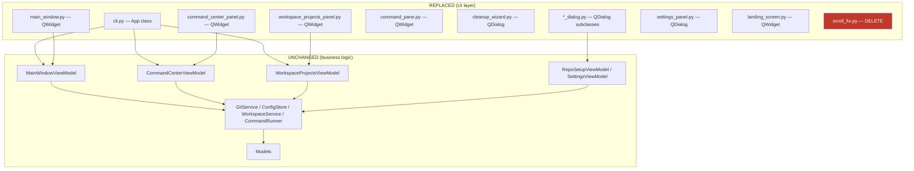

# PySide6 Migration

## Overview

Migrate the worktree-manager GUI from CustomTkinter (a Tkinter wrapper) to PySide6 (Qt6 bindings for Python). The app is an MVVM-structured desktop tool for managing git worktrees, a command center for running shell commands, and a workspace projects panel. The migration replaces every UI file while keeping all ViewModels, services, models, and business logic untouched. The goal is a native-feeling Qt app that is easier to style, theme, and maintain long-term than the CTk layer.

## UI / Flow

The app has a persistent sidebar on the left and a swappable main content area on the right. Three top-level views can be loaded into the main area: the worktree list, the command center, and the workspace projects panel.

### Main window skeleton

```
┌─────────────────────────────────────────────────────────────────┐
│  ┌──────────────┐  ┌──────────────────────────────────────────┐ │
│  │ Sidebar      │  │ Main Content Area                        │ │
│  │              │  │                                          │ │
│  │ [⊞ Command   │  │  Git Worktree Manager — <repo>           │ │
│  │   Center   ] │  │  ─────────────────────────────           │ │
│  │ [⊞ Workspace │  │  Worktrees          [+ New]  [⚙] [🧹]   │ │
│  │   Projects ] │  │                                          │ │
│  │ ▼ REPOS      │  │  ● (main)   14d ago                      │ │
│  │  ● my-repo   │  │  ○ feature  2h ago   [branch ▾] [✕]     │ │
│  │  ○ other     │  │  ○ fix/bug  3d ago ⚠ stale ...          │ │
│  │  ✕           │  │                                          │ │
│  │              │  │                                          │ │
│  │ [+ Add Repo] │  │                                          │ │
│  │ [↻ Refresh ] │  │                                          │ │
│  └──────────────┘  └──────────────────────────────────────────┘ │
└─────────────────────────────────────────────────────────────────┘
```

### Command Center panel

```
┌──────────────────────────────────────────────────────────────┐
│  Command Center                     [⚙ Commands] [+ Launch] [×]│
│  ┌────────────────────────────────────────────────────────┐   │
│  │ Filter running commands by name or repo…               │   │
│  └────────────────────────────────────────────────────────┘   │
│  ┌─────────────────────────────────────────────────────────┐  │
│  │ ● my-server  (my-repo / main)    [▶] [■] [⧉] [✕]       │  │
│  │ ┌───────────────────────────────────────────────────┐   │  │
│  │ │ stdout output scrollable text area                │   │  │
│  │ └───────────────────────────────────────────────────┘   │  │
│  └─────────────────────────────────────────────────────────┘  │
└──────────────────────────────────────────────────────────────┘
```

### Cleanup Wizard (modal dialog)

```
┌────────────────────────────────────┐
│  Cleanup Wizard                    │
│  ┌──────────────────────────────┐  │
│  │ Merged:                      │  │
│  │   → into main  [Select all]  │  │
│  │   ☑ feature/foo (merged…)    │  │
│  │ ────────────────────────────  │  │
│  │ Stale:         [Select all]  │  │
│  │   ☑ fix/bar   (30d, stale)   │  │
│  │ ────────────────────────────  │  │
│  │ Healthy:                     │  │
│  │   ☐ main/baz  (2h ago)       │  │
│  └──────────────────────────────┘  │
│  ☐ Admin Mode ⚠                    │
│  [Select All] [Cancel]   [Delete]  │
└────────────────────────────────────┘
```

## Architecture



**Key Qt mapping decisions:**

| CTk concept | Qt6 equivalent |
|---|---|
| `ctk.CTk()` | `QApplication` + `QMainWindow` |
| `ctk.CTkFrame` | `QWidget` or `QFrame` |
| `ctk.CTkToplevel` | `QDialog` (modal) or `QWidget` (floating) |
| `ctk.CTkScrollableFrame` | `QScrollArea` with a `QWidget` container |
| `ctk.CTkLabel` | `QLabel` |
| `ctk.CTkButton` | `QPushButton` |
| `ctk.CTkOptionMenu` | `QComboBox` |
| `ctk.CTkEntry` | `QLineEdit` |
| `ctk.CTkCheckBox` | `QCheckBox` |
| `ctk.CTkSegmentedButton` | `QButtonGroup` with radio buttons or a `QTabBar` |
| `ctk.CTkProgressBar` | `QProgressBar` |
| `ctk.StringVar` / `ctk.BooleanVar` | plain Python state + signal/slot wiring |
| `tkinter.messagebox` | `QMessageBox` |
| `tkinter.filedialog` | `QFileDialog` |
| `attach_scroll_fix()` | DELETE — Qt handles scroll natively |
| `.after(0, fn)` | `QTimer.singleShot(0, fn)` |
| `.pack()` / `.place()` | `QVBoxLayout` / `QHBoxLayout` / `QGridLayout` |
| `widget.trace_add("write", cb)` | Connect `QLineEdit.textChanged` etc. |
| `.configure(...)` | Direct property setters or stylesheets |

**Styling:** Use a single `QSS` stylesheet (Qt's CSS-like system) applied at app startup to replicate the dark/light appearance that CTk provided. The `appearance_mode = "system"` behavior maps to `QApplication.setStyle()` + palette.

## Iteration Plan

### Iteration 0 — Walking Skeleton
**Delivers:** The app launches with PySide6, shows the sidebar and the empty-state placeholder in the main area, and a repo can be added, saved, and switched between via the sidebar — no CTk imports survive.

**Scope:**
- Install PySide6, remove customtkinter from dependencies
- Delete `scroll_fix.py`
- Rewrite `cli.py` (`App` class + `main()`) using `QApplication` + `QMainWindow`
- Rewrite sidebar: repo list (collapsible), Add Repo button (via `QFileDialog`), Refresh button, Command Center button, Workspace Projects button
- Rewrite landing screen (empty state placeholder widget)
- Rewrite `main_window.py` (worktree list panel with branch switcher, New/Delete/Settings/Cleanup buttons — no dialogs wired yet, just stubs that print/pass)
- OS light/dark theme: apply `QApplication` palette from system at startup
- Add one `pytest-qt` smoke test: app launches without crashing

**Explicitly out of scope:** All dialogs (Create, Delete, Settings, RepoSetup, Cleanup, CommandCenter, WorkspaceProjects, AddCommand, ManageCommands, Launch) — those are wired in later iterations.

---

### Iteration 1 — Core Worktree Dialogs
**Delivers:** A user can create a new worktree, delete an existing one, and configure a newly-added repo — all from within the running Qt app.

**Scope:**
- `create_dialog.py` → `QDialog` (new branch / existing branch modes, copy-button helpers)
- `delete_dialog.py` → `QDialog` (also-delete-branch checkbox, uncommitted-changes warning)
- `repo_setup_dialog.py` → `QDialog` (worktree storage path picker)
- `settings_panel.py` → `QDialog` (storage path + stale days)
- Wire all four into `App` / `MainWindow`
- `pytest-qt` smoke tests for each dialog: opens without crash, cancel closes it, confirm calls the right VM method

**Builds on:** Iteration 0

---

### Iteration 2 — Command Center
**Delivers:** The Command Center panel is fully functional: users can manage saved commands, launch them against any repo/worktree, see live output, stop/restart/remove runs, and pop-out individual panes.

**Scope:**
- `command_center_panel.py` → `QWidget` (search filter, pane list, Launch + Manage Commands buttons)
- `command_pane.py` → `QWidget` (status dot, header buttons, scrollable output text, find bar)
- `command_popout.py` → `QDialog` (detached pane window)
- `manage_commands_dialog.py` → `QDialog` (per-repo command list, edit/delete inline)
- `add_command_dialog.py` → `QDialog` (repo picker, name, command text)
- `launch_dialog.py` → `QDialog` (repo/worktree/command picker with filter)
- Wire into `App._show_command_center()`
- `pytest-qt` smoke tests: panel loads, launch dialog opens/cancels, add-command dialog saves

**Builds on:** Iteration 1

---

### Iteration 3 — Cleanup Wizard & Workspace Projects
**Delivers:** The Cleanup Wizard correctly lists and deletes merged/stale branches with admin-mode support, and the Workspace Projects panel lets users create, open, and manage projects — completing the full feature set.

**Scope:**
- `cleanup_wizard.py` → `QDialog` (grouped branch list, checkboxes, admin mode toggle, progress loading state, select-all/subgroup buttons)
- `workspace_projects_panel.py` → `QWidget` (project list with collapsible groups, editor radio buttons, New dialog)
- `new_project_dialog.py` → `QDialog`
- `project_operations_dialog.py` → `QDialog`
- `landing_screen.py` → finalize (already stubbed in Iteration 0)
- Wire Cleanup Wizard into `App._show_cleanup()`
- Wire Workspace Projects into `App._show_workspace_projects()`
- `pytest-qt` smoke tests: cleanup wizard loads with candidates, workspace panel loads projects
- Full regression pass confirming Iterations 0–2 behaviour still works

**Builds on:** Iteration 2

---

## Iteration 0 — Walking Skeleton

### Phase 0.1 — PySide6 Dependencies & pytest-qt Wiring

**What it covers:** Install PySide6 + pytest-qt, configure pytest to use the PySide6 backend, verify the fixtures work end-to-end. No production widgets yet — just the foundation everything else builds on.

**Tests (Red) — write these first:**

```python
# tests/test_pyside6_setup.py
def test_pyside6_importable():
    """PySide6 is installed and importable."""
    import PySide6.QtWidgets  # noqa: F401


def test_qapplication_can_be_created(qapp):
    """pytest-qt's qapp fixture provides a real QApplication backed by PySide6."""
    from PySide6.QtWidgets import QApplication
    assert isinstance(qapp, QApplication)


def test_qtbot_can_add_widget(qtbot):
    """qtbot fixture works and can manage a QWidget lifecycle."""
    from PySide6.QtWidgets import QWidget
    w = QWidget()
    qtbot.addWidget(w)
    assert w.isHidden() or w.isVisible() or True  # smoke
```

**Production code (Green):**

Update `pyproject.toml`:

```toml
[build-system]
requires = ["setuptools>=68", "wheel"]
build-backend = "setuptools.build_meta"

[project]
name = "worktree-manager"
version = "0.1.0"
requires-python = ">=3.9"
dependencies = ["customtkinter>=5.2", "PySide6>=6.6"]

[project.optional-dependencies]
dev = ["pytest>=7", "pytest-qt>=4.2"]

[project.scripts]
worktree-manager = "worktree_manager.cli:main"

[tool.setuptools.packages.find]
where = ["."]
include = ["worktree_manager*"]

[tool.pytest.ini_options]
qt_api = "pyside6"
```

Install:

```
python3.14 -m pip install "PySide6>=6.6" "pytest-qt>=4.2"
```

**Done when:** `python3.14 -m pytest tests/test_pyside6_setup.py` passes with all three tests green, and `python3.14 -c "import PySide6.QtWidgets"` works.

---

### Phase 0.2 — LandingScreen Widget (Qt)

**What it covers:** Replace the CTk `LandingScreen` widget with a Qt `QWidget` that shows the empty-state message. Same behaviour as the current inline `_show_empty_main()` placeholder.

**Tests (Red) — write these first:**

```python
# tests/test_landing_screen_qt.py
from PySide6.QtWidgets import QLabel
from worktree_manager.ui.landing_screen import LandingScreen


def test_landing_screen_is_a_qwidget(qtbot):
    from PySide6.QtWidgets import QWidget
    w = LandingScreen()
    qtbot.addWidget(w)
    assert isinstance(w, QWidget)


def test_landing_screen_shows_empty_message(qtbot):
    w = LandingScreen()
    qtbot.addWidget(w)
    texts = [lbl.text() for lbl in w.findChildren(QLabel)]
    combined = "\n".join(texts)
    assert "No repo selected" in combined
    assert "Add Repo" in combined
```

**Production code (Green):**

Replace `worktree_manager/ui/landing_screen.py`:

```python
from PySide6.QtCore import Qt
from PySide6.QtWidgets import QLabel, QVBoxLayout, QWidget


class LandingScreen(QWidget):
    def __init__(self, parent=None):
        super().__init__(parent)
        layout = QVBoxLayout(self)
        layout.setAlignment(Qt.AlignCenter)
        label = QLabel(
            "No repo selected.\n"
            "Pick one from the sidebar or click + Add Repo."
        )
        label.setAlignment(Qt.AlignCenter)
        label.setStyleSheet("color: gray;")
        layout.addWidget(label)
```

**Done when:** `python3.14 -m pytest tests/test_landing_screen_qt.py` is green, and the file no longer imports `customtkinter` or `tkinter`.

---

### Phase 0.3 — Sidebar Widget (Qt)

**What it covers:** Replace the CTk sidebar (currently inline in `cli.py`) with a self-contained `Sidebar` Qt widget. Lists repos from the store, supports collapse, exposes click callbacks for every action.

**Tests (Red) — write these first:**

```python
# tests/test_sidebar_qt.py
from unittest.mock import MagicMock

from PySide6.QtCore import Qt
from PySide6.QtWidgets import QPushButton

from worktree_manager.ui.sidebar import Sidebar


def _make_store(repos=None, collapsed=None):
    store = MagicMock()
    store.all_repos.return_value = repos or {}
    store.get_ui_pref.side_effect = lambda key, default=None: (
        collapsed if key == "repos_collapsed" else default
    )
    return store


def _make_sidebar(qtbot, store, **overrides):
    callbacks = {
        "on_command_center": lambda: None,
        "on_workspace_projects": lambda: None,
        "on_add_repo": lambda: None,
        "on_refresh": lambda: None,
        "on_repo_selected": lambda path: None,
        "on_repo_delete": lambda path: None,
    }
    callbacks.update(overrides)
    sb = Sidebar(store=store, active_repo_path=None, **callbacks)
    qtbot.addWidget(sb)
    return sb


def _button_texts(widget):
    return [b.text() for b in widget.findChildren(QPushButton)]


def test_sidebar_has_top_action_buttons(qtbot):
    sb = _make_sidebar(qtbot, _make_store())
    texts = _button_texts(sb)
    assert any("Command Center" in t for t in texts)
    assert any("Workspace Projects" in t for t in texts)
    assert any("Add Repo" in t for t in texts)
    assert any("Refresh" in t for t in texts)


def test_sidebar_lists_configured_repos(qtbot, tmp_path):
    repo_a = tmp_path / "repo-a"
    repo_b = tmp_path / "repo-b"
    sb = _make_sidebar(qtbot, _make_store({str(repo_a): {}, str(repo_b): {}}))
    texts = _button_texts(sb)
    assert any("repo-a" in t for t in texts)
    assert any("repo-b" in t for t in texts)


def test_sidebar_marks_active_repo_with_filled_dot(qtbot, tmp_path):
    repo = tmp_path / "repo-a"
    store = _make_store({str(repo): {}})
    sb = Sidebar(
        store=store,
        on_command_center=lambda: None,
        on_workspace_projects=lambda: None,
        on_add_repo=lambda: None,
        on_refresh=lambda: None,
        on_repo_selected=lambda p: None,
        on_repo_delete=lambda p: None,
        active_repo_path=str(repo),
    )
    qtbot.addWidget(sb)
    texts = _button_texts(sb)
    assert any(t.startswith("● ") and "repo-a" in t for t in texts)


def test_sidebar_repo_button_invokes_on_repo_selected(qtbot, tmp_path):
    repo = tmp_path / "repo-a"
    clicked: list = []
    sb = _make_sidebar(
        qtbot, _make_store({str(repo): {}}),
        on_repo_selected=lambda p: clicked.append(p),
    )
    btn = next(b for b in sb.findChildren(QPushButton) if "repo-a" in b.text())
    qtbot.mouseClick(btn, Qt.LeftButton)
    assert clicked == [str(repo)]


def test_sidebar_delete_button_invokes_on_repo_delete(qtbot, tmp_path):
    repo = tmp_path / "repo-a"
    deleted: list = []
    sb = _make_sidebar(
        qtbot, _make_store({str(repo): {}}),
        on_repo_delete=lambda p: deleted.append(p),
    )
    del_btn = next(b for b in sb.findChildren(QPushButton) if b.text() == "✕")
    qtbot.mouseClick(del_btn, Qt.LeftButton)
    assert deleted == [str(repo)]


def test_sidebar_top_action_button_invokes_callback(qtbot):
    triggered: list = []
    sb = _make_sidebar(
        qtbot, _make_store(),
        on_command_center=lambda: triggered.append("cc"),
    )
    btn = next(b for b in sb.findChildren(QPushButton) if "Command Center" in b.text())
    qtbot.mouseClick(btn, Qt.LeftButton)
    assert triggered == ["cc"]


def test_sidebar_toggle_collapse_persists_to_store(qtbot):
    store = _make_store(collapsed=False)
    sb = _make_sidebar(qtbot, store)
    assert sb.repos_visible() is True
    sb.toggle_repos_section()
    assert sb.repos_visible() is False
    store.set_ui_pref.assert_called_with("repos_collapsed", True)


def test_sidebar_starts_collapsed_when_store_pref_is_true(qtbot):
    store = _make_store(collapsed=True)
    sb = _make_sidebar(qtbot, store)
    assert sb.repos_visible() is False


def test_sidebar_set_active_repo_updates_dot_marker(qtbot, tmp_path):
    repo_a = tmp_path / "repo-a"
    repo_b = tmp_path / "repo-b"
    sb = _make_sidebar(qtbot, _make_store({str(repo_a): {}, str(repo_b): {}}))
    sb.set_active_repo(str(repo_b))
    texts = _button_texts(sb)
    assert any(t.startswith("● ") and "repo-b" in t for t in texts)
    assert any(t.startswith("○ ") and "repo-a" in t for t in texts)
```

**Production code (Green):**

New file `worktree_manager/ui/sidebar.py`:

```python
from pathlib import Path

from PySide6.QtWidgets import (
    QHBoxLayout, QPushButton, QScrollArea, QVBoxLayout, QWidget,
)


class Sidebar(QWidget):
    def __init__(
        self,
        store,
        on_command_center,
        on_workspace_projects,
        on_add_repo,
        on_refresh,
        on_repo_selected,
        on_repo_delete,
        active_repo_path=None,
        parent=None,
    ):
        super().__init__(parent)
        self._store = store
        self._on_repo_selected = on_repo_selected
        self._on_repo_delete = on_repo_delete
        self._active_repo_path = active_repo_path
        self._repo_buttons: dict = {}

        self.setFixedWidth(220)

        outer = QVBoxLayout(self)
        outer.setContentsMargins(4, 8, 4, 12)
        outer.setSpacing(4)

        cc_btn = QPushButton("⊞ Command Center")
        cc_btn.clicked.connect(on_command_center)
        outer.addWidget(cc_btn)

        wp_btn = QPushButton("⊞ Workspace Projects")
        wp_btn.clicked.connect(on_workspace_projects)
        outer.addWidget(wp_btn)

        self._collapsed = bool(store.get_ui_pref("repos_collapsed", False))
        arrow = "▶" if self._collapsed else "▼"
        self._header_btn = QPushButton(f"{arrow} REPOS")
        self._header_btn.setFlat(True)
        self._header_btn.setStyleSheet(
            "text-align: left; color: gray; font-weight: bold;"
        )
        self._header_btn.clicked.connect(self.toggle_repos_section)
        outer.addWidget(self._header_btn)

        self._repo_scroll = QScrollArea()
        self._repo_scroll.setWidgetResizable(True)
        self._repo_scroll.setFixedHeight(220)
        self._repo_container = QWidget()
        self._repo_layout = QVBoxLayout(self._repo_container)
        self._repo_layout.setContentsMargins(0, 0, 0, 0)
        self._repo_layout.setSpacing(2)
        self._repo_layout.addStretch(1)
        self._repo_scroll.setWidget(self._repo_container)
        outer.addWidget(self._repo_scroll)
        self._repo_scroll.setVisible(not self._collapsed)

        outer.addStretch(1)

        add_btn = QPushButton("+ Add Repo")
        add_btn.clicked.connect(on_add_repo)
        outer.addWidget(add_btn)

        refresh_btn = QPushButton("↻ Refresh")
        refresh_btn.clicked.connect(on_refresh)
        outer.addWidget(refresh_btn)

        self.populate_repo_rows()

    def populate_repo_rows(self):
        while self._repo_layout.count():
            item = self._repo_layout.takeAt(0)
            w = item.widget()
            if w is not None:
                w.deleteLater()
        self._repo_buttons.clear()

        for path in self._store.all_repos().keys():
            name = Path(path).name
            is_active = (path == self._active_repo_path)
            row = QWidget()
            row_layout = QHBoxLayout(row)
            row_layout.setContentsMargins(0, 0, 0, 0)
            row_layout.setSpacing(2)

            label = ("● " if is_active else "○ ") + name
            btn = QPushButton(label)
            btn.setStyleSheet("text-align: left;")
            btn.clicked.connect(
                lambda _checked=False, p=path: self._on_repo_selected(p)
            )
            row_layout.addWidget(btn, 1)

            del_btn = QPushButton("✕")
            del_btn.setFixedWidth(28)
            del_btn.setStyleSheet(
                "background-color: #c0392b; color: white; border: none;"
            )
            del_btn.clicked.connect(
                lambda _checked=False, p=path: self._on_repo_delete(p)
            )
            row_layout.addWidget(del_btn)

            self._repo_layout.addWidget(row)
            self._repo_buttons[path] = btn

        self._repo_layout.addStretch(1)

    def set_active_repo(self, repo_path):
        self._active_repo_path = repo_path
        self.populate_repo_rows()

    def repos_visible(self):
        return self._repo_scroll.isVisible()

    def toggle_repos_section(self):
        self._collapsed = not self._collapsed
        self._store.set_ui_pref("repos_collapsed", self._collapsed)
        arrow = "▶" if self._collapsed else "▼"
        self._header_btn.setText(f"{arrow} REPOS")
        self._repo_scroll.setVisible(not self._collapsed)
```

**Done when:** All sidebar tests pass and the widget renders the expected button labels for an empty store, a single-repo store, and a multi-repo store.

---

### Phase 0.4 — MainWindow Widget (Qt — worktree list)

**What it covers:** Replace the CTk `MainWindow` with a Qt `QWidget` that lists worktrees, supports branch switching via `QComboBox`, and exposes header buttons for + New, ⚙ Settings, and 🧹 Cleanup. The dialog launches themselves are stubbed in this iteration (they just call the provided callback or `print()`); real dialogs arrive in Iteration 1.

**Tests (Red) — write these first:**

```python
# tests/test_main_window_qt.py
import time
from unittest.mock import MagicMock, patch

from PySide6.QtCore import Qt
from PySide6.QtWidgets import QComboBox, QLabel, QPushButton

from worktree_manager.main_window_vm import MainWindowViewModel
from worktree_manager.models import WorktreeModel
from worktree_manager.ui.main_window import MainWindow


def _make_vm():
    now = int(time.time())
    vm = MagicMock(spec=MainWindowViewModel)
    vm.load_worktrees.return_value = [
        WorktreeModel("/repos/proj", "main", True, now, False, False),
        WorktreeModel("/repos/proj-wt/fix-auth", "fix/auth", False, now - 3600, False, False),
    ]
    vm.list_branches_with_checkout_status.return_value = [
        ("main", True), ("fix/auth", True), ("hotfix/2.1", False),
    ]
    return vm


def _make_window(qtbot, vm=None, on_settings=None, on_cleanup=None, on_new=None):
    win = MainWindow(
        vm=vm or _make_vm(),
        repo_name="proj",
        on_settings=on_settings or (lambda: None),
        on_cleanup=on_cleanup or (lambda: None),
        on_new=on_new or (lambda: None),
    )
    qtbot.addWidget(win)
    return win


def _label_texts(widget):
    return [lbl.text() for lbl in widget.findChildren(QLabel)]


def _buttons(widget):
    return widget.findChildren(QPushButton)


def test_main_window_header_shows_repo_name(qtbot):
    win = _make_window(qtbot)
    assert any("proj" in t for t in _label_texts(win))


def test_main_window_has_new_settings_cleanup_buttons(qtbot):
    win = _make_window(qtbot)
    btn_texts = [b.text() for b in _buttons(win)]
    assert any("New" in t for t in btn_texts)
    assert any("⚙" in t for t in btn_texts)
    assert any("🧹" in t for t in btn_texts)


def test_main_window_lists_non_main_worktree_folder_names(qtbot):
    win = _make_window(qtbot)
    texts = _label_texts(win)
    assert any("fix-auth" in t for t in texts)
    assert any("(main)" in t for t in texts)


def test_main_window_shows_branch_dropdown_per_worktree(qtbot):
    win = _make_window(qtbot)
    combos = win.findChildren(QComboBox)
    # one per worktree (2 in the fixture)
    assert len(combos) == 2


def test_main_window_branch_dropdown_lists_all_branches(qtbot):
    win = _make_window(qtbot)
    combo = win.findChildren(QComboBox)[0]
    values = [combo.itemText(i) for i in range(combo.count())]
    assert "main" in values
    assert "fix/auth" in values
    assert "hotfix/2.1" in values


def test_main_window_switch_branch_calls_vm(qtbot):
    vm = _make_vm()
    win = _make_window(qtbot, vm=vm)
    win._switch_branch("/repos/proj-wt/fix-auth", "hotfix/2.1")
    vm.switch_branch.assert_called_once_with("/repos/proj-wt/fix-auth", "hotfix/2.1")


def test_main_window_switch_branch_shows_error_on_uncommitted(qtbot):
    vm = _make_vm()
    vm.switch_branch.side_effect = ValueError("uncommitted changes")
    win = _make_window(qtbot, vm=vm)
    with patch("PySide6.QtWidgets.QMessageBox.critical") as mock_err:
        result = win._switch_branch("/repos/proj-wt/fix-auth", "hotfix/2.1")
    mock_err.assert_called_once()
    assert result is False


def test_main_window_switch_branch_refreshes_on_success(qtbot):
    vm = _make_vm()
    win = _make_window(qtbot, vm=vm)
    initial = vm.load_worktrees.call_count
    win._switch_branch("/repos/proj-wt/fix-auth", "hotfix/2.1")
    assert vm.load_worktrees.call_count > initial


def test_main_window_new_button_invokes_callback(qtbot):
    called: list = []
    win = _make_window(qtbot, on_new=lambda: called.append("new"))
    btn = next(b for b in _buttons(win) if "New" in b.text())
    qtbot.mouseClick(btn, Qt.LeftButton)
    assert called == ["new"]


def test_main_window_settings_button_invokes_callback(qtbot):
    called: list = []
    win = _make_window(qtbot, on_settings=lambda: called.append("settings"))
    btn = next(b for b in _buttons(win) if "⚙" in b.text())
    qtbot.mouseClick(btn, Qt.LeftButton)
    assert called == ["settings"]


def test_main_window_cleanup_button_invokes_callback(qtbot):
    called: list = []
    win = _make_window(qtbot, on_cleanup=lambda: called.append("cleanup"))
    btn = next(b for b in _buttons(win) if "🧹" in b.text())
    qtbot.mouseClick(btn, Qt.LeftButton)
    assert called == ["cleanup"]


def test_main_window_stale_worktree_shows_warning(qtbot):
    vm = _make_vm()
    vm.load_worktrees.return_value = [
        WorktreeModel("/repos/proj-wt/old", "old", False, 0, True, False),
    ]
    win = _make_window(qtbot, vm=vm)
    texts = _label_texts(win)
    assert any("stale" in t for t in texts)
```

**Production code (Green):**

Replace `worktree_manager/ui/main_window.py`:

```python
import os
import time

from PySide6.QtWidgets import (
    QComboBox, QHBoxLayout, QLabel, QMessageBox, QPushButton, QScrollArea,
    QVBoxLayout, QWidget,
)

from worktree_manager.main_window_vm import MainWindowViewModel
from worktree_manager.models import WorktreeModel


def _fmt_age(ts):
    if ts == 0:
        return "no commits"
    diff = int(time.time()) - ts
    if diff < 3600:
        return f"{diff // 60}m ago"
    if diff < 86400:
        return f"{diff // 3600}h ago"
    return f"{diff // 86400}d ago"


class MainWindow(QWidget):
    def __init__(self, vm: MainWindowViewModel, repo_name: str,
                 on_settings, on_cleanup, on_new, parent=None):
        super().__init__(parent)
        self._vm = vm
        self._repo_name = repo_name
        self._on_settings = on_settings
        self._on_cleanup = on_cleanup
        self._on_new = on_new

        outer = QVBoxLayout(self)
        outer.setContentsMargins(16, 16, 16, 8)
        outer.setSpacing(4)

        header = QHBoxLayout()
        title = QLabel(f"Git Worktree Manager — {self._repo_name}")
        title.setStyleSheet("font-weight: bold; font-size: 16px;")
        header.addWidget(title)
        header.addStretch(1)
        settings_btn = QPushButton("⚙")
        settings_btn.setFixedWidth(36)
        settings_btn.clicked.connect(self._on_settings)
        cleanup_btn = QPushButton("🧹")
        cleanup_btn.setFixedWidth(36)
        cleanup_btn.clicked.connect(self._on_cleanup)
        header.addWidget(cleanup_btn)
        header.addWidget(settings_btn)
        outer.addLayout(header)

        sub = QHBoxLayout()
        sub_label = QLabel("Worktrees")
        sub_label.setStyleSheet("font-weight: bold;")
        sub.addWidget(sub_label)
        sub.addStretch(1)
        new_btn = QPushButton("+ New")
        new_btn.setFixedWidth(70)
        new_btn.clicked.connect(self._on_new)
        sub.addWidget(new_btn)
        outer.addLayout(sub)

        self._list_scroll = QScrollArea()
        self._list_scroll.setWidgetResizable(True)
        self._list_container = QWidget()
        self._list_layout = QVBoxLayout(self._list_container)
        self._list_layout.setContentsMargins(0, 0, 0, 0)
        self._list_layout.setSpacing(2)
        self._list_layout.addStretch(1)
        self._list_scroll.setWidget(self._list_container)
        outer.addWidget(self._list_scroll, 1)

        self.refresh()

    def refresh(self):
        while self._list_layout.count():
            item = self._list_layout.takeAt(0)
            w = item.widget()
            if w is not None:
                w.deleteLater()

        worktrees = self._vm.load_worktrees()
        branch_status = self._vm.list_branches_with_checkout_status()
        for wt in worktrees:
            self._add_row(wt, branch_status)
        self._list_layout.addStretch(1)

    def _add_row(self, wt: WorktreeModel, branch_status):
        row = QWidget()
        layout = QHBoxLayout(row)
        layout.setContentsMargins(0, 2, 0, 2)

        dot = QLabel("●" if wt.is_main else "○")
        dot.setFixedWidth(20)
        layout.addWidget(dot)

        wt_name = os.path.basename(wt.path) if not wt.is_main else "(main)"
        name_label = QLabel(wt_name)
        name_label.setFixedWidth(200)
        layout.addWidget(name_label)

        age = QLabel(_fmt_age(wt.last_commit_ts))
        age.setStyleSheet("color: gray;")
        age.setFixedWidth(80)
        layout.addWidget(age)

        if wt.is_stale:
            stale = QLabel("⚠ stale")
            stale.setStyleSheet("color: orange;")
            stale.setFixedWidth(70)
            layout.addWidget(stale)
        else:
            spacer = QLabel("")
            spacer.setFixedWidth(70)
            layout.addWidget(spacer)

        layout.addStretch(1)

        all_branches = [b for b, _ in branch_status]
        checked_out_set = {b for b, co in branch_status if co and b != wt.branch}

        combo = QComboBox()
        combo.addItems(all_branches)
        if wt.branch in all_branches:
            combo.setCurrentText(wt.branch)
        combo.setFixedWidth(160)

        def _on_change(new_branch, path=wt.path, c=combo, orig=wt.branch):
            if new_branch == orig:
                return
            if new_branch in checked_out_set:
                QMessageBox.critical(
                    self, "Cannot switch",
                    f"'{new_branch}' is already checked out in another worktree.",
                )
                c.blockSignals(True)
                c.setCurrentText(orig)
                c.blockSignals(False)
                return
            if not self._switch_branch(path, new_branch):
                c.blockSignals(True)
                c.setCurrentText(orig)
                c.blockSignals(False)

        combo.currentTextChanged.connect(_on_change)
        layout.addWidget(combo)

        if not wt.is_main:
            del_btn = QPushButton("✕")
            del_btn.setFixedWidth(28)
            del_btn.setStyleSheet("background-color: #c0392b; color: white; border: none;")
            del_btn.clicked.connect(lambda _checked=False, w=wt: self._open_delete(w))
            layout.addWidget(del_btn)

        self._list_layout.addWidget(row)

    def _switch_branch(self, worktree_path, new_branch):
        try:
            self._vm.switch_branch(worktree_path, new_branch)
            self.refresh()
            return True
        except ValueError as e:
            QMessageBox.critical(self, "Cannot switch branch", str(e))
            return False

    def _open_delete(self, wt: WorktreeModel):
        # Stubbed in Iteration 0 — real DeleteDialog arrives in Iteration 1.
        print(f"[stub] delete worktree: {wt.path}")
```

**Done when:** All `test_main_window_qt.py` tests pass; the widget renders without any tkinter/customtkinter imports; clicking + New / ⚙ / 🧹 invokes the right callback; branch dropdown switching invokes `vm.switch_branch`.

---

### Phase 0.5 — App (QMainWindow) Wiring

**What it covers:** Replace the procedural `App` class in `cli.py` with a Qt `QMainWindow` that hosts the sidebar on the left and a swappable content area on the right. Wires up Add-Repo via `QFileDialog`, repo deletion via `QMessageBox.question`, and stubs the Settings / Cleanup / Command Center / Workspace Projects show-methods. System theme is whatever Qt's default native style provides (which on macOS already follows OS appearance).

**Tests (Red) — write these first:**

```python
# tests/test_cli_qt.py
import sys
from unittest.mock import MagicMock, patch

import pytest
from PySide6.QtWidgets import QMainWindow

from worktree_manager.cli import App, parse_args, resolve_repo_path
from worktree_manager.git_service import GitService


# ── parse_args / resolve_repo_path: unchanged, copy of existing coverage ─────

def test_parse_args_no_argument():
    args = parse_args([])
    assert args.repo_path is None


def test_parse_args_with_path():
    args = parse_args(["/repos/proj"])
    assert args.repo_path == "/repos/proj"


def test_resolve_repo_path_valid(tmp_path):
    git = MagicMock(spec=GitService)
    git.is_valid_repo.return_value = True
    repo = tmp_path / "myrepo"
    repo.mkdir()
    assert resolve_repo_path(str(repo), git) == str(repo)


def test_resolve_repo_path_invalid(tmp_path, capsys):
    git = MagicMock(spec=GitService)
    git.is_valid_repo.return_value = False
    with pytest.raises(SystemExit):
        resolve_repo_path(str(tmp_path / "no"), git)
    assert "not a git repository" in capsys.readouterr().err.lower()


def test_resolve_repo_path_none_returns_none():
    assert resolve_repo_path(None, MagicMock(spec=GitService)) is None


# ── App: QMainWindow wiring ─────────────────────────────────────────────────

@pytest.fixture
def empty_store(tmp_path, monkeypatch):
    """Patch ConfigStore so all_repos returns empty and no file IO happens."""
    store = MagicMock()
    store.all_repos.return_value = {}
    store.get_ui_pref.side_effect = lambda key, default=None: default
    monkeypatch.setattr("worktree_manager.cli.ConfigStore", lambda *a, **kw: store)
    monkeypatch.setattr("worktree_manager.cli.GitService", lambda *a, **kw: MagicMock())
    return store


def test_app_is_qmainwindow(qtbot, empty_store):
    app = App(repo_path=None)
    qtbot.addWidget(app)
    assert isinstance(app, QMainWindow)


def test_app_window_title_set(qtbot, empty_store):
    app = App(repo_path=None)
    qtbot.addWidget(app)
    assert "Worktree Manager" in app.windowTitle()


def test_app_shows_landing_when_no_repo(qtbot, empty_store):
    from worktree_manager.ui.landing_screen import LandingScreen
    app = App(repo_path=None)
    qtbot.addWidget(app)
    assert isinstance(app._current_panel, LandingScreen)


def test_app_sidebar_present_when_no_repo(qtbot, empty_store):
    from worktree_manager.ui.sidebar import Sidebar
    app = App(repo_path=None)
    qtbot.addWidget(app)
    assert isinstance(app._sidebar, Sidebar)


def test_app_loads_main_window_when_repo_configured(qtbot, empty_store):
    from worktree_manager.models import RepoConfig
    from worktree_manager.ui.main_window import MainWindow

    cfg = RepoConfig(
        repo_path="/repos/proj", worktree_storage="/repos/proj-wt",
        stale_days=30, last_editor="cursor", last_editor_mode="reuse",
        last_opened="2026-05-19T10:00:00",
    )
    empty_store.get_repo.return_value = cfg
    empty_store.all_repos.return_value = {"/repos/proj": cfg}

    with patch("worktree_manager.main_window_vm.MainWindowViewModel") as MockVM:
        MockVM.return_value.load_worktrees.return_value = []
        MockVM.return_value.list_branches_with_checkout_status.return_value = []
        app = App(repo_path="/repos/proj")
        qtbot.addWidget(app)
        assert isinstance(app._current_panel, MainWindow)


def test_app_pick_repo_uses_qfiledialog(qtbot, empty_store):
    app = App(repo_path=None)
    qtbot.addWidget(app)
    with patch("PySide6.QtWidgets.QFileDialog.getExistingDirectory",
               return_value="") as mock_dlg:
        app._pick_and_add_repo()
    mock_dlg.assert_called_once()


def test_app_pick_repo_rejects_non_git_with_messagebox(qtbot, empty_store, tmp_path):
    app = App(repo_path=None)
    qtbot.addWidget(app)
    app._git.is_valid_repo = MagicMock(return_value=False)
    with patch("PySide6.QtWidgets.QFileDialog.getExistingDirectory",
               return_value=str(tmp_path)):
        with patch("PySide6.QtWidgets.QMessageBox.critical") as mock_err:
            app._pick_and_add_repo()
    mock_err.assert_called_once()


def test_app_confirm_delete_repo_yes_removes_from_store(qtbot, empty_store):
    from worktree_manager.models import RepoConfig
    cfg = RepoConfig(
        repo_path="/repos/proj", worktree_storage="/repos/proj-wt",
        stale_days=30, last_editor="cursor", last_editor_mode="reuse",
        last_opened="2026-05-19T10:00:00",
    )
    empty_store.all_repos.return_value = {"/repos/proj": cfg}
    app = App(repo_path=None)
    qtbot.addWidget(app)
    from PySide6.QtWidgets import QMessageBox
    with patch("PySide6.QtWidgets.QMessageBox.question",
               return_value=QMessageBox.Yes):
        app._confirm_delete_repo("/repos/proj", is_active=False)
    empty_store.delete_repo.assert_called_once_with("/repos/proj")


def test_app_confirm_delete_repo_no_keeps_store_intact(qtbot, empty_store):
    app = App(repo_path=None)
    qtbot.addWidget(app)
    from PySide6.QtWidgets import QMessageBox
    with patch("PySide6.QtWidgets.QMessageBox.question",
               return_value=QMessageBox.No):
        app._confirm_delete_repo("/repos/proj", is_active=False)
    empty_store.delete_repo.assert_not_called()


def test_app_show_command_center_is_stubbed_no_crash(qtbot, empty_store):
    """Iteration 0: real Command Center arrives in Iteration 2; method must exist
    and either no-op or show a 'coming soon' message without raising."""
    app = App(repo_path=None)
    qtbot.addWidget(app)
    app._show_command_center()  # must not raise


def test_app_show_workspace_projects_is_stubbed_no_crash(qtbot, empty_store):
    app = App(repo_path=None)
    qtbot.addWidget(app)
    app._show_workspace_projects()  # must not raise
```

**Production code (Green):**

Replace `worktree_manager/cli.py`:

```python
import argparse
import sys
from pathlib import Path

from PySide6.QtWidgets import (
    QApplication, QFileDialog, QHBoxLayout, QMainWindow, QMessageBox,
    QWidget,
)

from worktree_manager.config_store import ConfigStore
from worktree_manager.git_service import GitService


def parse_args(argv):
    parser = argparse.ArgumentParser(description="Git Worktree Manager")
    parser.add_argument("repo_path", nargs="?", default=None,
                        help="Path to the main git worktree")
    return parser.parse_args(argv)


def resolve_repo_path(path, git):
    if path is None:
        return None
    if not git.is_valid_repo(path):
        print(f"Error: '{path}' is not a git repository.", file=sys.stderr)
        sys.exit(1)
    return path


class App(QMainWindow):
    def __init__(self, repo_path=None, parent=None):
        super().__init__(parent)
        self.setWindowTitle("Git Worktree Manager")
        self.resize(900, 520)
        self.setMinimumSize(700, 400)

        self._store = ConfigStore()
        self._git = GitService()
        self._active_repo_path = None
        self._current_panel = None

        central = QWidget()
        self._central_layout = QHBoxLayout(central)
        self._central_layout.setContentsMargins(0, 0, 0, 0)
        self._central_layout.setSpacing(0)
        self.setCentralWidget(central)

        from worktree_manager.ui.sidebar import Sidebar
        self._sidebar = Sidebar(
            store=self._store,
            on_command_center=self._show_command_center,
            on_workspace_projects=self._show_workspace_projects,
            on_add_repo=self._pick_and_add_repo,
            on_refresh=self._refresh,
            on_repo_selected=self._switch_repo,
            on_repo_delete=lambda p: self._confirm_delete_repo(
                p, is_active=(p == self._active_repo_path),
            ),
            active_repo_path=None,
        )
        self._central_layout.addWidget(self._sidebar)

        if repo_path:
            self._load_repo(repo_path)
        else:
            self._show_empty_main()

    # ── panel swap helpers ──────────────────────────────────────────────────

    def _set_panel(self, widget):
        if self._current_panel is not None:
            self._central_layout.removeWidget(self._current_panel)
            self._current_panel.deleteLater()
        self._current_panel = widget
        self._central_layout.addWidget(widget, 1)

    def _show_empty_main(self):
        from worktree_manager.ui.landing_screen import LandingScreen
        self._set_panel(LandingScreen())

    # ── repo lifecycle ──────────────────────────────────────────────────────

    def _pick_and_add_repo(self):
        path = QFileDialog.getExistingDirectory(self, "Select git repo")
        if not path:
            return
        if not self._git.is_valid_repo(path):
            QMessageBox.critical(self, "Error", f"'{path}' is not a git repository.")
            return
        self._load_repo(path)

    def _switch_repo(self, repo_path):
        self._load_repo(repo_path)

    def _load_repo(self, repo_path):
        cfg = self._store.get_repo(repo_path)
        if cfg is None:
            # RepoSetupDialog arrives in Iteration 1; for now just refuse silently
            QMessageBox.information(
                self, "Setup required",
                f"'{Path(repo_path).name}' is not configured yet. "
                "Setup dialog ships in Iteration 1.",
            )
            return
        self._show_main(repo_path)

    def _show_main(self, repo_path):
        from worktree_manager.main_window_vm import MainWindowViewModel
        from worktree_manager.ui.main_window import MainWindow

        self._active_repo_path = repo_path
        self._sidebar.set_active_repo(repo_path)

        vm = MainWindowViewModel(
            repo_path=repo_path,
            config_store=self._store,
            git_service=self._git,
        )
        repo_name = Path(repo_path).name
        self._set_panel(MainWindow(
            vm=vm, repo_name=repo_name,
            on_settings=lambda: self._show_settings(repo_path),
            on_cleanup=lambda: self._show_cleanup(vm),
            on_new=lambda: self._show_new_worktree(vm),
        ))

    def _confirm_delete_repo(self, repo_path, is_active):
        name = Path(repo_path).name
        extra = (
            "\n\nThis is the currently open repo. Removing it will return you to the empty screen."
            if is_active else ""
        )
        ans = QMessageBox.question(
            self, "Remove repo",
            f'Remove "{name}" from the app?\n\n{repo_path}{extra}\n\nFiles on disk are not affected.',
        )
        if ans != QMessageBox.Yes:
            return
        self._store.delete_repo(repo_path)
        if is_active:
            self._active_repo_path = None
            self._sidebar.set_active_repo(None)
            self._show_empty_main()
        else:
            self._sidebar.populate_repo_rows()

    def _refresh(self):
        self._sidebar.populate_repo_rows()
        if self._current_panel is not None and hasattr(self._current_panel, "refresh"):
            self._current_panel.refresh()

    # ── stubs for dialogs/panels arriving in later iterations ───────────────

    def _show_settings(self, repo_path):
        QMessageBox.information(self, "Settings", "Ships in Iteration 1.")

    def _show_cleanup(self, vm):
        QMessageBox.information(self, "Cleanup Wizard", "Ships in Iteration 3.")

    def _show_new_worktree(self, vm):
        QMessageBox.information(self, "New Worktree", "Ships in Iteration 1.")

    def _show_command_center(self):
        QMessageBox.information(self, "Command Center", "Ships in Iteration 2.")

    def _show_workspace_projects(self):
        QMessageBox.information(self, "Workspace Projects", "Ships in Iteration 3.")


def main():
    args = parse_args(sys.argv[1:])
    git = GitService()
    repo_path = resolve_repo_path(args.repo_path, git)

    qt_app = QApplication.instance() or QApplication(sys.argv)
    window = App(repo_path=repo_path)
    window.show()
    sys.exit(qt_app.exec())


if __name__ == "__main__":
    repo_root = Path(__file__).resolve().parent.parent
    if str(repo_root) not in sys.path:
        sys.path.insert(0, str(repo_root))
    main()
```

**Done when:** All `test_cli_qt.py` tests pass; `python3.14 -m worktree_manager.cli` launches a real window with the sidebar visible and the landing screen in the content area.

---

### Phase 0.6 — Cleanup: Delete `scroll_fix.py` + Broken Legacy Tests

**What it covers:** Remove the dead `scroll_fix.py` module (Qt handles scroll natively) and delete the CTk-based legacy tests for the files we just rewrote. These tests assert against CTk widget trees and instantiate the now-Qt `App`/`MainWindow` with CTk patterns — they cannot be salvaged in place.

**Tests (Red) — write these first:**

```python
# tests/test_iteration_0_cleanup.py
"""Iteration 0 cleanup: assert that dead modules and obsolete tests are gone."""
import importlib
import os
import pathlib

import pytest


def test_scroll_fix_module_removed():
    with pytest.raises(ModuleNotFoundError):
        importlib.import_module("worktree_manager.ui.scroll_fix")


@pytest.mark.parametrize("relpath", [
    "tests/test_hover_scoped_scroll.py",
    "tests/test_main_window_iter0.py",
    "tests/test_sidebar_redesign.py",
    "tests/test_sidebar_stable_repo_list.py",
    "tests/test_workspace_projects_sidebar_wiring.py",
])
def test_legacy_ctk_test_file_removed(relpath):
    repo_root = pathlib.Path(__file__).resolve().parents[1]
    assert not (repo_root / relpath).exists(), \
        f"{relpath} still exists — delete it as part of Iteration 0 cleanup"


def test_no_ui_file_imports_customtkinter():
    """Iteration 0's rewritten UI files must not import customtkinter."""
    import worktree_manager.cli as cli_mod
    import worktree_manager.ui.landing_screen as ls_mod
    import worktree_manager.ui.main_window as mw_mod
    import worktree_manager.ui.sidebar as sb_mod
    for mod in (cli_mod, ls_mod, mw_mod, sb_mod):
        src = pathlib.Path(mod.__file__).read_text()
        assert "customtkinter" not in src, f"{mod.__name__} still imports customtkinter"
        assert "import tkinter" not in src, f"{mod.__name__} still imports tkinter"


def test_app_can_be_constructed_and_destroyed_cleanly(qtbot, monkeypatch):
    """End-to-end smoke: App constructs, shows, and tears down without raising."""
    from unittest.mock import MagicMock
    store = MagicMock()
    store.all_repos.return_value = {}
    store.get_ui_pref.side_effect = lambda key, default=None: default
    monkeypatch.setattr("worktree_manager.cli.ConfigStore", lambda *a, **kw: store)
    monkeypatch.setattr("worktree_manager.cli.GitService", lambda *a, **kw: MagicMock())
    from worktree_manager.cli import App
    app = App(repo_path=None)
    qtbot.addWidget(app)
    app.show()
    qtbot.waitExposed(app)
    app.close()
```

**Production code (Green):**

Delete these files:

```
worktree_manager/ui/scroll_fix.py
tests/test_hover_scoped_scroll.py
tests/test_main_window_iter0.py
tests/test_sidebar_redesign.py
tests/test_sidebar_stable_repo_list.py
tests/test_workspace_projects_sidebar_wiring.py
```

Also: scan `worktree_manager/ui/cli.py` (already rewritten in Phase 0.5) and all other rewritten Iter 0 UI files to confirm there are no leftover `from worktree_manager.ui.scroll_fix import attach_scroll_fix` lines. (Untouched UI files like `command_center_panel.py` keep their existing `attach_scroll_fix` imports — they will be deleted when those files are rewritten in Iterations 1–3. They still need to import successfully *if* something imports them; nothing in Iteration 0 imports them, so this is fine.)

Update `tests/test_cli.py`: rename to `tests/test_cli_legacy.py.bak` is NOT desirable — instead, **delete `tests/test_cli.py` entirely**, since `tests/test_cli_qt.py` (from Phase 0.5) now covers `parse_args`, `resolve_repo_path`, and the App lifecycle.

**Done when:** `python3.14 -m pytest tests/test_iteration_0_cleanup.py` passes; deleted test files are gone; `python3.14 -m pytest tests/` runs cleanly with no `ImportError`s related to `scroll_fix`. (Other unrelated test failures unrelated to Iter 0 work are acceptable to surface here.)

---

## ✋ Manual Testing Gate — Iteration 0

> STOP. Do not proceed to Iteration 1 until every item below is checked off by the user.

- [ ] Run `python3.14 -m worktree_manager.cli` from the `worktree-manager/` directory. A native Qt window titled "Git Worktree Manager" appears, sized roughly 900×520.
- [ ] The window has a fixed-width sidebar on the left containing: ⊞ Command Center, ⊞ Workspace Projects, a ▼ REPOS section header, + Add Repo, ↻ Refresh.
- [ ] The right side shows the landing message: "No repo selected. Pick one from the sidebar or click + Add Repo." in gray, centered.
- [ ] Click "▼ REPOS" — the arrow changes to ▶ and the (empty) repo scroll area collapses. Click again — it expands. Close and re-open the app — the collapse state was persisted.
- [ ] Click "+ Add Repo". A native folder picker opens. Cancel it — nothing happens. Pick a non-git folder — a red error dialog says "'<path>' is not a git repository."
- [ ] Pick a real git repo for the first time. An info dialog says "Setup dialog ships in Iteration 1." (RepoSetupDialog isn't wired yet — that's expected.)
- [ ] Manually configure a repo by editing `~/.config/worktree-manager/config.json` (or whatever path `ConfigStore` writes to) so that the repo has a worktree storage entry, then restart the app. The repo now appears in the sidebar with a ○ next to its name.
- [ ] Click the repo button in the sidebar. The landing screen disappears and the right side shows the Worktree Manager panel with header "Git Worktree Manager — <repo-name>", a + New button, a ⚙ Settings button, a 🧹 Cleanup button, and the worktree list.
- [ ] The worktree list shows one row per worktree with: dot (● for main, ○ for others), folder name (or "(main)"), age label, optional "⚠ stale", a branch dropdown, and (for non-main) a red ✕ button.
- [ ] Open the branch dropdown for a non-main worktree, select a different branch that is NOT checked out elsewhere — the branch is switched, the list refreshes, the row now reflects the new branch.
- [ ] Open the branch dropdown and select a branch that IS already checked out in another worktree — an error message appears and the dropdown reverts to the original branch.
- [ ] Click + New / ⚙ / 🧹 — each shows an info dialog saying "Ships in Iteration N" (no crashes).
- [ ] Click the red ✕ next to a repo in the sidebar — a Yes/No confirmation appears. Click No — nothing happens. Click Yes — the repo disappears from the sidebar; if it was the active one, the landing screen returns.
- [ ] Switch your OS appearance between Light and Dark mode while the app is open — the app's colors update to match (Qt's native style handles this on macOS).

**How to confirm:** Run the app, perform each action above, and check off each item manually.
Reply "Iteration 0 confirmed" (or describe any failures) before I write the plan for Iteration 1.

---

## Iteration 1 — Core Worktree Dialogs

### Phase 1.1 — RepoSetupDialog (Qt)

**What it covers:** Replace `RepoSetupDialog` (CTkToplevel) with a Qt `QDialog`. Shows the default storage path pre-filled in a `QLineEdit`, a Browse button that opens `QFileDialog`, and Cancel / Confirm buttons. Confirm calls `vm.confirm(storage_path=..., callback=...)`. No `MainWindow`/`App` wiring yet — that lands in Phase 1.5.

**Tests (Red) — write these first:**

```python
# tests/test_repo_setup_dialog_qt.py
from unittest.mock import MagicMock, patch

from PySide6.QtCore import Qt
from PySide6.QtWidgets import QDialog, QLineEdit, QPushButton

from worktree_manager.setup_settings_vm import RepoSetupViewModel
from worktree_manager.ui.repo_setup_dialog import RepoSetupDialog


def _make_vm(default_path="/repos/proj-worktrees"):
    vm = MagicMock(spec=RepoSetupViewModel)
    vm.default_storage_path.return_value = default_path
    return vm


def test_repo_setup_dialog_is_qdialog(qtbot):
    vm = _make_vm()
    d = RepoSetupDialog(parent=None, vm=vm, on_confirm=lambda: None)
    qtbot.addWidget(d)
    assert isinstance(d, QDialog)


def test_repo_setup_dialog_prefills_default_path(qtbot):
    vm = _make_vm(default_path="/repos/myrepo-worktrees")
    d = RepoSetupDialog(parent=None, vm=vm, on_confirm=lambda: None)
    qtbot.addWidget(d)
    entry = d.findChild(QLineEdit)
    assert entry.text() == "/repos/myrepo-worktrees"


def test_repo_setup_dialog_has_cancel_and_confirm_buttons(qtbot):
    vm = _make_vm()
    d = RepoSetupDialog(parent=None, vm=vm, on_confirm=lambda: None)
    qtbot.addWidget(d)
    btn_texts = [b.text() for b in d.findChildren(QPushButton)]
    assert "Cancel" in btn_texts
    assert "Confirm" in btn_texts


def test_repo_setup_dialog_cancel_closes_without_calling_vm(qtbot):
    vm = _make_vm()
    called = []
    d = RepoSetupDialog(parent=None, vm=vm, on_confirm=lambda: called.append("ok"))
    qtbot.addWidget(d)
    cancel = next(b for b in d.findChildren(QPushButton) if b.text() == "Cancel")
    qtbot.mouseClick(cancel, Qt.LeftButton)
    vm.confirm.assert_not_called()
    assert called == []


def test_repo_setup_dialog_confirm_calls_vm_with_entry_text(qtbot):
    vm = _make_vm()
    called = []
    d = RepoSetupDialog(parent=None, vm=vm, on_confirm=lambda: called.append("ok"))
    qtbot.addWidget(d)
    entry = d.findChild(QLineEdit)
    entry.setText("/somewhere/else")
    confirm = next(b for b in d.findChildren(QPushButton) if b.text() == "Confirm")
    qtbot.mouseClick(confirm, Qt.LeftButton)
    vm.confirm.assert_called_once()
    kwargs = vm.confirm.call_args.kwargs
    assert kwargs["storage_path"] == "/somewhere/else"
    # callback wiring — vm gets called with the on_confirm function
    assert callable(kwargs["callback"])


def test_repo_setup_dialog_browse_button_updates_entry(qtbot):
    vm = _make_vm()
    d = RepoSetupDialog(parent=None, vm=vm, on_confirm=lambda: None)
    qtbot.addWidget(d)
    browse = next(b for b in d.findChildren(QPushButton) if b.text() == "Browse")
    with patch("PySide6.QtWidgets.QFileDialog.getExistingDirectory",
               return_value="/picked/path"):
        qtbot.mouseClick(browse, Qt.LeftButton)
    entry = d.findChild(QLineEdit)
    assert entry.text() == "/picked/path"


def test_repo_setup_dialog_browse_cancel_leaves_entry_unchanged(qtbot):
    vm = _make_vm(default_path="/orig")
    d = RepoSetupDialog(parent=None, vm=vm, on_confirm=lambda: None)
    qtbot.addWidget(d)
    browse = next(b for b in d.findChildren(QPushButton) if b.text() == "Browse")
    with patch("PySide6.QtWidgets.QFileDialog.getExistingDirectory", return_value=""):
        qtbot.mouseClick(browse, Qt.LeftButton)
    entry = d.findChild(QLineEdit)
    assert entry.text() == "/orig"
```

**Production code (Green):**

Replace `worktree_manager/ui/repo_setup_dialog.py`:

```python
from PySide6.QtWidgets import (
    QDialog, QFileDialog, QHBoxLayout, QLabel, QLineEdit, QPushButton,
    QVBoxLayout,
)

from worktree_manager.setup_settings_vm import RepoSetupViewModel


class RepoSetupDialog(QDialog):
    def __init__(self, parent, vm: RepoSetupViewModel, on_confirm):
        super().__init__(parent)
        self.setWindowTitle("Worktree Storage")
        self.setModal(True)
        self._vm = vm
        self._on_confirm = on_confirm

        outer = QVBoxLayout(self)
        outer.setContentsMargins(24, 20, 24, 16)
        outer.setSpacing(8)

        title = QLabel("Where should worktrees be stored?")
        title.setStyleSheet("font-weight: bold;")
        outer.addWidget(title)

        row = QHBoxLayout()
        self._entry = QLineEdit(vm.default_storage_path())
        self._entry.setMinimumWidth(300)
        row.addWidget(self._entry, 1)
        browse = QPushButton("Browse")
        browse.setFixedWidth(80)
        browse.clicked.connect(self._browse)
        row.addWidget(browse)
        outer.addLayout(row)

        btns = QHBoxLayout()
        cancel = QPushButton("Cancel")
        cancel.clicked.connect(self.reject)
        btns.addWidget(cancel)
        btns.addStretch(1)
        confirm = QPushButton("Confirm")
        confirm.clicked.connect(self._confirm)
        btns.addWidget(confirm)
        outer.addLayout(btns)

    def _browse(self):
        path = QFileDialog.getExistingDirectory(
            self, "Choose worktree storage folder",
        )
        if path:
            self._entry.setText(path)

    def _confirm(self):
        self._vm.confirm(storage_path=self._entry.text(), callback=self._on_confirm)
        self.accept()
```

**Done when:** `python3.14 -m pytest tests/test_repo_setup_dialog_qt.py` is green and the module imports neither `customtkinter` nor `tkinter`.

---

### Phase 1.2 — SettingsDialog (Qt)

**What it covers:** Replace `SettingsPanel` with `SettingsDialog` (Qt `QDialog`). Shows the current worktree storage path (`QLineEdit` + Browse) and the stale threshold in days (`QSpinBox`), plus a Save button. Cancel just closes. Save calls `vm.save(worktree_storage=..., stale_days=...)`. The class is also re-exported from the existing module name `settings_panel` so existing imports keep working until Phase 1.5 finalises the wiring; the file is replaced in place.

**Tests (Red) — write these first:**

```python
# tests/test_settings_dialog_qt.py
from unittest.mock import MagicMock, patch

from PySide6.QtCore import Qt
from PySide6.QtWidgets import QDialog, QLineEdit, QPushButton, QSpinBox

from worktree_manager.setup_settings_vm import SettingsViewModel
from worktree_manager.ui.settings_panel import SettingsDialog


def _make_vm(storage="/repos/proj-wt", stale_days=30):
    vm = MagicMock(spec=SettingsViewModel)
    vm.worktree_storage = storage
    vm.stale_days = stale_days
    return vm


def test_settings_dialog_is_qdialog(qtbot):
    d = SettingsDialog(parent=None, vm=_make_vm())
    qtbot.addWidget(d)
    assert isinstance(d, QDialog)


def test_settings_dialog_prefills_storage_and_stale_days(qtbot):
    vm = _make_vm(storage="/x/y", stale_days=14)
    d = SettingsDialog(parent=None, vm=vm)
    qtbot.addWidget(d)
    entry = d.findChild(QLineEdit)
    assert entry.text() == "/x/y"
    spin = d.findChild(QSpinBox)
    assert spin.value() == 14


def test_settings_dialog_save_calls_vm_with_current_values(qtbot):
    vm = _make_vm()
    d = SettingsDialog(parent=None, vm=vm)
    qtbot.addWidget(d)
    d.findChild(QLineEdit).setText("/new/storage")
    d.findChild(QSpinBox).setValue(7)
    save = next(b for b in d.findChildren(QPushButton) if b.text() == "Save")
    qtbot.mouseClick(save, Qt.LeftButton)
    vm.save.assert_called_once_with(worktree_storage="/new/storage", stale_days=7)


def test_settings_dialog_cancel_does_not_call_vm(qtbot):
    vm = _make_vm()
    d = SettingsDialog(parent=None, vm=vm)
    qtbot.addWidget(d)
    cancel = next(b for b in d.findChildren(QPushButton) if b.text() == "Cancel")
    qtbot.mouseClick(cancel, Qt.LeftButton)
    vm.save.assert_not_called()


def test_settings_dialog_browse_updates_entry(qtbot):
    vm = _make_vm(storage="/orig")
    d = SettingsDialog(parent=None, vm=vm)
    qtbot.addWidget(d)
    browse = next(b for b in d.findChildren(QPushButton) if b.text() == "Browse")
    with patch("PySide6.QtWidgets.QFileDialog.getExistingDirectory",
               return_value="/chosen"):
        qtbot.mouseClick(browse, Qt.LeftButton)
    assert d.findChild(QLineEdit).text() == "/chosen"
```

**Production code (Green):**

Replace `worktree_manager/ui/settings_panel.py`:

```python
from PySide6.QtWidgets import (
    QDialog, QFileDialog, QHBoxLayout, QLabel, QLineEdit, QPushButton,
    QSpinBox, QVBoxLayout,
)

from worktree_manager.setup_settings_vm import SettingsViewModel


class SettingsDialog(QDialog):
    def __init__(self, parent, vm: SettingsViewModel):
        super().__init__(parent)
        self.setWindowTitle("Settings")
        self.setModal(True)
        self._vm = vm

        outer = QVBoxLayout(self)
        outer.setContentsMargins(24, 20, 24, 16)
        outer.setSpacing(8)

        title = QLabel("Settings")
        title.setStyleSheet("font-weight: bold; font-size: 16px;")
        outer.addWidget(title)

        row1 = QHBoxLayout()
        row1.addWidget(QLabel("Worktree storage:"))
        self._storage_entry = QLineEdit(vm.worktree_storage)
        self._storage_entry.setMinimumWidth(240)
        row1.addWidget(self._storage_entry, 1)
        browse = QPushButton("Browse")
        browse.setFixedWidth(80)
        browse.clicked.connect(self._browse)
        row1.addWidget(browse)
        outer.addLayout(row1)

        row2 = QHBoxLayout()
        row2.addWidget(QLabel("Stale threshold:"))
        self._stale_spin = QSpinBox()
        self._stale_spin.setRange(1, 3650)
        self._stale_spin.setValue(int(vm.stale_days))
        row2.addWidget(self._stale_spin)
        row2.addWidget(QLabel("days"))
        row2.addStretch(1)
        outer.addLayout(row2)

        btns = QHBoxLayout()
        cancel = QPushButton("Cancel")
        cancel.clicked.connect(self.reject)
        btns.addWidget(cancel)
        btns.addStretch(1)
        save = QPushButton("Save")
        save.clicked.connect(self._save)
        btns.addWidget(save)
        outer.addLayout(btns)

    def _browse(self):
        path = QFileDialog.getExistingDirectory(self, "Choose worktree storage")
        if path:
            self._storage_entry.setText(path)

    def _save(self):
        self._vm.save(
            worktree_storage=self._storage_entry.text(),
            stale_days=int(self._stale_spin.value()),
        )
        self.accept()
```

**Done when:** `python3.14 -m pytest tests/test_settings_dialog_qt.py` passes and the module imports neither `customtkinter` nor `tkinter`.

---

### Phase 1.3 — CreateDialog (Qt)

**What it covers:** Replace `CreateDialog` (CTkToplevel) with a Qt `QDialog` that supports both **New branch** and **Existing branch** modes via `QRadioButton`s. Mirrors the existing behaviour exactly: copy-from-branch / copy-from-worktree helpers, base branch dropdown, and a single `_create()` method that calls `on_create(branch, base_branch, is_existing, worktree_name)`. Preserves the underscore-named attributes (`_mode_var`, `_branch_entry`, `_wt_name_entry`, `_existing_var`, `_existing_wt_name_entry`, `_base_var`) so the existing 7 behavioural tests in `tests/test_ui_smoke.py` continue to pass.

**Tests (Red) — write these first:**

```python
# tests/test_create_dialog_qt.py
from PySide6.QtCore import Qt
from PySide6.QtWidgets import QDialog, QLineEdit, QPushButton, QRadioButton

from worktree_manager.ui.create_dialog import CreateDialog


def _make_dialog(qtbot, branches=None, existing_branches=None, on_create=None):
    d = CreateDialog(
        parent=None,
        branches=branches or ["main"],
        existing_branches=existing_branches or [],
        on_create=on_create or (lambda *a: None),
    )
    qtbot.addWidget(d)
    return d


def test_create_dialog_is_qdialog(qtbot):
    d = _make_dialog(qtbot)
    assert isinstance(d, QDialog)


def test_create_dialog_starts_in_new_branch_mode(qtbot):
    d = _make_dialog(qtbot)
    assert d._mode_var.get() == "new"


def test_create_dialog_has_two_mode_radio_buttons(qtbot):
    d = _make_dialog(qtbot)
    labels = [r.text() for r in d.findChildren(QRadioButton)]
    assert "New branch" in labels
    assert "Existing branch" in labels


def test_create_dialog_cancel_does_not_call_on_create(qtbot):
    calls = []
    d = _make_dialog(qtbot, on_create=lambda *a: calls.append(a))
    cancel = next(b for b in d.findChildren(QPushButton) if b.text() == "Cancel")
    qtbot.mouseClick(cancel, Qt.LeftButton)
    assert calls == []


def test_create_dialog_new_mode_create_calls_callback_with_correct_args(qtbot):
    calls = []
    d = _make_dialog(qtbot, branches=["main", "develop"],
                     on_create=lambda *a: calls.append(a))
    d._mode_var.set("new")
    d._on_mode_change()
    d._branch_entry.insert(0, "fix/login")
    d._base_var.set("main")
    d._wt_name_entry.clear()
    d._wt_name_entry.insert(0, "fix-login")
    d._create()
    assert len(calls) == 1
    branch, base, is_existing, wt_name = calls[0]
    assert (branch, base, is_existing, wt_name) == ("fix/login", "main", False, "fix-login")


def test_create_dialog_new_mode_empty_branch_does_not_call_callback(qtbot):
    calls = []
    d = _make_dialog(qtbot, on_create=lambda *a: calls.append(a))
    d._mode_var.set("new")
    d._on_mode_change()
    d._create()
    assert calls == []


def test_create_dialog_existing_mode_calls_callback_with_correct_args(qtbot):
    calls = []
    d = _make_dialog(qtbot,
                     existing_branches=["fix/auth", "chore/deps"],
                     on_create=lambda *a: calls.append(a))
    d._mode_var.set("existing")
    d._on_mode_change()
    d._existing_var.set("fix/auth")
    d._existing_wt_name_entry.clear()
    d._existing_wt_name_entry.insert(0, "auth-wt")
    d._create()
    assert len(calls) == 1
    branch, base, is_existing, wt_name = calls[0]
    assert (branch, base, is_existing, wt_name) == ("fix/auth", None, True, "auth-wt")


def test_create_dialog_copy_branch_to_wt_name(qtbot):
    d = _make_dialog(qtbot)
    d._mode_var.set("new")
    d._on_mode_change()
    d._branch_entry.clear()
    d._branch_entry.insert(0, "fix/my-login")
    d._copy_branch_to_wt()
    assert d._wt_name_entry.get() == "fix-my-login"


def test_create_dialog_copy_wt_to_branch_name(qtbot):
    d = _make_dialog(qtbot)
    d._mode_var.set("new")
    d._on_mode_change()
    d._wt_name_entry.clear()
    d._wt_name_entry.insert(0, "fix-my-login")
    d._copy_wt_to_branch()
    assert d._branch_entry.get() == "fix/my-login"


def test_create_dialog_existing_copy_branch_fills_wt_name(qtbot):
    d = _make_dialog(qtbot, existing_branches=["fix/auth", "chore/deps"])
    d._mode_var.set("existing")
    d._on_mode_change()
    d._existing_var.set("fix/auth")
    d._copy_existing_branch_to_wt()
    assert d._existing_wt_name_entry.get() == "fix-auth"


def test_create_dialog_new_mode_passes_none_wt_name_when_empty(qtbot):
    calls = []
    d = _make_dialog(qtbot, on_create=lambda *a: calls.append(a))
    d._mode_var.set("new")
    d._on_mode_change()
    d._branch_entry.insert(0, "fix/x")
    d._wt_name_entry.clear()
    d._create()
    branch, base, is_existing, wt_name = calls[0]
    assert wt_name is None


def test_create_dialog_existing_mode_with_no_branches_does_not_call_callback(qtbot):
    calls = []
    d = _make_dialog(qtbot, existing_branches=[],
                     on_create=lambda *a: calls.append(a))
    d._mode_var.set("existing")
    d._on_mode_change()
    d._create()
    assert calls == []


def test_create_dialog_shows_only_new_widgets_in_new_mode(qtbot):
    d = _make_dialog(qtbot, existing_branches=["fix/auth"])
    d._mode_var.set("new")
    d._on_mode_change()
    assert d._new_frame.isVisibleTo(d)
    assert not d._existing_frame.isVisibleTo(d)


def test_create_dialog_shows_only_existing_widgets_in_existing_mode(qtbot):
    d = _make_dialog(qtbot, existing_branches=["fix/auth"])
    d._mode_var.set("existing")
    d._on_mode_change()
    assert d._existing_frame.isVisibleTo(d)
    assert not d._new_frame.isVisibleTo(d)
```

**Production code (Green):**

Replace `worktree_manager/ui/create_dialog.py`:

```python
from PySide6.QtWidgets import (
    QButtonGroup, QComboBox, QDialog, QHBoxLayout, QLabel, QLineEdit,
    QPushButton, QRadioButton, QVBoxLayout, QWidget,
)


class _StringVar:
    """Tiny tk-style facade so existing tests calling ._mode_var.set/get keep working."""
    def __init__(self, initial=""):
        self._value = initial
        self._on_change = None

    def set(self, value):
        self._value = value
        if self._on_change:
            self._on_change(value)

    def get(self):
        return self._value


class _EntryFacade:
    """LineEdit wrapper providing tk-style insert/delete/get for test compatibility."""
    def __init__(self, line_edit: QLineEdit):
        self._le = line_edit

    def insert(self, index, text):
        if index == 0:
            self._le.setText(text + self._le.text())
        else:
            cur = self._le.text()
            self._le.setText(cur[:index] + text + cur[index:])

    def delete(self, first, last=None):
        self._le.clear()

    def clear(self):
        self._le.clear()

    def get(self):
        return self._le.text()


class CreateDialog(QDialog):
    def __init__(self, parent, branches: list, existing_branches: list, on_create):
        super().__init__(parent)
        self.setWindowTitle("New Worktree")
        self.setModal(True)
        self._branches = branches
        self._existing_branches = existing_branches
        self._on_create = on_create

        self._mode_var = _StringVar("new")
        self._mode_var._on_change = lambda _v: self._on_mode_change()

        self._build()

    def _build(self):
        outer = QVBoxLayout(self)
        outer.setContentsMargins(24, 20, 24, 16)
        outer.setSpacing(8)

        mode_row = QHBoxLayout()
        self._new_radio = QRadioButton("New branch")
        self._new_radio.setChecked(True)
        self._new_radio.toggled.connect(
            lambda checked: checked and self._mode_var.set("new")
        )
        self._existing_radio = QRadioButton("Existing branch")
        self._existing_radio.toggled.connect(
            lambda checked: checked and self._mode_var.set("existing")
        )
        group = QButtonGroup(self)
        group.addButton(self._new_radio)
        group.addButton(self._existing_radio)
        mode_row.addWidget(self._new_radio)
        mode_row.addWidget(self._existing_radio)
        mode_row.addStretch(1)
        outer.addLayout(mode_row)

        # ── New branch frame ────────────────────────────────────────────────
        self._new_frame = QWidget()
        new_layout = QVBoxLayout(self._new_frame)
        new_layout.setContentsMargins(0, 0, 0, 0)
        new_layout.setSpacing(4)

        new_layout.addWidget(QLabel("Worktree name:"))
        wt_row = QHBoxLayout()
        self._wt_name_le = QLineEdit()
        self._wt_name_le.setPlaceholderText("fix-login")
        self._wt_name_le.setMinimumWidth(240)
        wt_row.addWidget(self._wt_name_le)
        copy_b2w = QPushButton("← copy from branch")
        copy_b2w.setFixedWidth(150)
        copy_b2w.clicked.connect(self._copy_branch_to_wt)
        wt_row.addWidget(copy_b2w)
        new_layout.addLayout(wt_row)

        new_layout.addSpacing(6)
        new_layout.addWidget(QLabel("Branch name:"))
        br_row = QHBoxLayout()
        self._branch_le = QLineEdit()
        self._branch_le.setPlaceholderText("fix/")
        self._branch_le.setMinimumWidth(240)
        br_row.addWidget(self._branch_le)
        copy_w2b = QPushButton("← copy from worktree")
        copy_w2b.setFixedWidth(150)
        copy_w2b.clicked.connect(self._copy_wt_to_branch)
        br_row.addWidget(copy_w2b)
        new_layout.addLayout(br_row)

        new_layout.addSpacing(6)
        new_layout.addWidget(QLabel("Base branch:"))
        self._base_combo = QComboBox()
        self._base_combo.addItems(self._branches or ["main"])
        self._base_var = _StringVar(self._branches[0] if self._branches else "main")
        self._base_combo.currentTextChanged.connect(self._base_var.set)
        self._base_var._on_change = self._base_combo.setCurrentText
        new_layout.addWidget(self._base_combo)

        outer.addWidget(self._new_frame)

        # ── Existing branch frame ───────────────────────────────────────────
        self._existing_frame = QWidget()
        ex_layout = QVBoxLayout(self._existing_frame)
        ex_layout.setContentsMargins(0, 0, 0, 0)
        ex_layout.setSpacing(4)

        ex_layout.addWidget(QLabel("Existing branch:"))
        self._existing_combo = QComboBox()
        self._existing_combo.addItems(self._existing_branches or ["(none available)"])
        self._existing_var = _StringVar(
            self._existing_branches[0] if self._existing_branches else ""
        )
        self._existing_combo.currentTextChanged.connect(self._existing_var.set)
        self._existing_var._on_change = self._existing_combo.setCurrentText
        ex_layout.addWidget(self._existing_combo)

        ex_layout.addSpacing(6)
        ex_layout.addWidget(QLabel("Worktree name:"))
        ex_wt_row = QHBoxLayout()
        self._existing_wt_name_le = QLineEdit()
        self._existing_wt_name_le.setPlaceholderText("fix-login")
        self._existing_wt_name_le.setMinimumWidth(240)
        ex_wt_row.addWidget(self._existing_wt_name_le)
        copy_ex = QPushButton("← copy from branch")
        copy_ex.setFixedWidth(150)
        copy_ex.clicked.connect(self._copy_existing_branch_to_wt)
        ex_wt_row.addWidget(copy_ex)
        ex_layout.addLayout(ex_wt_row)

        outer.addWidget(self._existing_frame)

        # tk-facade entry adapters so existing tests using insert/delete/get pass
        self._wt_name_entry = _EntryFacade(self._wt_name_le)
        self._branch_entry = _EntryFacade(self._branch_le)
        self._existing_wt_name_entry = _EntryFacade(self._existing_wt_name_le)

        btns = QHBoxLayout()
        cancel = QPushButton("Cancel")
        cancel.clicked.connect(self.reject)
        btns.addWidget(cancel)
        btns.addStretch(1)
        create = QPushButton("Create")
        create.clicked.connect(self._create)
        btns.addWidget(create)
        outer.addLayout(btns)

        self._on_mode_change()

    def _on_mode_change(self):
        is_new = self._mode_var.get() == "new"
        # Keep radio button state in sync if _mode_var was set programmatically
        if is_new and not self._new_radio.isChecked():
            self._new_radio.setChecked(True)
        if not is_new and not self._existing_radio.isChecked():
            self._existing_radio.setChecked(True)
        self._new_frame.setVisible(is_new)
        self._existing_frame.setVisible(not is_new)

    def _copy_branch_to_wt(self):
        branch = self._branch_le.text().strip()
        self._wt_name_le.setText(branch.replace("/", "-"))

    def _copy_wt_to_branch(self):
        wt_name = self._wt_name_le.text().strip()
        self._branch_le.setText(wt_name.replace("-", "/", 1))

    def _copy_existing_branch_to_wt(self):
        branch = self._existing_var.get()
        self._existing_wt_name_le.setText(branch.replace("/", "-"))

    def _create(self):
        if self._mode_var.get() == "existing":
            branch = self._existing_var.get()
            if not branch or branch == "(none available)":
                return
            wt_name = self._existing_wt_name_le.text().strip() or None
            self._on_create(branch, None, True, wt_name)
        else:
            branch = self._branch_le.text().strip()
            if not branch:
                return
            wt_name = self._wt_name_le.text().strip() or None
            self._on_create(branch, self._base_var.get(), False, wt_name)
        self.accept()
```

**Done when:** `python3.14 -m pytest tests/test_create_dialog_qt.py` is green, and the legacy `tests/test_ui_smoke.py` create-dialog tests also still pass against the new implementation (the `_StringVar` / `_EntryFacade` shims preserve their API surface). Module imports neither `customtkinter` nor `tkinter`.

---

### Phase 1.4 — DeleteDialog (Qt)

**What it covers:** Replace `DeleteDialog` (CTkToplevel) with a Qt `QDialog`. Shows branch + path, optional "⚠ uncommitted changes" warning, optional "⚠ currently open in <editor>" warning, an "Also delete branch" checkbox (disabled and unchecked when `is_protected=True`), and Cancel / Delete buttons. The Delete button shows "Delete & Close" when `live_window` is non-None. Clicking Delete with uncommitted changes pops `QMessageBox.critical`. Otherwise calls `on_delete(wt, also_branch_bool)`. Preserves `_also_branch` attribute so existing smoke tests in `tests/test_ui_smoke.py` keep passing.

**Tests (Red) — write these first:**

```python
# tests/test_delete_dialog_qt.py
import time
from unittest.mock import MagicMock, patch

from PySide6.QtCore import Qt
from PySide6.QtWidgets import QCheckBox, QDialog, QLabel, QPushButton

from worktree_manager.models import WorktreeModel
from worktree_manager.ui.delete_dialog import DeleteDialog


def _make_wt(branch="fix/auth", path="/r/proj-wt/fix-auth"):
    return WorktreeModel(
        path=path, branch=branch, is_main=False,
        last_commit_ts=int(time.time()), is_merged=False, is_stale=False,
    )


def test_delete_dialog_is_qdialog(qtbot):
    d = DeleteDialog(parent=None, wt=_make_wt(), on_delete=lambda *a: None)
    qtbot.addWidget(d)
    assert isinstance(d, QDialog)


def test_delete_dialog_shows_branch_and_path(qtbot):
    d = DeleteDialog(
        parent=None,
        wt=_make_wt(branch="feature/x", path="/repos/wt/feature-x"),
        on_delete=lambda *a: None,
    )
    qtbot.addWidget(d)
    texts = " ".join(l.text() for l in d.findChildren(QLabel))
    assert "feature/x" in texts
    assert "/repos/wt/feature-x" in texts


def test_delete_dialog_normal_branch_checkbox_enabled_and_checked(qtbot):
    d = DeleteDialog(parent=None, wt=_make_wt(),
                     on_delete=lambda *a: None, is_protected=False)
    qtbot.addWidget(d)
    cb = d.findChild(QCheckBox)
    assert cb.isEnabled()
    assert cb.isChecked()
    assert d._also_branch.get() is True


def test_delete_dialog_protected_branch_checkbox_disabled_and_unchecked(qtbot):
    d = DeleteDialog(parent=None, wt=_make_wt(),
                     on_delete=lambda *a: None, is_protected=True)
    qtbot.addWidget(d)
    cb = d.findChild(QCheckBox)
    assert not cb.isEnabled()
    assert not cb.isChecked()
    assert d._also_branch.get() is False
    assert "protected" in cb.text().lower()


def test_delete_dialog_cancel_does_not_call_on_delete(qtbot):
    calls = []
    d = DeleteDialog(parent=None, wt=_make_wt(),
                     on_delete=lambda *a: calls.append(a))
    qtbot.addWidget(d)
    cancel = next(b for b in d.findChildren(QPushButton) if b.text() == "Cancel")
    qtbot.mouseClick(cancel, Qt.LeftButton)
    assert calls == []


def test_delete_dialog_delete_calls_on_delete_with_checkbox_value(qtbot):
    calls = []
    wt = _make_wt()
    d = DeleteDialog(parent=None, wt=wt, on_delete=lambda *a: calls.append(a))
    qtbot.addWidget(d)
    d._also_branch.set(False)
    delete = next(b for b in d.findChildren(QPushButton) if b.text() == "Delete")
    qtbot.mouseClick(delete, Qt.LeftButton)
    assert len(calls) == 1
    assert calls[0] == (wt, False)


def test_delete_dialog_uncommitted_shows_warning_label(qtbot):
    d = DeleteDialog(
        parent=None, wt=_make_wt(),
        on_delete=lambda *a: None, has_uncommitted=True,
    )
    qtbot.addWidget(d)
    texts = " ".join(l.text() for l in d.findChildren(QLabel))
    assert "uncommitted" in texts.lower()


def test_delete_dialog_uncommitted_blocks_delete_with_messagebox(qtbot):
    calls = []
    d = DeleteDialog(parent=None, wt=_make_wt(),
                     on_delete=lambda *a: calls.append(a), has_uncommitted=True)
    qtbot.addWidget(d)
    delete = next(b for b in d.findChildren(QPushButton)
                  if b.text() in ("Delete", "Delete & Close"))
    with patch("PySide6.QtWidgets.QMessageBox.critical") as mock_err:
        qtbot.mouseClick(delete, Qt.LeftButton)
    mock_err.assert_called_once()
    assert calls == []


def test_delete_dialog_live_window_shows_editor_warning_and_changes_button(qtbot):
    live = MagicMock()
    live.editor = "cursor"
    d = DeleteDialog(parent=None, wt=_make_wt(),
                     on_delete=lambda *a: None, live_window=live)
    qtbot.addWidget(d)
    texts = " ".join(l.text() for l in d.findChildren(QLabel))
    assert "Cursor" in texts
    btn_texts = [b.text() for b in d.findChildren(QPushButton)]
    assert "Delete & Close" in btn_texts
```

**Production code (Green):**

Replace `worktree_manager/ui/delete_dialog.py`:

```python
from PySide6.QtCore import Qt
from PySide6.QtWidgets import (
    QCheckBox, QDialog, QHBoxLayout, QLabel, QMessageBox, QPushButton,
    QVBoxLayout,
)

from worktree_manager.models import WorktreeModel


class _BoolVar:
    """tk-style BooleanVar facade so tests calling ._also_branch.set/get keep working."""
    def __init__(self, initial=False):
        self._value = bool(initial)
        self._on_change = None

    def set(self, value):
        self._value = bool(value)
        if self._on_change:
            self._on_change(self._value)

    def get(self):
        return self._value


class DeleteDialog(QDialog):
    def __init__(self, parent, wt: WorktreeModel, on_delete,
                 live_window=None, is_protected: bool = False,
                 has_uncommitted: bool = False):
        super().__init__(parent)
        self.setWindowTitle("Delete Worktree")
        self.setModal(True)
        self._wt = wt
        self._on_delete = on_delete
        self._live_window = live_window
        self._is_protected = is_protected
        self._has_uncommitted = has_uncommitted
        self._also_branch = _BoolVar(False if is_protected else True)
        self._build()

    def _build(self):
        outer = QVBoxLayout(self)
        outer.setContentsMargins(24, 20, 24, 16)
        outer.setSpacing(6)

        title = QLabel("Delete worktree?")
        title.setStyleSheet("font-weight: bold;")
        title.setAlignment(Qt.AlignCenter)
        outer.addWidget(title)

        outer.addWidget(QLabel(f"Branch:  {self._wt.branch}"))
        path_label = QLabel(f"Path:    {self._wt.path}")
        path_label.setWordWrap(True)
        outer.addWidget(path_label)

        if self._has_uncommitted:
            warn = QLabel("⚠ Unstaged or uncommitted changes detected.")
            warn.setStyleSheet("color: orange;")
            warn.setAlignment(Qt.AlignCenter)
            outer.addWidget(warn)

        if self._live_window is not None:
            editor_name = self._live_window.editor.title()
            live_warn = QLabel(
                f'⚠ "{self._wt.branch}" is currently open in {editor_name}.\n'
                "The editor window will be closed automatically."
            )
            live_warn.setStyleSheet("color: orange;")
            live_warn.setAlignment(Qt.AlignCenter)
            outer.addWidget(live_warn)

        cb_text = (
            "Also delete branch  (protected)" if self._is_protected
            else "Also delete branch"
        )
        self._cb = QCheckBox(cb_text)
        self._cb.setChecked(self._also_branch.get())
        self._cb.toggled.connect(self._also_branch.set)
        self._also_branch._on_change = self._cb.setChecked
        if self._is_protected:
            self._cb.setEnabled(False)
        outer.addWidget(self._cb)

        btns = QHBoxLayout()
        cancel = QPushButton("Cancel")
        cancel.clicked.connect(self.reject)
        btns.addWidget(cancel)
        btns.addStretch(1)
        confirm_label = "Delete & Close" if self._live_window is not None else "Delete"
        delete = QPushButton(confirm_label)
        delete.setStyleSheet("background-color: #c0392b; color: white;")
        delete.clicked.connect(self._delete)
        btns.addWidget(delete)
        outer.addLayout(btns)

    def _delete(self):
        if self._has_uncommitted:
            QMessageBox.critical(
                self, "Cannot delete branch",
                f'"{self._wt.branch}" has uncommitted changes.\n\n'
                "Commit or discard changes before deleting.",
            )
            return
        self._on_delete(self._wt, self._also_branch.get())
        self.accept()
```

**Done when:** `python3.14 -m pytest tests/test_delete_dialog_qt.py` passes, the existing `tests/test_ui_smoke.py::test_delete_dialog_*` tests still pass against the new implementation, and the module imports neither `customtkinter` nor `tkinter`.

---

### Phase 1.5 — Wire Dialogs into App / MainWindow

**What it covers:** Replace the four "Ships in Iteration N" `QMessageBox.information` stubs in `cli.py` and the `_open_delete` print stub in `main_window.py` with real dialog invocations. After this phase the user can do the full add-repo → configure → create-worktree → delete-worktree → tweak-settings loop entirely from the Qt UI.

Wiring:
- `App._load_repo()`: when `cfg is None`, open `RepoSetupDialog`; on confirm, re-load.
- `App._show_settings(repo_path)`: open `SettingsDialog`; on save, refresh the active panel.
- `App._show_new_worktree(vm)`: open `CreateDialog`; on create, call `vm.create_worktree(...)` and refresh.
- `MainWindow._open_delete(wt)`: open `DeleteDialog`; on confirm, call `vm.delete_worktree(...)` and refresh. Pass `is_protected = vm.is_protected_branch(wt.branch)` and `has_uncommitted = vm.has_uncommitted_changes(wt.path)`.

**Tests (Red) — write these first:**

```python
# tests/test_iteration_1_wiring.py
import time
from unittest.mock import MagicMock, patch

import pytest
from PySide6.QtWidgets import QDialog

from worktree_manager.models import RepoConfig, WorktreeModel


@pytest.fixture
def empty_store(monkeypatch):
    store = MagicMock()
    store.all_repos.return_value = {}
    store.get_ui_pref.side_effect = lambda key, default=None: default
    monkeypatch.setattr("worktree_manager.cli.ConfigStore", lambda *a, **kw: store)
    monkeypatch.setattr("worktree_manager.cli.GitService", lambda *a, **kw: MagicMock())
    return store


def _mock_vm(monkeypatch, worktrees=None, branch_status=None):
    vm = MagicMock()
    vm.load_worktrees.return_value = worktrees or []
    vm.list_branches_with_checkout_status.return_value = branch_status or []
    vm.is_protected_branch.return_value = False
    vm.has_uncommitted_changes.return_value = False
    monkeypatch.setattr(
        "worktree_manager.main_window_vm.MainWindowViewModel",
        lambda *a, **kw: vm,
    )
    return vm


def test_app_load_repo_unconfigured_opens_repo_setup_dialog(qtbot, empty_store):
    from worktree_manager.cli import App
    empty_store.get_repo.return_value = None
    app = App(repo_path=None)
    qtbot.addWidget(app)
    with patch("worktree_manager.cli.RepoSetupDialog") as MockDlg:
        instance = MagicMock(spec=QDialog)
        MockDlg.return_value = instance
        app._load_repo("/repos/new-repo")
    MockDlg.assert_called_once()
    instance.exec.assert_called_once()


def test_app_show_settings_opens_settings_dialog(qtbot, empty_store):
    from worktree_manager.cli import App
    cfg = RepoConfig(
        repo_path="/repos/p", worktree_storage="/repos/p-wt",
        stale_days=30, last_editor="cursor", last_editor_mode="reuse",
        last_opened="2026-05-19T10:00:00",
    )
    empty_store.get_repo.return_value = cfg
    app = App(repo_path=None)
    qtbot.addWidget(app)
    with patch("worktree_manager.cli.SettingsDialog") as MockDlg:
        instance = MagicMock(spec=QDialog)
        MockDlg.return_value = instance
        app._show_settings("/repos/p")
    MockDlg.assert_called_once()
    instance.exec.assert_called_once()


def test_app_show_new_worktree_opens_create_dialog(qtbot, empty_store, monkeypatch):
    from worktree_manager.cli import App
    vm = _mock_vm(monkeypatch)
    vm.list_local_branches.return_value = ["main", "feature/x"]
    vm.list_available_branches.return_value = ["feature/x"]
    app = App(repo_path=None)
    qtbot.addWidget(app)
    with patch("worktree_manager.cli.CreateDialog") as MockDlg:
        instance = MagicMock(spec=QDialog)
        MockDlg.return_value = instance
        app._show_new_worktree(vm)
    MockDlg.assert_called_once()
    instance.exec.assert_called_once()


def test_app_create_dialog_callback_invokes_vm_create_and_refreshes(
    qtbot, empty_store, monkeypatch,
):
    from worktree_manager.cli import App
    vm = _mock_vm(monkeypatch)
    vm.list_local_branches.return_value = ["main"]
    vm.list_available_branches.return_value = []
    app = App(repo_path=None)
    qtbot.addWidget(app)
    captured = {}

    def fake_dlg_ctor(parent, branches, existing_branches, on_create):
        captured["on_create"] = on_create
        d = MagicMock(spec=QDialog)
        return d

    with patch("worktree_manager.cli.CreateDialog", side_effect=fake_dlg_ctor):
        app._show_new_worktree(vm)
    captured["on_create"]("fix/x", "main", False, "fix-x")
    vm.create_worktree.assert_called_once_with(
        branch="fix/x", base_branch="main",
        existing=False, worktree_name="fix-x",
    )


def test_main_window_open_delete_opens_delete_dialog(qtbot, monkeypatch):
    from worktree_manager.ui.main_window import MainWindow
    vm = MagicMock()
    vm.load_worktrees.return_value = []
    vm.list_branches_with_checkout_status.return_value = []
    vm.is_protected_branch.return_value = False
    vm.has_uncommitted_changes.return_value = False
    win = MainWindow(vm=vm, repo_name="proj",
                     on_settings=lambda: None, on_cleanup=lambda: None,
                     on_new=lambda: None)
    qtbot.addWidget(win)
    wt = WorktreeModel(
        path="/r/proj-wt/fix-x", branch="fix/x", is_main=False,
        last_commit_ts=int(time.time()), is_merged=False, is_stale=False,
    )
    with patch("worktree_manager.ui.main_window.DeleteDialog") as MockDlg:
        instance = MagicMock(spec=QDialog)
        MockDlg.return_value = instance
        win._open_delete(wt)
    MockDlg.assert_called_once()
    kwargs = MockDlg.call_args.kwargs
    assert kwargs["wt"] is wt
    assert kwargs["is_protected"] is False
    assert kwargs["has_uncommitted"] is False
    instance.exec.assert_called_once()


def test_main_window_delete_dialog_callback_invokes_vm_delete_and_refreshes(
    qtbot, monkeypatch,
):
    from worktree_manager.ui.main_window import MainWindow
    vm = MagicMock()
    vm.load_worktrees.return_value = []
    vm.list_branches_with_checkout_status.return_value = []
    vm.is_protected_branch.return_value = False
    vm.has_uncommitted_changes.return_value = False
    win = MainWindow(vm=vm, repo_name="proj",
                     on_settings=lambda: None, on_cleanup=lambda: None,
                     on_new=lambda: None)
    qtbot.addWidget(win)
    wt = WorktreeModel(
        path="/r/proj-wt/fix-x", branch="fix/x", is_main=False,
        last_commit_ts=int(time.time()), is_merged=False, is_stale=False,
    )
    captured = {}

    def fake_dlg_ctor(parent, **kwargs):
        captured["on_delete"] = kwargs["on_delete"]
        return MagicMock(spec=QDialog)

    with patch("worktree_manager.ui.main_window.DeleteDialog",
               side_effect=fake_dlg_ctor):
        win._open_delete(wt)
    initial = vm.load_worktrees.call_count
    captured["on_delete"](wt, True)
    vm.delete_worktree.assert_called_once_with(
        path=wt.path, branch=wt.branch, also_delete_branch=True,
    )
    assert vm.load_worktrees.call_count > initial
```

**Production code (Green):**

In `worktree_manager/cli.py`, replace the four stub methods and add the imports:

```python
# add to the top of cli.py
from worktree_manager.setup_settings_vm import RepoSetupViewModel, SettingsViewModel
from worktree_manager.ui.create_dialog import CreateDialog
from worktree_manager.ui.repo_setup_dialog import RepoSetupDialog
from worktree_manager.ui.settings_panel import SettingsDialog
```

```python
def _load_repo(self, repo_path):
    cfg = self._store.get_repo(repo_path)
    if cfg is None:
        vm = RepoSetupViewModel(repo_path=repo_path, config_store=self._store)
        dlg = RepoSetupDialog(
            parent=self, vm=vm,
            on_confirm=lambda: self._show_main(repo_path),
        )
        dlg.exec()
        self._sidebar.populate_repo_rows()
        return
    self._show_main(repo_path)

def _show_settings(self, repo_path):
    vm = SettingsViewModel(repo_path=repo_path, config_store=self._store)
    dlg = SettingsDialog(parent=self, vm=vm)
    dlg.exec()
    self._refresh()

def _show_new_worktree(self, vm):
    vm.load_worktrees()
    all_branches = vm.list_local_branches()
    available = vm.list_available_branches()
    def _on_create(branch, base_branch, is_existing, worktree_name):
        try:
            vm.create_worktree(
                branch=branch, base_branch=base_branch,
                existing=is_existing, worktree_name=worktree_name,
            )
        except ValueError as e:
            QMessageBox.critical(self, "Cannot create worktree", str(e))
            return
        if self._current_panel is not None and hasattr(self._current_panel, "refresh"):
            self._current_panel.refresh()
    dlg = CreateDialog(
        parent=self, branches=all_branches,
        existing_branches=available, on_create=_on_create,
    )
    dlg.exec()
```

In `worktree_manager/ui/main_window.py`, replace `_open_delete`:

```python
# add to the top of main_window.py
from worktree_manager.ui.delete_dialog import DeleteDialog
```

```python
def _open_delete(self, wt: WorktreeModel):
    def _on_delete(_wt, also_branch):
        try:
            self._vm.delete_worktree(
                path=_wt.path, branch=_wt.branch,
                also_delete_branch=also_branch,
            )
        except Exception as e:
            QMessageBox.critical(self, "Delete failed", str(e))
            return
        self.refresh()
    dlg = DeleteDialog(
        parent=self, wt=wt, on_delete=_on_delete,
        is_protected=self._vm.is_protected_branch(wt.branch),
        has_uncommitted=self._vm.has_uncommitted_changes(wt.path),
    )
    dlg.exec()
```

Also: leave the `_show_cleanup` and `_show_command_center` / `_show_workspace_projects` stubs as-is — they ship in Iterations 2 and 3.

**Done when:** `python3.14 -m pytest tests/test_iteration_1_wiring.py` is green, and a manual launch (`python3.14 -m worktree_manager.cli`) lets you complete the full add-repo-and-create-worktree-and-delete-it-and-edit-settings loop without ever seeing a "Ships in Iteration N" placeholder.

---

## ✋ Manual Testing Gate — Iteration 1

> STOP. Do not proceed to Iteration 2 until every item below is checked off by the user.

**Setup**
- [ ] Run `python3.14 -m worktree_manager.cli` from `worktree-manager/`. The Qt window opens, sidebar visible, landing screen on the right.

**Repo setup flow**
- [ ] Click "+ Add Repo" and pick a fresh git repo that's NOT yet in `~/.config/worktree-manager/config.json`. The **RepoSetupDialog** opens (title "Worktree Storage"), pre-filled with `<repo-parent>/<repo-name>-worktrees`.
- [ ] Click Browse — a native folder picker opens. Pick a folder — the entry updates. Cancel Browse — entry stays the same.
- [ ] Cancel the setup dialog — nothing is saved; the sidebar still doesn't show the repo (or it shows it without a config; either way no MainWindow loads).
- [ ] Re-add the repo, click Confirm — the dialog closes, the repo appears in the sidebar with ○, and the MainWindow loads on the right.

**Create worktree flow**
- [ ] Click "+ New". The **CreateDialog** opens in "New branch" mode by default.
- [ ] Type a branch name like `fix/login`, click "← copy from branch" — the worktree-name field fills with `fix-login`.
- [ ] Clear the worktree-name field, type `fix-login-2` directly, click "← copy from worktree" — the branch-name field fills with `fix/login-2`.
- [ ] Switch to "Existing branch" mode — the new-branch fields disappear and the existing-branch dropdown + worktree-name row appear.
- [ ] Switch back to "New branch" mode. Pick a base branch from the dropdown.
- [ ] Cancel — nothing is created.
- [ ] Click Create with the New branch form filled — the dialog closes, the worktree list refreshes, and the new worktree appears as a row.
- [ ] Click "+ New" again. Try to create a worktree with a branch name that already exists — a red error dialog says the branch already exists; the new-worktree dialog stays open (or re-opens; either way no silent failure).

**Delete worktree flow**
- [ ] Click the red ✕ next to a non-main worktree row. The **DeleteDialog** opens, shows the branch and path, and the "Also delete branch" checkbox is checked.
- [ ] Cancel — nothing changes.
- [ ] Re-open the delete dialog for a `feature/...` (protected) branch — the "Also delete branch" checkbox is **disabled and unchecked** with "(protected)" in the label.
- [ ] Confirm Delete — the dialog closes, the worktree is gone from the list, and (for non-protected branches) the branch is also deleted (verify by running `git branch` in the repo).
- [ ] Make uncommitted changes in a worktree (`echo x >> README.md` in that folder), then try to delete it — a warning "⚠ Unstaged or uncommitted changes detected." appears in the dialog, and clicking Delete pops a `QMessageBox.critical` "Cannot delete branch" instead of deleting.

**Settings flow**
- [ ] Click the ⚙ button in the worktree panel header. The **SettingsDialog** opens, pre-filled with the current worktree storage path and stale days.
- [ ] Click Browse — folder picker opens, pick a folder, entry updates.
- [ ] Cancel — no changes saved (verify by re-opening — original values still there).
- [ ] Change stale threshold to `7` via the spinbox, click Save — dialog closes, settings persisted (re-open to verify; worktrees with last commit > 7 days now show ⚠ stale).

**Regression — Iteration 0 behaviour still works**
- [ ] Sidebar ▼ REPOS collapse toggle still flips, persists across restarts.
- [ ] Branch dropdown on a worktree row still switches branches and still shows an error when the chosen branch is checked out elsewhere.
- [ ] Repo ✕ in the sidebar still asks Yes/No and removes the repo from the store.
- [ ] OS Light/Dark mode toggle still propagates to the app's chrome.

**How to confirm:** Run the app, perform each action above, and check off each item manually.
Reply "Iteration 1 confirmed" (or describe any failures) before I write the plan for Iteration 2.

---

## Iteration 2 — Command Center

### Phase 2.1 — CommandPane Widget (Qt)

**What it covers:** Replace `CommandPane` (CTkFrame) with a Qt `QWidget`. Shows a coloured status dot, a header label `<cmd_name> · <repo_name> : <wt_name>`, header buttons (⤢ popout, ⟳ restart, ■ stop, ⎘ copy, 🔍 find, ✕ remove), an optional find bar with prev/next/close controls, and a `QPlainTextEdit` (read-only) for streaming output. The `_run_id` attribute and the `update_run_id`, `update_callbacks`, `append_line`, `set_status`, `clear_output`, `find`, `find_bar_visible`, `header_text`, `status_dot_color`, `get_output_text`, `trigger_stop`, `trigger_restart`, `trigger_remove`, `trigger_copy`, `trigger_maximize`, `show_find_bar`, `hide_find_bar` methods are preserved so the panel and popout can drive the pane.

**Tests (Red) — write these first:**

```python
# tests/test_command_pane_qt.py
from unittest.mock import MagicMock

from PySide6.QtWidgets import QLabel, QPlainTextEdit, QPushButton

from worktree_manager.command_runner import RunHandle, RunStatus
from worktree_manager.ui.command_pane import CommandPane


def _handle(status=RunStatus.RUNNING, run_id="r1"):
    return RunHandle(
        run_id=run_id, cmd_name="frontend", repo_path="/r/proj",
        repo_name="proj", worktree_path="/r/proj-wt/feature-x",
        command=["echo", "hi"], status=status,
    )


def _pane(qtbot, **overrides):
    callbacks = dict(
        handle=_handle(),
        on_maximize=lambda p: None,
        on_stop=lambda: None,
        on_restart=lambda: None,
        on_remove=lambda: None,
    )
    callbacks.update(overrides)
    p = CommandPane(parent=None, **callbacks)
    qtbot.addWidget(p)
    return p


def _button_with(pane, label):
    return next(b for b in pane.findChildren(QPushButton) if b.text() == label)


def test_command_pane_header_shows_cmd_repo_wt(qtbot):
    p = _pane(qtbot)
    assert "frontend" in p.header_text()
    assert "proj" in p.header_text()
    assert "feature-x" in p.header_text()


def test_command_pane_initial_status_dot_running(qtbot):
    p = _pane(qtbot)
    assert p.status_dot_color() == "green"


def test_command_pane_set_status_changes_dot_color(qtbot):
    p = _pane(qtbot)
    p.set_status(RunStatus.ERROR)
    assert p.status_dot_color() == "red"
    p.set_status(RunStatus.STOPPED)
    assert p.status_dot_color() == "gray"


def test_command_pane_append_line_renders_in_output(qtbot):
    p = _pane(qtbot)
    p.append_line("hello world")
    assert "hello world" in p.get_output_text()


def test_command_pane_clear_output_empties_the_textbox(qtbot):
    p = _pane(qtbot)
    p.append_line("noise")
    p.clear_output()
    assert "noise" not in p.get_output_text()


def test_command_pane_stop_button_invokes_callback(qtbot):
    calls = []
    p = _pane(qtbot, on_stop=lambda: calls.append("stop"))
    p.trigger_stop()
    assert calls == ["stop"]


def test_command_pane_restart_button_invokes_callback(qtbot):
    calls = []
    p = _pane(qtbot, on_restart=lambda: calls.append("restart"))
    p.trigger_restart()
    assert calls == ["restart"]


def test_command_pane_remove_button_invokes_callback(qtbot):
    calls = []
    p = _pane(qtbot, on_remove=lambda: calls.append("remove"))
    p.trigger_remove()
    assert calls == ["remove"]


def test_command_pane_maximize_button_invokes_callback_with_self(qtbot):
    calls = []
    p = _pane(qtbot, on_maximize=lambda x: calls.append(x))
    p.trigger_maximize()
    assert calls == [p]


def test_command_pane_show_and_hide_find_bar(qtbot):
    p = _pane(qtbot)
    assert p.find_bar_visible() is False
    p.show_find_bar()
    assert p.find_bar_visible() is True
    p.hide_find_bar()
    assert p.find_bar_visible() is False


def test_command_pane_find_counts_matches(qtbot):
    p = _pane(qtbot)
    p.append_line("foo bar foo")
    p.append_line("baz foo")
    assert p.find("foo") == 3
    assert p.find("nope") == 0
    assert p.find("") == 0


def test_command_pane_update_run_id_changes_attribute(qtbot):
    p = _pane(qtbot)
    p.update_run_id("new-id")
    assert p._run_id == "new-id"


def test_command_pane_update_callbacks_replaces_handlers(qtbot):
    p = _pane(qtbot)
    calls = []
    p.update_callbacks(
        on_stop=lambda: calls.append("s"),
        on_restart=lambda: calls.append("r"),
        on_remove=lambda: calls.append("x"),
    )
    p.trigger_stop()
    p.trigger_restart()
    p.trigger_remove()
    assert calls == ["s", "r", "x"]


def test_command_pane_popout_button_hidden_when_show_popout_btn_false(qtbot):
    p = CommandPane(
        parent=None, handle=_handle(),
        on_maximize=lambda x: None, on_stop=lambda: None,
        on_restart=lambda: None, on_remove=lambda: None,
        show_popout_btn=False,
    )
    qtbot.addWidget(p)
    assert not any(b.text() == "⤢" for b in p.findChildren(QPushButton))
```

**Production code (Green):**

Replace `worktree_manager/ui/command_pane.py`:

```python
from PySide6.QtCore import Qt
from PySide6.QtGui import QTextCharFormat, QTextCursor, QColor
from PySide6.QtWidgets import (
    QHBoxLayout, QLabel, QLineEdit, QPlainTextEdit, QPushButton, QVBoxLayout,
    QWidget, QApplication,
)

from worktree_manager.command_runner import RunHandle, RunStatus


_STATUS_COLORS = {
    RunStatus.RUNNING: "green",
    RunStatus.STOPPED: "gray",
    RunStatus.ERROR: "red",
}

_STATUS_DOTS = {
    RunStatus.RUNNING: "●",
    RunStatus.STOPPED: "○",
    RunStatus.ERROR: "✕",
}


class CommandPane(QWidget):
    def __init__(self, parent, handle: RunHandle, on_maximize, on_stop,
                 on_restart, on_remove=None, show_popout_btn=True):
        super().__init__(parent)
        self._handle = handle
        self._run_id = handle.run_id
        self._on_maximize = on_maximize
        self._on_stop = on_stop
        self._on_restart = on_restart
        self._on_remove = on_remove
        self._show_popout_btn = show_popout_btn
        self._status = handle.status
        self._find_matches: list[int] = []
        self._find_cursor = 0
        self._build()

    def _build(self):
        outer = QVBoxLayout(self)
        outer.setContentsMargins(4, 4, 4, 4)
        outer.setSpacing(2)

        header = QHBoxLayout()
        self._dot = QLabel(_STATUS_DOTS[self._status])
        self._dot.setStyleSheet(f"color: {_STATUS_COLORS[self._status]};")
        self._dot.setFixedWidth(16)
        header.addWidget(self._dot)

        wt_name = self._handle.worktree_path.split("/")[-1]
        self._label = QLabel(
            f"{self._handle.cmd_name} · {self._handle.repo_name} : {wt_name}"
        )
        header.addWidget(self._label, 1)

        if self._show_popout_btn:
            header.addWidget(self._mk_btn("⤢", self.trigger_maximize))
        header.addWidget(self._mk_btn("⟳", self.trigger_restart))
        header.addWidget(self._mk_btn("■", self.trigger_stop))
        header.addWidget(self._mk_btn("⎘", self.trigger_copy))
        header.addWidget(self._mk_btn("🔍", self.show_find_bar))
        header.addWidget(self._mk_btn("✕", self.trigger_remove))
        outer.addLayout(header)

        self._find_bar = QWidget()
        find_layout = QHBoxLayout(self._find_bar)
        find_layout.setContentsMargins(0, 0, 0, 0)
        self._find_entry = QLineEdit()
        self._find_entry.setPlaceholderText("🔍 search...")
        self._find_entry.textChanged.connect(self._apply_find)
        self._find_entry.returnPressed.connect(self._find_next)
        find_layout.addWidget(self._find_entry, 1)
        self._find_count_label = QLabel("")
        self._find_count_label.setFixedWidth(80)
        find_layout.addWidget(self._find_count_label)
        find_layout.addWidget(self._mk_btn("↑", self._find_prev))
        find_layout.addWidget(self._mk_btn("↓", self._find_next))
        find_layout.addWidget(self._mk_btn("×", self.hide_find_bar))
        self._find_bar.setVisible(False)
        outer.addWidget(self._find_bar)

        self._textbox = QPlainTextEdit()
        self._textbox.setReadOnly(True)
        self._textbox.setMinimumHeight(140)
        outer.addWidget(self._textbox, 1)

    def _mk_btn(self, label, handler):
        b = QPushButton(label)
        b.setFixedWidth(28)
        b.clicked.connect(lambda _checked=False: handler())
        return b

    # --- public API ---

    def header_text(self) -> str:
        return self._label.text()

    def append_line(self, line: str) -> None:
        self._textbox.appendPlainText(line)
        sb = self._textbox.verticalScrollBar()
        sb.setValue(sb.maximum())
        if self._find_bar.isVisible():
            self._apply_find()

    def get_output_text(self) -> str:
        return self._textbox.toPlainText()

    def clear_output(self) -> None:
        self._textbox.clear()

    def set_status(self, status: RunStatus) -> None:
        self._status = status
        self._dot.setText(_STATUS_DOTS[status])
        self._dot.setStyleSheet(f"color: {_STATUS_COLORS[status]};")

    def status_dot_color(self) -> str:
        return _STATUS_COLORS[self._status]

    def update_run_id(self, run_id: str) -> None:
        self._run_id = run_id

    def update_callbacks(self, on_stop, on_restart, on_remove=None) -> None:
        self._on_stop = on_stop
        self._on_restart = on_restart
        if on_remove is not None:
            self._on_remove = on_remove

    def trigger_remove(self) -> None:
        if self._on_remove:
            self._on_remove()

    def trigger_stop(self) -> None:
        self._on_stop()

    def trigger_restart(self) -> None:
        self._on_restart()

    def trigger_maximize(self) -> None:
        self._on_maximize(self)

    def trigger_copy(self) -> None:
        QApplication.clipboard().setText(self.get_output_text())

    def show_find_bar(self) -> None:
        self._find_bar.setVisible(True)
        self._find_entry.setFocus()
        self._apply_find()

    def hide_find_bar(self) -> None:
        self._find_bar.setVisible(False)
        self._textbox.setExtraSelections([])
        self._find_count_label.setText("")

    def find_bar_visible(self) -> bool:
        return self._find_bar.isVisible()

    def find(self, query: str) -> int:
        self._find_matches = []
        self._textbox.setExtraSelections([])
        if not query:
            return 0
        doc = self._textbox.document()
        text = doc.toPlainText().lower()
        q = query.lower()
        start = 0
        while True:
            idx = text.find(q, start)
            if idx == -1:
                break
            self._find_matches.append(idx)
            start = idx + len(q)
        # apply highlights
        selections = []
        for pos in self._find_matches:
            cursor = QTextCursor(doc)
            cursor.setPosition(pos)
            cursor.setPosition(pos + len(query), QTextCursor.KeepAnchor)
            fmt = QTextCharFormat()
            fmt.setBackground(QColor("yellow"))
            fmt.setForeground(QColor("black"))
            sel = QPlainTextEdit.ExtraSelection()
            sel.cursor = cursor
            sel.format = fmt
            selections.append(sel)
        self._textbox.setExtraSelections(selections)
        return len(self._find_matches)

    # --- private ---

    def _apply_find(self) -> None:
        query = self._find_entry.text() if self._find_bar.isVisible() else ""
        count = self.find(query)
        self._find_cursor = 0
        self._find_count_label.setText(
            f"{count} match{'es' if count != 1 else ''}" if query else ""
        )

    def _find_next(self) -> None:
        if not self._find_matches:
            return
        self._find_cursor = (self._find_cursor + 1) % len(self._find_matches)
        cursor = self._textbox.textCursor()
        cursor.setPosition(self._find_matches[self._find_cursor])
        self._textbox.setTextCursor(cursor)

    def _find_prev(self) -> None:
        if not self._find_matches:
            return
        self._find_cursor = (self._find_cursor - 1) % len(self._find_matches)
        cursor = self._textbox.textCursor()
        cursor.setPosition(self._find_matches[self._find_cursor])
        self._textbox.setTextCursor(cursor)
```

**Done when:** `python3.14 -m pytest tests/test_command_pane_qt.py` is green, and the module imports neither `customtkinter` nor `tkinter`.

---

### Phase 2.2 — CommandPopout Dialog (Qt)

**What it covers:** Replace `CommandPopout` (CTkToplevel) with a Qt `QDialog` that hosts a single `CommandPane` (with the popout button hidden) and forwards `append_line`, `set_status`, `clear_output` to it.

**Tests (Red) — write these first:**

```python
# tests/test_command_popout_qt.py
from PySide6.QtWidgets import QDialog

from worktree_manager.command_runner import RunHandle, RunStatus
from worktree_manager.ui.command_pane import CommandPane
from worktree_manager.ui.command_popout import CommandPopout


def _handle():
    return RunHandle(
        run_id="r1", cmd_name="frontend", repo_path="/r/proj",
        repo_name="proj", worktree_path="/r/proj-wt/feature-x",
        command=["echo", "hi"], status=RunStatus.RUNNING,
    )


def _popout(qtbot, **overrides):
    callbacks = dict(
        handle=_handle(),
        on_stop=lambda: None,
        on_restart=lambda: None,
        on_remove=lambda: None,
    )
    callbacks.update(overrides)
    p = CommandPopout(parent=None, **callbacks)
    qtbot.addWidget(p)
    return p


def test_command_popout_is_qdialog(qtbot):
    p = _popout(qtbot)
    assert isinstance(p, QDialog)


def test_command_popout_title_contains_cmd_repo_wt(qtbot):
    p = _popout(qtbot)
    title = p.windowTitle()
    assert "frontend" in title
    assert "proj" in title
    assert "feature-x" in title


def test_command_popout_contains_a_command_pane(qtbot):
    p = _popout(qtbot)
    assert p.findChild(CommandPane) is not None


def test_command_popout_append_line_routes_to_pane(qtbot):
    p = _popout(qtbot)
    p.append_line("hello")
    assert "hello" in p._pane.get_output_text()


def test_command_popout_set_status_routes_to_pane(qtbot):
    p = _popout(qtbot)
    p.set_status(RunStatus.ERROR)
    assert p._pane.status_dot_color() == "red"


def test_command_popout_clear_output_routes_to_pane(qtbot):
    p = _popout(qtbot)
    p.append_line("noise")
    p.clear_output()
    assert "noise" not in p._pane.get_output_text()
```

**Production code (Green):**

Replace `worktree_manager/ui/command_popout.py`:

```python
from PySide6.QtWidgets import QDialog, QVBoxLayout

from worktree_manager.command_runner import RunHandle, RunStatus
from worktree_manager.ui.command_pane import CommandPane


class CommandPopout(QDialog):
    def __init__(self, parent, handle: RunHandle, on_stop, on_restart, on_remove):
        super().__init__(parent)
        wt_name = handle.worktree_path.split("/")[-1]
        self.setWindowTitle(
            f"{handle.cmd_name} · {handle.repo_name} : {wt_name}"
        )
        self.resize(900, 600)
        layout = QVBoxLayout(self)
        layout.setContentsMargins(8, 8, 8, 8)
        self._pane = CommandPane(
            parent=self, handle=handle,
            on_maximize=lambda p: None,
            on_stop=on_stop, on_restart=on_restart, on_remove=on_remove,
            show_popout_btn=False,
        )
        layout.addWidget(self._pane)

    def append_line(self, line: str) -> None:
        self._pane.append_line(line)

    def set_status(self, status: RunStatus) -> None:
        self._pane.set_status(status)

    def clear_output(self) -> None:
        self._pane.clear_output()
```

**Done when:** `python3.14 -m pytest tests/test_command_popout_qt.py` is green and the module imports neither `customtkinter` nor `tkinter`.

---

### Phase 2.3 — AddCommandDialog (Qt)

**What it covers:** Replace `AddCommandDialog` (CTkToplevel) with a Qt `QDialog`. Repo dropdown defaults to (1) explicit `initial_repo`, (2) `vm.get_last_used_repo()`, (3) first repo. Name `QLineEdit`, command `QPlainTextEdit`, Cancel/Save buttons. Save calls `vm.save_command(repo_path, name, cmd)`, `vm.set_last_used_repo(repo_path)`, fires `on_saved()`, then closes. Save no-ops when name or command is blank.

**Tests (Red) — write these first:**

```python
# tests/test_add_command_dialog_qt.py
from unittest.mock import MagicMock

from PySide6.QtWidgets import (
    QComboBox, QDialog, QLineEdit, QPlainTextEdit, QPushButton,
)

from worktree_manager.ui.add_command_dialog import AddCommandDialog


def _vm(repos=None, last_used=None):
    vm = MagicMock()
    vm.all_repos.return_value = repos or {
        "/repos/proj": MagicMock(), "/repos/api": MagicMock(),
    }
    vm.get_last_used_repo.return_value = last_used
    return vm


def _dlg(qtbot, vm=None, initial_repo=None, on_saved=None):
    d = AddCommandDialog(
        parent=None, vm=vm or _vm(),
        initial_repo=initial_repo, on_saved=on_saved,
    )
    qtbot.addWidget(d)
    return d


def test_add_command_dialog_is_qdialog(qtbot):
    assert isinstance(_dlg(qtbot), QDialog)


def test_add_command_dialog_defaults_repo_to_initial_repo(qtbot):
    d = _dlg(qtbot, initial_repo="/repos/api")
    combo = d.findChild(QComboBox)
    assert combo.currentText() == "api"


def test_add_command_dialog_defaults_repo_to_last_used_when_no_initial(qtbot):
    vm = _vm(last_used="/repos/api")
    d = _dlg(qtbot, vm=vm)
    combo = d.findChild(QComboBox)
    assert combo.currentText() == "api"


def test_add_command_dialog_defaults_repo_to_first_when_no_pref(qtbot):
    d = _dlg(qtbot)
    combo = d.findChild(QComboBox)
    assert combo.currentText() in ("proj", "api")


def test_add_command_dialog_cancel_does_not_save(qtbot):
    vm = _vm()
    d = _dlg(qtbot, vm=vm)
    cancel = next(b for b in d.findChildren(QPushButton) if b.text() == "Cancel")
    cancel.click()
    vm.save_command.assert_not_called()


def test_add_command_dialog_save_calls_vm_with_values(qtbot):
    vm = _vm()
    saved = []
    d = _dlg(qtbot, vm=vm, initial_repo="/repos/api",
             on_saved=lambda: saved.append("ok"))
    d.findChild(QLineEdit).setText("build")
    d.findChild(QPlainTextEdit).setPlainText("make build")
    save = next(b for b in d.findChildren(QPushButton) if b.text() == "Save")
    save.click()
    vm.save_command.assert_called_once_with("/repos/api", "build", "make build")
    vm.set_last_used_repo.assert_called_once_with("/repos/api")
    assert saved == ["ok"]


def test_add_command_dialog_save_with_blank_name_does_nothing(qtbot):
    vm = _vm()
    d = _dlg(qtbot, vm=vm, initial_repo="/repos/api")
    d.findChild(QPlainTextEdit).setPlainText("make build")
    save = next(b for b in d.findChildren(QPushButton) if b.text() == "Save")
    save.click()
    vm.save_command.assert_not_called()


def test_add_command_dialog_save_with_blank_command_does_nothing(qtbot):
    vm = _vm()
    d = _dlg(qtbot, vm=vm, initial_repo="/repos/api")
    d.findChild(QLineEdit).setText("build")
    save = next(b for b in d.findChildren(QPushButton) if b.text() == "Save")
    save.click()
    vm.save_command.assert_not_called()
```

**Production code (Green):**

Replace `worktree_manager/ui/add_command_dialog.py`:

```python
from pathlib import Path

from PySide6.QtWidgets import (
    QComboBox, QDialog, QHBoxLayout, QLabel, QLineEdit, QPlainTextEdit,
    QPushButton, QVBoxLayout,
)


class AddCommandDialog(QDialog):
    def __init__(self, parent, vm, initial_repo: str | None = None, on_saved=None):
        super().__init__(parent)
        self.setWindowTitle("Add Saved Command")
        self.setModal(True)
        self._vm = vm
        self._on_saved = on_saved
        self._build(initial_repo)

    def _build(self, initial_repo):
        outer = QVBoxLayout(self)
        outer.setContentsMargins(24, 16, 24, 16)
        outer.setSpacing(8)

        title = QLabel("Add Saved Command")
        title.setStyleSheet("font-weight: bold; font-size: 14px;")
        outer.addWidget(title)

        repo_paths = list(self._vm.all_repos().keys())
        self._repo_map = {Path(p).name: p for p in repo_paths}
        display_names = list(self._repo_map.keys())

        last_used = initial_repo or (
            self._vm.get_last_used_repo()
            if hasattr(self._vm, "get_last_used_repo") else None
        )
        if last_used and last_used in repo_paths:
            default_name = Path(last_used).name
        elif display_names:
            default_name = display_names[0]
        else:
            default_name = ""

        row1 = QHBoxLayout()
        row1.addWidget(QLabel("Repo:"))
        self._repo_combo = QComboBox()
        self._repo_combo.addItems(display_names)
        if default_name:
            self._repo_combo.setCurrentText(default_name)
        self._repo_combo.setMinimumWidth(220)
        row1.addWidget(self._repo_combo, 1)
        outer.addLayout(row1)

        row2 = QHBoxLayout()
        row2.addWidget(QLabel("Name:"))
        self._name_entry = QLineEdit()
        self._name_entry.setMinimumWidth(220)
        row2.addWidget(self._name_entry, 1)
        outer.addLayout(row2)

        outer.addWidget(QLabel("Command:"))
        self._cmd_text = QPlainTextEdit()
        self._cmd_text.setMinimumHeight(80)
        outer.addWidget(self._cmd_text)

        btns = QHBoxLayout()
        cancel = QPushButton("Cancel")
        cancel.clicked.connect(self.reject)
        btns.addWidget(cancel)
        btns.addStretch(1)
        save = QPushButton("Save")
        save.clicked.connect(self._save)
        btns.addWidget(save)
        outer.addLayout(btns)

    def _save(self) -> None:
        name = self._name_entry.text().strip()
        cmd = self._cmd_text.toPlainText().strip()
        repo_name = self._repo_combo.currentText()
        repo_path = self._repo_map.get(repo_name, "")
        if not name or not cmd or not repo_path:
            return
        self._vm.save_command(repo_path, name, cmd)
        if hasattr(self._vm, "set_last_used_repo"):
            self._vm.set_last_used_repo(repo_path)
        if self._on_saved:
            self._on_saved()
        self.accept()
```

**Done when:** `python3.14 -m pytest tests/test_add_command_dialog_qt.py` is green and the module imports neither `customtkinter` nor `tkinter`.

---

### Phase 2.4 — ManageCommandsDialog (Qt)

**What it covers:** Replace `ManageCommandsDialog` (CTkToplevel) with a Qt `QDialog`. Repo dropdown + scrollable list of saved commands. Each row in view mode shows name/command/Edit/Delete/Copy buttons. Clicking Edit swaps that row to an edit form (name `QLineEdit` + command `QPlainTextEdit` + Save/Cancel). While editing, the Done button and all other rows' action buttons are disabled. + Add Command button opens `AddCommandDialog`. Delete calls `vm.delete_command(...)`. Save writes (deleting the old name first if it was renamed).

**Tests (Red) — write these first:**

```python
# tests/test_manage_commands_dialog_qt.py
from unittest.mock import MagicMock, patch

from PySide6.QtWidgets import (
    QComboBox, QDialog, QLineEdit, QPlainTextEdit, QPushButton,
)

from worktree_manager.models import SavedCommand
from worktree_manager.ui.manage_commands_dialog import ManageCommandsDialog


def _vm(commands=None, repos=None, last_used="/repos/proj"):
    vm = MagicMock()
    vm.all_repos.return_value = repos or {"/repos/proj": MagicMock()}
    vm.get_last_used_repo.return_value = last_used
    vm.saved_commands.return_value = commands or [
        SavedCommand(name="build", command="make build"),
        SavedCommand(name="test", command="pytest"),
    ]
    return vm


def _dlg(qtbot, vm=None):
    d = ManageCommandsDialog(parent=None, vm=vm or _vm())
    qtbot.addWidget(d)
    return d


def _buttons(d):
    return [b.text() for b in d.findChildren(QPushButton)]


def test_manage_commands_dialog_is_qdialog(qtbot):
    assert isinstance(_dlg(qtbot), QDialog)


def test_manage_commands_dialog_lists_saved_commands(qtbot):
    d = _dlg(qtbot)
    labels = [w.text() for w in d.findChildren(QPushButton)]
    # commands shown as buttons or labels; either way names must appear somewhere
    from PySide6.QtWidgets import QLabel
    all_text = " ".join(l.text() for l in d.findChildren(QLabel))
    assert "build" in all_text
    assert "test" in all_text


def test_manage_commands_dialog_has_add_command_button(qtbot):
    d = _dlg(qtbot)
    assert any("Add Command" in t for t in _buttons(d))


def test_manage_commands_dialog_has_done_button(qtbot):
    d = _dlg(qtbot)
    assert "Done" in _buttons(d)


def test_manage_commands_dialog_delete_calls_vm(qtbot):
    vm = _vm()
    d = _dlg(qtbot, vm=vm)
    d._delete("build")
    vm.delete_command.assert_called_once_with("/repos/proj", "build")


def test_manage_commands_dialog_start_edit_swaps_row(qtbot):
    d = _dlg(qtbot)
    d._start_edit("build")
    assert d._editing_name == "build"
    # edit form widgets present
    assert d.findChild(QLineEdit) is not None
    assert d.findChild(QPlainTextEdit) is not None


def test_manage_commands_dialog_save_edit_same_name(qtbot):
    vm = _vm()
    d = _dlg(qtbot, vm=vm)
    d._save_edit("build", "build", "make build -j")
    vm.save_command.assert_called_once_with("/repos/proj", "build", "make build -j")
    vm.delete_command.assert_not_called()


def test_manage_commands_dialog_save_edit_rename_deletes_old_first(qtbot):
    vm = _vm()
    d = _dlg(qtbot, vm=vm)
    d._save_edit("build", "compile", "make build -j")
    vm.delete_command.assert_called_once_with("/repos/proj", "build")
    vm.save_command.assert_called_once_with("/repos/proj", "compile", "make build -j")


def test_manage_commands_dialog_save_edit_blank_name_is_noop(qtbot):
    vm = _vm()
    d = _dlg(qtbot, vm=vm)
    d._save_edit("build", "  ", "make build")
    vm.save_command.assert_not_called()


def test_manage_commands_dialog_cancel_edit_clears_editing_state(qtbot):
    d = _dlg(qtbot)
    d._start_edit("build")
    d._cancel_edit()
    assert d._editing_name is None


def test_manage_commands_dialog_repo_change_refreshes(qtbot):
    vm = _vm(repos={"/repos/proj": MagicMock(), "/repos/api": MagicMock()})
    d = _dlg(qtbot, vm=vm)
    combo = d.findChild(QComboBox)
    combo.setCurrentText("api")
    # after change, set_last_used_repo called and saved_commands called again for new repo
    vm.set_last_used_repo.assert_called_with("/repos/api")


def test_manage_commands_dialog_add_command_opens_add_dialog(qtbot):
    d = _dlg(qtbot)
    with patch(
        "worktree_manager.ui.manage_commands_dialog.AddCommandDialog"
    ) as MockDlg:
        instance = MagicMock(spec=QDialog)
        MockDlg.return_value = instance
        d._open_add_command_dialog()
    MockDlg.assert_called_once()
    instance.exec.assert_called_once()


def test_manage_commands_dialog_empty_repo_shows_empty_label(qtbot):
    vm = _vm(commands=[])
    d = _dlg(qtbot, vm=vm)
    from PySide6.QtWidgets import QLabel
    all_text = " ".join(l.text() for l in d.findChildren(QLabel))
    assert "No commands saved" in all_text
```

**Production code (Green):**

Replace `worktree_manager/ui/manage_commands_dialog.py`:

```python
from pathlib import Path

from PySide6.QtWidgets import (
    QComboBox, QDialog, QFrame, QHBoxLayout, QLabel, QLineEdit, QPlainTextEdit,
    QPushButton, QScrollArea, QVBoxLayout, QWidget,
)


class ManageCommandsDialog(QDialog):
    def __init__(self, parent, vm):
        super().__init__(parent)
        self.setWindowTitle("Manage Commands")
        self.setModal(True)
        self.resize(520, 480)
        self._vm = vm
        self._editing_name: str | None = None
        self._action_buttons: list[QPushButton] = []
        self._done_btn: QPushButton | None = None
        self._build()

    def _build(self):
        repo_paths = list(self._vm.all_repos().keys())
        self._repo_map = {Path(p).name: p for p in repo_paths}
        display_names = list(self._repo_map.keys())

        outer = QVBoxLayout(self)
        outer.setContentsMargins(24, 20, 24, 16)
        outer.setSpacing(8)

        top = QHBoxLayout()
        title = QLabel("Manage Commands")
        title.setStyleSheet("font-weight: bold; font-size: 14px;")
        top.addWidget(title)
        top.addStretch(1)
        add_btn = QPushButton("+ Add Command")
        add_btn.clicked.connect(self._open_add_command_dialog)
        top.addWidget(add_btn)
        outer.addLayout(top)

        repo_row = QHBoxLayout()
        repo_row.addWidget(QLabel("Repository:"))
        last_used = (
            self._vm.get_last_used_repo()
            if hasattr(self._vm, "get_last_used_repo") else None
        )
        if last_used and last_used in repo_paths:
            default_name = Path(last_used).name
        elif display_names:
            default_name = display_names[0]
        else:
            default_name = ""
        self._repo_combo = QComboBox()
        self._repo_combo.addItems(display_names)
        if default_name:
            self._repo_combo.setCurrentText(default_name)
        self._repo_combo.currentTextChanged.connect(self._on_repo_changed)
        repo_row.addWidget(self._repo_combo, 1)
        outer.addLayout(repo_row)

        self._scroll = QScrollArea()
        self._scroll.setWidgetResizable(True)
        self._list_container = QWidget()
        self._list_layout = QVBoxLayout(self._list_container)
        self._list_layout.setContentsMargins(0, 0, 0, 0)
        self._list_layout.setSpacing(0)
        self._list_layout.addStretch(1)
        self._scroll.setWidget(self._list_container)
        outer.addWidget(self._scroll, 1)

        footer = QHBoxLayout()
        self._count_label = QLabel("")
        self._count_label.setStyleSheet("color: gray;")
        footer.addWidget(self._count_label)
        footer.addStretch(1)
        self._done_btn = QPushButton("Done")
        self._done_btn.clicked.connect(self._on_done)
        footer.addWidget(self._done_btn)
        outer.addLayout(footer)

        if display_names:
            self._refresh_list()

    def _current_repo_path(self) -> str:
        return self._repo_map.get(self._repo_combo.currentText(), "")

    def _on_repo_changed(self, _: str) -> None:
        self._editing_name = None
        if hasattr(self._vm, "set_last_used_repo"):
            self._vm.set_last_used_repo(self._current_repo_path())
        self._refresh_list()

    def _refresh_list(self) -> None:
        while self._list_layout.count():
            item = self._list_layout.takeAt(0)
            w = item.widget()
            if w is not None:
                w.deleteLater()
        self._action_buttons = []

        repo_path = self._current_repo_path()
        commands = self._vm.saved_commands(repo_path)
        n = len(commands)
        self._count_label.setText(
            f"{n} command{'s' if n != 1 else ''} saved for this repo"
        )

        if not commands:
            empty = QLabel(
                'No commands saved for this repo yet.\n'
                'Use "+ Add Command" in the toolbar to create one.'
            )
            empty.setStyleSheet("color: gray;")
            self._list_layout.addWidget(empty)
            self._list_layout.addStretch(1)
            self._apply_lock_state()
            return

        for i, cmd in enumerate(commands):
            if i > 0:
                sep = QFrame()
                sep.setFrameShape(QFrame.HLine)
                sep.setStyleSheet("color: gray;")
                self._list_layout.addWidget(sep)
            if cmd.name == self._editing_name:
                self._list_layout.addWidget(self._build_edit_row(cmd.name, cmd.command))
            else:
                self._list_layout.addWidget(self._build_view_row(cmd.name, cmd.command))

        self._list_layout.addStretch(1)
        self._apply_lock_state()

    def _build_view_row(self, name: str, command: str) -> QWidget:
        row = QWidget()
        layout = QVBoxLayout(row)
        layout.setContentsMargins(0, 4, 0, 4)

        name_label = QLabel(name)
        name_label.setStyleSheet("font-weight: bold;")
        layout.addWidget(name_label)
        cmd_label = QLabel(command)
        cmd_label.setStyleSheet("color: gray; font-size: 11px;")
        cmd_label.setWordWrap(True)
        layout.addWidget(cmd_label)

        btn_row = QHBoxLayout()
        btn_row.addStretch(1)
        del_btn = QPushButton("Delete")
        del_btn.setStyleSheet("background-color: #b04545; color: white;")
        del_btn.clicked.connect(lambda _c=False, n=name: self._delete(n))
        btn_row.addWidget(del_btn)
        copy_btn = QPushButton("⎘")
        copy_btn.setFixedWidth(36)
        copy_btn.clicked.connect(lambda _c=False, cmd=command: self._copy_command(cmd))
        btn_row.addWidget(copy_btn)
        edit_btn = QPushButton("Edit")
        edit_btn.clicked.connect(lambda _c=False, n=name: self._start_edit(n))
        btn_row.addWidget(edit_btn)
        layout.addLayout(btn_row)

        self._action_buttons.extend([del_btn, copy_btn, edit_btn])
        return row

    def _build_edit_row(self, name: str, command: str) -> QWidget:
        row = QFrame()
        row.setFrameShape(QFrame.StyledPanel)
        layout = QVBoxLayout(row)
        layout.setContentsMargins(10, 8, 10, 8)

        layout.addWidget(QLabel("Name"))
        name_entry = QLineEdit(name)
        layout.addWidget(name_entry)

        layout.addWidget(QLabel("Command"))
        cmd_text = QPlainTextEdit(command)
        cmd_text.setMinimumHeight(80)
        layout.addWidget(cmd_text)

        btn_row = QHBoxLayout()
        btn_row.addStretch(1)
        cancel_btn = QPushButton("Cancel")
        cancel_btn.clicked.connect(self._cancel_edit)
        btn_row.addWidget(cancel_btn)
        save_btn = QPushButton("Save")
        save_btn.clicked.connect(
            lambda _c=False: self._save_edit(
                name, name_entry.text(), cmd_text.toPlainText(),
            )
        )
        btn_row.addWidget(save_btn)
        layout.addLayout(btn_row)

        name_entry.setFocus()
        return row

    def _apply_lock_state(self) -> None:
        editing = self._editing_name is not None
        for btn in self._action_buttons:
            btn.setEnabled(not editing)
        if self._done_btn:
            self._done_btn.setEnabled(not editing)

    def _start_edit(self, name: str) -> None:
        self._editing_name = name
        self._refresh_list()

    def _cancel_edit(self) -> None:
        self._editing_name = None
        self._refresh_list()

    def _save_edit(self, old_name: str, new_name: str, new_command: str) -> None:
        new_name = new_name.strip()
        new_command = new_command.strip()
        if not new_name or not new_command:
            return
        repo_path = self._current_repo_path()
        if old_name != new_name:
            self._vm.delete_command(repo_path, old_name)
        self._vm.save_command(repo_path, new_name, new_command)
        self._editing_name = None
        self._refresh_list()

    def _delete(self, name: str) -> None:
        self._vm.delete_command(self._current_repo_path(), name)
        self._refresh_list()

    def _copy_command(self, command: str) -> None:
        from PySide6.QtWidgets import QApplication
        QApplication.clipboard().setText(command)

    def _open_add_command_dialog(self) -> None:
        from worktree_manager.ui.add_command_dialog import AddCommandDialog
        dlg = AddCommandDialog(
            parent=self, vm=self._vm,
            initial_repo=self._current_repo_path(),
            on_saved=self._refresh_list,
        )
        dlg.exec()

    def _on_done(self) -> None:
        if self._editing_name is not None:
            return
        self.accept()
```

**Done when:** `python3.14 -m pytest tests/test_manage_commands_dialog_qt.py` is green and the module imports neither `customtkinter` nor `tkinter`.

---

### Phase 2.5 — LaunchDialog (Qt)

**What it covers:** Replace `LaunchDialog` (CTkToplevel) with a Qt `QDialog`. Repo dropdown, worktree dropdown, filterable scrollable list of saved commands (clicking selects), Launch + Cancel buttons. Launch invokes `vm.find_existing_run(...)`; if a RUNNING handle exists, show a red "already running" message and no Restart button; if a STOPPED handle exists, show the same message with a Restart button that calls `vm.restart(run_id)`. Otherwise calls `vm.launch(...)` and `vm.set_last_used_repo(...)` and closes.

**Tests (Red) — write these first:**

```python
# tests/test_launch_dialog_qt.py
from unittest.mock import MagicMock

from PySide6.QtWidgets import QComboBox, QDialog, QPushButton

from worktree_manager.command_runner import RunHandle, RunStatus
from worktree_manager.models import SavedCommand, WorktreeModel
from worktree_manager.ui.launch_dialog import LaunchDialog


def _wt(branch="main", path="/r/proj"):
    import time
    return WorktreeModel(
        path=path, branch=branch, is_main=True,
        last_commit_ts=int(time.time()), is_merged=False, is_stale=False,
    )


def _vm(repos=None, last_used="/repos/proj", saved=None, worktrees=None,
        existing=None):
    vm = MagicMock()
    vm.all_repos.return_value = repos or {"/repos/proj": MagicMock()}
    vm.get_last_used_repo.return_value = last_used
    vm.saved_commands.return_value = saved or [
        SavedCommand(name="build", command="make"),
        SavedCommand(name="test", command="pytest"),
    ]
    vm.list_worktrees.return_value = worktrees or [_wt()]
    vm.find_existing_run.return_value = existing
    return vm


def _dlg(qtbot, vm=None):
    d = LaunchDialog(parent=None, vm=vm or _vm())
    qtbot.addWidget(d)
    return d


def test_launch_dialog_is_qdialog(qtbot):
    assert isinstance(_dlg(qtbot), QDialog)


def test_launch_dialog_has_launch_and_cancel(qtbot):
    d = _dlg(qtbot)
    texts = [b.text() for b in d.findChildren(QPushButton)]
    assert "Launch" in texts
    assert "Cancel" in texts


def test_launch_dialog_defaults_repo_to_last_used(qtbot):
    vm = _vm(repos={"/repos/proj": MagicMock(), "/repos/api": MagicMock()},
             last_used="/repos/api")
    d = _dlg(qtbot, vm=vm)
    assert d._current_repo_path() == "/repos/api"


def test_launch_dialog_lists_commands_for_selected_repo(qtbot):
    d = _dlg(qtbot)
    assert d.command_choices() == ["build", "test"]


def test_launch_dialog_lists_worktrees_for_selected_repo(qtbot):
    d = _dlg(qtbot)
    assert any("main" in w for w in d.worktree_choices())


def test_launch_dialog_launch_with_no_selected_command_is_noop(qtbot):
    vm = _vm()
    d = _dlg(qtbot, vm=vm)
    d._selected_cmd = None
    d.trigger_launch()
    vm.launch.assert_not_called()


def test_launch_dialog_launch_calls_vm_with_correct_args(qtbot):
    vm = _vm()
    d = _dlg(qtbot, vm=vm)
    d.set_command("build")
    d.trigger_launch()
    vm.launch.assert_called_once()
    kwargs = vm.launch.call_args.kwargs
    assert kwargs["cmd_name"] == "build"
    assert kwargs["command_str"] == "make"
    assert kwargs["repo_path"] == "/repos/proj"
    assert kwargs["repo_name"] == "proj"
    vm.set_last_used_repo.assert_called_once_with("/repos/proj")


def test_launch_dialog_filter_narrows_command_list(qtbot):
    d = _dlg(qtbot)
    d._cmd_filter.setText("test")
    visible = [c.name for c in d._visible_cmds()]
    assert visible == ["test"]


def test_launch_dialog_existing_running_shows_conflict_no_restart(qtbot):
    existing = RunHandle(
        run_id="r1", cmd_name="build", repo_path="/repos/proj",
        repo_name="proj", worktree_path="/r/proj", command=["make"],
        status=RunStatus.RUNNING,
    )
    vm = _vm(existing=existing)
    d = _dlg(qtbot, vm=vm)
    d.set_command("build")
    d.trigger_launch()
    assert "already running" in d._conflict_label.text().lower()
    assert not d._restart_btn.isVisible()
    vm.launch.assert_not_called()


def test_launch_dialog_existing_stopped_shows_restart_button(qtbot):
    existing = RunHandle(
        run_id="r1", cmd_name="build", repo_path="/repos/proj",
        repo_name="proj", worktree_path="/r/proj", command=["make"],
        status=RunStatus.STOPPED,
    )
    vm = _vm(existing=existing)
    d = _dlg(qtbot, vm=vm)
    d.set_command("build")
    d.trigger_launch()
    assert d._restart_btn.isVisible()
    d._restart_btn.click()
    vm.restart.assert_called_once_with("r1")


def test_launch_dialog_cancel_closes_without_launching(qtbot):
    vm = _vm()
    d = _dlg(qtbot, vm=vm)
    cancel = next(b for b in d.findChildren(QPushButton) if b.text() == "Cancel")
    cancel.click()
    vm.launch.assert_not_called()
```

**Production code (Green):**

Replace `worktree_manager/ui/launch_dialog.py`:

```python
from pathlib import Path

from PySide6.QtWidgets import (
    QComboBox, QDialog, QHBoxLayout, QLabel, QLineEdit, QPushButton,
    QScrollArea, QVBoxLayout, QWidget,
)

from worktree_manager.command_runner import RunStatus
from worktree_manager.models import SavedCommand, WorktreeModel


class LaunchDialog(QDialog):
    def __init__(self, parent, vm):
        super().__init__(parent)
        self.setWindowTitle("Launch Command")
        self.setModal(True)
        self.resize(440, 460)
        self._vm = vm
        self._commands: list[SavedCommand] = []
        self._worktrees: list[WorktreeModel] = []
        self._selected_cmd: SavedCommand | None = None
        self._cmd_row_widgets: list[QWidget] = []
        self._conflict_run_id: str | None = None
        self._build()

    def _build(self):
        outer = QVBoxLayout(self)
        outer.setContentsMargins(24, 16, 24, 16)
        outer.setSpacing(6)

        title = QLabel("Launch Command")
        title.setStyleSheet("font-weight: bold; font-size: 14px;")
        outer.addWidget(title)

        repo_paths = list(self._vm.all_repos().keys())
        self._repo_map = {Path(p).name: p for p in repo_paths}
        display_names = list(self._repo_map.keys())

        last_used = (
            self._vm.get_last_used_repo()
            if hasattr(self._vm, "get_last_used_repo") else None
        )
        if last_used and last_used in repo_paths:
            default_name = Path(last_used).name
        elif display_names:
            default_name = display_names[0]
        else:
            default_name = ""

        row1 = QHBoxLayout()
        row1.addWidget(QLabel("Repo:"))
        self._repo_combo = QComboBox()
        self._repo_combo.addItems(display_names)
        if default_name:
            self._repo_combo.setCurrentText(default_name)
        self._repo_combo.currentTextChanged.connect(self._on_repo_changed)
        self._repo_combo.setMinimumWidth(200)
        row1.addWidget(self._repo_combo, 1)
        outer.addLayout(row1)

        row2 = QHBoxLayout()
        row2.addWidget(QLabel("Worktree:"))
        self._wt_combo = QComboBox()
        self._wt_combo.setMinimumWidth(200)
        row2.addWidget(self._wt_combo, 1)
        outer.addLayout(row2)

        cmd_row = QHBoxLayout()
        cmd_row.addWidget(QLabel("Command:"))
        cmd_row.addStretch(1)
        self._cmd_filter = QLineEdit()
        self._cmd_filter.setPlaceholderText("Filter…")
        self._cmd_filter.setFixedWidth(160)
        self._cmd_filter.textChanged.connect(self._render_cmd_list)
        cmd_row.addWidget(self._cmd_filter)
        outer.addLayout(cmd_row)

        self._scroll = QScrollArea()
        self._scroll.setWidgetResizable(True)
        self._scroll.setMinimumHeight(160)
        self._cmd_container = QWidget()
        self._cmd_layout = QVBoxLayout(self._cmd_container)
        self._cmd_layout.setContentsMargins(0, 0, 0, 0)
        self._cmd_layout.setSpacing(1)
        self._cmd_layout.addStretch(1)
        self._scroll.setWidget(self._cmd_container)
        outer.addWidget(self._scroll, 1)

        self._conflict_label = QLabel("")
        self._conflict_label.setStyleSheet("color: red;")
        self._conflict_label.setWordWrap(True)
        outer.addWidget(self._conflict_label)
        self._restart_btn = QPushButton("Restart")
        self._restart_btn.setFixedWidth(80)
        self._restart_btn.clicked.connect(self._trigger_conflict_restart)
        self._restart_btn.setVisible(False)
        outer.addWidget(self._restart_btn)

        btns = QHBoxLayout()
        cancel = QPushButton("Cancel")
        cancel.clicked.connect(self.reject)
        btns.addWidget(cancel)
        btns.addStretch(1)
        launch = QPushButton("Launch")
        launch.clicked.connect(self.trigger_launch)
        btns.addWidget(launch)
        outer.addLayout(btns)

        if default_name:
            self._on_repo_changed(default_name)

    def _on_repo_changed(self, repo_name: str) -> None:
        repo_path = self._repo_map.get(repo_name, "")
        self._commands = self._vm.saved_commands(repo_path)
        self._selected_cmd = None
        self._cmd_filter.blockSignals(True)
        self._cmd_filter.setText("")
        self._cmd_filter.blockSignals(False)
        self._worktrees = self._vm.list_worktrees(repo_path)
        wt_labels = [f"{wt.branch}  ({wt.path})" for wt in self._worktrees]
        self._wt_combo.clear()
        self._wt_combo.addItems(wt_labels)
        self._render_cmd_list()

    def _visible_cmds(self) -> list[SavedCommand]:
        term = self._cmd_filter.text().strip().lower()
        return [
            c for c in self._commands
            if not term or term in c.name.lower() or term in c.command.lower()
        ]

    def _render_cmd_list(self) -> None:
        while self._cmd_layout.count():
            item = self._cmd_layout.takeAt(0)
            w = item.widget()
            if w is not None:
                w.deleteLater()
        self._cmd_row_widgets = []

        visible = self._visible_cmds()
        if not visible:
            empty = QLabel("No saved commands for this repo.")
            empty.setStyleSheet("color: gray;")
            self._cmd_layout.addWidget(empty)
            self._cmd_layout.addStretch(1)
            return

        for cmd in visible:
            row = QPushButton(f"{cmd.name}   —   {cmd.command}")
            row.setStyleSheet("text-align: left; padding: 6px;")
            row.clicked.connect(lambda _c=False, c=cmd: self._select_cmd(c))
            self._cmd_layout.addWidget(row)
            self._cmd_row_widgets.append(row)

        self._cmd_layout.addStretch(1)
        self._select_cmd(visible[0])

    def _select_cmd(self, cmd: SavedCommand) -> None:
        self._selected_cmd = cmd
        visible = self._visible_cmds()
        for row, vcmd in zip(self._cmd_row_widgets, visible):
            if vcmd is cmd:
                row.setStyleSheet(
                    "text-align: left; padding: 6px; background-color: #4a90d9; color: white;"
                )
            else:
                row.setStyleSheet("text-align: left; padding: 6px;")

    def _current_repo_path(self) -> str:
        return self._repo_map.get(self._repo_combo.currentText(), "")

    def _current_worktree_path(self) -> str:
        label = self._wt_combo.currentText()
        for wt in self._worktrees:
            if wt.path in label:
                return wt.path
        return label

    # --- public API for tests ---

    def command_choices(self) -> list[str]:
        return [c.name for c in self._commands]

    def worktree_choices(self) -> list[str]:
        return [f"{wt.branch}  ({wt.path})" for wt in self._worktrees]

    def set_command(self, name: str) -> None:
        for cmd in self._commands:
            if cmd.name == name:
                self._select_cmd(cmd)
                return

    def set_worktree(self, path: str) -> None:
        for i, wt in enumerate(self._worktrees):
            if wt.path == path:
                self._wt_combo.setCurrentIndex(i)
                return

    def trigger_launch(self) -> None:
        if self._selected_cmd is None:
            return
        cmd_obj = self._selected_cmd
        repo_path = self._current_repo_path()
        worktree_path = self._current_worktree_path()
        repo_name = Path(repo_path).name

        existing = None
        if hasattr(self._vm, "find_existing_run"):
            existing = self._vm.find_existing_run(
                cmd_obj.name, repo_path, worktree_path,
            )

        if existing is not None:
            if existing.status == RunStatus.RUNNING:
                self._show_conflict(
                    f'"{cmd_obj.name}" is already running in this worktree.',
                    show_restart=False, run_id=None,
                )
            else:
                self._show_conflict(
                    f'"{cmd_obj.name}" already exists but is stopped. Restart it?',
                    show_restart=True, run_id=existing.run_id,
                )
            return

        self._vm.launch(
            repo_path=repo_path, repo_name=repo_name,
            cmd_name=cmd_obj.name, command_str=cmd_obj.command,
            worktree_path=worktree_path,
        )
        if hasattr(self._vm, "set_last_used_repo"):
            self._vm.set_last_used_repo(repo_path)
        self.accept()

    def _show_conflict(self, message: str, show_restart: bool,
                       run_id: str | None) -> None:
        self._conflict_label.setText(message)
        self._conflict_run_id = run_id
        self._restart_btn.setVisible(show_restart)

    def _trigger_conflict_restart(self) -> None:
        if self._conflict_run_id and hasattr(self._vm, "restart"):
            self._vm.restart(self._conflict_run_id)
        self.accept()
```

**Done when:** `python3.14 -m pytest tests/test_launch_dialog_qt.py` is green and the module imports neither `customtkinter` nor `tkinter`.

---

### Phase 2.6 — CommandCenterPanel (Qt)

**What it covers:** Replace `CommandCenterPanel` (CTkFrame) with a Qt `QWidget`. Toolbar with title, ⚙ Commands, + Launch, × close. Search `QLineEdit` filters running panes by `cmd_name`/`repo_name`. Scrollable pane list with empty-state label. Wires `vm.on_run_added`, `vm.on_output`, `vm.on_status_changed`, `vm.on_run_id_changed`. **Cross-thread safety:** VM callbacks fire on background threads; the panel defines Qt signals and emits them from those callbacks, so connected slots run on the GUI thread. Preserves the public methods used by other code/tests: `add_pane`, `remove_pane`, `route_output`, `route_status`, `pane_count`, `get_pane`, `maximize_pane`, `restore_tiled`, `is_maximized`, `is_visible`, `empty_state_visible`, `trigger_close`.

**Tests (Red) — write these first:**

```python
# tests/test_command_center_panel_qt.py
from unittest.mock import MagicMock, patch

from PySide6.QtWidgets import QDialog, QLineEdit, QPushButton

from worktree_manager.command_runner import RunHandle, RunStatus
from worktree_manager.ui.command_center_panel import CommandCenterPanel
from worktree_manager.ui.command_pane import CommandPane


def _handle(run_id="r1", cmd_name="build", repo_name="proj",
            wt="/r/proj", status=RunStatus.RUNNING):
    return RunHandle(
        run_id=run_id, cmd_name=cmd_name, repo_path="/r/" + repo_name,
        repo_name=repo_name, worktree_path=wt, command=["echo"],
        status=status,
    )


def _vm(runs=None):
    vm = MagicMock()
    vm.all_runs.return_value = runs or []
    vm.all_repos.return_value = {"/r/proj": MagicMock()}
    vm.get_run.side_effect = lambda rid: next(
        (h for h in (runs or []) if h.run_id == rid), None,
    )
    return vm


def _panel(qtbot, vm=None, on_close=None):
    p = CommandCenterPanel(
        parent=None, vm=vm or _vm(),
        on_close=on_close or (lambda: None),
    )
    qtbot.addWidget(p)
    return p


def test_command_center_panel_toolbar_has_expected_buttons(qtbot):
    p = _panel(qtbot)
    texts = [b.text() for b in p.findChildren(QPushButton)]
    assert any("Commands" in t for t in texts)
    assert any("Launch" in t for t in texts)
    assert "×" in texts


def test_command_center_panel_empty_state_visible_initially(qtbot):
    p = _panel(qtbot)
    assert p.empty_state_visible() is True
    assert p.pane_count() == 0


def test_command_center_panel_add_pane_hides_empty_state(qtbot):
    p = _panel(qtbot)
    p.add_pane(_handle())
    assert p.empty_state_visible() is False
    assert p.pane_count() == 1
    assert isinstance(p.get_pane("r1"), CommandPane)


def test_command_center_panel_add_pane_is_idempotent_by_run_id(qtbot):
    p = _panel(qtbot)
    h = _handle()
    p.add_pane(h)
    p.add_pane(h)
    assert p.pane_count() == 1


def test_command_center_panel_remove_pane_calls_vm_and_drops_pane(qtbot):
    vm = _vm()
    p = _panel(qtbot, vm=vm)
    p.add_pane(_handle())
    p.remove_pane("r1")
    vm.remove_run.assert_called_once_with("r1")
    assert p.pane_count() == 0
    assert p.empty_state_visible() is True


def test_command_center_panel_route_output_appends_to_pane(qtbot):
    p = _panel(qtbot)
    p.add_pane(_handle())
    p.route_output("r1", "hello")
    assert "hello" in p.get_pane("r1").get_output_text()


def test_command_center_panel_route_status_updates_dot(qtbot):
    p = _panel(qtbot)
    p.add_pane(_handle())
    p.route_status("r1", RunStatus.ERROR)
    assert p.get_pane("r1").status_dot_color() == "red"


def test_command_center_panel_search_filters_visible_panes(qtbot):
    p = _panel(qtbot)
    p.add_pane(_handle(run_id="r1", cmd_name="build"))
    p.add_pane(_handle(run_id="r2", cmd_name="test"))
    search = p.findChild(QLineEdit)
    search.setText("build")
    assert p.is_visible("r1") is True
    assert p.is_visible("r2") is False


def test_command_center_panel_close_button_invokes_callback(qtbot):
    calls = []
    p = _panel(qtbot, on_close=lambda: calls.append("x"))
    p.trigger_close()
    assert calls == ["x"]


def test_command_center_panel_restores_existing_runs_on_construction(qtbot):
    h = _handle(run_id="r1")
    h.output_lines.append("prior line")
    vm = _vm(runs=[h])
    p = _panel(qtbot, vm=vm)
    assert p.pane_count() == 1
    assert "prior line" in p.get_pane("r1").get_output_text()


def test_command_center_panel_launch_button_opens_launch_dialog(qtbot):
    p = _panel(qtbot)
    with patch("worktree_manager.ui.command_center_panel.LaunchDialog") as MockDlg:
        instance = MagicMock(spec=QDialog)
        MockDlg.return_value = instance
        p._open_launch_dialog()
    MockDlg.assert_called_once()
    instance.exec.assert_called_once()


def test_command_center_panel_commands_button_opens_manage_dialog(qtbot):
    p = _panel(qtbot)
    with patch(
        "worktree_manager.ui.command_center_panel.ManageCommandsDialog"
    ) as MockDlg:
        instance = MagicMock(spec=QDialog)
        MockDlg.return_value = instance
        p._open_manage_commands_dialog()
    MockDlg.assert_called_once()
    instance.exec.assert_called_once()


def test_command_center_panel_wires_vm_callbacks(qtbot):
    vm = _vm()
    p = _panel(qtbot, vm=vm)
    assert vm.on_run_added is not None
    assert vm.on_output is not None
    assert vm.on_status_changed is not None
    assert vm.on_run_id_changed is not None


def test_command_center_panel_maximize_and_restore_tiled(qtbot):
    p = _panel(qtbot)
    p.add_pane(_handle(run_id="r1"))
    p.add_pane(_handle(run_id="r2"))
    p.maximize_pane("r1")
    assert p.is_maximized("r1") is True
    assert p.is_visible("r1") is True
    assert p.is_visible("r2") is False
    p.restore_tiled()
    assert p.is_maximized("r1") is False
    assert p.is_visible("r2") is True
```

**Production code (Green):**

Replace `worktree_manager/ui/command_center_panel.py`:

```python
from PySide6.QtCore import QObject, Qt, Signal
from PySide6.QtWidgets import (
    QHBoxLayout, QLabel, QLineEdit, QPushButton, QScrollArea, QVBoxLayout,
    QWidget,
)

from worktree_manager.command_runner import RunHandle, RunStatus
from worktree_manager.ui.command_pane import CommandPane
from worktree_manager.ui.launch_dialog import LaunchDialog
from worktree_manager.ui.manage_commands_dialog import ManageCommandsDialog


class _VMBridge(QObject):
    """Queues VM callbacks (which arrive on background threads) onto the GUI thread."""
    run_added = Signal(object)
    output_received = Signal(str, str)
    status_changed = Signal(str, object)
    run_id_changed = Signal(str, str)


class CommandCenterPanel(QWidget):
    def __init__(self, parent, vm, on_close):
        super().__init__(parent)
        self._vm = vm
        self._on_close = on_close
        self._panes: dict[str, CommandPane] = {}
        self._popouts: dict[str, object] = {}
        self._maximized_id: str | None = None

        self._bridge = _VMBridge()
        self._bridge.run_added.connect(self.add_pane)
        self._bridge.output_received.connect(self.route_output)
        self._bridge.status_changed.connect(self.route_status)
        self._bridge.run_id_changed.connect(self._on_run_id_changed)

        self._build()
        self._wire_vm()
        self._restore_existing_runs()

    def _build(self):
        outer = QVBoxLayout(self)
        outer.setContentsMargins(8, 8, 8, 8)
        outer.setSpacing(4)

        toolbar = QHBoxLayout()
        title = QLabel("Command Center")
        title.setStyleSheet("font-weight: bold; font-size: 15px;")
        toolbar.addWidget(title)
        toolbar.addStretch(1)
        cmds_btn = QPushButton("⚙ Commands")
        cmds_btn.clicked.connect(self._open_manage_commands_dialog)
        toolbar.addWidget(cmds_btn)
        launch_btn = QPushButton("+ Launch")
        launch_btn.clicked.connect(self._open_launch_dialog)
        toolbar.addWidget(launch_btn)
        close_btn = QPushButton("×")
        close_btn.setFixedWidth(32)
        close_btn.clicked.connect(self.trigger_close)
        toolbar.addWidget(close_btn)
        outer.addLayout(toolbar)

        self._search = QLineEdit()
        self._search.setPlaceholderText("Filter running commands by name or repo…")
        self._search.textChanged.connect(self._on_search_changed)
        outer.addWidget(self._search)

        self._scroll = QScrollArea()
        self._scroll.setWidgetResizable(True)
        self._scroll_container = QWidget()
        self._scroll_layout = QVBoxLayout(self._scroll_container)
        self._scroll_layout.setContentsMargins(0, 0, 0, 0)
        self._scroll_layout.setSpacing(4)
        self._scroll_layout.addStretch(1)
        self._scroll.setWidget(self._scroll_container)
        outer.addWidget(self._scroll, 1)

        self._empty_label = QLabel(
            "No commands running.\nClick [+ Launch] to start one."
        )
        self._empty_label.setStyleSheet("color: gray;")
        self._empty_label.setAlignment(Qt.AlignCenter)
        self._scroll_layout.insertWidget(0, self._empty_label)

        self._no_match_label = QLabel("")
        self._no_match_label.setStyleSheet("color: gray;")
        self._no_match_label.setAlignment(Qt.AlignCenter)
        self._no_match_label.setVisible(False)
        self._scroll_layout.insertWidget(1, self._no_match_label)

    def _wire_vm(self):
        self._vm.on_run_added = self._bridge.run_added.emit
        self._vm.on_output = self._bridge.output_received.emit
        self._vm.on_status_changed = self._bridge.status_changed.emit
        self._vm.on_run_id_changed = self._bridge.run_id_changed.emit

    def _restore_existing_runs(self):
        for handle in self._vm.all_runs():
            self.add_pane(handle)
            for line in handle.output_lines:
                self._panes[handle.run_id].append_line(line)
            self._panes[handle.run_id].set_status(handle.status)

    # --- pane lifecycle ---

    def add_pane(self, handle: RunHandle) -> None:
        if handle.run_id in self._panes:
            return
        pane = CommandPane(
            parent=self._scroll_container, handle=handle,
            on_maximize=lambda p: self._open_popout(p._run_id),
            on_stop=lambda: self._vm.stop(handle.run_id),
            on_restart=lambda: self._do_restart(handle.run_id),
            on_remove=lambda: self.remove_pane(handle.run_id),
        )
        self._panes[handle.run_id] = pane
        # insert before stretch
        self._scroll_layout.insertWidget(self._scroll_layout.count() - 1, pane)
        self._empty_label.setVisible(False)
        self._apply_filter()

    def remove_pane(self, run_id: str) -> None:
        self._vm.remove_run(run_id)
        popout = self._popouts.pop(run_id, None)
        if popout is not None:
            popout.close()
        pane = self._panes.pop(run_id, None)
        if pane is not None:
            self._scroll_layout.removeWidget(pane)
            pane.deleteLater()
        if self._maximized_id == run_id:
            self._maximized_id = None
        if not self._panes:
            self._empty_label.setVisible(True)
            self._no_match_label.setVisible(False)
        else:
            self._apply_filter()

    def _on_run_id_changed(self, old_id: str, new_id: str) -> None:
        pane = self._panes.pop(old_id, None)
        if pane is not None:
            self._panes[new_id] = pane
            pane.update_run_id(new_id)
            pane.update_callbacks(
                on_stop=lambda: self._vm.stop(new_id),
                on_restart=lambda: self._do_restart(new_id),
                on_remove=lambda: self.remove_pane(new_id),
            )
        popout = self._popouts.pop(old_id, None)
        if popout is not None:
            self._popouts[new_id] = popout

    def _do_restart(self, run_id: str) -> None:
        pane = self._panes.get(run_id)
        if pane is not None:
            pane.clear_output()
        popout = self._popouts.get(run_id)
        if popout is not None:
            popout.clear_output()
        self._vm.restart(run_id)

    def route_output(self, run_id: str, line: str) -> None:
        pane = self._panes.get(run_id)
        if pane is not None:
            pane.append_line(line)
        popout = self._popouts.get(run_id)
        if popout is not None:
            popout.append_line(line)

    def route_status(self, run_id: str, status: RunStatus) -> None:
        pane = self._panes.get(run_id)
        if pane is not None:
            pane.set_status(status)
        popout = self._popouts.get(run_id)
        if popout is not None:
            popout.set_status(status)

    # --- search / filter ---

    def _on_search_changed(self, _text: str) -> None:
        self._apply_filter()

    def _apply_filter(self) -> None:
        term = self._search.text().strip().lower()
        visible_count = 0
        for run_id, pane in self._panes.items():
            handle = self._vm.get_run(run_id)
            match = (
                handle is None
                or not term
                or term in handle.cmd_name.lower()
                or term in handle.repo_name.lower()
            )
            if self._maximized_id is not None and run_id != self._maximized_id:
                pane.setVisible(False)
                continue
            pane.setVisible(bool(match))
            if match:
                visible_count += 1
        if term and visible_count == 0 and self._panes:
            self._no_match_label.setText(
                f'No running commands match "{self._search.text()}".'
            )
            self._no_match_label.setVisible(True)
        else:
            self._no_match_label.setVisible(False)

    # --- popout / maximize ---

    def _open_popout(self, run_id: str) -> None:
        from worktree_manager.ui.command_popout import CommandPopout
        existing = self._popouts.get(run_id)
        if existing is not None and existing.isVisible():
            existing.raise_()
            existing.activateWindow()
            return
        handle = self._vm.get_run(run_id)
        if not handle:
            return
        popout = CommandPopout(
            parent=self, handle=handle,
            on_stop=lambda: self._vm.stop(run_id),
            on_restart=lambda: self._do_restart(run_id),
            on_remove=lambda: self.remove_pane(run_id),
        )
        for line in handle.output_lines:
            popout.append_line(line)
        popout.set_status(handle.status)
        self._popouts[run_id] = popout
        popout.show()

    def maximize_pane(self, run_id: str) -> None:
        self._maximized_id = run_id
        self._apply_filter()

    def restore_tiled(self) -> None:
        self._maximized_id = None
        self._apply_filter()

    def is_maximized(self, run_id: str) -> bool:
        return self._maximized_id == run_id

    def is_visible(self, run_id: str) -> bool:
        pane = self._panes.get(run_id)
        return bool(pane is not None and pane.isVisible())

    def empty_state_visible(self) -> bool:
        return self._empty_label.isVisible()

    def trigger_close(self) -> None:
        self._on_close()

    def pane_count(self) -> int:
        return len(self._panes)

    def get_pane(self, run_id: str) -> CommandPane | None:
        return self._panes.get(run_id)

    # --- dialogs ---

    def _open_launch_dialog(self) -> None:
        dlg = LaunchDialog(parent=self, vm=self._vm)
        dlg.exec()

    def _open_manage_commands_dialog(self) -> None:
        dlg = ManageCommandsDialog(parent=self, vm=self._vm)
        dlg.exec()
```

**Done when:** `python3.14 -m pytest tests/test_command_center_panel_qt.py` is green and the module imports neither `customtkinter` nor `tkinter`.

---

### Phase 2.7 — Wire CommandCenterPanel into App

**What it covers:** Replace the `QMessageBox.information(..., "Ships in Iteration 2.")` stub in `cli.py::_show_command_center` with a real wiring that constructs `CommandCenterViewModel` (lazily, once) and swaps the panel into the main content area.

**Tests (Red) — write these first:**

```python
# tests/test_command_center_wiring.py
from unittest.mock import MagicMock

import pytest

from worktree_manager.ui.command_center_panel import CommandCenterPanel
from worktree_manager.ui.landing_screen import LandingScreen


@pytest.fixture
def empty_store(monkeypatch):
    store = MagicMock()
    store.all_repos.return_value = {}
    store.get_ui_pref.side_effect = lambda key, default=None: default
    monkeypatch.setattr(
        "worktree_manager.cli.ConfigStore", lambda *a, **kw: store,
    )
    monkeypatch.setattr(
        "worktree_manager.cli.GitService", lambda *a, **kw: MagicMock(),
    )
    return store


def test_show_command_center_swaps_in_panel(qtbot, empty_store):
    from worktree_manager.cli import App
    app = App(repo_path=None)
    qtbot.addWidget(app)
    assert isinstance(app._current_panel, LandingScreen)
    app._show_command_center()
    assert isinstance(app._current_panel, CommandCenterPanel)


def test_show_command_center_close_button_returns_to_landing(qtbot, empty_store):
    from worktree_manager.cli import App
    app = App(repo_path=None)
    qtbot.addWidget(app)
    app._show_command_center()
    app._current_panel.trigger_close()
    assert isinstance(app._current_panel, LandingScreen)


def test_command_center_vm_is_cached_across_invocations(qtbot, empty_store):
    from worktree_manager.cli import App
    app = App(repo_path=None)
    qtbot.addWidget(app)
    app._show_command_center()
    first_vm = app._command_center_vm
    app._current_panel.trigger_close()
    app._show_command_center()
    assert app._command_center_vm is first_vm
```

**Production code (Green):**

In `worktree_manager/cli.py` add the import and store a lazy VM, and replace `_show_command_center`:

```python
# add to the top of cli.py
from worktree_manager.command_center_vm import CommandCenterViewModel
from worktree_manager.ui.command_center_panel import CommandCenterPanel
```

In `App.__init__`, after the other state init lines, add:

```python
self._command_center_vm: CommandCenterViewModel | None = None
```

Replace `_show_command_center`:

```python
def _show_command_center(self):
    if self._command_center_vm is None:
        self._command_center_vm = CommandCenterViewModel(
            config_store=self._store, git_service=self._git,
        )
    panel = CommandCenterPanel(
        parent=None, vm=self._command_center_vm,
        on_close=self._show_empty_main if self._active_repo_path is None
        else lambda: self._show_main(self._active_repo_path),
    )
    self._set_panel(panel)
```

**Done when:** `python3.14 -m pytest tests/test_command_center_wiring.py` is green; clicking the sidebar ⊞ Command Center button in a live app swaps the Command Center in; clicking × in its toolbar returns to whichever panel was previously shown (landing screen or worktree list).

---

### Phase 2.8 — Cleanup: Delete Legacy CTk Command-Center Tests

**What it covers:** Remove the legacy tk-based test files for the modules just rewritten. They use `tkinter.Tk()` master widgets, which is incompatible with the Qt versions.

**Tests (Red) — write these first:**

```python
# tests/test_iteration_2_cleanup.py
"""Iteration 2 cleanup: assert that obsolete legacy CTk tests are gone."""
import pathlib

import pytest


@pytest.mark.parametrize("relpath", [
    "tests/test_command_center_panel.py",
    "tests/test_command_pane.py",
    "tests/test_launch_dialog.py",
    "tests/test_manage_commands_dialog.py",
    "tests/test_add_command_dialog.py",
])
def test_legacy_ctk_test_file_removed(relpath):
    repo_root = pathlib.Path(__file__).resolve().parents[1]
    assert not (repo_root / relpath).exists(), (
        f"{relpath} still exists — delete it as part of Iteration 2 cleanup"
    )


def test_no_command_center_ui_file_imports_customtkinter():
    import worktree_manager.ui.add_command_dialog as a
    import worktree_manager.ui.command_center_panel as cc
    import worktree_manager.ui.command_pane as cp
    import worktree_manager.ui.command_popout as po
    import worktree_manager.ui.launch_dialog as ld
    import worktree_manager.ui.manage_commands_dialog as mc
    for mod in (a, cc, cp, po, ld, mc):
        src = pathlib.Path(mod.__file__).read_text()
        assert "customtkinter" not in src, (
            f"{mod.__name__} still imports customtkinter"
        )
        assert "import tkinter" not in src, (
            f"{mod.__name__} still imports tkinter"
        )
```

**Production code (Green):**

Delete these files:

```
tests/test_command_center_panel.py
tests/test_command_pane.py
tests/test_launch_dialog.py
tests/test_manage_commands_dialog.py
tests/test_add_command_dialog.py
```

**Done when:** `python3.14 -m pytest tests/test_iteration_2_cleanup.py` passes; deleted test files are gone; `python3.14 -m pytest tests/test_command_*qt.py tests/test_launch_dialog_qt.py tests/test_manage_commands_dialog_qt.py tests/test_add_command_dialog_qt.py tests/test_command_center_wiring.py` is fully green.

---

## ✋ Manual Testing Gate — Iteration 2

> STOP. Do not proceed to Iteration 3 until every item below is checked off by the user.

**Setup**
- [ ] Run `python3.14 -m worktree_manager.cli` from `worktree-manager/`. Add at least one repo (Iteration 1 flow). Open the worktree list for that repo.

**Open Command Center**
- [ ] Click "⊞ Command Center" in the sidebar. The main content area switches to a Command Center panel with title "Command Center", a search box "Filter running commands by name or repo…", and a centered empty-state message "No commands running. Click [+ Launch] to start one."
- [ ] The toolbar contains three buttons on the right: "⚙ Commands", "+ Launch", "×".
- [ ] Click × — the panel closes and the previously-active panel (worktree list or landing) is restored.

**Manage saved commands**
- [ ] Re-open Command Center. Click "⚙ Commands". The **ManageCommandsDialog** opens with title "Manage Commands", a Repository dropdown defaulting to the last-used (or first) repo, an empty list with "No commands saved for this repo yet." text, a "+ Add Command" button in the toolbar, and a "Done" button at the bottom.
- [ ] Click "+ Add Command". The **AddCommandDialog** opens: Repo dropdown pre-filled, Name `QLineEdit`, Command `QPlainTextEdit`, Cancel / Save buttons.
- [ ] Type `build` / `echo hello`. Click Save. Dialog closes. Manage dialog now lists `build` with its command, and an Edit / Delete / ⎘ Copy button.
- [ ] Add a second command `loop` / `sh -c "while true; do date; sleep 1; done"`.
- [ ] Click Edit on `build`. The row swaps into an edit form. Done and other rows' buttons become disabled. Change the command to `echo hi there`, click Save — the row reverts to view mode with the new command text. Done re-enables.
- [ ] Click Edit again, click Cancel — no change.
- [ ] Click Delete on `build` — the row disappears.
- [ ] Click Done.

**Launch a command**
- [ ] Click "+ Launch". The **LaunchDialog** opens with Repo dropdown, Worktree dropdown (populated with that repo's worktrees), a filterable list of saved commands, Cancel + Launch buttons.
- [ ] Type `loop` into the filter — the command list narrows. Click the `loop` row — it highlights.
- [ ] Click Launch. The dialog closes; a new `CommandPane` row appears in the Command Center with the green ● dot, the label `loop · <repo> : <worktree>`, header buttons (⤢ ⟳ ■ ⎘ 🔍 ✕), and live `date` output streaming into its text area every second.
- [ ] Type into the search box at the top: `loop` — pane stays visible; `zzz` — pane hides and a "No running commands match" message appears. Clear the search — pane returns.

**Pane controls**
- [ ] Click 🔍 on the pane — a find bar appears below the header. Type `2026` (or any substring you see in the stream). Yellow highlights appear on matches. The count label shows e.g. `42 matches`. Press ↓ / ↑ — view scrolls between matches. Click × on the find bar — it closes and highlights clear.
- [ ] Click ⎘ — the output text is copied to clipboard (paste somewhere to verify).
- [ ] Click ⤢ — a new top-level CommandPopout window opens titled `loop · <repo> : <wt>` with its own pane mirroring the same output.
- [ ] Click ■ in the pane — the dot turns gray, output streaming stops.
- [ ] Click ⟳ — the pane's output clears and the dot returns to green; new `date` lines start streaming again.
- [ ] Click ✕ on the pane — the pane disappears, the popout (if still open) closes, the empty state returns.

**Launch conflict handling**
- [ ] Launch `loop` again. Then attempt to launch `loop` against the **same** repo + worktree — the LaunchDialog stays open, a red message "loop is already running in this worktree." appears, and no Restart button.
- [ ] Stop the running pane (■ button) so the dot turns gray. Re-attempt the same launch — the message changes to "…already exists but is stopped. Restart it?" and a Restart button appears. Click Restart — the dialog closes, the pane resumes streaming new output.

**Regression — Iterations 0 & 1 still work**
- [ ] Sidebar ▼ REPOS collapse still toggles and persists.
- [ ] + Add Repo still opens the picker and configures a fresh repo via RepoSetupDialog.
- [ ] + New / ⚙ Settings / Delete (✕) on a worktree still open the Iteration 1 dialogs and function correctly.
- [ ] Switching branches via the per-row dropdown still works and still errors when the branch is checked out elsewhere.

**How to confirm:** Run the app, perform each action above, and check off each item manually.
Reply "Iteration 2 confirmed" (or describe any failures) before I write the plan for Iteration 3.

---

## Decisions

- **Theme:** Follow OS light/dark preference automatically via `QApplication` palette.
- **`scroll_fix.py`:** Delete entirely — Qt handles scroll natively, no replacement needed.
- **UI tests:** Add `pytest-qt` smoke tests alongside the existing VM/service tests.
- **Segmented button:** Replace `CTkSegmentedButton` with two plain `QRadioButton`s in a row.
- **Iter 1 tk-facade shims (`_StringVar`, `_BoolVar`, `_EntryFacade`):** Used inside `CreateDialog` / `DeleteDialog` to preserve the underscore-prefixed `_mode_var`, `_branch_entry`, `_also_branch`, etc. attributes that existing `tests/test_ui_smoke.py` cases assert against. These shims are private and disappear naturally as the legacy CTk-era tests get retired.
- **Iter 2 thread bridging:** `CommandCenterPanel` defines a `_VMBridge(QObject)` with Qt `Signal`s and routes `vm.on_run_added` / `on_output` / `on_status_changed` / `on_run_id_changed` through it. The CommandRunner fires those callbacks from background streaming threads; Qt's queued signal delivery marshals them onto the GUI thread automatically (no `QTimer.singleShot` or thread-affinity gymnastics needed in the panel itself).
- **Iter 3 scope tweak:** `NewProjectDialog` is dead code in production (panel only imports `ProjectOperationsDialog`, which handles both create and edit). It is deleted in Phase 3.6 rather than migrated. The original Iteration 3 scope listed both — this is a simplification, not a deferral.
- **Iter 3 cleanup wizard delete contract:** Original CTk callback passed `list[(c, var)]` tuples. The Qt rewrite simplifies the callback signature to plain `list[CleanupCandidate]` — the wizard internally manages its `(candidate, QCheckBox)` pairs and resolves selected candidates before invoking the callback. Wiring in `cli.py` is updated to match.
- **Iter 3 thread bridging:** `CleanupWizard` defines its own `_LoadBridge(QObject)` with `progress_updated = Signal(int, int, str)` and `loading_finished = Signal(list)` signals. `App._show_cleanup()` spawns a background thread that calls `vm.all_cleanup_candidates(on_progress=…)` and emits these signals — Qt's queued delivery moves them onto the GUI thread for safe widget updates.

---

## Iteration 3 — Cleanup Wizard & Workspace Projects

Six phases. **Phase 3.1** migrates `CleanupWizard`. **Phase 3.2** migrates `ProjectOperationsDialog`. **Phase 3.3** migrates `WorkspaceProjectsPanel`. **Phase 3.4** wires Cleanup Wizard into `App`. **Phase 3.5** wires Workspace Projects into `App`. **Phase 3.6** deletes all legacy CTk source + test files (`new_project_dialog.py`, the old CTk `cleanup_wizard.py` / `workspace_projects_panel.py` / `project_operations_dialog.py` test files, and the long-obsolete `scroll_fix.py` if still present).

### Phase 3.1 — CleanupWizard (QDialog)

**What it covers:** Cleanup Wizard rewritten as a `QDialog`. Supports a deferred-load mode (`candidates=None` with `update_progress(current, total, label)` + `finish_loading(candidates)` API for the background scan), groups candidates into Merged / Stale / Healthy / Protected / Cannot delete sections, defaults merged + stale checkboxes to checked, supports global / per-subgroup / stale "Select all/Deselect all" toggles, and unlocks the Protected section only when Admin Mode is enabled. The on-delete callback receives `list[CleanupCandidate]` (simplified from the CTk `list[(c, var)]` contract).

**Tests (Red) — write these first:** new file `tests/test_cleanup_wizard_qt.py`

```python
import time
from unittest.mock import MagicMock

from PySide6.QtWidgets import QDialog, QCheckBox, QPushButton

from worktree_manager.models import CleanupCandidate
from worktree_manager.ui.cleanup_wizard import CleanupWizard


def _c(branch="feat", is_merged=False, is_stale=False, is_protected=False,
       has_uncommitted=False, is_checked_out=False, merged_into=None,
       last_commit_ts=None):
    return CleanupCandidate(
        branch=branch,
        is_merged=is_merged, is_stale=is_stale, is_protected=is_protected,
        has_uncommitted=has_uncommitted, is_checked_out=is_checked_out,
        merged_into=merged_into,
        last_commit_ts=last_commit_ts if last_commit_ts is not None else int(time.time()),
    )


def _wiz(qtbot, candidates=None, on_delete=None):
    w = CleanupWizard(parent=None, candidates=candidates,
                      on_delete_selected=on_delete or (lambda _sel: None))
    qtbot.addWidget(w)
    return w


def test_cleanup_wizard_is_qdialog(qtbot):
    assert isinstance(_wiz(qtbot, candidates=[]), QDialog)


def test_cleanup_wizard_shows_merged_branches(qtbot):
    w = _wiz(qtbot, candidates=[_c(branch="feature-a", is_merged=True, merged_into="main")])
    texts = " ".join(cb.text() for cb in w.findChildren(QCheckBox))
    assert "feature-a" in texts


def test_cleanup_wizard_merged_branches_default_checked(qtbot):
    w = _wiz(qtbot, candidates=[_c(branch="m", is_merged=True)])
    box = next(cb for cb in w.findChildren(QCheckBox) if "m" in cb.text() and cb.isEnabled())
    assert box.isChecked() is True


def test_cleanup_wizard_stale_branches_default_checked(qtbot):
    w = _wiz(qtbot, candidates=[_c(branch="old", is_stale=True)])
    box = next(cb for cb in w.findChildren(QCheckBox) if "old" in cb.text() and cb.isEnabled())
    assert box.isChecked() is True


def test_cleanup_wizard_healthy_branches_default_unchecked(qtbot):
    w = _wiz(qtbot, candidates=[_c(branch="fresh")])
    box = next(cb for cb in w.findChildren(QCheckBox) if "fresh" in cb.text() and cb.isEnabled())
    assert box.isChecked() is False


def test_cleanup_wizard_protected_branches_disabled_by_default(qtbot):
    w = _wiz(qtbot, candidates=[_c(branch="main", is_protected=True)])
    box = next(cb for cb in w.findChildren(QCheckBox) if "main" in cb.text())
    assert box.isEnabled() is False


def test_cleanup_wizard_admin_mode_enables_protected(qtbot):
    w = _wiz(qtbot, candidates=[_c(branch="main", is_protected=True)])
    w.set_admin_mode(True)
    box = next(cb for cb in w.findChildren(QCheckBox) if "main" in cb.text())
    assert box.isEnabled() is True


def test_cleanup_wizard_admin_mode_off_resets_protected_selection(qtbot):
    w = _wiz(qtbot, candidates=[_c(branch="main", is_protected=True)])
    w.set_admin_mode(True)
    box = next(cb for cb in w.findChildren(QCheckBox) if "main" in cb.text())
    box.setChecked(True)
    w.set_admin_mode(False)
    assert box.isChecked() is False
    assert box.isEnabled() is False


def test_cleanup_wizard_unoperable_branches_not_selectable(qtbot):
    w = _wiz(qtbot, candidates=[_c(branch="dirty", has_uncommitted=True)])
    boxes = [cb for cb in w.findChildren(QCheckBox) if "dirty" in cb.text()]
    assert boxes == []  # unoperable rows are plain labels, not checkboxes


def test_cleanup_wizard_select_all_toggles_all_operable(qtbot):
    w = _wiz(qtbot, candidates=[_c(branch="fresh"), _c(branch="m", is_merged=True)])
    w.trigger_select_all()
    assert all(v for _, v in w.selection_state())
    w.trigger_select_all()
    assert all(not v for _, v in w.selection_state())


def test_cleanup_wizard_subgroup_select_all_targets_merged_into(qtbot):
    w = _wiz(qtbot, candidates=[
        _c(branch="a", is_merged=True, merged_into="main"),
        _c(branch="b", is_merged=True, merged_into="dev"),
    ])
    # uncheck both first
    w.trigger_select_all()
    w.trigger_select_all()
    w.trigger_subgroup_select("main")
    state = dict((c.branch, v) for c, v in w.selection_state())
    assert state["a"] is True
    assert state["b"] is False


def test_cleanup_wizard_delete_passes_selected_candidates(qtbot):
    captured = []
    w = _wiz(qtbot, candidates=[_c(branch="m", is_merged=True), _c(branch="fresh")],
             on_delete=lambda sel: captured.append(sel))
    w.trigger_delete()
    assert len(captured) == 1
    names = [c.branch for c in captured[0]]
    assert names == ["m"]  # only checked-by-default merged branch


def test_cleanup_wizard_delete_includes_protected_when_admin_mode(qtbot):
    captured = []
    w = _wiz(qtbot, candidates=[_c(branch="main", is_protected=True)],
             on_delete=lambda sel: captured.append(sel))
    w.set_admin_mode(True)
    box = next(cb for cb in w.findChildren(QCheckBox) if "main" in cb.text())
    box.setChecked(True)
    w.trigger_delete()
    assert [c.branch for c in captured[0]] == ["main"]


def test_cleanup_wizard_deferred_load_shows_progress(qtbot):
    w = _wiz(qtbot, candidates=None)
    assert w.is_loading() is True
    w.update_progress(3, 10, "Scanning origin/feature-x …")
    assert "3" in w.progress_text()
    assert "10" in w.progress_text()


def test_cleanup_wizard_finish_loading_swaps_to_real_ui(qtbot):
    w = _wiz(qtbot, candidates=None)
    w.finish_loading([_c(branch="m", is_merged=True)])
    assert w.is_loading() is False
    texts = " ".join(cb.text() for cb in w.findChildren(QCheckBox))
    assert "m" in texts


def test_cleanup_wizard_cancel_does_not_invoke_callback(qtbot):
    captured = []
    w = _wiz(qtbot, candidates=[_c(branch="m", is_merged=True)],
             on_delete=lambda sel: captured.append(sel))
    cancel = next(b for b in w.findChildren(QPushButton) if b.text() == "Cancel")
    cancel.click()
    assert captured == []
```

**Production code (Green):** new file `worktree_manager/ui/cleanup_wizard.py` (replaces CTk version in-place)

```python
import time

from PySide6.QtCore import QObject, Qt, Signal
from PySide6.QtWidgets import (
    QCheckBox, QDialog, QFrame, QHBoxLayout, QLabel, QProgressBar, QPushButton,
    QScrollArea, QVBoxLayout, QWidget,
)

from worktree_manager.models import CleanupCandidate


def _fmt_age(ts: int) -> str:
    if ts == 0:
        return "no commits"
    return f"{(int(time.time()) - ts) // 86400}d"


def _reason(c: CleanupCandidate) -> str:
    if c.is_merged:
        return f"merged into {c.merged_into or 'main'}"
    if c.is_stale:
        return f"{_fmt_age(c.last_commit_ts)}, stale"
    return f"{_fmt_age(c.last_commit_ts)} ago"


def _group_candidates(candidates: list) -> dict:
    unoperable = [c for c in candidates if c.has_uncommitted or c.is_checked_out]
    protected = [c for c in candidates if c.is_protected and not c.has_uncommitted and not c.is_checked_out]
    operable = [c for c in candidates if not c.is_protected and not c.has_uncommitted and not c.is_checked_out]
    merged = [c for c in operable if c.is_merged]
    stale = [c for c in operable if c.is_stale and not c.is_merged]
    healthy = [c for c in operable if not c.is_stale and not c.is_merged]
    merged.sort(key=lambda c: ((c.merged_into or "main").lower(), c.branch.lower()))
    stale.sort(key=lambda c: c.last_commit_ts)
    return {"merged": merged, "stale": stale, "healthy": healthy,
            "protected": protected, "unoperable": unoperable}


def _merged_subgroups(merged: list) -> list:
    groups: dict = {}
    for c in merged:
        target = c.merged_into or "main"
        groups.setdefault(target, []).append(c)
    for branches in groups.values():
        branches.sort(key=lambda c: c.branch.lower())
    return sorted(groups.items(), key=lambda kv: kv[0].lower())


class CleanupWizard(QDialog):
    def __init__(self, parent, candidates, on_delete_selected):
        super().__init__(parent)
        self.setWindowTitle("Cleanup Wizard")
        self.setModal(True)
        self.resize(520, 520)
        self._on_delete = on_delete_selected
        self._pairs: list[tuple[CleanupCandidate, QCheckBox]] = []
        self._protected_pairs: list[tuple[CleanupCandidate, QCheckBox]] = []
        self._subgroup_btns: dict[str, QPushButton] = {}
        self._stale_btn: QPushButton | None = None
        self._global_btn: QPushButton | None = None
        self._admin_mode: bool = False
        self._admin_banner: QWidget | None = None
        self._progress_bar: QProgressBar | None = None
        self._progress_label: QLabel | None = None
        self._loading: bool = candidates is None

        self._outer = QVBoxLayout(self)
        self._outer.setContentsMargins(24, 16, 24, 16)
        self._outer.setSpacing(6)
        if self._loading:
            self._build_loading()
        else:
            self._build(candidates)

    # --- loading state ---

    def _build_loading(self):
        title = QLabel("Cleanup Wizard")
        title.setStyleSheet("font-weight: bold; font-size: 14px;")
        self._outer.addWidget(title)
        self._progress_label = QLabel("Scanning branches…")
        self._outer.addWidget(self._progress_label)
        self._progress_bar = QProgressBar()
        self._progress_bar.setRange(0, 100)
        self._progress_bar.setValue(0)
        self._outer.addWidget(self._progress_bar)
        self._outer.addStretch(1)

    def is_loading(self) -> bool:
        return self._loading

    def update_progress(self, current: int, total: int, label: str) -> None:
        if not self._loading or self._progress_bar is None:
            return
        pct = int(100 * current / total) if total > 0 else 0
        self._progress_bar.setValue(pct)
        self._progress_label.setText(f"{label}  ({current} / {total})")

    def progress_text(self) -> str:
        return self._progress_label.text() if self._progress_label else ""

    def finish_loading(self, candidates: list) -> None:
        while self._outer.count():
            item = self._outer.takeAt(0)
            w = item.widget()
            if w is not None:
                w.setParent(None)
        self._progress_bar = None
        self._progress_label = None
        self._loading = False
        self._build(candidates)

    # --- main UI ---

    def _build(self, candidates: list):
        title = QLabel("Cleanup Wizard")
        title.setStyleSheet("font-weight: bold; font-size: 14px;")
        self._outer.addWidget(title)

        self._admin_banner = QLabel(
            "⚠ Admin Mode: Protected branches can be deleted.\n"
            "    Double-check your selection before deleting."
        )
        self._admin_banner.setStyleSheet(
            "background-color: #7b2d00; color: white; padding: 6px 12px;"
        )
        self._admin_banner.setVisible(False)
        self._outer.addWidget(self._admin_banner)

        scroll = QScrollArea()
        scroll.setWidgetResizable(True)
        container = QWidget()
        self._list_layout = QVBoxLayout(container)
        self._list_layout.setContentsMargins(0, 0, 0, 0)
        self._list_layout.setSpacing(2)
        scroll.setWidget(container)
        self._outer.addWidget(scroll, 1)

        grouped = _group_candidates(candidates)
        self._render_merged(grouped["merged"])
        self._render_stale(grouped["stale"])
        self._render_healthy(grouped["healthy"])
        self._render_protected(grouped["protected"])
        self._render_unoperable(grouped["unoperable"])
        self._list_layout.addStretch(1)

        admin_row = QHBoxLayout()
        admin_cb = QCheckBox("Admin Mode")
        admin_cb.toggled.connect(self.set_admin_mode)
        admin_row.addWidget(admin_cb)
        admin_warn = QLabel("⚠ Enable only if you know what you're doing")
        admin_warn.setStyleSheet("color: orange;")
        admin_row.addWidget(admin_warn)
        admin_row.addStretch(1)
        self._outer.addLayout(admin_row)

        btn_row = QHBoxLayout()
        self._global_btn = QPushButton("Select All")
        self._global_btn.clicked.connect(self.trigger_select_all)
        btn_row.addWidget(self._global_btn)
        cancel = QPushButton("Cancel")
        cancel.clicked.connect(self.reject)
        btn_row.addWidget(cancel)
        btn_row.addStretch(1)
        delete = QPushButton("Delete")
        delete.setStyleSheet("background-color: #c0392b; color: white;")
        delete.clicked.connect(self.trigger_delete)
        btn_row.addWidget(delete)
        self._outer.addLayout(btn_row)
        self._refresh_button_labels()

    def _add_section_label(self, text: str):
        lbl = QLabel(text)
        lbl.setStyleSheet("color: gray;")
        self._list_layout.addWidget(lbl)

    def _add_divider(self):
        line = QFrame()
        line.setFrameShape(QFrame.HLine)
        line.setStyleSheet("color: gray;")
        self._list_layout.addWidget(line)

    def _render_merged(self, merged: list):
        self._add_section_label("Merged:")
        if not merged:
            self._add_section_label("  (none)")
            return
        for target, branches in _merged_subgroups(merged):
            header = QHBoxLayout()
            tlabel = QLabel(f"  → into {target}")
            tlabel.setStyleSheet("color: gray;")
            header.addWidget(tlabel)
            header.addStretch(1)
            btn = QPushButton("Select all")
            btn.setFixedWidth(90)
            btn.clicked.connect(lambda _=False, t=target: self.trigger_subgroup_select(t))
            header.addWidget(btn)
            self._subgroup_btns[target] = btn
            wrap = QWidget()
            wrap.setLayout(header)
            self._list_layout.addWidget(wrap)
            for c in branches:
                self._add_checkbox(c, default_checked=True)

    def _render_stale(self, stale: list):
        self._add_divider()
        header = QHBoxLayout()
        lbl = QLabel("Stale:")
        lbl.setStyleSheet("color: gray;")
        header.addWidget(lbl)
        header.addStretch(1)
        if stale:
            self._stale_btn = QPushButton("Select all")
            self._stale_btn.setFixedWidth(90)
            self._stale_btn.clicked.connect(self.trigger_stale_select)
            header.addWidget(self._stale_btn)
        wrap = QWidget()
        wrap.setLayout(header)
        self._list_layout.addWidget(wrap)
        if not stale:
            self._add_section_label("  (none)")
            return
        for c in stale:
            self._add_checkbox(c, default_checked=True)

    def _render_healthy(self, healthy: list):
        self._add_divider()
        self._add_section_label("Healthy:")
        if not healthy:
            self._add_section_label("  (none)")
            return
        for c in healthy:
            self._add_checkbox(c, default_checked=False)

    def _render_protected(self, protected: list):
        if not protected:
            return
        self._add_divider()
        self._add_section_label("Protected:")
        for c in protected:
            row = QHBoxLayout()
            cb = QCheckBox(f"{c.branch}  ({_reason(c)})")
            cb.setEnabled(False)
            row.addWidget(cb)
            tag = QLabel("⚠ main" if c.branch == "main" else "⚠ feature")
            tag.setStyleSheet("color: orange;")
            row.addWidget(tag)
            row.addStretch(1)
            wrap = QWidget()
            wrap.setLayout(row)
            self._list_layout.addWidget(wrap)
            self._protected_pairs.append((c, cb))

    def _render_unoperable(self, unoperable: list):
        if not unoperable:
            return
        self._add_divider()
        self._add_section_label("Cannot delete:")
        for c in unoperable:
            row = QHBoxLayout()
            txt = QLabel(f"—   {c.branch}  ({_reason(c)})")
            txt.setStyleSheet("color: gray;")
            row.addWidget(txt)
            tag = QLabel("⚠ uncommitted" if c.has_uncommitted else "⚠ checked out")
            tag.setStyleSheet("color: orange;")
            row.addWidget(tag)
            row.addStretch(1)
            wrap = QWidget()
            wrap.setLayout(row)
            self._list_layout.addWidget(wrap)

    def _add_checkbox(self, c: CleanupCandidate, default_checked: bool):
        cb = QCheckBox(f"{c.branch}  ({_reason(c)})")
        cb.setChecked(default_checked)
        cb.toggled.connect(lambda _=False: self._refresh_button_labels())
        self._list_layout.addWidget(cb)
        self._pairs.append((c, cb))

    # --- admin mode ---

    def set_admin_mode(self, on: bool) -> None:
        self._admin_mode = bool(on)
        if self._admin_banner is not None:
            self._admin_banner.setVisible(self._admin_mode)
        for _, cb in self._protected_pairs:
            if self._admin_mode:
                cb.setEnabled(True)
            else:
                cb.setChecked(False)
                cb.setEnabled(False)

    # --- selection helpers ---

    def selection_state(self) -> list:
        return [(c, cb.isChecked()) for c, cb in self._pairs]

    def trigger_select_all(self) -> None:
        all_checked = bool(self._pairs) and all(cb.isChecked() for _, cb in self._pairs)
        for _, cb in self._pairs:
            cb.setChecked(not all_checked)

    def trigger_subgroup_select(self, target: str) -> None:
        pairs = [(c, cb) for c, cb in self._pairs
                 if c.is_merged and (c.merged_into or "main") == target]
        all_checked = bool(pairs) and all(cb.isChecked() for _, cb in pairs)
        for _, cb in pairs:
            cb.setChecked(not all_checked)

    def trigger_stale_select(self) -> None:
        pairs = [(c, cb) for c, cb in self._pairs if c.is_stale and not c.is_merged]
        all_checked = bool(pairs) and all(cb.isChecked() for _, cb in pairs)
        for _, cb in pairs:
            cb.setChecked(not all_checked)

    def _refresh_button_labels(self) -> None:
        if self._global_btn:
            all_checked = bool(self._pairs) and all(cb.isChecked() for _, cb in self._pairs)
            self._global_btn.setText("Deselect All" if all_checked else "Select All")
        for target, btn in self._subgroup_btns.items():
            pairs = [(c, cb) for c, cb in self._pairs
                     if c.is_merged and (c.merged_into or "main") == target]
            all_checked = bool(pairs) and all(cb.isChecked() for _, cb in pairs)
            btn.setText("Deselect all" if all_checked else "Select all")
        if self._stale_btn is not None:
            pairs = [(c, cb) for c, cb in self._pairs if c.is_stale and not c.is_merged]
            all_checked = bool(pairs) and all(cb.isChecked() for _, cb in pairs)
            self._stale_btn.setText("Deselect all" if all_checked else "Select all")

    # --- delete ---

    def trigger_delete(self) -> None:
        selected = [c for c, cb in self._pairs if cb.isChecked()]
        if self._admin_mode:
            selected += [c for c, cb in self._protected_pairs if cb.isChecked()]
        self._on_delete(selected)
        self.accept()
```

**Done when:** All 16 tests pass. `python3.14 -m pytest tests/test_cleanup_wizard_qt.py` is green; the wizard renders all five sections correctly, admin mode toggles the protected section enable/check state, and trigger_delete passes plain `list[CleanupCandidate]` to the callback.

---

### Phase 3.2 — ProjectOperationsDialog (QDialog)

**What it covers:** `ProjectOperationsDialog` rewritten as `QDialog`, supporting both create (`existing_project=None`) and edit modes. Includes project-name entry with validation, repo + worktree pickers with an "+ Add" button, a scroll-list of selected entries with per-row delete, and submit / cancel buttons. Reused by both the "+ New" and per-project "Edit" buttons on the panel.

**Tests (Red) — write these first:** new file `tests/test_project_operations_dialog_qt.py`

```python
from unittest.mock import MagicMock

from PySide6.QtWidgets import QComboBox, QDialog, QLineEdit, QPushButton

from worktree_manager.models import WorkspaceEntry, WorkspaceProject, WorktreeModel
from worktree_manager.ui.project_operations_dialog import ProjectOperationsDialog


def _wt(path="/r/proj", branch="main", is_main=True):
    return WorktreeModel(
        path=path, branch=branch, is_main=is_main,
        last_commit_ts=0, is_merged=False, is_stale=False,
    )


def _vm(worktrees=None):
    vm = MagicMock()
    vm.list_worktrees_for_repo.return_value = worktrees or [_wt()]
    return vm


def _dlg(qtbot, vm=None, repos=None, on_create=None, on_edit=None,
         existing_project=None):
    d = ProjectOperationsDialog(
        parent=None, vm=vm or _vm(),
        repos=repos or {"/repos/proj": MagicMock()},
        on_create=on_create or (lambda name, entries: None),
        on_edit=on_edit, existing_project=existing_project,
    )
    qtbot.addWidget(d)
    return d


def test_project_operations_dialog_is_qdialog(qtbot):
    assert isinstance(_dlg(qtbot), QDialog)


def test_project_operations_dialog_title_create_mode(qtbot):
    d = _dlg(qtbot)
    assert "New" in d.windowTitle()


def test_project_operations_dialog_title_edit_mode(qtbot):
    proj = WorkspaceProject(name="myproj", entries=[WorkspaceEntry(worktree_path="/r/proj")])
    d = _dlg(qtbot, existing_project=proj, on_edit=lambda *_: None)
    assert "Edit" in d.windowTitle()


def test_project_operations_dialog_edit_mode_prepopulates(qtbot):
    proj = WorkspaceProject(name="myproj", entries=[WorkspaceEntry(worktree_path="/r/proj")])
    d = _dlg(qtbot, existing_project=proj, on_edit=lambda *_: None)
    assert d.get_name() == "myproj"
    assert "/r/proj" in d.get_entries()


def test_project_operations_dialog_add_entry_via_picker(qtbot):
    d = _dlg(qtbot)
    d.trigger_add_entry("/r/proj")
    assert "/r/proj" in d.get_entries()


def test_project_operations_dialog_add_entry_is_idempotent(qtbot):
    d = _dlg(qtbot)
    d.trigger_add_entry("/r/proj")
    d.trigger_add_entry("/r/proj")
    assert d.get_entries().count("/r/proj") == 1


def test_project_operations_dialog_remove_entry(qtbot):
    d = _dlg(qtbot)
    d.trigger_add_entry("/r/proj")
    d.trigger_remove_entry("/r/proj")
    assert d.get_entries() == []


def test_project_operations_dialog_confirm_create_calls_callback(qtbot):
    captured = []
    d = _dlg(qtbot, on_create=lambda n, e: captured.append((n, e)))
    d._name_edit.setText("newproj")
    d.trigger_add_entry("/r/proj")
    d.trigger_confirm()
    assert len(captured) == 1
    name, entries = captured[0]
    assert name == "newproj"
    assert [e.worktree_path for e in entries] == ["/r/proj"]


def test_project_operations_dialog_confirm_blank_name_shows_warning(qtbot):
    captured = []
    d = _dlg(qtbot, on_create=lambda n, e: captured.append((n, e)))
    d.trigger_add_entry("/r/proj")
    d.trigger_confirm()
    assert captured == []
    assert "required" in d._name_warn.text().lower()


def test_project_operations_dialog_confirm_no_entries_shows_warning(qtbot):
    captured = []
    d = _dlg(qtbot, on_create=lambda n, e: captured.append((n, e)))
    d._name_edit.setText("p")
    d.trigger_confirm()
    assert captured == []
    assert "worktree" in d._entries_warn.text().lower() or "at least one" in d._entries_warn.text().lower()


def test_project_operations_dialog_confirm_edit_calls_on_edit(qtbot):
    proj = WorkspaceProject(name="old", entries=[WorkspaceEntry(worktree_path="/r/proj")])
    captured = []
    d = _dlg(qtbot, existing_project=proj,
             on_edit=lambda old, new, ents: captured.append((old, new, ents)))
    d._name_edit.setText("renamed")
    d.trigger_confirm()
    assert len(captured) == 1
    old, new, entries = captured[0]
    assert old == "old"
    assert new == "renamed"
    assert [e.worktree_path for e in entries] == ["/r/proj"]


def test_project_operations_dialog_cancel_does_not_invoke_callbacks(qtbot):
    captured = []
    d = _dlg(qtbot, on_create=lambda n, e: captured.append((n, e)))
    cancel = next(b for b in d.findChildren(QPushButton) if b.text() == "Cancel")
    cancel.click()
    assert captured == []
```

**Production code (Green):** `worktree_manager/ui/project_operations_dialog.py` (replaces CTk version in-place)

```python
from pathlib import Path

from PySide6.QtWidgets import (
    QComboBox, QDialog, QHBoxLayout, QLabel, QLineEdit, QPushButton,
    QScrollArea, QVBoxLayout, QWidget,
)

from worktree_manager.models import WorkspaceEntry


class ProjectOperationsDialog(QDialog):
    def __init__(self, parent, vm, repos: dict, on_create=None, on_edit=None,
                 existing_project=None):
        super().__init__(parent)
        self._vm = vm
        self._repos = repos
        self._on_create = on_create
        self._on_edit = on_edit
        self._existing_project = existing_project
        self._editing = existing_project is not None
        self._entries: list[str] = []
        self._worktree_path_map: dict[str, str] = {}

        self.setWindowTitle("Edit Project" if self._editing else "New Workspace Project")
        self.setModal(True)
        self.resize(460, 460)
        self._build()
        if self._editing:
            self._prepopulate(existing_project)

    def _build(self):
        outer = QVBoxLayout(self)
        outer.setContentsMargins(24, 16, 24, 16)
        outer.setSpacing(4)

        title = QLabel("Edit Project" if self._editing else "New Workspace Project")
        title.setStyleSheet("font-weight: bold; font-size: 14px;")
        outer.addWidget(title)

        name_row = QHBoxLayout()
        name_row.addWidget(QLabel("Project name:"))
        self._name_edit = QLineEdit()
        self._name_edit.textChanged.connect(lambda _t: self._name_warn.setText(""))
        name_row.addWidget(self._name_edit, 1)
        outer.addLayout(name_row)

        self._name_warn = QLabel("")
        self._name_warn.setStyleSheet("color: #e74c3c;")
        outer.addWidget(self._name_warn)

        outer.addWidget(QLabel("Add worktrees:"))
        picker = QHBoxLayout()
        picker.addWidget(QLabel("Repo:"))
        self._repo_combo = QComboBox()
        repo_names = list(self._repos.keys())
        self._repo_label_map = {Path(p).name: p for p in repo_names}
        self._repo_combo.addItems(list(self._repo_label_map.keys()) or ["(no repos)"])
        self._repo_combo.currentTextChanged.connect(self._on_repo_changed)
        picker.addWidget(self._repo_combo, 1)
        picker.addWidget(QLabel("Worktree:"))
        self._wt_combo = QComboBox()
        picker.addWidget(self._wt_combo, 1)
        add_btn = QPushButton("+ Add")
        add_btn.clicked.connect(self._add_selected)
        picker.addWidget(add_btn)
        outer.addLayout(picker)

        if repo_names:
            self._refresh_worktrees(repo_names[0])

        outer.addWidget(QLabel("Entries:"))
        self._list_scroll = QScrollArea()
        self._list_scroll.setWidgetResizable(True)
        self._list_container = QWidget()
        self._list_layout = QVBoxLayout(self._list_container)
        self._list_layout.setContentsMargins(0, 0, 0, 0)
        self._list_layout.setSpacing(2)
        self._list_scroll.setWidget(self._list_container)
        outer.addWidget(self._list_scroll, 1)

        self._entries_warn = QLabel("")
        self._entries_warn.setStyleSheet("color: #e74c3c;")
        outer.addWidget(self._entries_warn)

        btn_row = QHBoxLayout()
        cancel = QPushButton("Cancel")
        cancel.clicked.connect(self.reject)
        btn_row.addWidget(cancel)
        btn_row.addStretch(1)
        confirm = QPushButton("Save Changes" if self._editing else "Create Project")
        confirm.clicked.connect(self.trigger_confirm)
        btn_row.addWidget(confirm)
        outer.addLayout(btn_row)
        self._refresh_entry_list()

    def _on_repo_changed(self, display_name: str) -> None:
        path = self._repo_label_map.get(display_name, "")
        if path:
            self._refresh_worktrees(path)

    def _refresh_worktrees(self, repo_path: str) -> None:
        try:
            worktrees = self._vm.list_worktrees_for_repo(repo_path)
        except Exception:
            worktrees = []
        paths = [wt.path for wt in worktrees]
        display = [
            f"(main): {wt.branch}" if wt.is_main else f"{Path(wt.path).name or wt.path}: {wt.branch}"
            for wt in worktrees
        ]
        self._worktree_path_map = dict(zip(display, paths))
        self._wt_combo.clear()
        self._wt_combo.addItems(display or ["(none)"])

    def _add_selected(self) -> None:
        display = self._wt_combo.currentText()
        if not display or display in ("(none)", "(select repo first)"):
            return
        path = self._worktree_path_map.get(display, display)
        if path:
            self.trigger_add_entry(path)

    def trigger_add_entry(self, path: str) -> None:
        if path in self._entries:
            return
        self._entries.append(path)
        self._entries_warn.setText("")
        self._refresh_entry_list()

    def trigger_remove_entry(self, path: str) -> None:
        if path in self._entries:
            self._entries.remove(path)
        self._refresh_entry_list()

    def _refresh_entry_list(self) -> None:
        while self._list_layout.count():
            item = self._list_layout.takeAt(0)
            w = item.widget()
            if w is not None:
                w.setParent(None)
        if not self._entries:
            empty = QLabel("(none)")
            empty.setStyleSheet("color: gray;")
            self._list_layout.addWidget(empty)
            self._list_layout.addStretch(1)
            return
        for path in list(self._entries):
            row = QHBoxLayout()
            lbl = QLabel(path)
            row.addWidget(lbl, 1)
            rm = QPushButton("✕")
            rm.setFixedWidth(28)
            rm.setStyleSheet("background-color: #c0392b; color: white;")
            rm.clicked.connect(lambda _=False, p=path: self.trigger_remove_entry(p))
            row.addWidget(rm)
            wrap = QWidget()
            wrap.setLayout(row)
            self._list_layout.addWidget(wrap)
        self._list_layout.addStretch(1)

    def _prepopulate(self, project) -> None:
        self._name_edit.setText(project.name)
        for entry in project.entries:
            self.trigger_add_entry(entry.worktree_path)

    def trigger_confirm(self) -> None:
        name = self._name_edit.text().strip()
        valid = True
        if not name:
            self._name_warn.setText("Project name is required.")
            valid = False
        if not self._entries:
            self._entries_warn.setText("Add at least one worktree.")
            valid = False
        if not valid:
            return
        entries = [WorkspaceEntry(worktree_path=p) for p in self._entries]
        try:
            if self._editing:
                self._on_edit(self._existing_project.name, name, entries)
            else:
                self._on_create(name, entries)
        except Exception as e:
            self._name_warn.setText(f"Error: {e}")
            return
        self.accept()

    # --- public test API ---

    def get_name(self) -> str:
        return self._name_edit.text()

    def get_entries(self) -> list[str]:
        return list(self._entries)
```

**Done when:** All 12 tests pass. Create and edit modes both work; entries can be added / removed; validation triggers warnings; cancel exits without invoking callbacks.

---

### Phase 3.3 — WorkspaceProjectsPanel (QWidget)

**What it covers:** Workspace Projects panel rewritten as `QWidget` — sidebar-content panel for the main area. Provides the project list with collapsible per-project rows (▶/▼), Open/Edit/✕ buttons, per-entry rows with branch picker (`QComboBox` calling `vm.switch_branch_in_project`), top-bar editor selection (cursor/vscode via `QRadioButton`s, persisted via `vm._store.set_ui_pref("projects_editor", …)`), and an empty state. Hosts the `ProjectOperationsDialog` for + New and Edit actions.

**Tests (Red) — write these first:** new file `tests/test_workspace_projects_panel_qt.py`

```python
from unittest.mock import MagicMock, patch

from PySide6.QtWidgets import QComboBox, QDialog, QPushButton, QRadioButton

from worktree_manager.models import WorkspaceEntry, WorkspaceProject
from worktree_manager.ui.workspace_projects_panel import WorkspaceProjectsPanel


def _vm(projects=None, editor="cursor", collapsed=None,
        branches=("main", "feat-a"), current_branch="main"):
    vm = MagicMock()
    vm.load_projects.return_value = projects or []
    vm._store.get_ui_pref.side_effect = lambda key, default: {
        "projects_editor": editor,
        "projects_collapsed": collapsed or [],
    }.get(key, default)
    vm._store.all_repos.return_value = {"/r/proj": MagicMock()}
    vm.list_branches_for_worktree.return_value = list(branches)
    vm._git.checked_out_branch.return_value = current_branch
    return vm


def _panel(qtbot, vm=None, on_close=None):
    p = WorkspaceProjectsPanel(
        parent=None, vm=vm or _vm(),
        on_close=on_close or (lambda: None),
    )
    qtbot.addWidget(p)
    return p


def test_workspace_panel_toolbar_has_new_and_close(qtbot):
    p = _panel(qtbot)
    texts = [b.text() for b in p.findChildren(QPushButton)]
    assert any("New" in t for t in texts)
    assert "×" in texts


def test_workspace_panel_editor_radio_defaults_from_pref(qtbot):
    p = _panel(qtbot, vm=_vm(editor="vscode"))
    vscode = next(r for r in p.findChildren(QRadioButton) if r.text() == "vscode")
    assert vscode.isChecked() is True


def test_workspace_panel_editor_radio_change_persists_pref(qtbot):
    vm = _vm(editor="cursor")
    p = _panel(qtbot, vm=vm)
    vscode = next(r for r in p.findChildren(QRadioButton) if r.text() == "vscode")
    vscode.setChecked(True)
    vm._store.set_ui_pref.assert_any_call("projects_editor", "vscode")


def test_workspace_panel_empty_state_when_no_projects(qtbot):
    p = _panel(qtbot, vm=_vm(projects=[]))
    assert p.empty_state_visible() is True


def test_workspace_panel_shows_project_rows(qtbot):
    proj = WorkspaceProject(name="alpha", entries=[WorkspaceEntry(worktree_path="/r/proj")])
    p = _panel(qtbot, vm=_vm(projects=[proj]))
    texts = " ".join(b.text() for b in p.findChildren(QPushButton))
    assert "alpha" in texts


def test_workspace_panel_collapse_toggles_persisted(qtbot):
    proj = WorkspaceProject(name="alpha", entries=[WorkspaceEntry(worktree_path="/r/proj")])
    vm = _vm(projects=[proj])
    p = _panel(qtbot, vm=vm)
    p.toggle_collapse("alpha")
    vm._store.set_ui_pref.assert_any_call("projects_collapsed", ["alpha"])


def test_workspace_panel_open_invokes_vm(qtbot):
    proj = WorkspaceProject(name="alpha", entries=[WorkspaceEntry(worktree_path="/r/proj")])
    vm = _vm(projects=[proj])
    p = _panel(qtbot, vm=vm)
    p.open_project("alpha")
    vm.open_project.assert_called_once_with("alpha", "cursor")


def test_workspace_panel_delete_invokes_vm_and_refreshes(qtbot):
    proj = WorkspaceProject(name="alpha", entries=[WorkspaceEntry(worktree_path="/r/proj")])
    vm = _vm(projects=[proj])
    p = _panel(qtbot, vm=vm)
    p.delete_project("alpha")
    vm.delete_project.assert_called_once_with("alpha")


def test_workspace_panel_close_invokes_callback(qtbot):
    calls = []
    p = _panel(qtbot, on_close=lambda: calls.append("x"))
    p.trigger_close()
    assert calls == ["x"]


def test_workspace_panel_new_button_opens_operations_dialog(qtbot):
    p = _panel(qtbot)
    with patch(
        "worktree_manager.ui.workspace_projects_panel.ProjectOperationsDialog"
    ) as MockDlg:
        instance = MagicMock(spec=QDialog)
        MockDlg.return_value = instance
        p._open_new_dialog()
    MockDlg.assert_called_once()


def test_workspace_panel_edit_button_opens_operations_dialog(qtbot):
    proj = WorkspaceProject(name="alpha", entries=[WorkspaceEntry(worktree_path="/r/proj")])
    p = _panel(qtbot, vm=_vm(projects=[proj]))
    with patch(
        "worktree_manager.ui.workspace_projects_panel.ProjectOperationsDialog"
    ) as MockDlg:
        instance = MagicMock(spec=QDialog)
        MockDlg.return_value = instance
        p._edit_project(proj)
    MockDlg.assert_called_once()


def test_workspace_panel_branch_switch_calls_vm(qtbot):
    proj = WorkspaceProject(name="alpha", entries=[WorkspaceEntry(worktree_path="/r/proj")])
    vm = _vm(projects=[proj])
    p = _panel(qtbot, vm=vm)
    p.switch_branch("/r/proj", "feat-a")
    vm.switch_branch_in_project.assert_called_once_with("/r/proj", "feat-a")
```

**Production code (Green):** `worktree_manager/ui/workspace_projects_panel.py` (replaces CTk version in-place)

```python
import os
from pathlib import Path

from PySide6.QtCore import Qt
from PySide6.QtWidgets import (
    QButtonGroup, QComboBox, QHBoxLayout, QLabel, QMessageBox, QPushButton,
    QRadioButton, QScrollArea, QVBoxLayout, QWidget,
)

from worktree_manager.ui.project_operations_dialog import ProjectOperationsDialog


class WorkspaceProjectsPanel(QWidget):
    def __init__(self, parent, vm, on_close):
        super().__init__(parent)
        self._vm = vm
        self._on_close = on_close
        self._collapsed: set[str] = set(vm._store.get_ui_pref("projects_collapsed", []))
        self._editor: str = vm._store.get_ui_pref("projects_editor", "cursor")
        self._empty_visible: bool = True
        self._build()
        self.refresh()

    def _build(self):
        outer = QVBoxLayout(self)
        outer.setContentsMargins(8, 8, 8, 8)
        outer.setSpacing(4)

        toolbar = QHBoxLayout()
        title = QLabel("Workspace Projects")
        title.setStyleSheet("font-weight: bold; font-size: 15px;")
        toolbar.addWidget(title)
        toolbar.addStretch(1)
        new_btn = QPushButton("+ New")
        new_btn.clicked.connect(self._open_new_dialog)
        toolbar.addWidget(new_btn)
        close_btn = QPushButton("×")
        close_btn.setFixedWidth(32)
        close_btn.clicked.connect(self.trigger_close)
        toolbar.addWidget(close_btn)
        outer.addLayout(toolbar)

        editor_row = QHBoxLayout()
        editor_row.addWidget(QLabel("Editor:"))
        self._editor_group = QButtonGroup(self)
        for name in ("cursor", "vscode"):
            rb = QRadioButton(name)
            rb.setChecked(name == self._editor)
            rb.toggled.connect(lambda checked, n=name: checked and self._set_editor(n))
            self._editor_group.addButton(rb)
            editor_row.addWidget(rb)
        editor_row.addStretch(1)
        outer.addLayout(editor_row)

        self._scroll = QScrollArea()
        self._scroll.setWidgetResizable(True)
        self._scroll_container = QWidget()
        self._scroll_layout = QVBoxLayout(self._scroll_container)
        self._scroll_layout.setContentsMargins(0, 0, 0, 0)
        self._scroll_layout.setSpacing(4)
        self._scroll.setWidget(self._scroll_container)
        outer.addWidget(self._scroll, 1)

        self._empty_label = QLabel("No projects yet.\nClick [+ New] to create one.")
        self._empty_label.setAlignment(Qt.AlignCenter)
        self._empty_label.setStyleSheet("color: gray;")
        self._scroll_layout.addWidget(self._empty_label)
        self._scroll_layout.addStretch(1)

    def _set_editor(self, name: str):
        self._editor = name
        self._vm._store.set_ui_pref("projects_editor", name)

    def refresh(self):
        while self._scroll_layout.count():
            item = self._scroll_layout.takeAt(0)
            w = item.widget()
            if w is not None:
                w.setParent(None)
        projects = self._vm.load_projects()
        if not projects:
            self._empty_label = QLabel("No projects yet.\nClick [+ New] to create one.")
            self._empty_label.setAlignment(Qt.AlignCenter)
            self._empty_label.setStyleSheet("color: gray;")
            self._scroll_layout.addWidget(self._empty_label)
            self._scroll_layout.addStretch(1)
            self._empty_visible = True
            return
        self._empty_visible = False
        for project in projects:
            self._add_project_row(project)
        self._scroll_layout.addStretch(1)

    def empty_state_visible(self) -> bool:
        return self._empty_visible

    def _add_project_row(self, project):
        name = project.name
        is_collapsed = name in self._collapsed

        header = QHBoxLayout()
        toggle = QPushButton(f"{'▶' if is_collapsed else '▼'} {name}")
        toggle.setStyleSheet("text-align: left; padding: 4px;")
        toggle.clicked.connect(lambda _=False, n=name: self.toggle_collapse(n))
        header.addWidget(toggle, 1)
        open_btn = QPushButton("Open")
        open_btn.setFixedWidth(56)
        open_btn.clicked.connect(lambda _=False, n=name: self.open_project(n))
        header.addWidget(open_btn)
        edit_btn = QPushButton("Edit")
        edit_btn.setFixedWidth(48)
        edit_btn.clicked.connect(lambda _=False, p=project: self._edit_project(p))
        header.addWidget(edit_btn)
        del_btn = QPushButton("✕")
        del_btn.setFixedWidth(28)
        del_btn.setStyleSheet("background-color: #c0392b; color: white;")
        del_btn.clicked.connect(lambda _=False, n=name: self.delete_project(n))
        header.addWidget(del_btn)
        wrap = QWidget()
        wrap.setLayout(header)
        self._scroll_layout.addWidget(wrap)

        if not is_collapsed:
            for entry in project.entries:
                self._add_entry_row(entry.worktree_path)

    def _add_entry_row(self, worktree_path: str):
        try:
            current_branch = self._vm._git.checked_out_branch(worktree_path)
            branches = self._vm.list_branches_for_worktree(worktree_path)
        except Exception:
            current_branch = "(unknown)"
            branches = []
        wt_name = os.path.basename(worktree_path) or worktree_path
        home = os.path.expanduser("~")
        short = "~" + worktree_path[len(home):] if worktree_path.startswith(home) else worktree_path

        row = QHBoxLayout()
        lbl = QLabel(f"    {wt_name}: {short}")
        lbl.setStyleSheet("color: gray;")
        row.addWidget(lbl, 1)
        if branches:
            combo = QComboBox()
            combo.addItems(branches)
            if current_branch in branches:
                combo.setCurrentText(current_branch)
            combo.setFixedWidth(180)
            combo.currentTextChanged.connect(
                lambda new, p=worktree_path, orig=current_branch:
                    self._on_branch_changed(p, orig, new)
            )
            row.addWidget(combo)
        else:
            row.addWidget(QLabel(current_branch))
        wrap = QWidget()
        wrap.setLayout(row)
        self._scroll_layout.addWidget(wrap)

    def _on_branch_changed(self, path: str, orig: str, new: str):
        if new == orig:
            return
        try:
            self.switch_branch(path, new)
        except ValueError as e:
            QMessageBox.critical(self, "Cannot switch", str(e))
        self.refresh()

    # --- public API ---

    def switch_branch(self, worktree_path: str, new_branch: str) -> None:
        self._vm.switch_branch_in_project(worktree_path, new_branch)

    def toggle_collapse(self, name: str) -> None:
        if name in self._collapsed:
            self._collapsed.discard(name)
        else:
            self._collapsed.add(name)
        self._vm._store.set_ui_pref("projects_collapsed", list(self._collapsed))
        self.refresh()

    def open_project(self, name: str) -> None:
        self._vm.open_project(name, self._editor)

    def delete_project(self, name: str) -> None:
        self._vm.delete_project(name)
        self.refresh()

    def trigger_close(self) -> None:
        self._on_close()

    def _open_new_dialog(self) -> None:
        dlg = ProjectOperationsDialog(
            parent=self, vm=self._vm,
            repos=self._vm._store.all_repos(),
            on_create=self._handle_create,
        )
        dlg.exec()

    def _edit_project(self, project) -> None:
        dlg = ProjectOperationsDialog(
            parent=self, vm=self._vm,
            repos=self._vm._store.all_repos(),
            on_edit=self._handle_edit,
            existing_project=project,
        )
        dlg.exec()

    def _handle_create(self, name: str, entries: list) -> None:
        self._vm.create_project(name=name, entries=entries)
        self.refresh()

    def _handle_edit(self, old_name: str, new_name: str, entries: list) -> None:
        self._vm.update_project(old_name=old_name, new_name=new_name, entries=entries)
        self.refresh()
```

**Done when:** All 12 tests pass. Panel lists projects, collapses/expands, opens dialogs, supports editor radio with pref persistence, and triggers branch switching via the VM.

---

### Phase 3.4 — Wire CleanupWizard into App._show_cleanup

**What it covers:** Wire the Qt CleanupWizard into `App._show_cleanup()` with a background-thread scan that emits progress signals onto the GUI thread via a `_LoadBridge(QObject)`. On finish, swap the dialog into its real list state; if no candidates were found, close the dialog and show a `QMessageBox.information`. Selected candidates flow through `vm.delete_cleanup_candidates(…, also_delete_branches=True)`, then the active worktree panel is refreshed.

**Tests (Red) — write these first:** new file `tests/test_cleanup_wiring.py`

```python
from unittest.mock import MagicMock, patch

from worktree_manager.cli import App


def _make_app(qtbot):
    with (
        patch("worktree_manager.cli.ConfigStore") as MockStore,
        patch("worktree_manager.cli.GitService"),
    ):
        MockStore.return_value.get_repo.return_value = None
        app = App(repo_path=None)
        qtbot.addWidget(app)
    return app


def test_show_cleanup_creates_wizard_dialog(qtbot):
    app = _make_app(qtbot)
    vm = MagicMock()
    vm.all_cleanup_candidates.return_value = []
    with (
        patch("worktree_manager.cli.CleanupWizard") as MockWiz,
        patch("worktree_manager.cli.threading.Thread") as MockThread,
    ):
        MockThread.return_value.start = MagicMock()
        app._show_cleanup(vm)
    MockWiz.assert_called_once()
    kwargs = MockWiz.call_args.kwargs
    assert kwargs.get("candidates") is None  # deferred load
    assert callable(kwargs.get("on_delete_selected"))


def test_show_cleanup_spawns_background_thread(qtbot):
    app = _make_app(qtbot)
    vm = MagicMock()
    with (
        patch("worktree_manager.cli.CleanupWizard"),
        patch("worktree_manager.cli.threading.Thread") as MockThread,
    ):
        thread_instance = MagicMock()
        MockThread.return_value = thread_instance
        app._show_cleanup(vm)
    MockThread.assert_called_once()
    assert MockThread.call_args.kwargs.get("daemon") is True
    thread_instance.start.assert_called_once()


def test_cleanup_delete_callback_invokes_vm(qtbot):
    app = _make_app(qtbot)
    vm = MagicMock()
    with (
        patch("worktree_manager.cli.CleanupWizard") as MockWiz,
        patch("worktree_manager.cli.threading.Thread"),
    ):
        app._show_cleanup(vm)
        on_delete = MockWiz.call_args.kwargs["on_delete_selected"]
        candidates = [MagicMock(), MagicMock()]
        on_delete(candidates)
    vm.delete_cleanup_candidates.assert_called_once_with(
        candidates, also_delete_branches=True,
    )
```

**Production code (Green):** `worktree_manager/cli.py` — add `import threading`, import `CleanupWizard` at module top, replace `_show_cleanup` stub.

```python
# at top of file, with the other Qt UI imports:
import threading
from worktree_manager.ui.cleanup_wizard import CleanupWizard
```

```python
    def _show_cleanup(self, vm):
        def _on_delete(selected: list):
            vm.delete_cleanup_candidates(selected, also_delete_branches=True)
            if self._current_panel is not None and hasattr(self._current_panel, "refresh"):
                self._current_panel.refresh()

        wizard = CleanupWizard(
            parent=self, candidates=None, on_delete_selected=_on_delete,
        )

        bridge = _CleanupLoadBridge()
        bridge.progress_updated.connect(wizard.update_progress)
        bridge.loading_finished.connect(
            lambda candidates: self._on_cleanup_loaded(wizard, candidates)
        )

        def _load():
            def _on_progress(current, total, label):
                bridge.progress_updated.emit(current, total, label)
            candidates = vm.all_cleanup_candidates(on_progress=_on_progress)
            bridge.loading_finished.emit(candidates)

        threading.Thread(target=_load, daemon=True).start()
        wizard.exec()

    def _on_cleanup_loaded(self, wizard, candidates: list) -> None:
        if not candidates:
            wizard.reject()
            QMessageBox.information(self, "Cleanup", "No branches to clean up.")
            return
        wizard.finish_loading(candidates)
```

Also append the bridge class near the top of `cli.py` (after the imports, before `App`):

```python
from PySide6.QtCore import QObject, Signal


class _CleanupLoadBridge(QObject):
    progress_updated = Signal(int, int, str)
    loading_finished = Signal(list)
```

**Done when:** All 3 wiring tests pass. Manually launching the Cleanup Wizard in the app shows the progress bar, then either swaps to the candidate list or shows the "No branches to clean up." info dialog.

---

### Phase 3.5 — Wire WorkspaceProjectsPanel into App._show_workspace_projects

**What it covers:** Wire the Qt `WorkspaceProjectsPanel` into `App._show_workspace_projects()`. Constructs (or reuses) a `WorkspaceProjectsViewModel` with `WorkspaceService` + `GitService` + `ConfigStore`; swaps the panel into the main central area via `_set_panel`. Close button (×) returns to the empty landing screen.

**Tests (Red) — write these first:** new file `tests/test_workspace_projects_wiring.py`

```python
from unittest.mock import MagicMock, patch

from worktree_manager.cli import App
from worktree_manager.ui.workspace_projects_panel import WorkspaceProjectsPanel


def _make_app(qtbot):
    with (
        patch("worktree_manager.cli.ConfigStore") as MockStore,
        patch("worktree_manager.cli.GitService"),
    ):
        MockStore.return_value.get_repo.return_value = None
        app = App(repo_path=None)
        qtbot.addWidget(app)
    return app


def test_show_workspace_projects_creates_panel(qtbot):
    app = _make_app(qtbot)
    with (
        patch("worktree_manager.cli.WorkspaceProjectsViewModel") as MockVM,
        patch("worktree_manager.cli.WorkspaceService"),
    ):
        vm = MagicMock()
        vm.load_projects.return_value = []
        vm._store.get_ui_pref.side_effect = lambda key, default: default
        vm._store.all_repos.return_value = {}
        MockVM.return_value = vm
        app._show_workspace_projects()
    assert isinstance(app._current_panel, WorkspaceProjectsPanel)


def test_show_workspace_projects_close_returns_to_landing(qtbot):
    app = _make_app(qtbot)
    with (
        patch("worktree_manager.cli.WorkspaceProjectsViewModel") as MockVM,
        patch("worktree_manager.cli.WorkspaceService"),
    ):
        vm = MagicMock()
        vm.load_projects.return_value = []
        vm._store.get_ui_pref.side_effect = lambda key, default: default
        vm._store.all_repos.return_value = {}
        MockVM.return_value = vm
        app._show_workspace_projects()
    panel = app._current_panel
    panel.trigger_close()
    assert not isinstance(app._current_panel, WorkspaceProjectsPanel)
```

**Production code (Green):** `worktree_manager/cli.py` — add imports at module top, replace `_show_workspace_projects` stub.

```python
from worktree_manager.workspace_projects_vm import WorkspaceProjectsViewModel
from worktree_manager.workspace_service import WorkspaceService
from worktree_manager.ui.workspace_projects_panel import WorkspaceProjectsPanel
```

```python
    def _show_workspace_projects(self):
        vm = WorkspaceProjectsViewModel(
            config_store=self._store,
            git_service=self._git,
            workspace_service=WorkspaceService(),
        )
        self._set_panel(WorkspaceProjectsPanel(
            parent=self, vm=vm, on_close=self._show_empty_main,
        ))
```

**Done when:** Both wiring tests pass. Manually clicking Workspace Projects in the sidebar shows the panel; clicking × returns to the empty landing screen.

---

### Phase 3.6 — Legacy CTk Cleanup

**What it covers:** Delete every remaining CTk-bound test for the components migrated in this iteration, plus the dead `new_project_dialog.py` (and its tests). Also delete `scroll_fix.py` if still present (it's CTk-only). Verify with explicit "does not exist" assertions.

**Files to delete:**
- `tests/test_cleanup_wizard_admin_mode.py`
- `tests/test_cleanup_protected_branches.py`
- `tests/test_cleanup_wizard_iter0.py`
- `tests/test_cleanup_wizard_merged_into.py`
- `tests/test_cleanup_wizard_toggle_buttons.py`
- `tests/test_cleanup_wizard_merged_subgroups.py`
- `tests/test_new_project_dialog.py`
- `tests/test_project_operations_dialog.py` (CTk version — replaced by `_qt.py`)
- `tests/test_workspace_projects_panel.py` (CTk version — replaced by `_qt.py`)
- `worktree_manager/ui/new_project_dialog.py` (dead code)
- `worktree_manager/scroll_fix.py` (if it still exists)

**Tests (Red) — write these first:** new file `tests/test_iteration_3_cleanup.py`

```python
import os


def _tests_dir():
    return os.path.dirname(__file__)


def _project_root():
    return os.path.dirname(_tests_dir())


def test_legacy_cleanup_admin_mode_test_deleted():
    assert not os.path.exists(os.path.join(_tests_dir(), "test_cleanup_wizard_admin_mode.py"))


def test_legacy_cleanup_protected_branches_test_deleted():
    assert not os.path.exists(os.path.join(_tests_dir(), "test_cleanup_protected_branches.py"))


def test_legacy_cleanup_wizard_iter0_test_deleted():
    assert not os.path.exists(os.path.join(_tests_dir(), "test_cleanup_wizard_iter0.py"))


def test_legacy_cleanup_wizard_merged_into_test_deleted():
    assert not os.path.exists(os.path.join(_tests_dir(), "test_cleanup_wizard_merged_into.py"))


def test_legacy_cleanup_wizard_toggle_buttons_test_deleted():
    assert not os.path.exists(os.path.join(_tests_dir(), "test_cleanup_wizard_toggle_buttons.py"))


def test_legacy_cleanup_wizard_merged_subgroups_test_deleted():
    assert not os.path.exists(os.path.join(_tests_dir(), "test_cleanup_wizard_merged_subgroups.py"))


def test_legacy_new_project_dialog_test_deleted():
    assert not os.path.exists(os.path.join(_tests_dir(), "test_new_project_dialog.py"))


def test_legacy_project_operations_dialog_test_deleted():
    assert not os.path.exists(os.path.join(_tests_dir(), "test_project_operations_dialog.py"))


def test_legacy_workspace_projects_panel_test_deleted():
    assert not os.path.exists(os.path.join(_tests_dir(), "test_workspace_projects_panel.py"))


def test_dead_new_project_dialog_source_deleted():
    assert not os.path.exists(os.path.join(
        _project_root(), "worktree_manager", "ui", "new_project_dialog.py",
    ))


def test_scroll_fix_module_deleted():
    assert not os.path.exists(os.path.join(
        _project_root(), "worktree_manager", "scroll_fix.py",
    ))
```

**Production "code":** Simply `rm` the listed files.

**Done when:** All 11 cleanup tests pass, AND the full project test suite passes with no collection errors or regressions.

---

## ✋ Manual Testing Gate — Iteration 3

> STOP. Do not declare the feature complete until every item below is checked off.

**Setup:** `cd worktree-manager && python3.14 -m worktree_manager.cli`

**Cleanup Wizard**
- [ ] Open a repo, then click **Cleanup** (or whatever button calls `_show_cleanup`) in the worktree panel — the wizard opens immediately in loading state with a progress bar and "Scanning branches…" label that updates as the background scan progresses.
- [ ] If branches are found, the dialog swaps to the real list: Merged (grouped by `→ into <target>`), Stale, Healthy, Protected, Cannot delete sections render correctly.
- [ ] Merged + Stale checkboxes are checked by default; Healthy unchecked; Protected disabled; "Cannot delete" rows are plain labels (no checkbox).
- [ ] Click **Select All** — all operable checkboxes flip; button text becomes "Deselect All"; click again — all clear, label flips back.
- [ ] In a merged subgroup with multiple branches, click the per-subgroup **Select all** — only that subgroup toggles; other subgroups unchanged.
- [ ] In the Stale section with multiple stale branches, click the section **Select all** — only stale flips.
- [ ] Toggle **Admin Mode** — orange warning banner appears at the top, Protected checkboxes become enabled. Toggle off — checkboxes clear and re-disable; banner hides.
- [ ] Select a Protected branch in Admin Mode, click **Delete** — that branch is included in the `delete_cleanup_candidates` call (verify by checking the worktree list after — branch should be gone).
- [ ] If no branches need cleanup, the wizard auto-closes and shows a "No branches to clean up." info dialog.
- [ ] Click **Cancel** — wizard closes with no deletions performed.

**Workspace Projects**
- [ ] Click **Workspace Projects** in the sidebar — the panel replaces the main content area; if no projects exist, the empty state is visible.
- [ ] Click **+ New** — the ProjectOperationsDialog opens titled "New Workspace Project". Enter a name, pick a repo + worktree, click **+ Add** — the path appears in the Entries list. Click **Create Project** — dialog closes and the new project appears in the panel.
- [ ] Submit with an empty name — red "Project name is required." warning appears, no callback fires.
- [ ] Submit with a name but no entries — red "Add at least one worktree." warning appears, no callback fires.
- [ ] Click a project's ▼ to collapse — the entries hide; reload the panel (close + reopen) — collapsed state persists across sessions.
- [ ] Click **Edit** on a project — dialog opens titled "Edit Project" pre-populated with the name and entries; rename, add an entry, click **Save Changes** — panel refreshes with the new name + entries.
- [ ] Pick a different branch from a per-entry dropdown — the worktree switches branches (verify on disk); if the branch is checked out elsewhere, an error dialog appears and the dropdown reverts.
- [ ] Click **Open** on a project — your selected editor (cursor or vscode) launches with the `.code-workspace` file.
- [ ] Switch the editor radio from cursor to vscode — open another project — vscode launches instead; switch back — the choice persists across re-opens of the panel.
- [ ] Click **✕** on a project — it's removed from the list; the `.code-workspace` file is also deleted from disk.
- [ ] Click **×** in the toolbar — the panel closes and the empty landing screen returns.

**Regression — Iterations 0, 1, 2 still work**
- [ ] Sidebar still lists repos, add/remove repo still works, switching repos still loads MainWindow correctly.
- [ ] + New / Delete (✕) / ⚙ Settings / RepoSetup dialogs all still function.
- [ ] Command Center still opens, can launch / stop / restart / remove commands, search filter works, popouts open, vm callbacks marshal across threads cleanly.
- [ ] No CTk imports remain in production code (verify with `grep -r "customtkinter\|import ctk" worktree_manager/` — should be empty).

**How to confirm:** Run the app, perform each action above, and check off each item manually.
Reply **"Iteration 3 confirmed"** (or describe any failures) — once confirmed, I'll run the full test suite as the Stage 7 bookend and declare the feature done.
