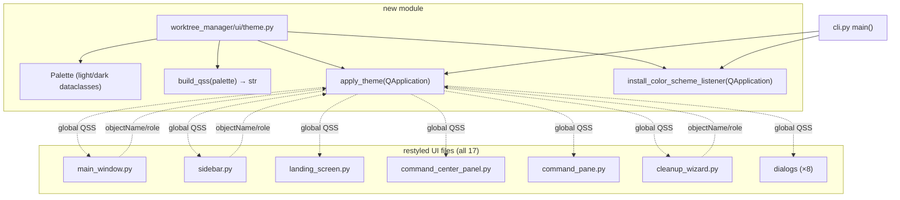
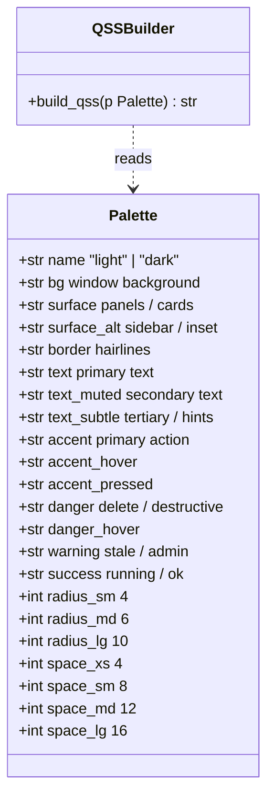
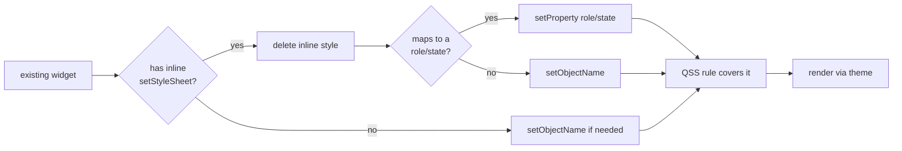

# PySide6 Style Overhaul

## Overview

Replace the app's ad-hoc, tkinter-era inline styling with a centralized PySide6-native theme system that adapts to the OS light/dark appearance and unifies every panel, dialog, and control. Today, ~17 UI files set local stylesheets with hardcoded colors (`#c0392b`, `gray`, `orange`, `#7b2d00`), fixed widths, and bold-via-stylesheet labels — the result reads like a port of CustomTkinter rather than a Qt-native app. After this work, the app will look at home on macOS in both light and dark mode: consistent typography, semantic colors, modern button/input/checkbox styles, hover and focus states, and tight visual rhythm. No new dependencies; emoji glyphs stay, but get sized/colored deliberately. Test coverage and behavior remain unchanged — this is a presentation-layer refresh.

## UI / Flow

### Theme detection (boot)

```
┌─ App starts ─────────────────────────────────────────────────────────┐
│ QApplication                                                          │
│   ↓ read styleHints().colorScheme()                                   │
│   ↓ select Palette(LIGHT|DARK)                                        │
│   ↓ apply QSS template populated with palette tokens                  │
│   ↓ install listener: on colorScheme change → reapply                 │
└──────────────────────────────────────────────────────────────────────┘
```

### Main window (loaded repo, light mode)

```
┌──────────────────────────────────────────────────────────────────────────────┐
│  Git Worktree Manager                                              ─  ☐  ✕   │ ← native chrome
├────────────────┬─────────────────────────────────────────────────────────────┤
│                │                                                              │
│  ⊞  Command    │   my-repo                                          🧹  ⚙    │
│      Center    │   ──────────────────────────────────────────────────────    │
│                │                                                              │
│  ⊞  Workspace  │   WORKTREES                                       + New     │
│      Projects  │                                                              │
│                │   ●  main          2h ago              [ main      ▾ ]      │
│  ─────────     │   ○  feat-login    5h ago              [ feat-log… ▾ ]  ✕   │
│  REPOS    ▾    │   ○  bug-fix-12    3d ago  ⚠ stale     [ bug-fix-… ▾ ]  ✕   │
│                │   ○  old-branch    47d ago ⚠ stale     [ old-bra…  ▾ ]  ✕   │
│  ●  my-repo  ✕ │                                                              │
│  ○  side-app ✕ │                                                              │
│  ○  scratch  ✕ │                                                              │
│                │                                                              │
│                │                                                              │
│  ─────────     │                                                              │
│  + Add Repo    │                                                              │
│  ↻ Refresh     │                                                              │
└────────────────┴─────────────────────────────────────────────────────────────┘
```

Key visual changes vs today:
- Sidebar uses a slightly inset surface tone (subtle separation, no hard border).
- Active repo row uses an accent-tinted background pill, not a `●` character carrying all the meaning.
- Action buttons (`🧹`, `⚙`, `✕`) get circular hover targets at consistent size.
- Stale tag is a small rounded pill, not raw orange text.
- The combo-box and inputs adopt platform-native heights and focus rings.

### Main window (dark mode, hovered row)

```
┌──────────────────────────────────────────────────────────────────────────────┐
│  Git Worktree Manager                                              ─  ☐  ✕   │
├────────────────┬─────────────────────────────────────────────────────────────┤
│ ░░░░░░░░░░░░░░ │                                                              │
│ ░ ⊞ Command  ░ │   my-repo                                          🧹  ⚙    │
│ ░    Center  ░ │   ──────────────────────────────────────────────────────    │
│ ░            ░ │                                                              │
│ ░ ⊞ Workspace░ │   WORKTREES                                       + New     │
│ ░    Projects░ │                                                              │
│ ░            ░ │   ●  main          2h ago              [ main      ▾ ]      │
│ ░  REPOS  ▾  ░ │  ┃○  feat-login    5h ago              [ feat-log… ▾ ]  ✕ ┃ ← hover row
│ ░            ░ │   ○  bug-fix-12    3d ago  ▣ stale     [ bug-fix-… ▾ ]  ✕   │
│ ░╶active-pill╴░│   ○  old-branch    47d ago ▣ stale     [ old-bra…  ▾ ]  ✕   │
│ ░ ●  my-repo ░ │                                                              │
│ ░ ○  side-app░ │                                                              │
│ ░ ○  scratch ░ │                                                              │
│ ░            ░ │                                                              │
│ ░ + Add Repo ░ │                                                              │
│ ░ ↻ Refresh  ░ │                                                              │
└────────────────┴─────────────────────────────────────────────────────────────┘
```

### Empty / landing state

```
┌──────────────────────────────────────────────────────────────────────────────┐
│ ░░░░░░░░░░░░░░ │                                                              │
│ ░ ⊞ Command  ░ │                                                              │
│ ░ ⊞ Workspace░ │                                                              │
│ ░  REPOS  ▾  ░ │                ┌─────────────────────────────┐               │
│ ░  (empty)   ░ │                │           📁                │               │
│ ░            ░ │                │                             │               │
│ ░ + Add Repo ░ │                │     No repo selected.       │               │
│ ░ ↻ Refresh  ░ │                │   Pick one from the         │               │
│                │                │   sidebar or add a new      │               │
│                │                │   repository below.         │               │
│                │                │                             │               │
│                │                │     [   + Add Repo   ]      │ ← primary CTA │
│                │                └─────────────────────────────┘               │
└────────────────┴─────────────────────────────────────────────────────────────┘
```

### Cleanup Wizard — loading

```
┌─ Cleanup Wizard ──────────────────────────────────────────────────────┐
│                                                                       │
│   🧹  Scanning branches…                                              │
│                                                                       │
│   ▰▰▰▰▰▰▰▰▰▰▱▱▱▱▱▱▱▱▱▱▱▱▱▱▱▱▱▱▱▱▱▱▱▱▱▱▱▱   34%                       │
│                                                                       │
│   Checking merge status of feat-login   (17 / 50)                     │
│                                                                       │
└───────────────────────────────────────────────────────────────────────┘
```

### Cleanup Wizard — loaded

```
┌─ Cleanup Wizard ───────────────────────────────────────────────────────┐
│                                                                        │
│   MERGED                                                               │
│   ↳ into main                                          ☑  Select all  │
│      ☑  feat-login         merged 3d ago                               │
│      ☑  feat-search        merged 1d ago                               │
│   ↳ into develop                                       ☐  Select all  │
│      ☑  hotfix-auth        merged 12d ago                              │
│                                                                        │
│   ─────────────────────────────────────────────────────────────────   │
│   STALE                                                ☑  Select all  │
│      ☑  old-spike          47d ago                                     │
│      ☑  pre-refactor       62d ago                                     │
│                                                                        │
│   ─────────────────────────────────────────────────────────────────   │
│   HEALTHY                                                              │
│      ☐  ongoing-work       2d ago                                      │
│                                                                        │
│   ─────────────────────────────────────────────────────────────────   │
│   PROTECTED                                                            │
│      ⛨  main               (protected)                                 │
│      ⛨  release-2025-q1    (protected)                                 │
│                                                                        │
│   ─────────────────────────────────────────────────────────────────   │
│   CANNOT DELETE                                                        │
│      ⊘  wip-branch         ⚠ uncommitted changes                       │
│                                                                        │
├────────────────────────────────────────────────────────────────────────┤
│   ☐ Admin Mode  ⚠ unlocks protected      [Cancel]  [Select All] [Delete]│ ← Delete is destructive
└────────────────────────────────────────────────────────────────────────┘
```

### Cleanup Wizard — admin mode banner

```
┌─ Cleanup Wizard ───────────────────────────────────────────────────────┐
│ ┃ ⚠  ADMIN MODE                                                       │ ← destructive banner
│ ┃    Protected branches can be deleted. Double-check selection.       │
├────────────────────────────────────────────────────────────────────────┤
│   …branch list with protected checkboxes now enabled…                  │
└────────────────────────────────────────────────────────────────────────┘
```

### Command Center

```
┌──────────────────────────────────────────────────────────────────────────────┐
│   Command Center                            [ ⚙ Commands ]  [ + Launch ] ✕   │
│   ──────────────────────────────────────────────────────────────────────     │
│   🔍 Filter running commands by name or repo…                                │
│                                                                              │
│   ┌─ ▶ dev-server  ·  my-repo  · running ─────────────  ⤢  ◼  ↻  ✕ ───┐    │
│   │ 12:03  Starting server on :3000                                       │   │
│   │ 12:03  ✓ Listening                                                    │   │
│   │ 12:04  GET /api/users  200 (12ms)                                     │   │
│   └────────────────────────────────────────────────────────────────────────┘   │
│                                                                              │
│   ┌─ ● test-watch  ·  my-repo  · stopped (exit 1) ────  ⤢  ▶  ↻  ✕ ───┐    │
│   │ 12:05  ✗ 2 failing tests                                             │   │
│   │ 12:05  Process exited with code 1                                    │   │
│   └────────────────────────────────────────────────────────────────────────┘   │
│                                                                              │
└──────────────────────────────────────────────────────────────────────────────┘
```

Status dots become small colored circles, not raw glyphs leaking through. Pane headers become tighter chips with a status pill on the right.

### Dialogs (Create / Delete / Launch / etc.)

```
┌─ Create Worktree ─────────────────────────────────────────────────┐
│                                                                   │
│   Worktree name                                                   │
│   ┌──────────────────────────────────────────────────────────┐    │
│   │  feat-login                                              │    │
│   └──────────────────────────────────────────────────────────┘    │
│                                                                   │
│   Branch                                                          │
│   ( ) New branch from   [ main                          ▾ ]       │
│   (•) Existing branch    [ feat-login                   ▾ ]       │
│                                                                   │
│ ─────────────────────────────────────────────────────────────── │
│                                          [ Cancel ]  [ Create ]   │ ← primary CTA accent
└───────────────────────────────────────────────────────────────────┘
```

All dialogs gain: consistent 20px margins, divider line above the button row, primary button uses accent fill, destructive buttons use red tone, secondary buttons are flat.

## Architecture

### Module layout



### Theme application flow

```mermaid
sequenceDiagram
    participant CLI as cli.py main()
    participant App as QApplication
    participant Hints as QStyleHints
    participant Theme as ui/theme.py
    participant Win as App window

    CLI->>App: QApplication(sys.argv)
    CLI->>Theme: apply_theme(App)
    Theme->>Hints: colorScheme()
    Hints-->>Theme: Light | Dark | Unknown
    Theme->>Theme: select Palette
    Theme->>Theme: build_qss(palette)
    Theme->>App: setStyleSheet(qss)
    CLI->>Theme: install_color_scheme_listener(App)
    Theme->>Hints: connect colorSchemeChanged
    CLI->>Win: App(repo_path); show()

    Note over Win: User toggles OS appearance
    Hints-->>Theme: colorSchemeChanged(Dark)
    Theme->>Theme: build_qss(dark_palette)
    Theme->>App: setStyleSheet(qss)
    Note over Win: every widget repaints with new palette
```

### Token model



The QSS template uses Qt object selectors (`QPushButton`, `QPushButton[role="primary"]`, `QPushButton[role="danger"]`, `QLineEdit:focus`, `#sidebar`, `#repoRow[active="true"]`, etc.). Per-widget setup means setting an `objectName` or `setProperty("role", "primary")` — never an inline color.

### Restyling pattern (per file)



## Open Questions

1. **macOS only or cross-platform parity?** The app appears macOS-targeted (Tk 9 scroll fix in memory mentions macOS), but PySide6 runs everywhere. Should the QSS aim to look great on macOS first and accept it'll look "fine" on Windows/Linux, or should we test/tune all three? (Affects manual testing scope.)

2. **Window chrome — frameless or native?** Stay with the standard macOS title bar (current behavior), or go frameless with a custom toolbar/title row? Frameless is more "modern app" but a bigger lift and worse accessibility on macOS.

3. **Font choice — system default, or a specific family?** SF Pro on macOS via system default is fine, but if you want a specific feel (e.g., Inter, JetBrains Mono for paths/commands), say so. I'd default to system UI font for everything and a mono font (`Menlo`/`SF Mono`) only inside the command center output pane.

4. **Density preference?** Three reasonable rhythms: **compact** (Linear/VS Code feel), **comfortable** (GitHub Desktop), or **spacious**. Compact suits a power-user dev tool but may feel cramped on a 4K display. Default proposal: **comfortable** as the baseline, with the worktree list rows on the tighter end.

5. **Per-status colors in dark mode — should "stale" be amber or a more muted yellow-gray?** Loud amber stands out but can feel noisy in a list of mostly stale branches. Same question for "danger" — true red vs. a slightly desaturated red.

6. **Sidebar repo row icons — keep `●`/`○` glyphs, or use a colored vertical bar accent on the active row (Linear style)?** Both can work; the vertical bar reads more native-Qt and frees the glyph slot.

7. **Iteration 0 walking skeleton scope check** — my plan for Iteration 0 is: ship `theme.py` with palette + QSS, wire `apply_theme` into `cli.main`, install the color-scheme listener, and remove every inline `setStyleSheet` in `main_window.py` + `sidebar.py` + `landing_screen.py` (the three most-visible surfaces). Other panels keep working but inherit only the global default QSS until later iterations. Does that feel like the right thin-but-touchable skeleton, or do you want it thinner (skeleton = theme only, no inline-style removal) or thicker (also cover Command Center)?

---

**Does this design look right?** Please answer the seven open questions before I move to Stage 2 — I will not write the iteration plan until each is resolved.
