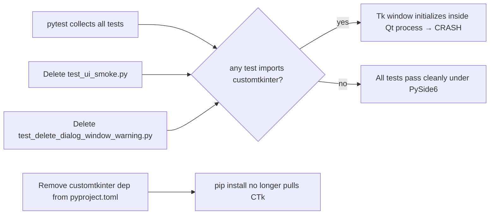

# PySide6 Test Cleanup

## Overview
The project was migrated from customtkinter to PySide6, but two test files and a
`pyproject.toml` dependency were left behind. When pytest collects the full suite,
those two files import `customtkinter`, which initializes a Tk event loop inside the
same process as PySide6's Qt event loop — the two GUI backends fatally conflict,
crashing the entire test run with an OS-level signal. All behaviour tested by those
files is already covered by the newer `_qt.py` test files, so the fix is pure
deletion plus a dependency removal.

## Root-cause map

```
test_ui_smoke.py                → imports customtkinter → Tk window created
test_delete_dialog_window_warning.py → imports customtkinter → Tk window created
                    ↕
PySide6 QApplication already running (pytest-qt's qapp fixture)
                    ↓
Fatal crash (abort signal from Tcl/Tk trying to initialize colours via CoreFoundation)
```

## Coverage gaps (none — everything is already tested)

| Broken CTk file | Behaviour it tested | Already covered by |
|---|---|---|
| `test_ui_smoke.py` — VM tests | `LandingScreenViewModel`, `RepoSetupViewModel`, `SettingsViewModel` | `test_landing_screen.py`, `test_setup_settings_vm.py` |
| `test_ui_smoke.py` — UI tests | `CleanupWizard` smoke | `test_cleanup_wizard_qt.py` |
| `test_delete_dialog_window_warning.py` | `DeleteDialog` with `live_window` arg | `test_delete_dialog_qt.py::test_delete_dialog_live_window_shows_editor_warning_and_changes_button` |

## Architecture



## Open Questions
_(none)_

---

## Iteration Plan

### Iteration 0 — Walking Skeleton (full fix in one pass)
**Delivers:** A full clean test-suite run with zero crashes and zero customtkinter imports anywhere in tests or dependencies.
**Scope:**
- Add a test asserting both dead test files are absent (red)
- Add a test asserting `pyproject.toml` does not mention customtkinter (red)
- Delete `tests/test_ui_smoke.py`
- Delete `tests/test_delete_dialog_window_warning.py`
- Remove `customtkinter>=5.2` from `pyproject.toml` dependencies
- Confirm full suite passes

**Explicitly out of scope:** Any new UI behaviour, refactoring of the Qt tests, or adding missing coverage.

---

## Iteration 0 — Walking Skeleton

### Phase 0.1 — Add cleanup-guard tests (Red)
**What it covers:** Two new assertions that will fail until the dead files are deleted and the dependency removed.

**Tests (Red) — write these first:**
```python
# tests/test_iteration_4_cleanup.py
"""Verify that legacy CTk test files and dependencies from the PySide6 migration are gone."""
import os
import pathlib


def _tests_dir():
    return pathlib.Path(__file__).resolve().parent


def _project_root():
    return _tests_dir().parent


def test_legacy_ui_smoke_test_deleted():
    assert not (_tests_dir() / "test_ui_smoke.py").exists(), (
        "test_ui_smoke.py still exists — delete it; all tests are covered by Qt equivalents"
    )


def test_legacy_delete_dialog_window_warning_test_deleted():
    assert not (_tests_dir() / "test_delete_dialog_window_warning.py").exists(), (
        "test_delete_dialog_window_warning.py still exists — delete it; "
        "covered by test_delete_dialog_qt.py"
    )


def test_customtkinter_not_in_pyproject_dependencies():
    pyproject = (_project_root() / "pyproject.toml").read_text()
    assert "customtkinter" not in pyproject, (
        "customtkinter is still listed as a dependency in pyproject.toml — remove it"
    )
```

**Production code (Green):**
_(none for this phase — tests should go red immediately)_

**Done when:** Running `pytest tests/test_iteration_4_cleanup.py` shows 3 failures.

---

### Phase 0.2 — Delete dead files and remove dependency (Green)

**What it covers:** Making all three red assertions above pass.

**Tests (Red) — already written in Phase 0.1**

**Production code (Green):**

1. Delete `tests/test_ui_smoke.py`
2. Delete `tests/test_delete_dialog_window_warning.py`
3. In `pyproject.toml`, change:
   ```toml
   # before
   dependencies = ["customtkinter>=5.2", "PySide6>=6.6"]
   # after
   dependencies = ["PySide6>=6.6"]
   ```

**Done when:** `pytest tests/test_iteration_4_cleanup.py` → 3 passed, and the full suite no longer crashes.

---

## ✋ Manual Testing Gate — Iteration 0

> STOP. Do not proceed until every item below is checked off.

- [ ] Run `python3.14 -m pytest --tb=short -q` from the `worktree-manager` directory — the suite completes without any OS-level crash or abort signal.
- [ ] The exit code is 0 (all tests pass) — no failures in any file.
- [ ] `tests/test_ui_smoke.py` no longer exists.
- [ ] `tests/test_delete_dialog_window_warning.py` no longer exists.
- [ ] `pyproject.toml` no longer mentions `customtkinter`.
- [ ] `tests/test_iteration_4_cleanup.py` exists and all 3 tests pass.

**How to confirm:** Run the full suite, check the output, and manually verify the deleted files are gone.
Reply "Iteration 0 confirmed" (or describe any failures) before proceeding.
