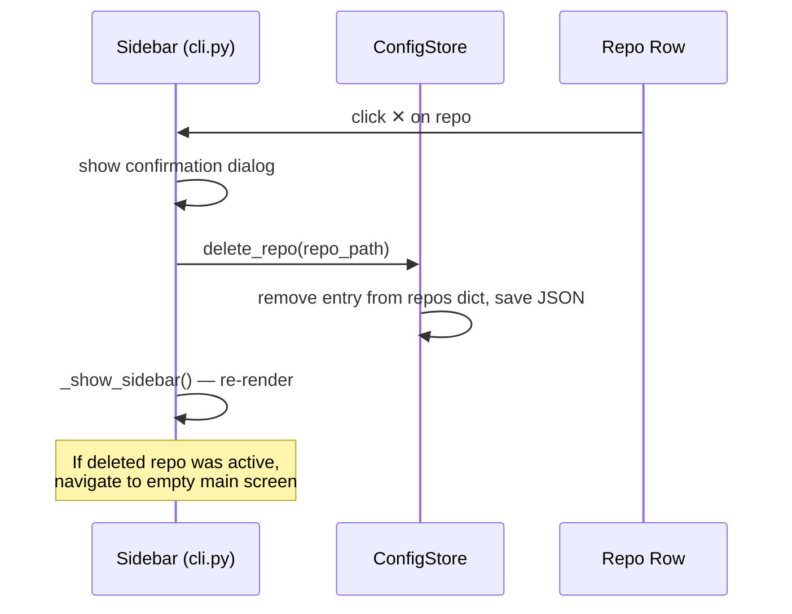

# Repo List Redesign

## Overview
Currently, repos occupy the most prominent part of the sidebar as a bare list of clickable buttons, dominating the UI even when the user may have many repos. This feature redesigns the sidebar so repos are treated at the same visual weight as Workspace Projects and Command Center — collapsible, secondary sections — and adds the ability to remove a repo from the app without deleting the actual files on disk.

## UI / Flow

### Current state
```
┌──────────────────────────────────────────────────────┐
│ ┌──────────┐ ┌────────────────────────────────────┐  │
│ │  REPOS   │ │          Main Content              │  │
│ │──────────│ │                                    │  │
│ │ ● my-app │ │  Git Worktree Manager — my-app     │  │
│ │  other   │ │  ──────────────────────────────    │  │
│ │  repo3   │ │  Worktrees                [+ New]  │  │
│ │  repo4   │ │  ● (main)      3d ago  [branch ▼] │  │
│ │  repo5   │ │  ○ feat-x      1h ago  [branch ▼] │  │
│ │          │ │                                    │  │
│ │+ Add Repo│ │                                    │  │
│ │──────────│ │                                    │  │
│ │⊞ Cmds    │ │                                    │  │
│ │⊞ Projects│ │                                    │  │
│ │↻ Refresh │ │                                    │  │
│ └──────────┘ └────────────────────────────────────┘  │
└──────────────────────────────────────────────────────┘
```

### New state — collapsed repos
```
┌──────────────────────────────────────────────────────┐
│ ┌──────────┐ ┌────────────────────────────────────┐  │
│ │⊞ Cmds    │ │          Main Content              │  │
│ │⊞ Projects│ │                                    │  │
│ │──────────│ │  Git Worktree Manager — my-app     │  │
│ │▶ REPOS   │ │  ──────────────────────────────    │  │
│ │──────────│ │  Worktrees                [+ New]  │  │
│ │          │ │  ● (main)      3d ago  [branch ▼] │  │
│ │          │ │  ○ feat-x      1h ago  [branch ▼] │  │
│ │          │ │                                    │  │
│ │          │ │                                    │  │
│ │+ Add Repo│ │                                    │  │
│ │↻ Refresh │ │                                    │  │
│ └──────────┘ └────────────────────────────────────┘  │
└──────────────────────────────────────────────────────┘
```

### New state — expanded repos (scrollable list)
```
┌──────────────────────────────────────────────────────┐
│ ┌──────────────────────────┐ ┌──────────────────────┐ │
│ │⊞ Cmd Center              │ │   Main Content       │ │
│ │⊞ Projects                │ │                      │ │
│ │──────────────────────────│ │  Git Worktree Mgr —  │ │
│ │▼ REPOS                   │ │  my-app              │ │
│ │┌────────────────────────┐│ │  ────────────────    │ │
│ ││ ● my-app            [✕]││ │  Worktrees  [+ New]  │ │
│ ││ ○ backend-api       [✕]││ │  ● (main)  3d ago    │ │
│ ││ ○ frontend-react    [✕]││ │  ○ feat-x  1h ago    │ │
│ ││ ○ mobile-ios        [✕]││ │                      │ │
│ ││ ○ design-system     [✕]││ │                      │ │
│ ││ ○ data-pipeline     [✕]││ │                      │ │
│ ││    (scrolls)           ││ │                      │ │
│ │└────────────────────────┘│ │                      │ │
│ │  + Add Repo               │ │                      │ │
│ │  ↻ Refresh                │ │                      │ │
│ └──────────────────────────┘ └──────────────────────┘ │
└──────────────────────────────────────────────────────┘
```
*✕ is always visible on every row. The repo list is a CTkScrollableFrame with `attach_scroll_fix` applied.*

### Delete confirmation — non-active repo
```
┌───────────────────────────────┐
│  Remove repo from app?        │
│                               │
│  backend-api                  │
│  /tmp/wm-fake-repos/...       │
│                               │
│  Files on disk are not        │
│  affected.                    │
│                               │
│         [Cancel]  [Remove]    │
└───────────────────────────────┘
```

### Delete confirmation — currently active repo
```
┌───────────────────────────────┐
│  Remove repo from app?        │
│                               │
│  my-app                       │
│  /Users/ahmed/repos/my-app    │
│                               │
│  ⚠ This is the currently      │
│  open repo. Removing it will  │
│  return you to the empty      │
│  screen.                      │
│                               │
│  Files on disk are not        │
│  affected.                    │
│                               │
│         [Cancel]  [Remove]    │
└───────────────────────────────┘
```

## Architecture



### Changes required
| File | Change |
|------|--------|
| `config_store.py` | Add `delete_repo(repo_path)` method |
| `cli.py` | Command Center and Workspace Projects buttons move above repos section; repos section becomes collapsible (▶/▼ toggle); repo list rendered in a `CTkScrollableFrame` with `attach_scroll_fix` applied; each repo row has an always-visible ✕ button; clicking ✕ shows a confirmation dialog (with extra active-repo warning if applicable); collapse state persisted via `set_ui_pref("repos_collapsed", bool)`; if active repo is deleted, navigate to empty main screen |

## Open Questions
*(none)*

## Iteration Plan

### Iteration 0 — Walking Skeleton
**Delivers:** The sidebar shows Command Center and Workspace Projects buttons at the top, then a collapsible ▶/▼ REPOS toggle with the repo list in a scrollable frame — collapse state persists across restarts.
**Scope:**
- Move Command Center and Workspace Projects buttons above the repos section
- Add a ▶/▼ REPOS toggle header
- Render repo list in a `CTkScrollableFrame` with `attach_scroll_fix`
- Collapse state saved/loaded via `set_ui_pref("repos_collapsed", bool)`
- Existing repo click-to-open and active-repo highlight still work
**Explicitly out of scope:** ✕ delete buttons, confirmation dialog, `delete_repo` in config store.

## ✋ Manual Testing Gate — Iteration 0

> STOP. Do not proceed to Iteration 1 until every item below is checked off by the user.

- [ ] Launch the app — confirm Command Center and Workspace Projects buttons appear at the **top** of the sidebar, above the repos section
- [ ] Confirm a "▶ REPOS" toggle header is visible below those buttons
- [ ] Click "▶ REPOS" — the repo list expands and the arrow changes to "▼ REPOS"
- [ ] Confirm all repos appear in the expanded list inside a scrollable area
- [ ] Scroll through the repo list with the trackpad — confirm it scrolls smoothly
- [ ] Click a repo name — confirm it opens correctly in the main content area with the active (●) indicator
- [ ] Click "▼ REPOS" again — list collapses back to "▶ REPOS"
- [ ] Quit and relaunch the app — confirm the collapsed/expanded state is remembered

**How to confirm:** Run the app with `python3.14 -m worktree_manager`, perform each action above, and check off each item manually.
Reply "Iteration 0 confirmed" (or describe any failures) before I write the plan for Iteration 1.

### Iteration 1 — Repo Deletion
**Delivers:** Each repo row has an always-visible ✕ button that removes the repo from the app (config only, files untouched), with a confirmation dialog that shows an extra warning when deleting the active repo.
**Scope:**
- Add `delete_repo(repo_path)` to `ConfigStore`
- Add ✕ button to every repo row in the sidebar
- Confirmation dialog — two variants (standard and active-repo warning)
- On confirm: call `delete_repo`, re-render sidebar; if active repo deleted, navigate to empty main screen
**Builds on:** Iteration 0.

## ✋ Manual Testing Gate — Iteration 1

> STOP. Do not proceed until every item below is checked off by the user.

- [ ] Launch the app and expand the REPOS section — every repo row has a visible ✕ button
- [ ] Click ✕ on a non-active repo — a confirmation dialog appears with the repo name, path, and "Files on disk are not affected"
- [ ] Click Cancel in the dialog — the repo is still in the list, nothing changed
- [ ] Click ✕ on a non-active repo again and click Remove — the repo disappears from the list
- [ ] Quit and relaunch — the removed repo is gone (not just hidden)
- [ ] Confirm the repo files still exist on disk at their original path
- [ ] Click ✕ on the currently active (●) repo — the dialog shows the extra ⚠ warning about returning to the empty screen
- [ ] Confirm Remove on the active repo — the sidebar re-renders and the main content switches to the empty "No repo selected" screen
- [ ] Regression: collapse/expand toggle still works and stays on the left side
- [ ] Regression: clicking a repo name still opens it correctly

**How to confirm:** Run `python3.14 -m worktree_manager`, perform each action above, and check off each item manually.
Reply "Iteration 1 confirmed" (or describe any failures) before I declare the feature complete.
