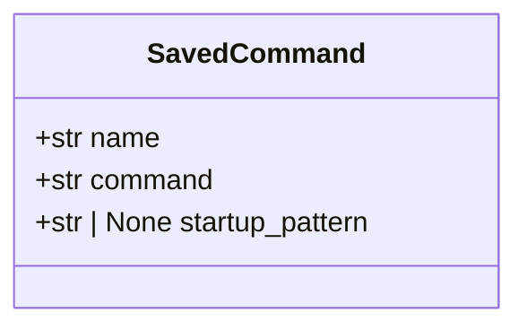
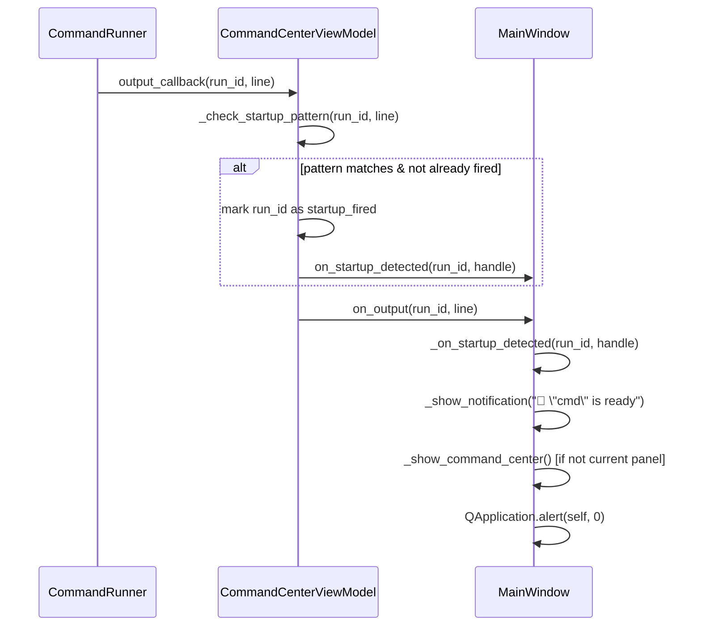

# Server Startup Alerts

## Overview

Commands that run long-lived servers (dev servers, backend APIs, etc.) never exit to signal they are ready — they just print a line like "Server ready on :3000" or "Listening on port 8000". Currently the Command Center only alerts when a command **exits**. This feature adds optional per-command "startup pattern" matching: when a saved command's output contains a configured substring (or regex), the same notification and window-flash mechanism fires to tell the user "your server is up."

## UI / Flow

### Add / Edit Command dialog — startup pattern field

A new optional field appears below the command text area in both the Add Command dialog and the inline edit row inside Manage Commands. It is clearly optional and labelled with an example.

```
┌──────────────────── Add Saved Command ──────────────────────┐
│                                                              │
│ Repo: [myrepo ▼]                                            │
│                                                              │
│ Name: [dev server                    ]                       │
│                                                              │
│ Command:                                                     │
│ ┌──────────────────────────────────────────────────────┐    │
│ │ npm run dev                                          │    │
│ └──────────────────────────────────────────────────────┘    │
│                                                              │
│ Startup pattern (optional):                                  │
│ ┌──────────────────────────────────────────────────────┐    │
│ │ ready in                                             │    │
│ └──────────────────────────────────────────────────────┘    │
│ Matches a substring in any output line to detect ready.     │
│                                                              │
│                              [Cancel]          [Save]        │
└──────────────────────────────────────────────────────────────┘
```

Same layout in the **Edit** row of Manage Commands:

```
┌── Editing: dev server ─────────────────────────────────────┐
│  Name   [dev server                  ]                      │
│  Command                                                     │
│  ┌───────────────────────────────────────────────────────┐  │
│  │ npm run dev                                           │  │
│  └───────────────────────────────────────────────────────┘  │
│  Startup pattern (optional)                                  │
│  ┌───────────────────────────────────────────────────────┐  │
│  │ ready in                                              │  │
│  └───────────────────────────────────────────────────────┘  │
│                             [Cancel]             [Save]      │
└─────────────────────────────────────────────────────────────┘
```

### Notification — server startup detected

When the startup pattern fires, the same notification mechanism used for command-exit alerts is used. The notification body includes the command name and the matched line:

```
macOS banner:
┌─────────────────────────────────────────┐
│  Command Center                          │
│  🚀 "dev server" is ready               │
└─────────────────────────────────────────┘
```

The Command Center panel is also brought into view and the window is flashed (same as exit alerts), **only if the Command Center panel is not already the active panel**.

### Alert fires once per run

The startup alert fires at most once per run — once the pattern has matched, subsequent matching lines do not fire additional alerts.

## Architecture

### Data model change — `SavedCommand.startup_pattern`



`startup_pattern` is a plain substring (not a regex) for simplicity. Empty string and `None` both mean "no pattern". Stored in JSON as `"startup_pattern": "..."` alongside `"name"` and `"command"`.

### Detection flow



### New components / changes

| Component | Change |
|---|---|
| `SavedCommand` (models.py) | Add `startup_pattern: str \| None = None` |
| `ConfigStore` | Read/write `startup_pattern` alongside `name`/`command` |
| `CommandCenterViewModel` | Track `_startup_fired: set[str]`; in `_on_runner_output`, check pattern and fire `on_startup_detected`; clear on `remove_run`/`restart` |
| `CommandCenterViewModel` | Add `on_startup_detected` callback; store startup_pattern per run in `_run_meta` |
| `CommandRunner` | No change — pattern checking happens in the VM |
| `AddCommandDialog` | Add startup pattern `QLineEdit`; pass to `vm.save_command` |
| `ManageCommandsDialog` | Add startup pattern field to view row (display only) and edit row; save on `_save_edit` |
| `MainWindow` (cli.py) | Wire `on_startup_detected` → `_on_startup_detected`; implement `_on_startup_detected` |

## Open Questions

(none)

---

## Iteration Plan

### Iteration 0 — Walking Skeleton
**Delivers:** A saved command with a startup pattern fires a macOS notification and flashes the window when that substring appears in its output — end-to-end, testable against the existing `test_server.py`.
**Scope:**
- `SavedCommand.startup_pattern: str | None = None` added to model
- `ConfigStore` reads/writes `startup_pattern` in JSON
- `CommandCenterViewModel`: add `_startup_fired: set[str]` and `on_startup_detected` callback; check pattern in `_on_runner_output`; clear `_startup_fired` entry on `remove_run` and `restart`; store `startup_pattern` in `_run_meta`
- `MainWindow`: wire `on_startup_detected` via signal bridge; implement `_on_startup_detected` (notification + show command center + window flash, only when Command Center is not already the active panel)

**Explicitly out of scope:** UI fields in Add Command dialog and Manage Commands dialog (pattern can be set directly in config JSON for manual testing); view-row display of pattern in Manage Commands.

---

### Iteration 1 — Add/Edit UI for Startup Pattern
**Delivers:** Users can set a startup pattern through the UI — the "Add Saved Command" dialog and the inline edit row in Manage Commands both show the optional "Startup pattern" field.
**Scope:**
- `AddCommandDialog`: add startup pattern `QLineEdit` below command text; pass value to `vm.save_command`
- `ManageCommandsDialog` view row: show startup pattern value as a small dimmed label when non-empty
- `ManageCommandsDialog` edit row: add startup pattern `QLineEdit`; include in `_save_edit`
- `vm.save_command` / `CommandCenterViewModel.save_command` signature accepts `startup_pattern`
**Builds on:** Iteration 0

## ✋ Manual Testing Gate — Iteration 0

> STOP. Do not proceed to Iteration 1 until every item below is checked off by the user.

- [ ] Edit the config JSON directly to add `"startup_pattern": "Server ready"` to a saved command (e.g. `test-server`). Launch it from Command Center — confirm a macOS notification saying `🚀 "test-server" is ready` appears when the output line containing "Server ready" is printed.
- [ ] Confirm the notification fires **only once** — subsequent lines in the same run do not trigger more notifications.
- [ ] While Command Center is the active panel, confirm the panel is **not** re-opened/flashed (no redundant panel switch).
- [ ] Navigate away from Command Center (e.g. open a repo), then launch a command with a startup pattern — confirm the Command Center panel is brought into view when the pattern fires.
- [ ] Stop the server and restart it — confirm the startup notification fires again on the restarted run (the once-per-run guard is reset).
- [ ] Save a command with **no** startup pattern — confirm it launches and runs normally with no spurious notification.

**How to confirm:** Run the app with `python3.14 -m worktree_manager.cli`, perform each action above, and check off each item manually.
Reply "Iteration 0 confirmed" (or describe any failures) before I write the plan for Iteration 1.
