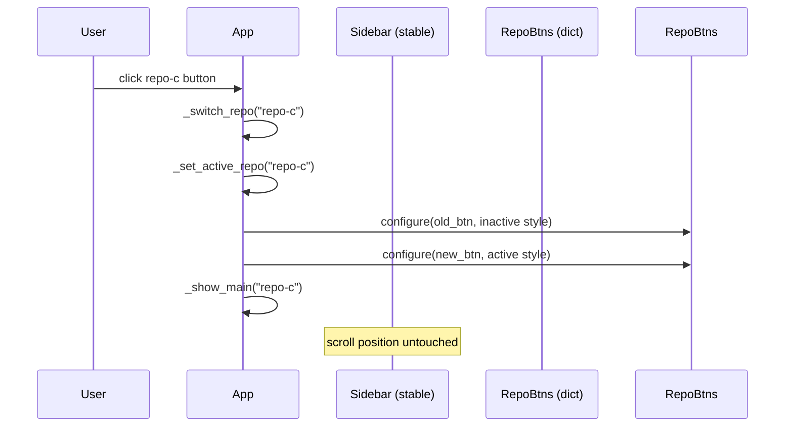

# Sidebar Stable Repo List

## Overview
Currently `_show_sidebar` destroys and recreates the entire sidebar widget tree every time a repo is selected, a repo is deleted, or a refresh is triggered. This causes the scroll position to reset to the top on every selection. The fix is to keep the sidebar alive and only update the visual state of repo buttons (active indicator, colour) in-place when the selection changes, and only rebuild the repo rows when the repo list itself changes (add/delete).

## UI / Flow

### Normal selection (no list change)
```
Before click:           After click:
┌──────────────────┐    ┌──────────────────┐
│ ⊞ Command Center │    │ ⊞ Command Center │
│ ⊞ Workspace Proj │    │ ⊞ Workspace Proj │
│ ▼ REPOS          │    │ ▼ REPOS          │
│ ┌──────────────┐ │    │ ┌──────────────┐ │
│ │ ○ repo-a   ✕│ │    │ │ ○ repo-a   ✕│ │
│ │ ● repo-b   ✕│ │    │ │ ○ repo-b   ✕│ │  ← deactivated
│ │ ○ repo-c   ✕│ │    │ │ ● repo-c   ✕│ │  ← activated
│ └──────────────┘ │    │ └──────────────┘ │
│   scroll pos: ↕  │    │   scroll pos: ↕  │  ← preserved
└──────────────────┘    └──────────────────┘
```

### Add/Delete repo (list changes — rows must be rebuilt)
```
Rows are cleared and re-rendered inside the existing CTkScrollableFrame.
Sidebar chrome (top buttons, REPOS header, bottom buttons) stays untouched.
```

## Architecture



### Key structural change
- `_show_sidebar` runs **once** (on first build). It builds the chrome + the repo scroll frame + all repo rows, and stores button references in `self._repo_buttons: dict[str, CTkButton]`.
- `_update_repo_selection(new_path)` swaps visual state on the two affected buttons only.
- `_rebuild_repo_rows()` clears and re-renders rows inside the existing scroll frame — called only after add/delete.
- `_show_sidebar` is replaced by `_ensure_sidebar()` which no-ops if the sidebar already exists.

## Open Questions
(none)

---

## Iteration Plan

### Iteration 0 — Walking Skeleton
**Delivers:** Selecting a repo updates button styles in-place without rebuilding the sidebar; scroll position is preserved.
**Scope:**
- Add `self._repo_buttons: dict[str, CTkButton]` to track button references
- `_show_sidebar` runs once; subsequent calls no-op if the sidebar is already built
- New `_update_repo_selection(new_path)` reconfigures only the old and new active buttons
- `_show_main` and `_show_empty_main` call `_update_repo_selection` instead of `_show_sidebar`
- Sidebar chrome (top buttons, REPOS header, bottom buttons) never rebuilt on selection

**Explicitly out of scope:**
- Add/delete repo row rebuilding (Iteration 1)
- Collapse/expand REPOS section (Iteration 1)
- Refresh triggering row rebuild (Iteration 1)

---

### Iteration 1 — Structural Mutations
**Delivers:** Adding or deleting a repo, and collapsing/expanding the REPOS section, rebuild only the repo rows inside the existing scroll frame — sidebar chrome remains stable.
**Scope:**
- New `_rebuild_repo_rows()` clears rows from the existing `_repo_scroll` and re-renders them, then calls `_update_repo_selection`
- `_confirm_delete_repo` and `_pick_and_add_repo` call `_rebuild_repo_rows()` instead of `_show_sidebar`
- `_toggle_repos_section` hides/shows the scroll frame in-place rather than rebuilding the sidebar
- `_refresh` calls `_rebuild_repo_rows()` instead of `_show_sidebar`
- `_show_empty_main` still calls `_ensure_sidebar()` (no-op if already built)
- `_clear` (used by `_show_setup`) still destroys the sidebar fully — setup flow is a full clear

**Builds on:** Iteration 0

---

## ✋ Manual Testing Gate — Iteration 0

> STOP. Do not proceed to Iteration 1 until every item below is checked off by the user.

- [ ] Launch the app with multiple repos in the sidebar list
- [ ] Scroll the repo list partway down so the top repos are out of view
- [ ] Click a repo that is visible in the scrolled position — confirm the main panel switches to that repo
- [ ] Confirm the scroll position did NOT jump back to the top
- [ ] Confirm the previously-active repo shows ○ and transparent background
- [ ] Confirm the newly-selected repo shows ● and gray30 background
- [ ] Click a second repo — confirm the same in-place style swap happens again without scroll reset

**How to confirm:** Run `python3.14 -m worktree_manager`, perform each action above, and check off each item manually.
Reply "Iteration 0 confirmed" (or describe any failures) before I implement Iteration 1.

---

## ✋ Manual Testing Gate — Iteration 1

> STOP. Do not proceed until every item below is checked off by the user.

- [ ] Scroll the repo list partway down, then delete a non-active repo — confirm the row disappears and scroll position is preserved
- [ ] Add a new repo via "+ Add Repo" — confirm it appears in the list without the sidebar chrome (top buttons, REPOS header) being recreated
- [ ] Click "▼ REPOS" to collapse the section — confirm the list hides cleanly
- [ ] Click "▶ REPOS" to expand — confirm the list reappears with the correct active repo highlighted
- [ ] Click "↻ Refresh" — confirm the list updates without the sidebar chrome rebuilding
- [ ] Regression: scroll down, click a repo — confirm scroll position still holds (Iteration 0 behaviour intact)

**How to confirm:** Run `python3.14 -m worktree_manager`, perform each action above, and check off each item manually.
Reply "Iteration 1 confirmed" (or describe any failures) when done.
