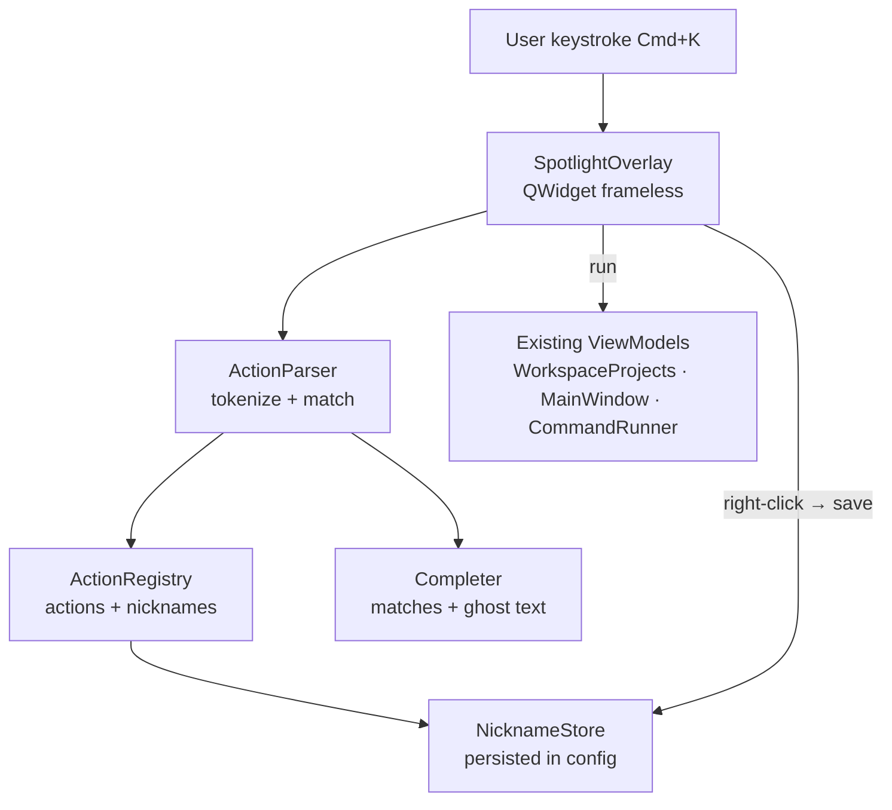
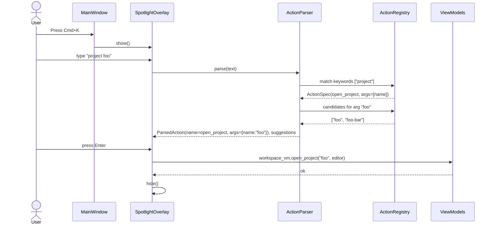
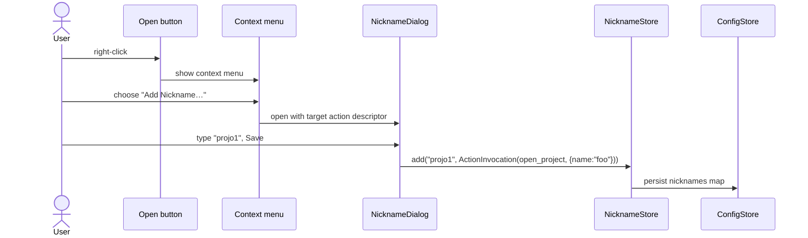

# Spotlight Actions

## Overview

A Spotlight-style command launcher overlay that opens with a global hotkey (Cmd+K) and lets the user trigger app actions by typing a sequence of unique keywords, optionally followed by string arguments. The launcher offers smart substring/fuzzy filtering of matching keywords and Tab completion. Users can also assign nicknames (aliases) to specific concrete actions by right-clicking on existing UI elements (e.g. a project's *Open* button → *Nickname* → `projo1`), so that typing the nickname in the launcher directly executes the underlying action.

This feature plugs into the existing PySide6 `worktree_manager` app and reuses its view-models and services to actually execute the actions (open project, edit project, run command, etc.).

## UI / Flow

### Launcher closed (no UI visible)
```
┌─────────────────────────────────────────────────────────────┐
│ Worktree Manager (main window — unchanged)                  │
│                                                             │
│   Press Cmd+K anywhere to open Spotlight Actions            │
│                                                             │
└─────────────────────────────────────────────────────────────┘
```

### Launcher open — empty input
```
                ┌──────────────────────────────────────────┐
                │  >                                       │
                ├──────────────────────────────────────────┤
                │  project       Open a workspace project  │
                │  edit          Edit something            │
                │  command       Run a saved command       │
                │  ─────────────────────────────────────── │
                │  projo1   (nickname → project foo)       │
                │  api-run  (nickname → command myrepo …)  │
                └──────────────────────────────────────────┘
                  Esc to close · Tab to complete · ↵ to run
```

### Launcher open — typing first keyword (filter + completion ghost)
```
                ┌──────────────────────────────────────────┐
                │  > com▏mand                              │   ← "mand" is ghost text
                ├──────────────────────────────────────────┤
                │  command       Run a saved command       │   ← highlighted
                └──────────────────────────────────────────┘
                  Tab to accept "command"
```

### Launcher open — after first keyword (suggesting next keyword/argument)
```
                ┌──────────────────────────────────────────┐
                │  > project ▏                             │
                ├──────────────────────────────────────────┤
                │  foo                                     │
                │  spotlight_actions                       │
                │  bar-experiment                          │
                └──────────────────────────────────────────┘
                  ↑↓ to choose · ↵ to run · Esc to cancel
```

### Launcher open — multi-keyword action
```
                ┌──────────────────────────────────────────┐
                │  > edit project foo▏                     │
                ├──────────────────────────────────────────┤
                │  ↵  Edit project "foo"                   │
                └──────────────────────────────────────────┘
```

### Launcher open — full command action with three args
```
                ┌──────────────────────────────────────────┐
                │  > command worktree-manager main runs▏   │
                ├──────────────────────────────────────────┤
                │  runserver    (saved command)            │
                │  runtests                                │
                └──────────────────────────────────────────┘
```

### Launcher open — nickname match
```
                ┌──────────────────────────────────────────┐
                │  > projo1▏                               │
                ├──────────────────────────────────────────┤
                │  ↵  projo1 → project foo                 │
                └──────────────────────────────────────────┘
```

### Nickname creation flow (right-click menu on Project's "Open" button)
```
   Workspace Projects panel
   ┌─────────────────────────────────────┐
   │ foo                  [Open] [Edit]  │
   │                      └─┬─┘          │
   │                        │ right-click│
   │                ┌───────▼──────────┐ │
   │                │ Add Nickname…    │ │
   │                │ ──────────────── │ │
   │                │ projo1 (remove)  │ │
   │                └──────────────────┘ │
   └─────────────────────────────────────┘
```

### Nickname entry dialog
```
   ┌──────────────────────────────────────────┐
   │ Nickname for: project foo                │
   │                                          │
   │  Nickname:  [ projo1                  ]  │
   │                                          │
   │              [ Cancel ]   [ Save ]       │
   └──────────────────────────────────────────┘
```

### Error / unknown state
```
                ┌──────────────────────────────────────────┐
                │  > project nonexistent▏                  │
                ├──────────────────────────────────────────┤
                │  ⚠  No project named "nonexistent"       │
                └──────────────────────────────────────────┘
                  Esc to close
```

## Architecture

### Component diagram



### Action execution sequence



### Nickname save sequence



### Key models (new)

- `ActionSpec` — defines a registered action: keyword chain (`["project"]`, `["edit", "project"]`, `["command"]`), positional arg slots with completion providers, and the callable that executes it.
- `ActionInvocation` — a fully-bound `(action_name, args_dict)` ready to execute. Nicknames map a single string to one of these.
- `NicknameStore` — read/write nicknames through `ConfigStore` (new top-level `"nicknames"` section in `config.json`).
- `ActionParser` — tokenizes input on whitespace (with simple quoting), walks the registry's keyword tree, and returns `(matched_action_or_None, remaining_tokens, suggestions_for_next_slot)`.
- `Completer` — given the current input, returns the longest unambiguous extension (for Tab) and a ranked list of candidates (for the dropdown).

## Resolved Decisions

1. **Hotkey scope** — Cmd+K is an app-scoped `QShortcut`; only active while a worktree-manager window has focus. No global hotkey, no Accessibility permission.
2. **Process model** — Frameless overlay window owned by the same worktree-manager process; reuses existing view-models directly.
3. **Initial action catalogue (v1)** — 16 actions, following the grammar `<verb?> <noun> <args...>` where omitting the verb runs the noun's primary operation. Listed in frequency-of-use order (also the order they appear in the dropdown for empty input):

   | #  | Action                                  | What it does                                                | Confirm? |
   |----|-----------------------------------------|-------------------------------------------------------------|----------|
   | 1  | `project <name>`                        | Open the workspace project in editor                        | —        |
   | 2  | `command <repo> <worktree> <cmd-name>`  | Run a saved command in that repo+worktree                   | —        |
   | 3  | `repo <name>`                           | Focus (or open) that repo's main window                     | —        |
   | 4  | `switch <worktree> <branch>`            | Switch the branch in a worktree                             | —        |
   | 5  | `new worktree <repo> <branch>`          | Create a new worktree off a branch                          | —        |
   | 6  | `edit project <name>`                   | Open the project edit dialog                                | —        |
   | 7  | `new project`                           | Open the create-project dialog                              | —        |
   | 8  | `new command <repo>`                    | Open the add-command dialog for that repo                   | —        |
   | 9  | `edit command <repo> <cmd-name>`        | Open the edit-command dialog for that saved command         | —        |
   | 10 | `cleanup <repo>`                        | Open the cleanup wizard for that repo                       | —        |
   | 11 | `delete worktree <worktree>`            | Delete a worktree (asks about also deleting its branch)     | **Yes**  |
   | 12 | `delete project <name>`                 | Delete a workspace project                                  | **Yes**  |
   | 13 | `delete command <repo> <cmd-name>`      | Delete a saved command                                      | **Yes**  |
   | 14 | `settings`                              | Open the settings panel                                     | —        |
   | 15 | `new repo`                              | Open the repo setup dialog                                  | —        |
   | 16 | `delete repo <name>`                    | Remove a repo from the manager                              | **Yes**  |

   Root keywords offered for empty input / first-token Tab completion, in the same order:
   `project · command · repo · switch · new · edit · cleanup · delete · settings`

   (`new` collects: `new worktree`, `new project`, `new command`, `new repo`. `edit` collects: `edit project`, `edit command`. `delete` collects: `delete worktree`, `delete project`, `delete command`, `delete repo`.)

   **Confirmation rule for deletes from spotlight:** Every `delete *` action invoked from the launcher (including via a nickname) MUST present a blocking confirmation dialog before executing. The dialog states the exact target (e.g. *"Delete worktree `/Users/.../foo`? This cannot be undone."*) and requires an explicit *Delete* / *Cancel* click — no implicit Enter-confirms-delete from the spotlight. For `delete worktree`, the dialog also includes the existing "Also delete branch" checkbox so the worktree-manager's existing semantics are preserved. Confirmation applies even when the delete is triggered via a saved nickname.

4. **`command` argument order & source** — `command <repo> <worktree> <saved-command-name>`. Only previously-saved `SavedCommand`s from `ConfigStore`; no ad-hoc command strings in v1. (Saved commands are per-repo, so `new command <repo>` and `edit command <repo> <cmd-name>` don't take a worktree argument — only `command` itself does, since *running* a saved command needs a target worktree.)
5. **Nickname semantics** — A nickname is an alias for a **complete, already-bound action invocation**. Typing the nickname and pressing Enter executes the bound action immediately; nicknames are not chainable text expansions.
6. **Nickname surfaces (v1)** — A nickname binds a single string to a fully-specified `ActionInvocation`. The right-click context menu surfaces below cover every invocation type that is sensibly nicknameable in v1.

   #### Nicknameable invocations

   | Action invocation                                  | Right-click surface                                                                                  |
   |----------------------------------------------------|------------------------------------------------------------------------------------------------------|
   | `project <name>`                                   | *Open* button in `WorkspaceProjectsPanel`                                                            |
   | `edit project <name>`                              | *Edit* button in `WorkspaceProjectsPanel`                                                            |
   | `delete project <name>`                            | *Delete* button in `WorkspaceProjectsPanel`                                                          |
   | `repo <name>`                                      | Repo row in the sidebar                                                                              |
   | `cleanup <repo>`                                   | Repo row in the sidebar (separate menu entry)                                                        |
   | `delete repo <name>`                               | Repo row in the sidebar (separate menu entry)                                                        |
   | `command <repo> <worktree> <cmd-name>`             | Pane header of a running or recently-stopped run in the Command Center — the pane already has all three values bound via `RunHandle`. |
   | `edit command <repo> <cmd-name>`                   | Row in the Manage Commands dialog                                                                    |
   | `delete command <repo> <cmd-name>`                 | Row in the Manage Commands dialog (separate menu entry)                                              |
   | `delete worktree <worktree>`                       | The ✕ delete button on a worktree row in `MainWindow`                                                |

   Destructive nicknames are permitted; the confirmation dialog from Decision #3 still fires when they are executed.

   #### Not nicknameable in v1 (and why)

   | Action                                              | Why not                                                                                          |
   |-----------------------------------------------------|--------------------------------------------------------------------------------------------------|
   | `settings`                                          | Zero arguments — typing the keyword is already the shortcut.                                     |
   | `new project` / `new repo` / `new command <repo>`   | Zero or one argument; no real keystroke saving, and the dialog itself is what does the work.     |
   | `switch <worktree> <branch>`                        | Two free arguments with no single UI element that binds them together. Defer to v2.              |
   | `new worktree <repo> <branch>`                      | Same — two free args, no natural surface to right-click. Defer to v2.                            |
7. **Conflicts** —
   - Built-in keywords (the action catalogue) take precedence over nicknames at lookup time. A nickname that collides with a built-in keyword is rejected at save time.
   - Two nicknames with the same name: **last write wins** (silently overwrites).
8. **Tab completion behaviour** — All three behaviours combined:
   - Exactly one candidate → Tab completes the full token.
   - Multiple candidates with a common prefix longer than typed → Tab extends to the common prefix.
   - Multiple candidates with no further common prefix → repeated Tab cycles through candidates.
9. **Filter style** — Substring match (case-insensitive). `runs` matches `runserver` and `runtests`. `oo` matches `foo`.
10. **Multi-window** — Per-window launcher (the active window's Cmd+K opens its overlay). No global single-instance overlay.
11. **"edit project" target** — Opens the existing project edit dialog used by `WorkspaceProjectsPanel`.
12. **Recent actions on empty input** — When input is empty, the launcher shows the user's recently used actions/nicknames first, then the static list of root keywords. MRU list is persisted in `ConfigStore`.
13. **Multi-word names (spaces)** — **Greedy match against the known catalogue**, no quoting required. The parser tokenizes on whitespace, then for each argument slot it greedily accumulates tokens while the accumulated string is a substring of *some* candidate in that slot's catalogue. The dropdown disambiguates when multiple candidates match (e.g. `runs` and `runs server`); Enter selects the highlighted row. Names with spaces are stored and shown verbatim — no sanitization.

---

## Iteration Plan

### Iteration 0 — Walking Skeleton
**Delivers:** Press Cmd+K in the worktree-manager window → a frameless Spotlight overlay opens; type a prefix of a workspace project's name → matching projects appear in a filtered list; press Enter on the highlighted match → the project opens in the editor; press Esc → overlay closes.

**Scope:**
- New `ActionRegistry` with exactly one registered action: `project <name>`.
- New `ActionParser`: tokenize input on whitespace; first token is the keyword `project`; remaining tokens are matched greedily against the live project list from `ConfigStore.all_projects()`.
- New frameless `SpotlightOverlay` window: `QLineEdit` at top + a vertical list of suggestions below. Centered over the active main window.
- `QShortcut(Cmd+K)` on the main window opens the overlay; `Esc` closes it; `Enter` runs the highlighted action.
- Substring filter (case-insensitive) on the suggestion list.
- Action execution delegates to existing `WorkspaceProjectsViewModel.open_project(name, editor)` using the repo's `last_editor` value.
- Each main window owns its own overlay instance (per Decision #10).

**Explicitly out of scope:**
- Tab completion (Iteration 1).
- Any other action besides `project` (`command`, `repo`, `switch`, `edit project`, etc.).
- Multi-keyword chains like `edit project foo`.
- Nicknames and right-click menus.
- MRU on empty input.
- Confirmation dialogs (no destructive actions yet).
- Visual styling beyond what Qt gives for free.

### Iteration 1 — Tab Completion + Multi-Keyword + Full Read/Launch Catalogue
**Delivers:** Tab works as a power-user completion key everywhere in the launcher, multi-keyword chains like `edit project foo` parse correctly, and the full set of read/launch (non-destructive, non-creating) actions is wired up end-to-end.

**Scope:**
- Generalise `ActionRegistry` to a **keyword trie** so chains like `["edit", "project"]` resolve correctly while `["project"]` still matches.
- Implement Tab completion (Decision #8):
  - exactly one candidate → completes the full token,
  - multiple candidates with a longer common prefix → extends to common prefix,
  - no further common prefix → repeated Tab cycles through candidates.
- Add ghost-text rendering for the active completion suggestion in the input field.
- Register the remaining read/launch actions from the catalogue: `edit project <name>`, `command <repo> <worktree> <cmd-name>`, `repo <name>`, `switch <worktree> <branch>`, `cleanup <repo>`, `settings`.
- Wire each new action to its existing view-model / dialog method.

**Builds on:** Iteration 0.

### Iteration 2 — Create/Edit Dialog-Opening Actions
**Delivers:** All actions that open a creation or editing dialog work from the launcher: `new worktree`, `new project`, `new command`, `edit command`, `new repo`.

**Scope:**
- Register the 5 dialog-opening actions and bind each to the existing dialog (`CreateDialog`, project create dialog used by `WorkspaceProjectsPanel`, `AddCommandDialog`, `ManageCommandsDialog`, `RepoSetupDialog`).
- For actions that take args (`new worktree <repo> <branch>`, `new command <repo>`, `edit command <repo> <cmd-name>`), reuse the existing argument-slot completion machinery from Iteration 1.

**Builds on:** Iteration 1.

### Iteration 3 — Delete Actions with Confirmation Dialogs
**Delivers:** The four delete actions (`delete worktree`, `delete project`, `delete command`, `delete repo`) all execute from the launcher, **each gated by a blocking confirmation dialog** that names the exact target. `delete worktree`'s confirmation includes the existing "Also delete branch" checkbox.

**Scope:**
- Register the 4 delete actions.
- A shared `SpotlightConfirmDialog` widget that takes a title and a message and returns Accept/Cancel.
- `delete worktree` uses a slightly richer dialog that also exposes "Also delete branch" (mirrors current behavior in `MainWindow._open_delete`).
- After confirmation, delegate to the existing view-model methods (`delete_worktree`, `WorkspaceProjectsViewModel.delete_project`, `ConfigStore.delete_command`, `ConfigStore.delete_repo`).
- Cancelling the confirmation closes the dialog and returns the user to the (still-open) launcher.

**Builds on:** Iteration 2.

### Iteration 4 — Nicknames + MRU on Empty Input
**Delivers:** Right-click any of the 10 supported UI surfaces → "Add Nickname…" → enter a string → typing that string in the launcher and pressing Enter executes the bound action (with confirmation if destructive). On empty launcher input, the suggestion list is led by the user's most-recently-used actions/nicknames, then the static root keywords.

**Scope:**
- `NicknameStore` persisting a top-level `"nicknames"` map in `ConfigStore` (string → `ActionInvocation` serialized as `{action: str, args: dict}`).
- Right-click `QMenu` integration on each of the 10 surfaces in the Nicknameable table.
- "Add Nickname…" dialog with a single text field; validation rejects collisions with built-in keywords (Decision #7); same-name nickname overwrites silently (last-write-wins).
- Nickname lookup in the parser: before keyword-tree match, check whether the entire input matches a saved nickname; if so, the launcher offers the bound invocation as the top suggestion.
- MRU: persist a capped recent-actions list in `ConfigStore` (e.g. last 10). When the launcher opens with empty input, show MRU first, then the static root keywords.

**Builds on:** Iteration 3. Final iteration of the feature.

---

## Iteration 0 — Walking Skeleton

Five phases. Layer 0.1 + 0.2 are pure-Python (no Qt), 0.3 + 0.4 are Qt UI, 0.5 wires everything into the existing `App`.

### Phase 0.1 — `ActionRegistry`, `ActionSpec`, `ArgSlot` data structures

**What it covers:** A pure-Python registry that holds action specs and answers "what root keywords exist?" and "which spec matches this keyword chain?".

**Tests (Red) — write these first:**

`tests/test_spotlight_action_registry.py`:

```python
from worktree_manager.spotlight.action_registry import (
    ActionRegistry, ActionSpec, ArgSlot,
)


def _make_spec(keywords, name="dummy", slots=None, runner=None):
    return ActionSpec(
        name=name,
        keywords=list(keywords),
        slots=list(slots or []),
        runner=runner or (lambda args: None),
    )


def test_registry_starts_empty():
    r = ActionRegistry()
    assert r.all_specs() == []
    assert r.root_keywords() == []


def test_register_adds_spec_to_all_specs():
    r = ActionRegistry()
    spec = _make_spec(["project"])
    r.register(spec)
    assert r.all_specs() == [spec]


def test_root_keywords_returns_unique_first_keywords_in_registration_order():
    r = ActionRegistry()
    r.register(_make_spec(["project"], name="open_project"))
    r.register(_make_spec(["edit", "project"], name="edit_project"))
    r.register(_make_spec(["command"], name="run_command"))
    assert r.root_keywords() == ["project", "edit", "command"]


def test_find_by_keywords_returns_exact_match():
    r = ActionRegistry()
    s1 = _make_spec(["project"], name="open_project")
    s2 = _make_spec(["edit", "project"], name="edit_project")
    r.register(s1)
    r.register(s2)
    assert r.find_by_keywords(["project"]) is s1
    assert r.find_by_keywords(["edit", "project"]) is s2


def test_find_by_keywords_returns_none_when_no_match():
    r = ActionRegistry()
    r.register(_make_spec(["project"]))
    assert r.find_by_keywords(["repo"]) is None
    assert r.find_by_keywords([]) is None


def test_arg_slot_candidates_is_a_callable_returning_strings():
    slot = ArgSlot(name="name", candidates=lambda: ["a", "b"])
    assert slot.candidates() == ["a", "b"]
```

**Production code (Green):**

`worktree_manager/spotlight/__init__.py`:

```python
```

`worktree_manager/spotlight/action_registry.py`:

```python
from dataclasses import dataclass, field
from typing import Callable


@dataclass
class ArgSlot:
    name: str
    candidates: Callable[[], list[str]]


@dataclass
class ActionSpec:
    name: str
    keywords: list[str]
    slots: list[ArgSlot] = field(default_factory=list)
    runner: Callable[[dict], None] = field(default=lambda args: None)
    description: str = ""


class ActionRegistry:
    def __init__(self):
        self._specs: list[ActionSpec] = []

    def register(self, spec: ActionSpec) -> None:
        self._specs.append(spec)

    def all_specs(self) -> list[ActionSpec]:
        return list(self._specs)

    def root_keywords(self) -> list[str]:
        seen: list[str] = []
        for spec in self._specs:
            kw = spec.keywords[0]
            if kw not in seen:
                seen.append(kw)
        return seen

    def find_by_keywords(self, keywords: list[str]) -> ActionSpec | None:
        for spec in self._specs:
            if spec.keywords == list(keywords):
                return spec
        return None
```

**Done when:** All registry tests pass. The registry has no Qt dependency and can be imported in plain Python.

---

### Phase 0.2 — `ActionParser` (keyword vs. slot filtering with substring match)

**What it covers:** Pure-Python parser that turns raw input text into a `ParseResult` describing what suggestions to show and whether an action is ready to execute.

**Tests (Red) — write these first:**

`tests/test_spotlight_action_parser.py`:

```python
from worktree_manager.spotlight.action_parser import ActionParser, ParseResult
from worktree_manager.spotlight.action_registry import (
    ActionRegistry, ActionSpec, ArgSlot,
)


def _registry_with_project_action(projects):
    r = ActionRegistry()
    r.register(ActionSpec(
        name="open_project",
        keywords=["project"],
        slots=[ArgSlot(name="name", candidates=lambda: list(projects))],
        runner=lambda args: None,
    ))
    return r


def test_empty_input_returns_root_keywords_as_suggestions():
    r = _registry_with_project_action(["foo"])
    p = ActionParser(r)
    result = p.parse("")
    assert result.action is None
    assert result.suggestions == ["project"]
    assert result.executable is False


def test_partial_keyword_filters_root_keywords_by_substring_case_insensitive():
    r = ActionRegistry()
    r.register(ActionSpec(name="open_project", keywords=["project"], slots=[]))
    r.register(ActionSpec(name="run_command", keywords=["command"], slots=[]))
    p = ActionParser(r)
    assert p.parse("PRO").suggestions == ["project"]
    assert p.parse("o").suggestions == ["project", "command"]
    assert p.parse("xyz").suggestions == []


def test_exact_keyword_with_trailing_space_returns_all_slot_candidates():
    r = _registry_with_project_action(["alpha", "beta", "gamma"])
    p = ActionParser(r)
    result = p.parse("project ")
    assert result.action is not None
    assert result.action.name == "open_project"
    assert result.suggestions == ["alpha", "beta", "gamma"]


def test_exact_keyword_without_space_still_treats_keyword_as_complete():
    r = _registry_with_project_action(["alpha", "beta"])
    p = ActionParser(r)
    result = p.parse("project")
    assert result.action is not None
    assert result.suggestions == ["alpha", "beta"]


def test_keyword_with_partial_arg_filters_candidates_by_substring():
    r = _registry_with_project_action(["foo", "foo-bar", "baz"])
    p = ActionParser(r)
    result = p.parse("project fo")
    assert result.suggestions == ["foo", "foo-bar"]


def test_substring_match_is_case_insensitive():
    r = _registry_with_project_action(["Foo", "BAR"])
    p = ActionParser(r)
    assert p.parse("project f").suggestions == ["Foo"]
    assert p.parse("project ar").suggestions == ["BAR"]


def test_filter_supports_multi_word_candidate_names():
    r = _registry_with_project_action(["My Cool Project", "Other"])
    p = ActionParser(r)
    assert p.parse("project my co").suggestions == ["My Cool Project"]
    assert p.parse("project Cool").suggestions == ["My Cool Project"]


def test_executable_true_when_filter_matches_exactly_one_candidate():
    r = _registry_with_project_action(["foo", "bar"])
    p = ActionParser(r)
    assert p.parse("project foo").executable is True


def test_executable_false_when_filter_matches_multiple_candidates():
    r = _registry_with_project_action(["foo", "foo-bar"])
    p = ActionParser(r)
    assert p.parse("project foo").executable is False


def test_executable_false_when_filter_matches_no_candidates():
    r = _registry_with_project_action(["foo"])
    p = ActionParser(r)
    assert p.parse("project zzz").executable is False
```

**Production code (Green):**

`worktree_manager/spotlight/action_parser.py`:

```python
from dataclasses import dataclass, field

from worktree_manager.spotlight.action_registry import ActionRegistry, ActionSpec


@dataclass
class ParseResult:
    action: ActionSpec | None
    suggestions: list[str]
    filter_text: str = ""
    executable: bool = False


def _substring_filter(items: list[str], needle: str) -> list[str]:
    if not needle:
        return list(items)
    needle = needle.lower()
    return [item for item in items if needle in item.lower()]


class ActionParser:
    def __init__(self, registry: ActionRegistry):
        self._registry = registry

    def parse(self, text: str) -> ParseResult:
        roots = self._registry.root_keywords()

        stripped = text.lstrip()
        if not stripped:
            return ParseResult(action=None, suggestions=list(roots))

        # Split into first token + remainder (preserve remainder verbatim).
        if " " in stripped:
            first, _, remainder = stripped.partition(" ")
        else:
            first, remainder = stripped, ""

        # If the first token exactly matches a registered single-keyword action,
        # we're filtering that action's slot candidates.
        spec = self._registry.find_by_keywords([first])
        if spec is not None and spec.slots:
            slot = spec.slots[0]
            filter_text = remainder
            candidates = slot.candidates()
            suggestions = _substring_filter(candidates, filter_text)
            executable = len(suggestions) == 1
            return ParseResult(
                action=spec,
                suggestions=suggestions,
                filter_text=filter_text,
                executable=executable,
            )

        # Otherwise we're still filtering the root keyword.
        return ParseResult(
            action=None,
            suggestions=_substring_filter(roots, stripped),
            filter_text=stripped,
        )
```

**Done when:** All parser tests pass. The parser stays Qt-free and can be unit-tested without `qtbot`.

---

### Phase 0.3 — `SpotlightOverlay` UI scaffolding

**What it covers:** A frameless `QWidget` window that owns a `QLineEdit` (top) and a `QListWidget` (suggestions). Typing filters suggestions in real-time. Arrow keys move highlight. Esc closes. No execution yet — this phase wires the UI shell.

**Tests (Red) — write these first:**

`tests/test_spotlight_overlay_qt.py`:

```python
from PySide6.QtCore import Qt
from PySide6.QtWidgets import QLineEdit, QListWidget

from worktree_manager.spotlight.action_parser import ActionParser
from worktree_manager.spotlight.action_registry import (
    ActionRegistry, ActionSpec, ArgSlot,
)
from worktree_manager.ui.spotlight_overlay import SpotlightOverlay


def _make_overlay(qtbot, projects=("alpha", "beta", "gamma")):
    registry = ActionRegistry()
    registry.register(ActionSpec(
        name="open_project",
        keywords=["project"],
        slots=[ArgSlot(name="name", candidates=lambda p=projects: list(p))],
        runner=lambda args: None,
    ))
    parser = ActionParser(registry)
    overlay = SpotlightOverlay(parser=parser)
    qtbot.addWidget(overlay)
    overlay.show()
    return overlay


def _list_items(overlay):
    lw = overlay.findChild(QListWidget)
    return [lw.item(i).text() for i in range(lw.count())]


def test_overlay_is_frameless():
    from PySide6.QtCore import Qt as QtNS
    registry = ActionRegistry()
    overlay = SpotlightOverlay(parser=ActionParser(registry))
    flags = overlay.windowFlags()
    assert bool(flags & QtNS.FramelessWindowHint)


def test_overlay_has_lineedit_and_listwidget(qtbot):
    overlay = _make_overlay(qtbot)
    assert overlay.findChild(QLineEdit) is not None
    assert overlay.findChild(QListWidget) is not None


def test_overlay_shows_root_keywords_on_empty_input(qtbot):
    overlay = _make_overlay(qtbot)
    assert _list_items(overlay) == ["project"]


def test_typing_filters_suggestions_in_realtime(qtbot):
    overlay = _make_overlay(qtbot)
    edit = overlay.findChild(QLineEdit)
    edit.setText("project a")
    assert _list_items(overlay) == ["alpha", "gamma"]


def test_typing_with_no_match_shows_empty_list(qtbot):
    overlay = _make_overlay(qtbot)
    edit = overlay.findChild(QLineEdit)
    edit.setText("project zzz")
    assert _list_items(overlay) == []


def test_first_suggestion_is_highlighted_by_default(qtbot):
    overlay = _make_overlay(qtbot)
    edit = overlay.findChild(QLineEdit)
    edit.setText("project")
    lw = overlay.findChild(QListWidget)
    assert lw.currentRow() == 0


def test_down_arrow_moves_highlight(qtbot):
    overlay = _make_overlay(qtbot)
    edit = overlay.findChild(QLineEdit)
    edit.setText("project")
    qtbot.keyClick(edit, Qt.Key_Down)
    lw = overlay.findChild(QListWidget)
    assert lw.currentRow() == 1


def test_escape_hides_overlay(qtbot):
    overlay = _make_overlay(qtbot)
    edit = overlay.findChild(QLineEdit)
    qtbot.keyClick(edit, Qt.Key_Escape)
    assert not overlay.isVisible()
```

**Production code (Green):**

`worktree_manager/ui/spotlight_overlay.py`:

```python
from PySide6.QtCore import Qt
from PySide6.QtWidgets import (
    QLineEdit, QListWidget, QVBoxLayout, QWidget,
)

from worktree_manager.spotlight.action_parser import ActionParser


class SpotlightOverlay(QWidget):
    def __init__(self, parser: ActionParser, parent: QWidget | None = None):
        super().__init__(parent)
        self.setWindowFlags(
            Qt.FramelessWindowHint | Qt.Tool | Qt.WindowStaysOnTopHint
        )
        self.setAttribute(Qt.WA_TranslucentBackground, False)
        self.resize(520, 320)

        self._parser = parser

        layout = QVBoxLayout(self)
        layout.setContentsMargins(8, 8, 8, 8)
        layout.setSpacing(6)

        self._edit = QLineEdit()
        self._edit.setPlaceholderText(">")
        self._edit.textChanged.connect(self._on_text_changed)
        self._edit.installEventFilter(self)
        layout.addWidget(self._edit)

        self._list = QListWidget()
        layout.addWidget(self._list, 1)

        self._refresh("")

    def _on_text_changed(self, text: str) -> None:
        self._refresh(text)

    def _refresh(self, text: str) -> None:
        result = self._parser.parse(text)
        self._list.clear()
        for s in result.suggestions:
            self._list.addItem(s)
        if self._list.count() > 0:
            self._list.setCurrentRow(0)

    def eventFilter(self, obj, event):
        from PySide6.QtCore import QEvent
        if obj is self._edit and event.type() == QEvent.KeyPress:
            key = event.key()
            if key == Qt.Key_Escape:
                self.hide()
                return True
            if key == Qt.Key_Down:
                row = min(self._list.currentRow() + 1, self._list.count() - 1)
                if row >= 0:
                    self._list.setCurrentRow(row)
                return True
            if key == Qt.Key_Up:
                row = max(self._list.currentRow() - 1, 0)
                if self._list.count() > 0:
                    self._list.setCurrentRow(row)
                return True
        return super().eventFilter(obj, event)

    def show_centered_over(self, parent: QWidget) -> None:
        geo = parent.geometry()
        x = geo.x() + (geo.width() - self.width()) // 2
        y = geo.y() + (geo.height() // 4)
        self.move(x, y)
        self._edit.clear()
        self._refresh("")
        self.show()
        self._edit.setFocus()
```

**Done when:** Launching the overlay in isolation shows the input field, lists root keywords on empty input, filters live on typing, Up/Down moves highlight, Esc hides the window.

---

### Phase 0.4 — Execute selected action on Enter

**What it covers:** Pressing Enter runs the registered action's `runner` callable with `{slot_name: highlighted_suggestion}`, then hides the overlay. If the list is empty, Enter is a no-op.

**Tests (Red) — write these first:**

Append to `tests/test_spotlight_overlay_qt.py`:

```python
def test_enter_runs_action_with_highlighted_suggestion_as_arg(qtbot):
    calls = []
    registry = ActionRegistry()
    registry.register(ActionSpec(
        name="open_project",
        keywords=["project"],
        slots=[ArgSlot(name="name", candidates=lambda: ["alpha", "beta"])],
        runner=lambda args: calls.append(args),
    ))
    overlay = SpotlightOverlay(parser=ActionParser(registry))
    qtbot.addWidget(overlay)
    overlay.show()

    edit = overlay.findChild(QLineEdit)
    edit.setText("project")
    qtbot.keyClick(edit, Qt.Key_Down)  # highlight "beta"
    qtbot.keyClick(edit, Qt.Key_Return)

    assert calls == [{"name": "beta"}]


def test_enter_hides_overlay_after_running(qtbot):
    registry = ActionRegistry()
    registry.register(ActionSpec(
        name="open_project",
        keywords=["project"],
        slots=[ArgSlot(name="name", candidates=lambda: ["alpha"])],
        runner=lambda args: None,
    ))
    overlay = SpotlightOverlay(parser=ActionParser(registry))
    qtbot.addWidget(overlay)
    overlay.show()
    edit = overlay.findChild(QLineEdit)
    edit.setText("project")
    qtbot.keyClick(edit, Qt.Key_Return)
    assert not overlay.isVisible()


def test_enter_with_empty_suggestion_list_is_noop(qtbot):
    calls = []
    registry = ActionRegistry()
    registry.register(ActionSpec(
        name="open_project",
        keywords=["project"],
        slots=[ArgSlot(name="name", candidates=lambda: ["alpha"])],
        runner=lambda args: calls.append(args),
    ))
    overlay = SpotlightOverlay(parser=ActionParser(registry))
    qtbot.addWidget(overlay)
    overlay.show()
    edit = overlay.findChild(QLineEdit)
    edit.setText("project zzz")
    qtbot.keyClick(edit, Qt.Key_Return)
    assert calls == []
    assert overlay.isVisible()  # stays open so user can correct


def test_enter_on_root_keyword_match_does_not_run_action(qtbot):
    calls = []
    registry = ActionRegistry()
    registry.register(ActionSpec(
        name="open_project",
        keywords=["project"],
        slots=[ArgSlot(name="name", candidates=lambda: ["alpha"])],
        runner=lambda args: calls.append(args),
    ))
    overlay = SpotlightOverlay(parser=ActionParser(registry))
    qtbot.addWidget(overlay)
    overlay.show()
    edit = overlay.findChild(QLineEdit)
    edit.setText("pro")  # still filtering keyword, not slot
    qtbot.keyClick(edit, Qt.Key_Return)
    assert calls == []
```

**Production code (Green):**

Extend `eventFilter` in `worktree_manager/ui/spotlight_overlay.py`:

```python
            if key in (Qt.Key_Return, Qt.Key_Enter):
                self._maybe_execute()
                return True
```

And add the `_maybe_execute` method:

```python
    def _maybe_execute(self) -> None:
        result = self._parser.parse(self._edit.text())
        if result.action is None:
            return
        if self._list.count() == 0:
            return
        item = self._list.currentItem()
        if item is None:
            return
        value = item.text()
        slot = result.action.slots[0] if result.action.slots else None
        args = {slot.name: value} if slot else {}
        result.action.runner(args)
        self.hide()
```

**Done when:** All overlay tests pass — typing `project a` + Enter calls the runner with `{"name": "alpha"}` and hides the window; typing `project zzz` + Enter does nothing and leaves the overlay open.

---

### Phase 0.5 — Wire Cmd+K and the `project` action into `App`

**What it covers:** Register the `open_project` action in `App.__init__`, with a runner that delegates to `WorkspaceProjectsViewModel.open_project`. Add a `QShortcut(Cmd+K)` on the main window that calls `overlay.show_centered_over(self)`.

**Tests (Red) — write these first:**

`tests/test_spotlight_app_wiring_qt.py`:

```python
from pathlib import Path

from PySide6.QtCore import Qt
from PySide6.QtGui import QKeySequence
from PySide6.QtWidgets import QLineEdit, QListWidget

from worktree_manager.cli import App
from worktree_manager.config_store import ConfigStore
from worktree_manager.models import WorkspaceProject, WorkspaceEntry
from worktree_manager.ui.spotlight_overlay import SpotlightOverlay


def _seed_config(tmp_path, projects):
    cfg_path = tmp_path / "config.json"
    store = ConfigStore(path=cfg_path)
    for name in projects:
        store.save_project(WorkspaceProject(name=name, entries=[]))
    return cfg_path


def _patch_store_path(monkeypatch, cfg_path):
    monkeypatch.setattr(
        "worktree_manager.cli.ConfigStore",
        lambda: ConfigStore(path=cfg_path),
    )


def test_app_registers_open_project_action(qtbot, tmp_path, monkeypatch):
    cfg = _seed_config(tmp_path, ["alpha", "beta"])
    _patch_store_path(monkeypatch, cfg)
    app = App()
    qtbot.addWidget(app)
    keywords = app.spotlight_registry().root_keywords()
    assert "project" in keywords


def test_cmd_k_shortcut_opens_spotlight_overlay(qtbot, tmp_path, monkeypatch):
    cfg = _seed_config(tmp_path, ["alpha"])
    _patch_store_path(monkeypatch, cfg)
    app = App()
    qtbot.addWidget(app)
    app.show()
    qtbot.keyClick(app, Qt.Key_K, Qt.ControlModifier | Qt.MetaModifier)
    # Either Ctrl+K or Cmd+K on macOS; QKeySequence("Ctrl+K") maps to Cmd+K.
    overlay = app.findChild(SpotlightOverlay)
    assert overlay is not None
    assert overlay.isVisible()


def test_spotlight_lists_workspace_projects_from_config(qtbot, tmp_path, monkeypatch):
    cfg = _seed_config(tmp_path, ["alpha", "beta", "gamma"])
    _patch_store_path(monkeypatch, cfg)
    app = App()
    qtbot.addWidget(app)
    app.show()
    overlay = app.open_spotlight_for_test()
    edit = overlay.findChild(QLineEdit)
    edit.setText("project ")
    lw = overlay.findChild(QListWidget)
    items = sorted(lw.item(i).text() for i in range(lw.count()))
    assert items == ["alpha", "beta", "gamma"]


def test_enter_invokes_open_project_on_workspace_vm(qtbot, tmp_path, monkeypatch):
    cfg = _seed_config(tmp_path, ["alpha"])
    _patch_store_path(monkeypatch, cfg)
    calls = []
    monkeypatch.setattr(
        "worktree_manager.workspace_projects_vm.WorkspaceProjectsViewModel.open_project",
        lambda self, name, editor: calls.append((name, editor)),
    )
    app = App()
    qtbot.addWidget(app)
    app.show()
    overlay = app.open_spotlight_for_test()
    edit = overlay.findChild(QLineEdit)
    edit.setText("project alpha")
    qtbot.keyClick(edit, Qt.Key_Return)
    assert len(calls) == 1
    assert calls[0][0] == "alpha"
```

**Production code (Green):**

Add to `worktree_manager/cli.py` `App.__init__` (after the sidebar setup):

```python
        # ── spotlight wiring ───────────────────────────────────────────────
        from PySide6.QtGui import QShortcut, QKeySequence
        from worktree_manager.spotlight.action_registry import (
            ActionRegistry, ActionSpec, ArgSlot,
        )
        from worktree_manager.spotlight.action_parser import ActionParser
        from worktree_manager.ui.spotlight_overlay import SpotlightOverlay
        from worktree_manager.workspace_projects_vm import (
            WorkspaceProjectsViewModel,
        )
        from worktree_manager.workspace_service import WorkspaceService

        self._spotlight_registry = ActionRegistry()
        self._wp_vm = WorkspaceProjectsViewModel(
            config_store=self._store,
            git_service=self._git,
            workspace_service=WorkspaceService(),
        )

        def _run_open_project(args):
            name = args["name"]
            cfg = next(iter(self._store.all_repos().values()), None)
            editor = cfg.last_editor if cfg else "code"
            self._wp_vm.open_project(name, editor)

        self._spotlight_registry.register(ActionSpec(
            name="open_project",
            keywords=["project"],
            slots=[ArgSlot(
                name="name",
                candidates=lambda: [p.name for p in self._store.all_projects()],
            )],
            runner=_run_open_project,
            description="Open a workspace project",
        ))

        self._spotlight_overlay = SpotlightOverlay(
            parser=ActionParser(self._spotlight_registry),
            parent=self,
        )
        shortcut = QShortcut(QKeySequence("Ctrl+K"), self)
        shortcut.activated.connect(self._open_spotlight)

    def _open_spotlight(self) -> None:
        self._spotlight_overlay.show_centered_over(self)

    def spotlight_registry(self):
        return self._spotlight_registry

    def open_spotlight_for_test(self):
        self._open_spotlight()
        return self._spotlight_overlay
```

(Note: on macOS, `QKeySequence("Ctrl+K")` automatically maps to ⌘+K — Qt translates `Ctrl` → ⌘ on Mac. This matches Decision #1.)

**Done when:** All wiring tests pass. Manually launching the app and pressing ⌘+K opens the overlay; typing `project foo` + Enter opens project `foo` in the editor.

---

## ✋ Manual Testing Gate — Iteration 0

> STOP. Do not proceed to Iteration 1 until every item below is checked off by the user.

- [ ] Launch the worktree-manager app (`python3.14 -m worktree_manager.cli`). At least one workspace project must already exist in your config (create one first via the workspace projects panel if needed).
- [ ] With the main window focused, press **⌘+K**. A small frameless overlay appears centered over the main window with a text input at the top and a suggestion list below it.
- [ ] With empty input, the list shows **`project`** (the only root keyword in Iteration 0).
- [ ] Type **`pro`**. The list still shows `project` (substring match against the root keyword).
- [ ] Type **`xyz`**. The list is empty.
- [ ] Clear the input and type **`project `** (with trailing space). The list now shows every workspace project name from your config.
- [ ] Type a substring of one of your project names (e.g. `project foo`). The list narrows to projects whose name contains `foo` (case-insensitive).
- [ ] Press **Down** and **Up** arrows. The highlighted row moves in the list.
- [ ] With a project highlighted, press **Enter**. The overlay closes and the project opens in your configured editor (same behaviour as clicking *Open* on the project in the workspace projects panel).
- [ ] Press **⌘+K** again. Type something that matches no project (e.g. `project zzznomatch`). Press **Enter**. Nothing happens, and the overlay stays open.
- [ ] Press **Esc** with the overlay open. The overlay closes.
- [ ] If you have a project name that contains spaces (e.g. *"My Cool Project"*), type `project my co`. The list shows `My Cool Project`. Pressing Enter opens it.

**How to confirm:** Run the app, perform each action above, and check off each item manually. Reply **"Iteration 0 confirmed"** (or describe any failures) before I write the plan for Iteration 1.

---

## Iteration 1 — Tab Completion + Multi-Keyword + Full Read/Launch Catalogue

Six phases. 1.1–1.3 are pure-Python (registry + parser); 1.4–1.5 are Qt UI; 1.6 wires every new read/launch action into `App`.

> **Migration note (read first):** Phase 1.1 changes the signature of `ArgSlot.candidates` from a zero-arg callable to a one-arg callable `(prev_args: dict) -> list[str]`. The previously-committed args of preceding slots are passed in so that dependent slots (e.g. `worktree` depends on `repo`, `cmd-name` depends on `repo`) can scope their candidates. Every existing call site and test from Iteration 0 that defines an `ArgSlot` must change `lambda: [...]` to `lambda prev: [...]`. This is the only breaking change.

---

### Phase 1.1 — `ActionRegistry` becomes a keyword trie + slot-dependent candidates

**What it covers:** The registry can answer "what keywords come next after a given prefix?" and "what is the longest registered action chain that is a prefix of these tokens?". `ArgSlot.candidates` accepts the previously-committed arg dict.

**Tests (Red) — write these first:**

Append to `tests/test_spotlight_action_registry.py`:

```python
def test_next_keywords_lists_first_level_after_empty_prefix():
    r = ActionRegistry()
    r.register(_make_spec(["project"], name="p"))
    r.register(_make_spec(["edit", "project"], name="ep"))
    r.register(_make_spec(["edit", "command"], name="ec"))
    assert r.next_keywords([]) == ["project", "edit"]


def test_next_keywords_lists_continuations_after_partial_prefix():
    r = ActionRegistry()
    r.register(_make_spec(["edit", "project"], name="ep"))
    r.register(_make_spec(["edit", "command"], name="ec"))
    r.register(_make_spec(["project"], name="p"))
    assert r.next_keywords(["edit"]) == ["project", "command"]


def test_next_keywords_returns_empty_when_no_chain_extends_prefix():
    r = ActionRegistry()
    r.register(_make_spec(["project"], name="p"))
    assert r.next_keywords(["edit"]) == []


def test_find_longest_keyword_match_picks_longest_prefix():
    r = ActionRegistry()
    r.register(_make_spec(["edit", "project"], name="ep"))
    r.register(_make_spec(["project"], name="p"))
    spec, n = r.find_longest_keyword_match(["edit", "project", "foo"])
    assert spec.name == "ep"
    assert n == 2


def test_find_longest_keyword_match_returns_none_when_no_prefix_matches():
    r = ActionRegistry()
    r.register(_make_spec(["project"], name="p"))
    spec, n = r.find_longest_keyword_match(["xyz"])
    assert spec is None and n == 0


def test_arg_slot_candidates_receives_prev_args():
    seen = []
    slot = ArgSlot(name="cmd", candidates=lambda prev: seen.append(dict(prev)) or ["x"])
    assert slot.candidates({"repo": "r1"}) == ["x"]
    assert seen == [{"repo": "r1"}]
```

Also **update existing Iteration 0 tests** that define `ArgSlot` with a zero-arg lambda — every `candidates=lambda: [...]` becomes `candidates=lambda prev: [...]`. Affected files:

- `tests/test_spotlight_action_registry.py` (the existing `_make_spec` and `test_arg_slot_candidates_is_a_callable_returning_strings` — change to `lambda prev: ["a", "b"]` and call site to `slot.candidates({})`)
- `tests/test_spotlight_action_parser.py` (every `candidates=lambda: list(...)`)
- `tests/test_spotlight_overlay_qt.py` (every `candidates=lambda ...: list(...)`)
- `tests/test_spotlight_app_wiring_qt.py` (none — the monkeypatch path)

**Production code (Green):**

`worktree_manager/spotlight/action_registry.py` — complete rewrite:

```python
from dataclasses import dataclass, field
from typing import Callable


@dataclass
class ArgSlot:
    name: str
    candidates: Callable[[dict], list[str]]


@dataclass
class ActionSpec:
    name: str
    keywords: list[str]
    slots: list[ArgSlot] = field(default_factory=list)
    runner: Callable[[dict], None] = field(default=lambda args: None)
    description: str = ""


class ActionRegistry:
    def __init__(self):
        self._specs: list[ActionSpec] = []

    def register(self, spec: ActionSpec) -> None:
        self._specs.append(spec)

    def all_specs(self) -> list[ActionSpec]:
        return list(self._specs)

    def root_keywords(self) -> list[str]:
        seen: list[str] = []
        for spec in self._specs:
            kw = spec.keywords[0]
            if kw not in seen:
                seen.append(kw)
        return seen

    def find_by_keywords(self, keywords: list[str]) -> ActionSpec | None:
        for spec in self._specs:
            if spec.keywords == list(keywords):
                return spec
        return None

    def next_keywords(self, prefix: list[str]) -> list[str]:
        seen: list[str] = []
        n = len(prefix)
        for spec in self._specs:
            if len(spec.keywords) <= n:
                continue
            if spec.keywords[:n] != list(prefix):
                continue
            kw = spec.keywords[n]
            if kw not in seen:
                seen.append(kw)
        return seen

    def find_longest_keyword_match(
        self, tokens: list[str]
    ) -> tuple[ActionSpec | None, int]:
        best: ActionSpec | None = None
        best_len = 0
        for spec in self._specs:
            k = len(spec.keywords)
            if k > len(tokens):
                continue
            if spec.keywords == tokens[:k] and k > best_len:
                best = spec
                best_len = k
        return best, best_len
```

Also update existing `cli.py` `_setup_spotlight`: change `lambda: [p.name for p in self._store.all_projects()]` to `lambda prev: [p.name for p in self._store.all_projects()]`.

**Done when:** All registry tests (new + Iteration-0 updates) pass. Existing parser/overlay/wiring tests for Iteration 0 also keep passing after their lambdas are migrated.

---

### Phase 1.2 — `ActionParser` walks the keyword trie (single-slot only)

**What it covers:** The parser walks the trie token-by-token. When all keyword tokens are committed, it transitions into slot mode. While still in keyword mode it surfaces next-keyword candidates filtered by the partial token. Multi-slot stays out of scope until Phase 1.3 — for now the parser only deals with the active slot's candidates (treating the single slot as terminal). The new `ParseResult` carries `completion_kind`, `committed_args`, and `slot_index` fields so Phase 1.3+ can extend it without churning.

**Tests (Red) — write these first:**

Append to `tests/test_spotlight_action_parser.py`:

```python
def test_partial_first_keyword_filters_root_keywords_substring():
    r = ActionRegistry()
    r.register(ActionSpec(name="open_project", keywords=["project"], slots=[]))
    r.register(ActionSpec(name="edit_project", keywords=["edit", "project"], slots=[]))
    p = ActionParser(r)
    assert p.parse("e").suggestions == ["edit"]
    assert p.parse("p").suggestions == ["project"]


def test_first_keyword_complete_with_trailing_space_lists_continuations():
    r = ActionRegistry()
    r.register(ActionSpec(name="edit_project", keywords=["edit", "project"], slots=[]))
    r.register(ActionSpec(name="edit_command", keywords=["edit", "command"], slots=[]))
    p = ActionParser(r)
    result = p.parse("edit ")
    assert result.action is None
    assert result.suggestions == ["project", "command"]
    assert result.completion_kind == "keyword"


def test_partial_continuation_filters_continuations_by_substring():
    r = ActionRegistry()
    r.register(ActionSpec(name="edit_project", keywords=["edit", "project"], slots=[]))
    r.register(ActionSpec(name="edit_command", keywords=["edit", "command"], slots=[]))
    p = ActionParser(r)
    assert p.parse("edit pro").suggestions == ["project"]
    assert p.parse("edit c").suggestions == ["command"]


def test_full_chain_then_slot_filters_candidates():
    r = ActionRegistry()
    r.register(ActionSpec(
        name="edit_project",
        keywords=["edit", "project"],
        slots=[ArgSlot(name="name", candidates=lambda prev: ["alpha", "beta"])],
    ))
    p = ActionParser(r)
    result = p.parse("edit project a")
    assert result.action.name == "edit_project"
    assert result.suggestions == ["alpha"]
    assert result.completion_kind == "slot"


def test_zero_arg_keyword_action_is_executable_immediately():
    r = ActionRegistry()
    r.register(ActionSpec(name="settings", keywords=["settings"], slots=[]))
    p = ActionParser(r)
    result = p.parse("settings")
    assert result.action.name == "settings"
    assert result.executable is True
    assert result.suggestions == []
```

**Production code (Green):**

`worktree_manager/spotlight/action_parser.py` — complete rewrite (multi-slot still single-slot here, extended in 1.3):

```python
from dataclasses import dataclass, field

from worktree_manager.spotlight.action_registry import ActionRegistry, ActionSpec


@dataclass
class ParseResult:
    action: ActionSpec | None
    suggestions: list[str]
    filter_text: str = ""
    executable: bool = False
    completion_kind: str = "keyword"
    committed_args: dict[str, str] = field(default_factory=dict)
    slot_index: int = 0


def _substring_filter(items: list[str], needle: str) -> list[str]:
    if not needle:
        return list(items)
    needle = needle.lower()
    return [item for item in items if needle in item.lower()]


class ActionParser:
    def __init__(self, registry: ActionRegistry):
        self._registry = registry

    def parse(self, text: str) -> ParseResult:
        if not text.strip():
            return ParseResult(
                action=None,
                suggestions=list(self._registry.root_keywords()),
                completion_kind="keyword",
            )

        ends_with_space = text != text.rstrip()
        tokens = text.split()
        spec, consumed = self._registry.find_longest_keyword_match(tokens)

        if spec is None:
            if ends_with_space:
                prefix, partial = tokens, ""
            else:
                prefix, partial = tokens[:-1], tokens[-1]
            candidates = self._registry.next_keywords(prefix)
            return ParseResult(
                action=None,
                suggestions=_substring_filter(candidates, partial),
                filter_text=partial,
                completion_kind="keyword",
            )

        if not spec.slots:
            return ParseResult(
                action=spec, suggestions=[], filter_text="",
                executable=True, completion_kind="slot",
            )

        # Single-slot fallback (Phase 1.3 generalises to multi-slot).
        remaining = tokens[consumed:]
        slot = spec.slots[0]
        if not remaining and not ends_with_space:
            candidates = slot.candidates({})
            return ParseResult(
                action=spec, suggestions=candidates, filter_text="",
                executable=(len(candidates) == 1),
                completion_kind="slot",
            )
        needle = " ".join(remaining)
        candidates = slot.candidates({})
        suggestions = _substring_filter(candidates, needle)
        return ParseResult(
            action=spec, suggestions=suggestions, filter_text=needle,
            executable=(len(suggestions) == 1),
            completion_kind="slot",
        )
```

**Done when:** All new parser tests pass and Iteration 0's parser tests still pass.

---

### Phase 1.3 — Multi-slot parsing with slot-dependent candidates

**What it covers:** Actions with 2+ positional slots (e.g. `command <repo> <worktree> <cmd-name>`, `switch <worktree> <branch>`). Each non-final slot consumes exactly one whitespace-separated token; the final slot accepts a multi-token needle joined by a single space. The active slot's candidates are filtered by all preceding committed slot values.

**Tests (Red) — write these first:**

Append to `tests/test_spotlight_action_parser.py`:

```python
def test_multi_slot_lists_first_slot_candidates_after_keyword_then_space():
    r = ActionRegistry()
    r.register(ActionSpec(
        name="run_command",
        keywords=["command"],
        slots=[
            ArgSlot(name="repo", candidates=lambda prev: ["repoA", "repoB"]),
            ArgSlot(name="worktree", candidates=lambda prev: ["wt1"]),
            ArgSlot(name="cmd", candidates=lambda prev: ["runserver"]),
        ],
    ))
    p = ActionParser(r)
    result = p.parse("command ")
    assert result.slot_index == 0
    assert result.suggestions == ["repoA", "repoB"]
    assert result.committed_args == {}


def test_multi_slot_advances_to_second_slot_after_first_token_and_space():
    r = ActionRegistry()
    r.register(ActionSpec(
        name="run_command",
        keywords=["command"],
        slots=[
            ArgSlot(name="repo", candidates=lambda prev: ["repoA", "repoB"]),
            ArgSlot(
                name="worktree",
                candidates=lambda prev: {
                    "repoA": ["wt1", "wt2"], "repoB": ["wt3"],
                }.get(prev.get("repo"), []),
            ),
            ArgSlot(name="cmd", candidates=lambda prev: ["x"]),
        ],
    ))
    p = ActionParser(r)
    result = p.parse("command repoA ")
    assert result.slot_index == 1
    assert result.suggestions == ["wt1", "wt2"]
    assert result.committed_args == {"repo": "repoA"}


def test_multi_slot_filters_active_slot_by_partial_needle():
    r = ActionRegistry()
    r.register(ActionSpec(
        name="run_command",
        keywords=["command"],
        slots=[
            ArgSlot(name="repo", candidates=lambda prev: ["repoA"]),
            ArgSlot(name="worktree", candidates=lambda prev: ["main", "feat-1"]),
            ArgSlot(name="cmd", candidates=lambda prev: ["runserver", "runtests"]),
        ],
    ))
    p = ActionParser(r)
    result = p.parse("command repoA main runs")
    assert result.slot_index == 2
    assert result.suggestions == ["runserver", "runtests"]
    assert result.committed_args == {"repo": "repoA", "worktree": "main"}


def test_multi_slot_executable_when_all_slots_filled_with_trailing_space():
    r = ActionRegistry()
    r.register(ActionSpec(
        name="switch_branch",
        keywords=["switch"],
        slots=[
            ArgSlot(name="worktree", candidates=lambda prev: ["wt1"]),
            ArgSlot(name="branch", candidates=lambda prev: ["main", "dev"]),
        ],
    ))
    p = ActionParser(r)
    result = p.parse("switch wt1 main ")
    assert result.executable is True
    assert result.committed_args == {"worktree": "wt1", "branch": "main"}
    assert result.suggestions == []


def test_slot_candidates_receive_previous_committed_args():
    seen = []
    r = ActionRegistry()
    r.register(ActionSpec(
        name="x",
        keywords=["x"],
        slots=[
            ArgSlot(name="a", candidates=lambda prev: ["a1"]),
            ArgSlot(name="b", candidates=lambda prev: (seen.append(dict(prev)) or ["b1"])),
        ],
    ))
    p = ActionParser(r)
    p.parse("x a1 ")
    assert seen[-1] == {"a": "a1"}
```

**Production code (Green):**

Replace the slot-handling tail of `ActionParser.parse` (everything after the `if not spec.slots:` early return) with the full multi-slot block:

```python
        N = len(spec.slots)
        rem = tokens[consumed:]
        rem_count = len(rem)

        if rem_count == 0 and not ends_with_space:
            active_idx, committed_count, needle = 0, 0, ""
        elif rem_count <= N - 1:
            if ends_with_space:
                active_idx, committed_count, needle = rem_count, rem_count, ""
            else:
                active_idx = rem_count - 1
                committed_count = active_idx
                needle = rem[active_idx]
        elif rem_count == N:
            if ends_with_space:
                active_idx, committed_count, needle = N - 1, N, ""
            else:
                active_idx, committed_count, needle = N - 1, N - 1, rem[N - 1]
        else:
            active_idx = N - 1
            committed_count = N - 1
            needle = " ".join(rem[N - 1:])

        committed_args = {
            spec.slots[i].name: rem[i]
            for i in range(min(committed_count, N))
        }

        if committed_count == N:
            return ParseResult(
                action=spec, suggestions=[], filter_text="",
                executable=True, completion_kind="slot",
                committed_args=committed_args, slot_index=N,
            )

        active_slot = spec.slots[active_idx]
        candidates = active_slot.candidates(committed_args)
        suggestions = _substring_filter(candidates, needle)
        return ParseResult(
            action=spec, suggestions=suggestions, filter_text=needle,
            executable=(len(suggestions) == 1),
            completion_kind="slot",
            committed_args=committed_args, slot_index=active_idx,
        )
```

(Remove the Phase 1.2 single-slot tail. The new code subsumes it: a 1-slot spec runs through the multi-slot path identically.)

**Done when:** All multi-slot parser tests pass and Iteration 0 single-slot tests still pass.

---

### Phase 1.4 — Overlay executes multi-slot actions with committed + highlighted args

**What it covers:** `_maybe_execute` builds `args` from `result.committed_args` + the highlighted suggestion for the active slot. Zero-arg actions (no slots) run with `{}`. Multi-keyword chains work end-to-end.

**Tests (Red) — write these first:**

Append to `tests/test_spotlight_overlay_qt.py`:

```python
def test_enter_on_zero_arg_action_runs_with_empty_args(qtbot):
    calls = []
    registry = ActionRegistry()
    registry.register(ActionSpec(
        name="open_settings",
        keywords=["settings"],
        slots=[],
        runner=lambda args: calls.append(args),
    ))
    overlay = SpotlightOverlay(parser=ActionParser(registry))
    qtbot.addWidget(overlay)
    overlay.show()
    edit = overlay.findChild(QLineEdit)
    edit.setText("settings")
    qtbot.keyClick(edit, Qt.Key_Return)
    assert calls == [{}]


def test_enter_on_multi_keyword_chain_with_arg(qtbot):
    calls = []
    registry = ActionRegistry()
    registry.register(ActionSpec(
        name="edit_project",
        keywords=["edit", "project"],
        slots=[ArgSlot(name="name", candidates=lambda prev: ["alpha"])],
        runner=lambda args: calls.append(args),
    ))
    overlay = SpotlightOverlay(parser=ActionParser(registry))
    qtbot.addWidget(overlay)
    overlay.show()
    edit = overlay.findChild(QLineEdit)
    edit.setText("edit project alpha")
    qtbot.keyClick(edit, Qt.Key_Return)
    assert calls == [{"name": "alpha"}]


def test_enter_on_multi_slot_uses_committed_plus_highlighted(qtbot):
    calls = []
    registry = ActionRegistry()
    registry.register(ActionSpec(
        name="run_command",
        keywords=["command"],
        slots=[
            ArgSlot(name="repo", candidates=lambda prev: ["repoA"]),
            ArgSlot(name="worktree", candidates=lambda prev: ["wt1", "wt2"]),
            ArgSlot(name="cmd", candidates=lambda prev: ["runs"]),
        ],
        runner=lambda args: calls.append(args),
    ))
    overlay = SpotlightOverlay(parser=ActionParser(registry))
    qtbot.addWidget(overlay)
    overlay.show()
    edit = overlay.findChild(QLineEdit)
    edit.setText("command repoA wt2 runs")
    qtbot.keyClick(edit, Qt.Key_Return)
    assert calls == [{"repo": "repoA", "worktree": "wt2", "cmd": "runs"}]
```

**Production code (Green):**

Replace `_maybe_execute` in `worktree_manager/ui/spotlight_overlay.py`:

```python
    def _maybe_execute(self) -> None:
        result = self._parser.parse(self._edit.text())
        if result.action is None:
            return
        args = dict(result.committed_args)
        if result.action.slots:
            if result.slot_index < len(result.action.slots):
                if self._list.count() == 0:
                    return
                item = self._list.currentItem()
                if item is None:
                    return
                slot = result.action.slots[result.slot_index]
                args[slot.name] = item.text()
        result.action.runner(args)
        self.hide()
```

**Done when:** All Phase 1.4 tests pass and Iteration 0's Enter-runs tests still pass.

---

### Phase 1.5 — Tab completion (3 behaviours) + ghost text

**What it covers:**
- Tab on the active filter segment:
  - Exactly one candidate → complete the full token (replacing the active filter) and append a trailing space if more keywords/slots remain.
  - Multiple candidates with a common prefix longer than what is typed → extend the filter to the common prefix (no trailing space).
  - Otherwise → cycle through candidates with each Tab press.
- Ghost text in the input field: shows the suffix of the longest-common-prefix after the typed filter, in grey. Empty when no common extension exists.

The QLineEdit becomes a `_GhostLineEdit` subclass that paints ghost text after the cursor and exposes `ghost_text()`.

**Tests (Red) — write these first:**

Append to `tests/test_spotlight_overlay_qt.py`:

```python
def test_tab_completes_unique_keyword(qtbot):
    overlay = _make_overlay(qtbot)
    edit = overlay.findChild(QLineEdit)
    edit.setText("pro")
    qtbot.keyClick(edit, Qt.Key_Tab)
    assert edit.text() == "project "


def test_tab_extends_to_common_prefix_when_multiple_candidates_share_one(qtbot):
    registry = ActionRegistry()
    registry.register(ActionSpec(name="run_server", keywords=["runserver"], slots=[]))
    registry.register(ActionSpec(name="run_tests", keywords=["runtests"], slots=[]))
    overlay = SpotlightOverlay(parser=ActionParser(registry))
    qtbot.addWidget(overlay)
    overlay.show()
    edit = overlay.findChild(QLineEdit)
    edit.setText("ru")
    qtbot.keyClick(edit, Qt.Key_Tab)
    assert edit.text() == "run"


def test_tab_cycles_when_no_further_common_prefix(qtbot):
    registry = ActionRegistry()
    registry.register(ActionSpec(name="open_project", keywords=["project"], slots=[]))
    registry.register(ActionSpec(name="run_command", keywords=["command"], slots=[]))
    overlay = SpotlightOverlay(parser=ActionParser(registry))
    qtbot.addWidget(overlay)
    overlay.show()
    edit = overlay.findChild(QLineEdit)
    edit.setText("")
    qtbot.keyClick(edit, Qt.Key_Tab)
    first = edit.text()
    assert first in ("project ", "command ")
    qtbot.keyClick(edit, Qt.Key_Tab)
    second = edit.text()
    assert {first, second} == {"project ", "command "}


def test_tab_in_slot_mode_completes_candidate_without_trailing_space_on_last_slot(qtbot):
    overlay = _make_overlay(qtbot, projects=("alpha",))
    edit = overlay.findChild(QLineEdit)
    edit.setText("project a")
    qtbot.keyClick(edit, Qt.Key_Tab)
    assert edit.text() == "project alpha"


def test_tab_in_non_final_slot_appends_space(qtbot):
    registry = ActionRegistry()
    registry.register(ActionSpec(
        name="run_command",
        keywords=["command"],
        slots=[
            ArgSlot(name="repo", candidates=lambda prev: ["repoA"]),
            ArgSlot(name="worktree", candidates=lambda prev: ["wt1"]),
        ],
    ))
    overlay = SpotlightOverlay(parser=ActionParser(registry))
    qtbot.addWidget(overlay)
    overlay.show()
    edit = overlay.findChild(QLineEdit)
    edit.setText("command rep")
    qtbot.keyClick(edit, Qt.Key_Tab)
    assert edit.text() == "command repoA "


def test_ghost_text_shows_for_unique_prefix(qtbot):
    overlay = _make_overlay(qtbot)
    edit = overlay.findChild(QLineEdit)
    edit.setText("pro")
    assert edit.ghost_text() == "ject"


def test_ghost_text_empty_when_candidates_have_no_common_prefix(qtbot):
    registry = ActionRegistry()
    registry.register(ActionSpec(name="open_project", keywords=["project"], slots=[]))
    registry.register(ActionSpec(name="run_command", keywords=["command"], slots=[]))
    overlay = SpotlightOverlay(parser=ActionParser(registry))
    qtbot.addWidget(overlay)
    overlay.show()
    edit = overlay.findChild(QLineEdit)
    edit.setText("")
    assert edit.ghost_text() == ""


def test_ghost_text_empty_when_filter_has_no_match(qtbot):
    overlay = _make_overlay(qtbot)
    edit = overlay.findChild(QLineEdit)
    edit.setText("xyz")
    assert edit.ghost_text() == ""
```

**Production code (Green):**

Replace `worktree_manager/ui/spotlight_overlay.py` with the full file below:

```python
from PySide6.QtCore import QEvent, QRect, Qt
from PySide6.QtGui import QColor, QPainter
from PySide6.QtWidgets import (
    QLineEdit, QListWidget, QVBoxLayout, QWidget,
)

from worktree_manager.spotlight.action_parser import ActionParser


def _longest_common_prefix(items: list[str]) -> str:
    if not items:
        return ""
    out = items[0]
    for s in items[1:]:
        i = 0
        while i < len(out) and i < len(s) and out[i].lower() == s[i].lower():
            i += 1
        out = out[:i]
        if not out:
            return ""
    return out


class _GhostLineEdit(QLineEdit):
    def __init__(self, parent=None):
        super().__init__(parent)
        self._ghost: str = ""

    def set_ghost_text(self, text: str) -> None:
        if text == self._ghost:
            return
        self._ghost = text
        self.update()

    def ghost_text(self) -> str:
        return self._ghost

    def paintEvent(self, event):
        super().paintEvent(event)
        if not self._ghost:
            return
        painter = QPainter(self)
        painter.setPen(QColor(150, 150, 150))
        rect = self.cursorRect()
        x = rect.right() + 1
        w = max(0, self.width() - x - 4)
        painter.drawText(
            QRect(x, 0, w, self.height()),
            Qt.AlignVCenter | Qt.AlignLeft,
            self._ghost,
        )
        painter.end()


class SpotlightOverlay(QWidget):
    def __init__(self, parser: ActionParser, parent: QWidget | None = None):
        super().__init__(parent)
        self.setWindowFlags(
            Qt.FramelessWindowHint | Qt.Tool | Qt.WindowStaysOnTopHint
        )
        self.resize(520, 320)

        self._parser = parser

        layout = QVBoxLayout(self)
        layout.setContentsMargins(8, 8, 8, 8)
        layout.setSpacing(6)

        self._edit = _GhostLineEdit()
        self._edit.setPlaceholderText(">")
        self._edit.textChanged.connect(self._on_text_changed)
        self._edit.installEventFilter(self)
        layout.addWidget(self._edit)

        self._list = QListWidget()
        layout.addWidget(self._list, 1)

        self._refresh("")

    def _on_text_changed(self, text: str) -> None:
        self._refresh(text)

    def _refresh(self, text: str) -> None:
        result = self._parser.parse(text)
        self._list.clear()
        for s in result.suggestions:
            self._list.addItem(s)
        if self._list.count() > 0:
            self._list.setCurrentRow(0)
        # Ghost text: longest-common-prefix suffix after the typed filter.
        ghost = ""
        if result.suggestions:
            common = _longest_common_prefix(result.suggestions)
            ft = result.filter_text
            if common:
                if ft and common.lower().startswith(ft.lower()) and len(common) > len(ft):
                    ghost = common[len(ft):]
                elif not ft:
                    ghost = common
        self._edit.set_ghost_text(ghost)

    def _handle_tab(self) -> None:
        text = self._edit.text()
        result = self._parser.parse(text)
        suggestions = result.suggestions
        if not suggestions:
            return
        ft = result.filter_text
        base = text[: len(text) - len(ft)] if ft else text

        common = _longest_common_prefix(suggestions)
        if common and len(common) > len(ft) and common.lower().startswith(ft.lower()):
            completion = common
            full_token = False
        else:
            # Cycle through candidates.
            lowered = [s.lower() for s in suggestions]
            try:
                idx = lowered.index(ft.lower()) if ft else -1
            except ValueError:
                idx = -1
            completion = suggestions[(idx + 1) % len(suggestions)]
            full_token = True

        suffix = ""
        if full_token:
            if result.completion_kind == "keyword":
                suffix = " "
            elif result.completion_kind == "slot" and result.action is not None:
                if result.slot_index < len(result.action.slots) - 1:
                    suffix = " "

        self._edit.setText(base + completion + suffix)

    def _maybe_execute(self) -> None:
        result = self._parser.parse(self._edit.text())
        if result.action is None:
            return
        args = dict(result.committed_args)
        if result.action.slots:
            if result.slot_index < len(result.action.slots):
                if self._list.count() == 0:
                    return
                item = self._list.currentItem()
                if item is None:
                    return
                slot = result.action.slots[result.slot_index]
                args[slot.name] = item.text()
        result.action.runner(args)
        self.hide()

    def eventFilter(self, obj, event):
        if obj is self._edit and event.type() == QEvent.KeyPress:
            key = event.key()
            if key == Qt.Key_Escape:
                self.hide()
                return True
            if key == Qt.Key_Tab:
                self._handle_tab()
                return True
            if key == Qt.Key_Down:
                row = min(self._list.currentRow() + 1, self._list.count() - 1)
                if row >= 0:
                    self._list.setCurrentRow(row)
                return True
            if key == Qt.Key_Up:
                row = max(self._list.currentRow() - 1, 0)
                if self._list.count() > 0:
                    self._list.setCurrentRow(row)
                return True
            if key in (Qt.Key_Return, Qt.Key_Enter):
                self._maybe_execute()
                return True
        return super().eventFilter(obj, event)

    def show_centered_over(self, parent: QWidget) -> None:
        geo = parent.geometry()
        x = geo.x() + (geo.width() - self.width()) // 2
        y = geo.y() + (geo.height() // 4)
        self.move(x, y)
        self._edit.clear()
        self._refresh("")
        self.show()
        self._edit.setFocus()
```

**Done when:** All Phase 1.5 tests pass, including the existing overlay/Iteration-0 tests. Manual smoke: Tab does the right thing in all three regimes; ghost text appears and clears as expected.

---

### Phase 1.6 — Register the full read/launch catalogue + wire to view models

**What it covers:** Adds the remaining read/launch actions to `App._setup_spotlight`: `edit project <name>`, `command <repo> <worktree> <cmd-name>`, `repo <name>`, `switch <worktree> <branch>`, `cleanup <repo>`, `settings`. Each delegates to the existing view model or dialog.

**Tests (Red) — write these first:**

`tests/test_spotlight_iteration1_wiring_qt.py`:

```python
from pathlib import Path

from PySide6.QtCore import Qt
from PySide6.QtWidgets import QLineEdit

from worktree_manager.cli import App
from worktree_manager.config_store import ConfigStore
from worktree_manager.models import RepoConfig, SavedCommand, WorkspaceProject


def _seed(tmp_path, projects=(), repos=()):
    cfg = tmp_path / "config.json"
    store = ConfigStore(path=cfg)
    for name in projects:
        store.save_project(WorkspaceProject(name=name, entries=[]))
    for repo_path in repos:
        store.save_repo(RepoConfig(
            repo_path=repo_path, worktree_storage="adjacent",
            stale_days=30, last_editor="code", last_editor_mode="window",
            last_opened="",
        ))
    return cfg


def _patch(monkeypatch, cfg):
    monkeypatch.setattr(
        "worktree_manager.cli.ConfigStore",
        lambda: ConfigStore(path=cfg),
    )


def test_iteration1_root_keywords_include_full_catalogue(qtbot, tmp_path, monkeypatch):
    _patch(monkeypatch, _seed(tmp_path, projects=["alpha"]))
    app = App()
    qtbot.addWidget(app)
    roots = app.spotlight_registry().root_keywords()
    for kw in ("project", "edit", "command", "repo", "switch", "cleanup", "settings"):
        assert kw in roots


def test_edit_project_chain_is_registered(qtbot, tmp_path, monkeypatch):
    _patch(monkeypatch, _seed(tmp_path, projects=["alpha"]))
    app = App()
    qtbot.addWidget(app)
    spec = app.spotlight_registry().find_by_keywords(["edit", "project"])
    assert spec is not None
    assert spec.name == "edit_project"


def test_settings_chain_runs_show_settings(qtbot, tmp_path, monkeypatch):
    cfg = _seed(tmp_path, repos=["/tmp/fakerepoA"])
    _patch(monkeypatch, cfg)
    called = []
    monkeypatch.setattr(
        "worktree_manager.cli.App._show_settings",
        lambda self, repo_path: called.append(repo_path),
    )
    app = App()
    qtbot.addWidget(app)
    app.show()
    overlay = app.open_spotlight_for_test()
    edit = overlay.findChild(QLineEdit)
    edit.setText("settings")
    qtbot.keyClick(edit, Qt.Key_Return)
    assert called == ["/tmp/fakerepoA"]


def test_repo_chain_lists_repo_names_and_runs_load_repo(qtbot, tmp_path, monkeypatch):
    cfg = _seed(tmp_path, repos=["/tmp/fakerepoA", "/tmp/fakerepoB"])
    _patch(monkeypatch, cfg)
    called = []
    monkeypatch.setattr(
        "worktree_manager.cli.App._load_repo",
        lambda self, repo_path: called.append(repo_path),
    )
    app = App()
    qtbot.addWidget(app)
    app.show()
    overlay = app.open_spotlight_for_test()
    edit = overlay.findChild(QLineEdit)
    edit.setText("repo fakerepoB")
    qtbot.keyClick(edit, Qt.Key_Return)
    assert called == ["/tmp/fakerepoB"]


def test_cleanup_chain_runs_show_cleanup_for_named_repo(qtbot, tmp_path, monkeypatch):
    cfg = _seed(tmp_path, repos=["/tmp/fakerepoA"])
    _patch(monkeypatch, cfg)
    called = []
    monkeypatch.setattr(
        "worktree_manager.cli.App._show_cleanup",
        lambda self, vm: called.append(vm.repo_path),
    )
    app = App()
    qtbot.addWidget(app)
    app.show()
    overlay = app.open_spotlight_for_test()
    edit = overlay.findChild(QLineEdit)
    edit.setText("cleanup fakerepoA")
    qtbot.keyClick(edit, Qt.Key_Return)
    assert called == ["/tmp/fakerepoA"]


def test_edit_project_chain_executes_runner_with_name(qtbot, tmp_path, monkeypatch):
    cfg = _seed(tmp_path, projects=["alpha"])
    _patch(monkeypatch, cfg)
    called = []
    # Intercept the dialog so we don't actually open Qt UI.
    monkeypatch.setattr(
        "worktree_manager.ui.project_operations_dialog.ProjectOperationsDialog.exec",
        lambda self: called.append(self._existing.name if getattr(self, "_existing", None) else None),
    )
    app = App()
    qtbot.addWidget(app)
    app.show()
    overlay = app.open_spotlight_for_test()
    edit = overlay.findChild(QLineEdit)
    edit.setText("edit project alpha")
    qtbot.keyClick(edit, Qt.Key_Return)
    assert called == ["alpha"]
```

(If `ProjectOperationsDialog` stores the existing project under a different attribute, adjust the lambda accordingly — re-read the dialog before writing the test.)

**Production code (Green):**

Extend `App._setup_spotlight` in `worktree_manager/cli.py` to register six more actions. Insert after the existing `open_project` registration, before the `SpotlightOverlay` is constructed:

```python
        # ── edit project ───────────────────────────────────────────────────
        from worktree_manager.ui.project_operations_dialog import (
            ProjectOperationsDialog,
        )

        def _run_edit_project(args):
            name = args["name"]
            project = self._store.get_project(name)
            if project is None:
                return
            dlg = ProjectOperationsDialog(
                parent=self, vm=self._wp_vm,
                repos=self._store.all_repos(),
                on_edit=lambda old, new, entries: self._wp_vm.update_project(
                    old_name=old, new_name=new, entries=entries,
                ),
                existing_project=project,
            )
            dlg.exec()

        self._spotlight_registry.register(ActionSpec(
            name="edit_project",
            keywords=["edit", "project"],
            slots=[ArgSlot(
                name="name",
                candidates=lambda prev: [p.name for p in self._store.all_projects()],
            )],
            runner=_run_edit_project,
            description="Edit a workspace project",
        ))

        # ── repo <name> ────────────────────────────────────────────────────
        def _repo_path_by_name(name: str) -> str | None:
            for path in self._store.all_repos():
                if Path(path).name == name:
                    return path
            return None

        def _run_focus_repo(args):
            path = _repo_path_by_name(args["name"])
            if path is not None:
                self._load_repo(path)

        self._spotlight_registry.register(ActionSpec(
            name="focus_repo",
            keywords=["repo"],
            slots=[ArgSlot(
                name="name",
                candidates=lambda prev: [Path(p).name for p in self._store.all_repos()],
            )],
            runner=_run_focus_repo,
            description="Focus a repo's main window",
        ))

        # ── command <repo> <worktree> <cmd-name> ───────────────────────────
        def _command_worktrees(prev):
            path = _repo_path_by_name(prev.get("repo", ""))
            if path is None:
                return []
            return [Path(w.path).name for w in self._git.list_worktrees(path)]

        def _command_cmd_names(prev):
            path = _repo_path_by_name(prev.get("repo", ""))
            if path is None:
                return []
            return [c.name for c in self._store.get_commands(path)]

        def _run_command(args):
            repo_path = _repo_path_by_name(args["repo"])
            if repo_path is None:
                return
            wt_name = args["worktree"]
            wt_path = None
            for w in self._git.list_worktrees(repo_path):
                if Path(w.path).name == wt_name:
                    wt_path = w.path
                    break
            if wt_path is None:
                return
            cmd = next(
                (c for c in self._store.get_commands(repo_path) if c.name == args["cmd"]),
                None,
            )
            if cmd is None:
                return
            self._ensure_command_center_vm()
            self._command_center_vm.launch(
                repo_path=repo_path, repo_name=Path(repo_path).name,
                cmd_name=cmd.name, command_str=cmd.command,
                worktree_path=wt_path,
                startup_pattern=cmd.startup_pattern,
            )
            self._show_command_center()

        self._spotlight_registry.register(ActionSpec(
            name="run_command",
            keywords=["command"],
            slots=[
                ArgSlot(name="repo", candidates=lambda prev: [
                    Path(p).name for p in self._store.all_repos()
                ]),
                ArgSlot(name="worktree", candidates=_command_worktrees),
                ArgSlot(name="cmd", candidates=_command_cmd_names),
            ],
            runner=_run_command,
            description="Run a saved command",
        ))

        # ── switch <worktree> <branch> ─────────────────────────────────────
        def _all_worktree_names(_prev):
            names = []
            for repo_path in self._store.all_repos():
                for w in self._git.list_worktrees(repo_path):
                    names.append(Path(w.path).name)
            return names

        def _branches_for_worktree(prev):
            wt_name = prev.get("worktree", "")
            for repo_path in self._store.all_repos():
                for w in self._git.list_worktrees(repo_path):
                    if Path(w.path).name == wt_name:
                        return self._git.list_local_branches(repo_path)
            return []

        def _run_switch(args):
            wt_name = args["worktree"]
            branch = args["branch"]
            from worktree_manager.main_window_vm import MainWindowViewModel
            for repo_path in self._store.all_repos():
                for w in self._git.list_worktrees(repo_path):
                    if Path(w.path).name == wt_name:
                        vm = MainWindowViewModel(
                            repo_path=repo_path,
                            config_store=self._store,
                            git_service=self._git,
                        )
                        vm.switch_branch(w.path, branch)
                        if self._current_panel is not None and hasattr(
                            self._current_panel, "refresh"
                        ):
                            self._current_panel.refresh()
                        return

        self._spotlight_registry.register(ActionSpec(
            name="switch_branch",
            keywords=["switch"],
            slots=[
                ArgSlot(name="worktree", candidates=_all_worktree_names),
                ArgSlot(name="branch", candidates=_branches_for_worktree),
            ],
            runner=_run_switch,
            description="Switch a worktree's branch",
        ))

        # ── cleanup <repo> ─────────────────────────────────────────────────
        def _run_cleanup(args):
            path = _repo_path_by_name(args["name"])
            if path is None:
                return
            from worktree_manager.main_window_vm import MainWindowViewModel
            vm = MainWindowViewModel(
                repo_path=path,
                config_store=self._store,
                git_service=self._git,
            )
            self._show_cleanup(vm)

        self._spotlight_registry.register(ActionSpec(
            name="cleanup_repo",
            keywords=["cleanup"],
            slots=[ArgSlot(
                name="name",
                candidates=lambda prev: [Path(p).name for p in self._store.all_repos()],
            )],
            runner=_run_cleanup,
            description="Open cleanup wizard",
        ))

        # ── settings ──────────────────────────────────────────────────────
        def _run_settings(args):
            repo_path = self._active_repo_path or next(
                iter(self._store.all_repos()), None
            )
            if repo_path is None:
                return
            self._show_settings(repo_path)

        self._spotlight_registry.register(ActionSpec(
            name="open_settings",
            keywords=["settings"],
            slots=[],
            runner=_run_settings,
            description="Open settings",
        ))
```

Be sure `Path` is already imported at the top of `cli.py` (it is — line 5).

**Done when:** All wiring tests pass. Running the app and pressing ⌘+K, every new action chain reaches the right view-model/dialog with the right arguments.

---

## ✋ Manual Testing Gate — Iteration 1

> STOP. Do not proceed to Iteration 2 until every item below is checked off by the user.

Setup: have at least two configured repos, each with at least one saved command and at least two worktrees on different branches. Have at least two workspace projects.

**Keyword navigation & multi-keyword chains:**
- [ ] ⌘+K opens the overlay (regression).
- [ ] Empty input lists all root keywords in catalogue order: `project`, `command`, `repo`, `switch`, `edit`, `cleanup`, `settings` (omit any not yet registered — Iteration 1 adds 6 of these 9).
- [ ] Type `e` → list shows `edit`.
- [ ] Type `edit ` (with trailing space) → list shows `project` (and `command` once Iteration 2 lands; for now just `project`).
- [ ] Type `edit p` → list shows `project`.
- [ ] Type `edit project ` → list shows your workspace project names.
- [ ] Type `edit project <a partial name>` → list narrows. Press Enter → the project edit dialog opens for that project (Cancel it; no data change required).

**Tab completion (3 behaviours):**
- [ ] Type `pro`, press Tab. Input becomes `project ` (trailing space). Slot candidates appear.
- [ ] With two registered root keywords sharing a prefix (e.g. type a partial that matches both `cleanup` and `command`: `c`), press Tab. The input extends to the common prefix (e.g. `c`-no-extension still — verify with a real prefix collision in your catalogue; e.g. `re` for `repo` since no other root starts with `re` it completes to `repo `).
- [ ] With multiple candidates and no further common prefix (e.g. empty input), repeated Tab presses cycle through the candidates.
- [ ] In slot mode (`project <partial>`), Tab completes to the highlighted candidate.

**Ghost text:**
- [ ] Type `pro` — `ject` appears in grey after the cursor.
- [ ] Clear input and type `xyz` — no ghost.
- [ ] Backspace until only `p` remains — ghost updates live.

**Full read/launch catalogue executes correctly:**
- [ ] `repo <name>` + Enter → that repo's main window loads.
- [ ] `command <repo> <worktree> <cmd-name>` + Enter → the saved command starts running and the Command Center opens.
- [ ] `switch <worktree> <branch>` + Enter → that worktree's branch switches (check the worktree row in the main window).
- [ ] `cleanup <repo>` + Enter → cleanup wizard opens for that repo.
- [ ] `settings` + Enter → settings dialog opens for the active (or first) repo.

**Regression — Iteration 0:**
- [ ] `project <name>` + Enter still opens that workspace project in the editor.
- [ ] Esc still closes the overlay.
- [ ] Up/Down still moves the highlight.
- [ ] Typing a non-matching string yields an empty list, and Enter is a no-op.

**How to confirm:** Run the app, perform each action above, and check off each item manually. Reply **"Iteration 1 confirmed"** (or describe any failures) before I write the plan for Iteration 2.

---

## Iteration 2 — Create/Edit Dialog-Opening Actions

### Phase 2.1 — Register 5 new spotlight actions in cli.py

**What it covers:** `new worktree <repo>`, `new project`, `new command <repo>`, `edit command <repo>`, `new repo` are all wired into the spotlight registry.

**Tests (Red → Green):** `tests/test_spotlight_iteration2_wiring_qt.py` — 11 tests covering registration and runner delegation for each action.

**Done when:** All 11 wiring tests pass; full suite has only the 3 pre-existing failures.

---

## ✋ Manual Testing Gate — Iteration 2

> STOP. Do not proceed to Iteration 3 until every item below is checked off.

- [ ] Open spotlight (`Cmd+K`), type `new` — suggestions include `worktree`, `project`, `command`, `repo`
- [ ] `new project` → Enter — "New Workspace Project" dialog opens
- [ ] `new worktree <your-repo-name>` → Enter — "New Worktree" dialog opens pre-scoped to that repo
- [ ] `new command <your-repo-name>` → Enter — "Add Saved Command" dialog opens with that repo pre-selected
- [ ] `edit command <your-repo-name>` → Enter — "Manage Commands" dialog opens with that repo pre-selected
- [ ] `new repo` → Enter — file picker opens (or repo setup dialog if path is selected)
- [ ] Regression: `project`, `edit project`, `repo`, `command`, `switch`, `cleanup`, `settings` all still work as before

**How to confirm:** Run the app, perform each action above, and check off each item manually. Reply **"Iteration 2 confirmed"** (or describe any failures) before I write the plan for Iteration 3.

---

## Iteration 3 — Delete Actions with Confirmation Dialogs

### Phase 3.1 — SpotlightConfirmDialog + 4 delete actions

**What it covers:** `SpotlightConfirmDialog` (shared confirm/cancel dialog with optional "Also delete branch" checkbox), plus `delete worktree <repo> <worktree>`, `delete project <name>`, `delete command <repo> <cmd>`, `delete repo <name>` registered in the spotlight.

**Tests (Red → Green):** `tests/test_spotlight_iteration3_wiring_qt.py` — 18 tests covering the dialog widget behaviour and all four runner delegations (confirmed executes, cancelled does not).

**Done when:** All 18 wiring tests pass; full suite has only the 3 pre-existing failures.

---

## ✋ Manual Testing Gate — Iteration 3

> STOP. Do not proceed to Iteration 4 until every item below is checked off.

- [ ] Open spotlight (`Cmd+K`), type `delete` — suggestions include `worktree`, `project`, `command`, `repo`
- [ ] `delete project alpha` → Enter — confirmation dialog appears naming "alpha"; Cancel leaves project intact; Confirm deletes it
- [ ] `delete command <repo> <cmd>` → Enter — confirmation dialog appears; Cancel does nothing; Confirm removes the command
- [ ] `delete worktree <repo> <worktree>` → Enter — confirmation dialog appears with "Also delete branch" checkbox; Cancel aborts; Confirm deletes worktree
- [ ] `delete repo <repo>` → Enter — existing QMessageBox confirmation appears; Cancel aborts; Confirm removes repo from sidebar
- [ ] Cancelling any delete confirmation leaves the overlay open
- [ ] Regression: all `new …`, `edit …`, `project`, `repo`, `command`, `switch`, `cleanup`, `settings` still work

**How to confirm:** Run the app, perform each action above, and check off each item manually. Reply **"Iteration 3 confirmed"** (or describe any failures) before I write the plan for Iteration 4.

---

## Iteration 4 — Nicknames + MRU on Empty Input

**Implemented via direct TDD.**

**New files:**
- `worktree_manager/spotlight/nickname_store.py` — `NicknameStore` (persists via `ConfigStore.set_ui_pref("nicknames", ...)`)
- `worktree_manager/ui/add_nickname_dialog.py` — single-word nickname entry with validation
- `tests/test_spotlight_iteration4_nicknames.py` — 19 tests

**Changed files:**
- `action_parser.py` — nickname exact-match path, MRU labels prepended on empty input, prefix filtering
- `action_registry.py` — added `get_by_name(name)` method
- `config_store.py` — added `push_mru` / `get_mru` methods
- `spotlight_overlay.py` — `on_action_executed` callback, nickname execution path, ghost cleared on nickname match
- `cli.py` — wires `NicknameStore`, MRU builder, `_add_nickname`, `on_nickname` passed to all 5 panels
- `workspace_projects_panel.py` — `on_nickname` param + right-click menus on Open/Edit/Delete buttons
- `sidebar.py` — `on_nickname` param + right-click menu on repo rows (repo, cleanup, delete repo)
- `manage_commands_dialog.py` — `on_nickname` param + right-click menus on Edit/Delete buttons
- `command_pane.py` — `on_nickname` param + right-click menu on pane header label
- `command_center_panel.py` — `on_nickname` param, threaded through to `CommandPane`
- `main_window.py` — `on_nickname` param + right-click menu on ✕ delete buttons

**Tests (Red → Green):** `tests/test_spotlight_iteration4_nicknames.py` — 19 tests; total suite 112 tests.

---

## ✋ Manual Testing Gate — Iteration 4

> STOP. Do not proceed past this gate until every item below is checked off.

- [ ] Open spotlight (`Cmd+K`) with empty input — the suggestion list shows recently used actions first (if any), then root keywords
- [ ] Execute any action (e.g. `project <name>`) — on next `Cmd+K` with empty input, that action appears first in suggestions
- [ ] In Workspace Projects panel, right-click the **Open** button on a project → "Add Nickname…" → enter `projo1` → dialog accepts
- [ ] Type `projo1` in the spotlight → single suggestion `projo1` appears, no ghost text; press Enter → the project opens in your editor
- [ ] Right-click the **Edit** button on a project → "Add Nickname…" → enter `editproj` → type `editproj` in spotlight → Enter → edit dialog opens for that project
- [ ] Right-click the **Delete (✕)** button on a project → "Add Nickname…" → enter `delproj` → type `delproj` in spotlight → Enter → confirmation dialog appears for that project
- [ ] In the sidebar, right-click a repo row → see three options: "Add Nickname for 'repo'…", "Add Nickname for 'cleanup'…", "Add Nickname for 'delete repo'…" → assign one → verify it works from spotlight
- [ ] In Manage Commands dialog, right-click **Edit** or **Delete** on a command row → "Add Nickname…" → assign and verify from spotlight
- [ ] In Command Center, right-click the pane header label on a running command → "Add Nickname…" → assign and verify from spotlight
- [ ] In MainWindow worktree list, right-click the **✕** delete button on a non-main worktree → "Add Nickname…" → assign and verify from spotlight (confirmation dialog still appears)
- [ ] Trying to add a nickname that collides with a built-in keyword (e.g. `project`) → error message shown in dialog, dialog stays open
- [ ] Tab-completion still works for nickname prefixes: typing `proj` in spotlight shows `projo1` (if saved) among suggestions
- [ ] Regression: all `new …`, `edit …`, `delete …`, `project`, `repo`, `command`, `switch`, `cleanup`, `settings` still work normally

**How to confirm:** Run the app, perform each action above, and check off each item manually.
Reply **"Iteration 4 confirmed"** (or describe any failures).
