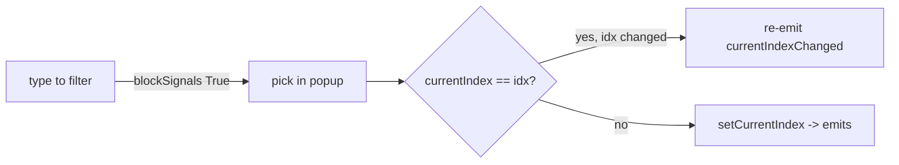

# Context: Iteration 3 — Dropdown + worktree-switch bug fixes (Bug A + Bug B)

## Goal
Fix two coupled bugs: (A) selecting an item in a `FilterableComboBox` via the completer popup must always fire `currentIndexChanged`, so worktree/branch switches actually activate; (B) switching a worktree in Command Center must yield exactly one pane (restart in the new worktree), never a duplicate or zero panes.

## Tests to write
### Bug A — FilterableComboBox
- Selecting via the completer emits currentIndexChanged: simulate typing to filter then committing a completer match for a different item — `currentIndexChanged` fires once with the chosen index.
- Selecting via the completer when the index already moved still emits: if the index already equals the target (moved under blockSignals), committing still fires exactly one `currentIndexChanged`.
- Raw keystrokes do not emit: typing filter text without committing fires no `currentIndexChanged`.
- Committing the same item already selected does not emit: re-selecting the current item produces zero `currentIndexChanged`.

### Bug B — CommandCenterPanel worktree switch
- Switching a worktree results in exactly one pane: starting from one running pane, invoking `_change_worktree` to a new path ends with exactly one pane in `_panes`.
- A second concurrent switch for the same run is ignored (re-entry guard): re-entering `_change_worktree` for a run mid-switch does not launch a second run.
- A failed relaunch surfaces instead of being swallowed: if `vm.launch` raises, the error is surfaced (not `except: pass`); pane count is left in a defined state.

## Files to touch
- [filterable_combo.py](worktree_manager/ui/filterable_combo.py) — fix `_commit_from_completer` to emit deterministically.
- [command_center_panel.py](worktree_manager/ui/command_center_panel.py) — guard `_change_worktree`; remove the silent `except Exception: pass`.

## Design / pseudocode

#### `worktree_manager/ui/filterable_combo.py`
```
_commit_from_completer(text):
    idx = findText(text, MatchExactly)
    _end_edit()                       # unblock signals
    if idx >= 0:
        _committed_index = idx
        if currentIndex() == idx:
            # index already moved under blockSignals -> the emit was lost; re-emit once
            currentIndexChanged.emit(idx)
        else:
            setCurrentIndex(idx)      # normal path emits once
```
Invariant: exactly one `currentIndexChanged(idx)` per committed selection that changes the value; zero for raw keystrokes; zero when committing the already-current item.

> Note on "same item" test: if the user commits the item that is already current, `currentIndex() == idx` is true AND it's not a change. Distinguish "value moved under blockSignals" from "no change at all" by comparing against the index *before* edit began. Track `_index_before_edit` set in `_on_text_edited` (first keystroke). Re-emit only if `idx != _index_before_edit`.

Refined:
```
_on_text_edited(_text):
    if not _in_edit:
        _in_edit = True
        _index_before_edit = currentIndex()
        blockSignals(True)

_commit_from_completer(text):
    idx = findText(text, MatchExactly)
    before = _index_before_edit
    _end_edit()
    if idx >= 0:
        _committed_index = idx
        if currentIndex() == idx:
            if idx != before:
                currentIndexChanged.emit(idx)   # lost emit -> re-emit
        else:
            setCurrentIndex(idx)
```

#### `worktree_manager/ui/command_center_panel.py`
```
__init__:
    self._switching: set[str] = set()

_change_worktree(handle, new_worktree_path):
    run_id = handle.run_id
    if run_id in self._switching:        # re-entry guard
        return
    self._switching.add(run_id)
    try:
        self.remove_pane(run_id)         # exactly once
        self._vm.launch(
            repo_path=handle.repo_path, repo_name=handle.repo_name,
            cmd_name=handle.cmd_name, command_str=handle.command,
            worktree_path=new_worktree_path,
        )
    except DuplicateRunError:
        # a run already exists for this worktree+cmd; nothing to relaunch
        # (do NOT silently pass — log it)
        logging.warning("worktree switch: run already exists for %s", new_worktree_path)
    finally:
        self._switching.discard(run_id)
```
Remove the existing `except Exception: pass` at [command_center_panel.py:196](worktree_manager/ui/command_center_panel.py#L196).

## Diagrams

Bug A signal flow:


## Relevant existing code
[filterable_combo.py:32-43](worktree_manager/ui/filterable_combo.py#L32) — current `_on_text_edited` / `_commit_from_completer`.
[command_pane.py:249](worktree_manager/ui/command_pane.py#L249) connects `_wt_combo.currentIndexChanged` → [`_on_wt_combo_changed`](worktree_manager/ui/command_pane.py#L396), which calls `on_change_worktree(new_path)`.
[command_center_panel.py:184-197](worktree_manager/ui/command_center_panel.py#L184) — current `_change_worktree` with the silent except.
[command_center_vm.launch](worktree_manager/command_center_vm.py#L58) raises `DuplicateRunError` when a matching RUNNING handle already exists — import it for the except clause.

## Constraints / invariants
- No silent exceptions — the `except Exception: pass` MUST go; surface or log `DuplicateRunError` explicitly.
- Bug A fix must not emit on raw keystrokes (existing handlers rely on commit-only emission).
- Exactly one pane after a switch; the re-entry guard prevents the duplicate-pane case.

## Done when (gate items)
- [ ] In Command Center, switch a running command's worktree via the dropdown — the command actually re-activates in the new worktree (Bug A).
- [ ] After switching, there is exactly ONE pane for that command — no duplicate, no disappearance (Bug B).
- [ ] Rapidly switching the worktree dropdown does not spawn extra panes.
- [ ] The per-repo branch dropdown still switches branches on selection (regression — same combo).
- [ ] Typing to filter the dropdown without picking does not trigger a switch (regression).

## TDD mode: <Reviewed | Autonomous>
