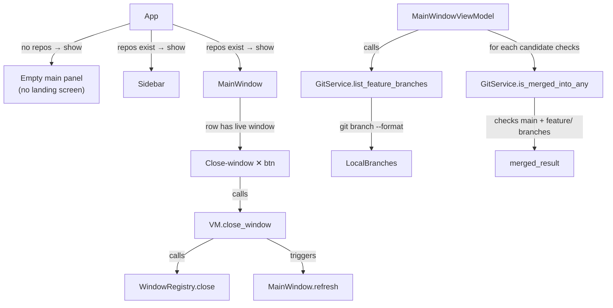
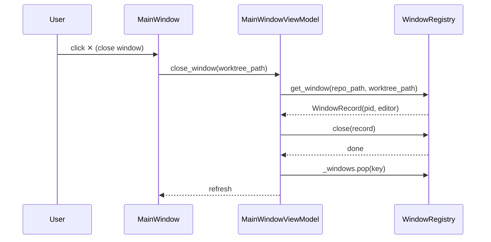

# UX Cleanup, Window Close Button & Feature-Branch Merge Detection

## Overview

Three targeted improvements to the Git Worktree Manager:

1. **Remove the landing screen** — the app now has a sidebar that lists repos and a `+ Add Repo` button. The old "No repo loaded / Select Repo" landing screen is redundant. When no repos are configured, the app should open directly to the sidebar-plus-empty-main layout instead of a full-frame landing screen.

2. **Add a close-window button** — worktree rows already show an `[OPEN]` badge when a tracked editor window is alive. A `✕` close-window button should appear next to that badge so the user can kill the editor window without deleting the worktree.

3. **Feature-branch merge detection** — `GitService.is_merged` and `MainWindowViewModel.all_cleanup_candidates` hardcode `"main"` as the merge target. The app should auto-detect all local branches beginning with `feature/` and treat a branch as "merged" if it has been merged into **main OR any `feature/...` branch**. This makes the cleanup wizard useful in trunk-based-with-feature-branch workflows.

---

## UI / Flow

### No-repos state (replaces landing screen)

```
┌──────────────────────────────────────────────────────────────────┐
│  Git Worktree Manager                                            │
├──────────────┬───────────────────────────────────────────────────┤
│ REPOS        │                                                   │
│              │      No repo selected.                            │
│ [+ Add Repo] │      Pick one from the sidebar or add a new one. │
│              │                                                   │
└──────────────┴───────────────────────────────────────────────────┘
```

### Worktree row — window open

```
 ○  feat/auth     1h ago              [OPEN] ✕   Focus ▾
                                       ↑badge  ↑close-window button
```

The `✕` button closes the editor window (sends SIGTERM via `WindowRegistry.close`), removes the registry entry, and refreshes the row. It is only visible when `vm.is_open(wt.path)` is true.

### Cleanup Wizard — feature-branch merge detection

Branches that are merged into `main` **or** any `feature/...` branch are flagged as merged. The reason text in the wizard shows which target they were merged into:

```
 ☑  fix/old-bug   (merged into main)
 ☑  fix/other     (merged into feature/payments)
 ☑  chore/deps    (35d, stale)
```

---

## Architecture

### Component diagram



### Data flow — close window button



### New / changed interfaces

**`GitService`** — two new methods:

```
list_feature_branches(repo_path: str) -> list[str]
    # returns all local branches starting with "feature/"

is_merged_into_any(repo_path: str, branch: str, targets: list[str]) -> bool
    # returns True if branch is in `git branch --merged <target>` for ANY target
```

**`MainWindowViewModel`** — one new method, one updated:

```
close_window(worktree_path: str) -> None
    # closes editor window and removes registry entry

all_cleanup_candidates() -> list[CleanupCandidate]   # already exists
    # UPDATED: gathers feature branches and passes them to is_merged_into_any
    # CleanupCandidate.is_merged is now set based on multi-target check
```

**`CleanupCandidate`** — add optional field:

```
merged_into: str | None   # "main", "feature/payments", etc.  (None if not merged)
```

**`App._show_landing`** — removed. `App.__init__` calls `_show_empty_main()` instead.

**`App._show_empty_main`** — new method: renders sidebar + a centred "No repo selected" label in the main area.

**`MainWindow._add_row`** — adds a close-window `✕` button when `vm.is_open(wt.path)` is true.

---

## Open Questions

_(none — all resolved during design)_

Resolved decisions:
- **Landing screen removal**: The sidebar covers the landing screen's job. No separate "no-repos" screen — just sidebar + empty-main panel.
- **Close-window button vs close-window menu item**: A dedicated `✕` button next to `[OPEN]` badge is clearer than hiding it in the dropdown. The dropdown still exists for focus/open operations.
- **Feature branch auto-detection**: Use `git branch --format=%(refname:short)` filtered to names starting with `feature/`. No config needed — detection is automatic.
- **Merge detection strategy**: A branch is "merged" if `git branch --merged <target>` includes it for **any** of `["main"] + feature_branches`. We check main first, then feature branches, and record the first match as `merged_into`.
- **CleanupCandidate.merged_into**: Added as an optional field (default `None`) so the wizard can display "merged into X". Existing code that doesn't use the field is unaffected.

---

## High-Level Steps

1. Add `merged_into: str | None` field to `CleanupCandidate` dataclass (default `None`)
2. Add `list_feature_branches(repo_path)` to `GitService`
3. Add `is_merged_into_any(repo_path, branch, targets)` to `GitService` — returns `(bool, str | None)` tuple (merged flag + winning target name)
4. Update `MainWindowViewModel.all_cleanup_candidates` to detect feature branches and use `is_merged_into_any`, populating `merged_into`
5. Update `CleanupWizard` to display `merged_into` in the reason text (e.g. "merged into feature/payments")
6. Add `close_window(worktree_path)` to `MainWindowViewModel` — closes editor window and removes registry entry
7. Update `MainWindow._add_row` to show a close-window `✕` button next to `[OPEN]` badge when the window is alive
8. Remove `App._show_landing` and `LandingScreen` call path; add `App._show_empty_main` for the no-repos-selected state
9. Update `App.__init__` to call `_show_empty_main()` (with sidebar) instead of `_show_landing()` when no repo path is provided

---

## Implementation Phases

### Phase 1 — `CleanupCandidate.merged_into` field
**What it covers:** Add `merged_into: str | None = None` to the dataclass so downstream phases can populate it without breaking existing code.

**Tests (Red) — write these first:**
```python
# tests/test_models.py — add this test
def test_cleanup_candidate_merged_into_defaults_to_none():
    from worktree_manager.models import CleanupCandidate
    c = CleanupCandidate(branch="fix/a", path=None, is_merged=True, is_stale=False, last_commit_ts=0)
    assert c.merged_into is None


def test_cleanup_candidate_merged_into_can_be_set():
    from worktree_manager.models import CleanupCandidate
    c = CleanupCandidate(
        branch="fix/a", path=None, is_merged=True, is_stale=False,
        last_commit_ts=0, merged_into="feature/payments",
    )
    assert c.merged_into == "feature/payments"
```

**Production code (Green):**
```python
# worktree_manager/models.py — update CleanupCandidate
from dataclasses import dataclass, field


@dataclass
class CleanupCandidate:
    branch: str
    path: str | None
    is_merged: bool
    is_stale: bool
    last_commit_ts: int
    merged_into: str | None = None
```

**Done when:** Both new model tests pass; all existing tests that construct `CleanupCandidate` without `merged_into` still pass.

---

### Phase 2 — `GitService` feature-branch detection & multi-target merge check
**What it covers:** `list_feature_branches` and `is_merged_into_any` on `GitService`.

**Tests (Red) — write these first:**
```python
# tests/test_git_service.py — add these tests
import pytest
from unittest.mock import patch, MagicMock
from worktree_manager.git_service import GitService


def test_list_feature_branches_returns_only_feature_prefix():
    svc = GitService()
    with patch.object(svc, "_run", return_value="main\nfeature/auth\nfeature/payments\nfix/bug\n"):
        result = svc.list_feature_branches("/repos/proj")
    assert result == ["feature/auth", "feature/payments"]


def test_list_feature_branches_returns_empty_when_none():
    svc = GitService()
    with patch.object(svc, "_run", return_value="main\nfix/bug\n"):
        result = svc.list_feature_branches("/repos/proj")
    assert result == []


def test_is_merged_into_any_returns_true_and_target_when_merged():
    svc = GitService()
    def fake_run(cmd, cwd=None):
        # git branch --merged main → includes fix/bug
        if "main" in cmd:
            return "  main\n  fix/bug\n"
        return "  main\n"
    with patch.object(svc, "_run", side_effect=fake_run):
        merged, target = svc.is_merged_into_any("/repos/proj", "fix/bug", ["main", "feature/auth"])
    assert merged is True
    assert target == "main"


def test_is_merged_into_any_returns_feature_target_when_only_merged_there():
    svc = GitService()
    def fake_run(cmd, cwd=None):
        if "main" in cmd:
            return "  main\n"
        if "feature/auth" in cmd:
            return "  main\n  fix/bug\n  feature/auth\n"
        return "  main\n"
    with patch.object(svc, "_run", side_effect=fake_run):
        merged, target = svc.is_merged_into_any("/repos/proj", "fix/bug", ["main", "feature/auth"])
    assert merged is True
    assert target == "feature/auth"


def test_is_merged_into_any_returns_false_when_not_merged_anywhere():
    svc = GitService()
    with patch.object(svc, "_run", return_value="  main\n"):
        merged, target = svc.is_merged_into_any("/repos/proj", "fix/bug", ["main", "feature/auth"])
    assert merged is False
    assert target is None


def test_is_merged_into_any_empty_targets_returns_false():
    svc = GitService()
    merged, target = svc.is_merged_into_any("/repos/proj", "fix/bug", [])
    assert merged is False
    assert target is None
```

**Production code (Green):**
```python
# worktree_manager/git_service.py — add two methods to GitService

    def list_feature_branches(self, repo_path: str) -> list[str]:
        out = self._run(["git", "branch", "--format=%(refname:short)"], cwd=repo_path)
        return [b for b in out.splitlines() if b.startswith("feature/")]

    def is_merged_into_any(
        self, repo_path: str, branch: str, targets: list[str]
    ) -> tuple[bool, str | None]:
        for target in targets:
            out = self._run(["git", "branch", "--merged", target], cwd=repo_path)
            merged = [b.strip().lstrip("* ") for b in out.splitlines()]
            if branch in merged:
                return True, target
        return False, None
```

**Done when:** All six new git service tests pass; existing `test_git_service.py` tests still pass.

---

### Phase 3 — VM uses multi-target merge detection
**What it covers:** `MainWindowViewModel.all_cleanup_candidates` detects feature branches and uses `is_merged_into_any`, populating `merged_into` on each candidate.

**Tests (Red) — write these first:**
```python
# tests/test_main_window_vm_actions.py — add these tests
import pytest
import time
from unittest.mock import MagicMock, patch
from worktree_manager.config_store import ConfigStore
from worktree_manager.git_service import GitService
from worktree_manager.editor_service import EditorService
from worktree_manager.models import RepoConfig, WorktreeModel, CleanupCandidate
from worktree_manager.main_window_vm import MainWindowViewModel


def _make_vm(tmp_path, worktrees, branches, feature_branches=None):
    s = ConfigStore(tmp_path / "config.json")
    s.save_repo(RepoConfig(
        repo_path="/repos/proj",
        worktree_storage="/repos/proj-wt",
        stale_days=30,
        last_editor="cursor",
        last_editor_mode="reuse",
        last_opened="2026-05-19T10:00:00",
    ))
    git = MagicMock(spec=GitService)
    git.list_worktrees.return_value = worktrees
    git.list_local_branches.return_value = branches
    git.list_feature_branches.return_value = feature_branches or []
    git.last_commit_ts.return_value = 0
    git.is_merged_into_any.return_value = (False, None)
    editor = MagicMock(spec=EditorService)
    vm = MainWindowViewModel(
        repo_path="/repos/proj",
        config_store=s,
        git_service=git,
        editor_service=editor,
    )
    vm.load_worktrees()
    return vm, git


def test_cleanup_candidates_use_feature_branches_as_merge_targets(tmp_path):
    now = int(time.time())
    worktrees = [
        WorktreeModel("/repos/proj", "main", True, now, False, False),
    ]
    branches = ["main", "feature/payments", "fix/old"]
    vm, git = _make_vm(tmp_path, worktrees, branches, feature_branches=["feature/payments"])
    git.is_merged_into_any.return_value = (True, "feature/payments")
    git.last_commit_ts.return_value = now - 100

    candidates = vm.all_cleanup_candidates()
    fix_candidate = next((c for c in candidates if c.branch == "fix/old"), None)
    assert fix_candidate is not None
    assert fix_candidate.is_merged is True
    assert fix_candidate.merged_into == "feature/payments"


def test_cleanup_candidates_merged_into_main_when_no_feature_branches(tmp_path):
    now = int(time.time())
    worktrees = [
        WorktreeModel("/repos/proj", "main", True, now, False, False),
    ]
    branches = ["main", "fix/old"]
    vm, git = _make_vm(tmp_path, worktrees, branches, feature_branches=[])
    git.is_merged_into_any.return_value = (True, "main")
    git.last_commit_ts.return_value = now - 100

    candidates = vm.all_cleanup_candidates()
    fix_candidate = next((c for c in candidates if c.branch == "fix/old"), None)
    assert fix_candidate is not None
    assert fix_candidate.merged_into == "main"


def test_cleanup_candidates_not_merged_when_not_in_any_target(tmp_path):
    now = int(time.time())
    stale_ts = now - 40 * 86400
    worktrees = [
        WorktreeModel("/repos/proj", "main", True, now, False, False),
    ]
    branches = ["main", "feature/payments", "fix/active"]
    vm, git = _make_vm(tmp_path, worktrees, branches, feature_branches=["feature/payments"])
    git.is_merged_into_any.return_value = (False, None)
    git.last_commit_ts.return_value = stale_ts

    candidates = vm.all_cleanup_candidates()
    fix_candidate = next((c for c in candidates if c.branch == "fix/active"), None)
    assert fix_candidate is not None
    assert fix_candidate.is_merged is False
    assert fix_candidate.merged_into is None
```

**Production code (Green):**
```python
# worktree_manager/main_window_vm.py — update all_cleanup_candidates

    def all_cleanup_candidates(self) -> list:
        import time
        from worktree_manager.models import CleanupCandidate
        cfg = self._store.get_repo(self._repo_path)
        stale_threshold = int(time.time()) - cfg.stale_days * 86400

        feature_branches = self._git.list_feature_branches(self._repo_path)
        merge_targets = ["main"] + feature_branches

        worktree_branches = {wt.branch for wt in self._worktrees}
        candidates = []

        for wt in self._worktrees:
            if wt.is_main:
                continue
            merged, merged_into = self._git.is_merged_into_any(
                self._repo_path, wt.branch, merge_targets
            )
            stale = wt.last_commit_ts > 0 and wt.last_commit_ts < stale_threshold
            if merged or stale:
                candidates.append(CleanupCandidate(
                    branch=wt.branch,
                    path=wt.path,
                    is_merged=merged,
                    is_stale=stale,
                    last_commit_ts=wt.last_commit_ts,
                    merged_into=merged_into,
                ))

        for branch in self._git.list_local_branches(self._repo_path):
            if branch in worktree_branches:
                continue
            ts = self._git.last_commit_ts(self._repo_path, branch)
            merged, merged_into = self._git.is_merged_into_any(
                self._repo_path, branch, merge_targets
            )
            stale = ts > 0 and ts < stale_threshold
            if merged or stale:
                candidates.append(CleanupCandidate(
                    branch=branch,
                    path=None,
                    is_merged=merged,
                    is_stale=stale,
                    last_commit_ts=ts,
                    merged_into=merged_into,
                ))

        return candidates
```

**Done when:** Three new VM tests pass; existing `test_main_window_vm_actions.py` tests still pass.

---

### Phase 4 — CleanupWizard shows `merged_into` in reason text
**What it covers:** The wizard displays "merged into main" or "merged into feature/payments" instead of just "merged".

**Tests (Red) — write these first:**
```python
# tests/test_cleanup_wizard_merged_into.py — new file
import pytest
from unittest.mock import MagicMock


def _ctk_available():
    try:
        import customtkinter
        return True
    except ImportError:
        return False

pytestmark = pytest.mark.skipif(not _ctk_available(), reason="customtkinter not installed")


@pytest.fixture
def root():
    import customtkinter as ctk
    r = ctk.CTk()
    r.withdraw()
    yield r
    r.destroy()


def _collect_text(widget):
    import customtkinter as ctk
    result = []
    for cls in (ctk.CTkLabel, ctk.CTkCheckBox):
        if isinstance(widget, cls):
            result.append(getattr(widget, "_text", ""))
    for child in widget.winfo_children():
        result.extend(_collect_text(child))
    return result


def test_wizard_shows_merged_into_main(root):
    from worktree_manager.ui.cleanup_wizard import CleanupWizard
    from worktree_manager.models import CleanupCandidate
    import time
    c = CleanupCandidate(
        branch="fix/old", path=None, is_merged=True, is_stale=False,
        last_commit_ts=int(time.time()), merged_into="main",
    )
    wiz = CleanupWizard(root, candidates=[c], on_delete_selected=MagicMock())
    texts = _collect_text(wiz)
    assert any("main" in t for t in texts)
    wiz.destroy()


def test_wizard_shows_merged_into_feature_branch(root):
    from worktree_manager.ui.cleanup_wizard import CleanupWizard
    from worktree_manager.models import CleanupCandidate
    import time
    c = CleanupCandidate(
        branch="fix/old", path=None, is_merged=True, is_stale=False,
        last_commit_ts=int(time.time()), merged_into="feature/payments",
    )
    wiz = CleanupWizard(root, candidates=[c], on_delete_selected=MagicMock())
    texts = _collect_text(wiz)
    assert any("feature/payments" in t for t in texts)
    wiz.destroy()


def test_wizard_shows_merged_without_target_when_none(root):
    from worktree_manager.ui.cleanup_wizard import CleanupWizard
    from worktree_manager.models import CleanupCandidate
    import time
    c = CleanupCandidate(
        branch="fix/old", path=None, is_merged=True, is_stale=False,
        last_commit_ts=int(time.time()), merged_into=None,
    )
    wiz = CleanupWizard(root, candidates=[c], on_delete_selected=MagicMock())
    texts = _collect_text(wiz)
    assert any("merged" in t.lower() for t in texts)
    wiz.destroy()
```

**Production code (Green):**
```python
# worktree_manager/ui/cleanup_wizard.py — update reason string in _build

# Replace the line:
#   reason = "merged" if c.is_merged else f"{_fmt_age(c.last_commit_ts)}, stale"
# with:

def _reason(c) -> str:
    if c.is_merged:
        target = c.merged_into or "main"
        return f"merged into {target}"
    return f"{_fmt_age(c.last_commit_ts)}, stale"
```

Apply `_reason(c)` in both the worktree and branch loops inside `_build`.

**Done when:** Three wizard tests pass; existing cleanup wizard tests still pass; reason text in the wizard reads "merged into main" or "merged into feature/payments".

---

### Phase 5 — Close-window button on worktree rows
**What it covers:** A `✕` button appears next to `[OPEN]` when a tracked window is alive. Clicking it closes the editor window without deleting the worktree, then refreshes the row.

**Tests (Red) — write these first:**
```python
# tests/test_main_window_vm_windows.py — add these tests

def test_close_window_closes_registry_record(vm, registry):
    registry.register("/repos/proj", "/repos/proj-wt/feat", pid=42, editor="cursor")
    with patch("os.kill") as mock_kill:
        vm.close_window("/repos/proj-wt/feat")
    import signal
    mock_kill.assert_any_call(42, signal.SIGTERM)


def test_close_window_removes_registry_entry(vm, registry):
    registry.register("/repos/proj", "/repos/proj-wt/feat", pid=42, editor="cursor")
    with patch("os.kill", return_value=None):
        vm.close_window("/repos/proj-wt/feat")
    assert registry.get_window("/repos/proj", "/repos/proj-wt/feat") is None


def test_close_window_noop_when_no_registry(store, git):
    editor = MagicMock(spec=EditorService)
    vm = MainWindowViewModel(
        repo_path="/repos/proj",
        config_store=store,
        git_service=git,
        editor_service=editor,
    )
    vm.close_window("/repos/proj-wt/feat")  # must not raise


def test_close_window_noop_when_not_tracked(vm):
    vm.close_window("/repos/proj-wt/feat")  # nothing registered, must not raise
```

```python
# tests/test_main_window_open_badge.py — add this test

def test_close_window_button_visible_when_open(root):
    from worktree_manager.ui.main_window import MainWindow
    vm = _make_vm(is_open_for="/repos/proj-wt/feat")
    win = MainWindow(root, vm=vm, repo_name="proj", on_settings=MagicMock(), on_cleanup=MagicMock())
    buttons = _collect_buttons(win)
    labels = [getattr(b, "_text", "") for b in buttons]
    assert any("✕" in lbl or "close" in lbl.lower() for lbl in labels)
    win.destroy()
```

**Production code (Green):**

Add `close_window` to `MainWindowViewModel`:
```python
# worktree_manager/main_window_vm.py — add method

    def close_window(self, worktree_path: str) -> None:
        if self._registry is None:
            return
        key = (self._repo_path, worktree_path)
        rec = self._registry.get_window(self._repo_path, worktree_path)
        if rec is None:
            return
        self._registry.close(rec)
        self._registry._windows.pop(key, None)
```

Update `MainWindow._add_row` to add the close button:
```python
# worktree_manager/ui/main_window.py — in _add_row, after the [OPEN] badge block

        if self._vm.is_open(wt.path):
            ctk.CTkLabel(row, text="[OPEN]", text_color="#2ecc71", width=60).pack(side="left")
            ctk.CTkButton(
                row, text="✕", width=28, fg_color="#7f8c8d",
                command=lambda p=wt.path: self._close_window(p),
            ).pack(side="left", padx=(0, 2))
        else:
            ctk.CTkLabel(row, text="", width=60).pack(side="left")
```

Add `_close_window` handler to `MainWindow`:
```python
# worktree_manager/ui/main_window.py — add method

    def _close_window(self, worktree_path: str):
        self._vm.close_window(worktree_path)
        self.refresh()
```

**Done when:** Close-window button appears only when `vm.is_open` is true; clicking it closes the editor window, removes the badge, and button disappears after refresh; all VM window tests pass.

---

### Phase 6 — Remove landing screen; add empty-main state
**What it covers:** Delete the `_show_landing` call path. When no repos are configured yet, show sidebar + an empty main panel with a "No repo selected" message instead of the full-frame landing screen.

**Tests (Red) — write these first:**
```python
# tests/test_cli.py — add these tests

def test_app_shows_sidebar_when_no_repo_path():
    import worktree_manager.cli as cli_mod
    from unittest.mock import patch, MagicMock, PropertyMock
    from worktree_manager.window_registry import WindowRegistry

    with patch("customtkinter.CTk") as MockCTk, \
         patch("worktree_manager.cli.ConfigStore") as MockStore, \
         patch("worktree_manager.cli.GitService"), \
         patch("worktree_manager.cli.EditorService"):
        mock_store = MagicMock()
        mock_store.all_repos.return_value = {}
        MockStore.return_value = mock_store

        app = object.__new__(cli_mod.App)
        app._ctk = MagicMock()
        app._root = MagicMock()
        app._store = mock_store
        app._git = MagicMock()
        app._editor = MagicMock()
        app._current_frame = None
        app._sidebar_frame = None
        app._window_registry = WindowRegistry()

        shown = {}
        app._show_sidebar = lambda active: shown.update({"sidebar": active})
        app._show_empty_main = lambda: shown.update({"empty": True})

        app._show_empty_main()
        assert "empty" in shown


def test_show_landing_is_noop(tmp_path):
    import worktree_manager.cli as cli_mod
    from unittest.mock import patch, MagicMock
    from worktree_manager.window_registry import WindowRegistry

    app = object.__new__(cli_mod.App)
    app._ctk = MagicMock()
    app._root = MagicMock()
    app._store = MagicMock()
    app._store.all_repos.return_value = {}
    app._git = MagicMock()
    app._editor = MagicMock()
    app._current_frame = None
    app._sidebar_frame = None
    app._window_registry = WindowRegistry()

    shown = {}
    app._show_sidebar = lambda active: shown.update({"sidebar": True})
    app._show_empty_main = lambda: shown.update({"empty": True})

    # _show_landing must exist and must not raise; it should delegate to _show_empty_main
    app._show_landing()
    assert shown.get("empty") is True
```

**Production code (Green):**
```python
# worktree_manager/cli.py — changes to App

# 1. Change __init__: replace `self._show_landing()` with `self._show_empty_main()`

# 2. Keep _show_landing as a no-op delegate (do not delete it):
    def _show_landing(self):
        self._show_empty_main()

# 3. Add new method:
    def _show_empty_main(self):
        self._clear_main()
        self._show_sidebar(active_repo_path=None)

        frame = self._ctk.CTkFrame(self._root)
        frame.pack(side="left", fill="both", expand=True)
        self._ctk.CTkLabel(
            frame,
            text="No repo selected.\nPick one from the sidebar or click + Add Repo.",
            text_color="gray",
            justify="center",
        ).place(relx=0.5, rely=0.5, anchor="center")
        self._current_frame = frame
```

Also update `_show_sidebar` to handle `active_repo_path=None` gracefully (no repo is highlighted).

**Done when:** App launches without a landing screen; sidebar is visible immediately; "No repo selected" message appears in the main area when no repos are configured; clicking `+ Add Repo` works; all existing `test_cli.py` tests still pass.

---

## Feature Acceptance Checklist

- [ ] App no longer shows the "No repo loaded / Select Repo" landing screen
- [ ] On first launch (no repos configured), app shows sidebar with `+ Add Repo` and empty main panel
- [ ] Worktree row shows `✕` close-window button next to `[OPEN]` badge when a tracked window is alive
- [ ] Clicking `✕` closes the editor window, removes the badge, and the button disappears on refresh
- [ ] Cleanup Wizard reason text reads "merged into main" or "merged into feature/…" instead of just "merged"
- [ ] Branches merged only into a `feature/…` branch (not main) are flagged as merged in the wizard
- [ ] Branches merged into main are still flagged correctly when no feature branches exist
- [ ] Stale-only branches still appear with stale reason text regardless of merge status
- [ ] All phases green (tests pass, no regressions)
