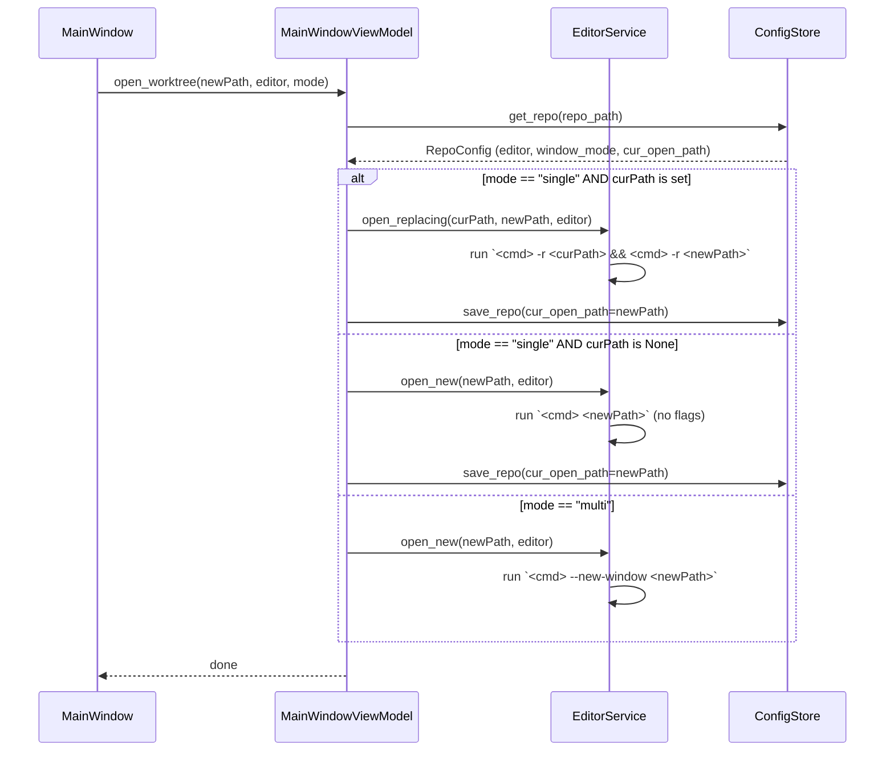

# Window Mode Redesign

## Overview

Replace the current PID/process-tracking window management with a simpler, more reliable
approach. Each repo gets two per-repo settings: **editor** (Cursor or VS Code) and
**window mode** (Single or Multi). When single-window mode is active and the user opens a
new worktree, the app uses `<editor> -r <curPath> && <editor> -r <newPath>` to focus and
replace the current window — no process tracking needed. Multi-window mode opens each
worktree in its own independent window.

---

## UI / Flow

### Main Window — toolbar with inline editor + window mode controls

The editor and window mode controls live in the toolbar row, between the repo title
and the ⚙/🧹 buttons. Settings panel retains only storage path and stale threshold.

```
┌──────────────────────────────────────────────────────────────────────┐
│  Git Worktree Manager — my-repo                                      │
│  ── toolbar ─────────────────────────────────────────────────────    │
│  [Cursor | VS Code]   [Single | Multi]              [⚙]  [🧹]       │
│  ── subheader ───────────────────────────────────────────────────    │
│  Worktrees                                             [+ New]       │
│  ────────────────────────────────────────────────────────────────    │
│  ●  main           2h ago                     [Open]               │
│  ○  feature/foo    3h ago                     [Open]  [✕]          │
│  ○  feature/bar    1d ago  ⚠ stale            [Open]  [✕]          │
└──────────────────────────────────────────────────────────────────────┘
```

- `[Cursor | VS Code]` is a `CTkSegmentedButton` — highlights the active choice
- `[Single | Multi]` is a `CTkSegmentedButton` — highlights the active choice
- On load: both buttons are initialised from `RepoConfig.editor` / `RepoConfig.window_mode`
- On click: the new value is written to `ConfigStore` immediately — no Save button needed
- Values are per-repo and persist across app restarts (stored in `config.json`)
- Settings panel (⚙) retains only worktree storage and stale threshold

### Main Window — Open/Switch button

The button uses the toolbar's current editor and window mode — no dropdown.

Single-window mode — no worktree open yet:
```
○  feature/foo   3h ago            [Open]  [✕]
```

Single-window mode — a worktree is currently tracked as open:
```
●  main          2h ago   [OPEN]   [Open]
○  feature/foo   3h ago            [Switch]  [✕]
○  feature/bar   1d ago            [Switch]  [✕]
```
"Switch" signals the action will replace the current window rather than open alongside.

Multi-window mode:
```
○  feature/foo   3h ago            [Open]  [✕]
○  feature/bar   1d ago   [OPEN]   [Open]  [✕]
```
Every worktree opens independently; label stays "Open" always.

---

## Architecture



### Changed components

| Component | Change |
|---|---|
| `RepoConfig` (models.py) | Add `editor: str`, `window_mode: str` (`"single"` \| `"multi"`), `cur_open_path: str` |
| `ConfigStore` | Persist/load the three new fields |
| `EditorService` | New `open_replacing(cur, new, editor)` method using `-r cur && -r new`; existing `open()` becomes `open_new()` |
| `MainWindowViewModel` | `open_worktree` reads `window_mode` and delegates to correct `EditorService` method; exposes `cur_open_path` for UI |
| `SettingsPanel` | Remove editor/mode fields; retains only worktree storage and stale threshold |
| `MainWindow` | Add toolbar segmented buttons (Editor, Window Mode) that save on change; button label logic (`Open` vs `Switch`); remove `▾` dropdown entirely |
| `WindowRegistry` | No longer needed for single-window tracking; kept for multi-window [OPEN] badge only |

---

## Open Questions

None — design is fully specified.

---

## High-Level Steps

1. Add `editor`, `window_mode`, and `cur_open_path` fields to `RepoConfig` in `models.py`
2. Update `ConfigStore` to persist and load the three new fields, with sensible defaults
3. Replace `EditorService.open()` with `open_new(path, editor)` and add `open_replacing(cur_path, new_path, editor)`
4. Update `MainWindowViewModel.open_worktree()` to read `window_mode` and `cur_open_path` and dispatch to the correct `EditorService` method
5. Add `set_editor()` and `set_window_mode()` methods to `MainWindowViewModel` that persist immediately via `ConfigStore`
6. Add toolbar row to `MainWindow` with two `CTkSegmentedButton` controls wired to the new VM methods
7. Update the per-row `[Open]` button label logic: show "Switch" in single-window mode when `cur_open_path` is set and this row is not the open one
8. Remove the `▾` dropdown button and `_show_open_menu` from `MainWindow`
9. Strip editor/mode fields from `SettingsPanel` and its `SettingsViewModel`

---

## Implementation Phases

### Phase 1 — Extend RepoConfig model and ConfigStore persistence

**What it covers:** New fields on `RepoConfig` and round-trip persistence in `ConfigStore`, with defaults for old config files that lack the fields.

**Tests (Red) — write these first:**
```python
# tests/test_config_store.py  (add to existing file)

def test_save_and_load_editor_and_window_mode(store):
    cfg = RepoConfig(
        repo_path="/repos/proj",
        worktree_storage="/repos/proj-wt",
        stale_days=30,
        last_editor="cursor",
        last_editor_mode="reuse",
        last_opened="2026-05-19T10:00:00",
        editor="vscode",
        window_mode="single",
        cur_open_path="/repos/proj-wt/feat",
    )
    store.save_repo(cfg)
    loaded = store.get_repo("/repos/proj")
    assert loaded.editor == "vscode"
    assert loaded.window_mode == "single"
    assert loaded.cur_open_path == "/repos/proj-wt/feat"


def test_defaults_when_fields_missing_from_disk(store, config_path):
    # Simulate a legacy config file that has no new fields
    config_path.write_text(json.dumps({
        "repos": {
            "/repos/proj": {
                "worktree_storage": "/repos/proj-wt",
                "stale_days": 30,
                "last_editor": "cursor",
                "last_editor_mode": "reuse",
                "last_opened": "2026-05-19T10:00:00",
            }
        }
    }))
    loaded = store.get_repo("/repos/proj")
    assert loaded.editor == "cursor"
    assert loaded.window_mode == "multi"
    assert loaded.cur_open_path is None


def test_cur_open_path_can_be_cleared(store):
    cfg = RepoConfig(
        repo_path="/repos/proj",
        worktree_storage="/repos/proj-wt",
        stale_days=30,
        last_editor="cursor",
        last_editor_mode="reuse",
        last_opened="2026-05-19T10:00:00",
        editor="cursor",
        window_mode="single",
        cur_open_path="/repos/proj-wt/feat",
    )
    store.save_repo(cfg)
    cfg.cur_open_path = None
    store.save_repo(cfg)
    assert store.get_repo("/repos/proj").cur_open_path is None
```

**Production code (Green):**
```python
# worktree_manager/models.py — replace RepoConfig

@dataclass
class RepoConfig:
    repo_path: str
    worktree_storage: str
    stale_days: int
    last_editor: str
    last_editor_mode: str
    last_opened: str
    editor: str = "cursor"
    window_mode: str = "multi"
    cur_open_path: str | None = None
```

```python
# worktree_manager/config_store.py — update save_repo and get_repo

def get_repo(self, repo_path: str) -> Optional[RepoConfig]:
    data = self._load_raw()
    entry = data["repos"].get(repo_path)
    if entry is None:
        return None
    return RepoConfig(
        repo_path=repo_path,
        worktree_storage=entry["worktree_storage"],
        stale_days=entry["stale_days"],
        last_editor=entry["last_editor"],
        last_editor_mode=entry["last_editor_mode"],
        last_opened=entry["last_opened"],
        editor=entry.get("editor", entry.get("last_editor", "cursor")),
        window_mode=entry.get("window_mode", "multi"),
        cur_open_path=entry.get("cur_open_path", None),
    )

def save_repo(self, cfg: RepoConfig) -> None:
    data = self._load_raw()
    data["repos"][cfg.repo_path] = {
        "worktree_storage": cfg.worktree_storage,
        "stale_days": cfg.stale_days,
        "last_editor": cfg.last_editor,
        "last_editor_mode": cfg.last_editor_mode,
        "last_opened": cfg.last_opened,
        "editor": cfg.editor,
        "window_mode": cfg.window_mode,
        "cur_open_path": cfg.cur_open_path,
    }
    self._save_raw(data)
```

**Done when:** All three new config tests pass; all existing `test_config_store.py` tests still pass.

---

### Phase 2 — EditorService: open_new and open_replacing

**What it covers:** Replace the old `open()` with `open_new()` (multi-window or first open) and add `open_replacing()` (single-window swap). Remove PID/registry wiring from `EditorService` — that's handled in the VM now.

**Tests (Red) — write these first:**
```python
# tests/test_editor_service.py — replace entire file

import pytest
from unittest.mock import patch, MagicMock, call
from worktree_manager.editor_service import EditorService
from worktree_manager.config_store import ConfigStore
from worktree_manager.models import RepoConfig


@pytest.fixture
def config_path(tmp_path):
    return tmp_path / "config.json"


@pytest.fixture
def store(config_path):
    s = ConfigStore(config_path)
    s.save_repo(RepoConfig(
        repo_path="/repos/proj",
        worktree_storage="/repos/proj-wt",
        stale_days=30,
        last_editor="cursor",
        last_editor_mode="reuse",
        last_opened="2026-05-19T10:00:00",
        editor="cursor",
        window_mode="multi",
        cur_open_path=None,
    ))
    return s


@pytest.fixture
def svc(store):
    return EditorService(store)


def test_open_new_launches_with_no_flags(svc):
    with patch("worktree_manager.editor_service._resolve_editor_cmd", return_value="cursor"), \
         patch("subprocess.Popen") as mock_popen:
        svc.open_new("/repos/proj-wt/feat", editor="cursor")
    mock_popen.assert_called_once_with(["cursor", "/repos/proj-wt/feat"])


def test_open_new_vscode_launches_with_no_flags(svc):
    with patch("worktree_manager.editor_service._resolve_editor_cmd", return_value="code"), \
         patch("subprocess.Popen") as mock_popen:
        svc.open_new("/repos/proj-wt/feat", editor="vscode")
    mock_popen.assert_called_once_with(["code", "/repos/proj-wt/feat"])


def test_open_replacing_runs_two_commands_in_sequence(svc):
    with patch("worktree_manager.editor_service._resolve_editor_cmd", return_value="cursor"), \
         patch("subprocess.run") as mock_run:
        svc.open_replacing(
            cur_path="/repos/proj-wt/old",
            new_path="/repos/proj-wt/new",
            editor="cursor",
        )
    assert mock_run.call_count == 2
    assert mock_run.call_args_list[0] == call(
        ["cursor", "-r", "/repos/proj-wt/old"], check=False
    )
    assert mock_run.call_args_list[1] == call(
        ["cursor", "-r", "/repos/proj-wt/new"], check=False
    )


def test_open_replacing_vscode(svc):
    with patch("worktree_manager.editor_service._resolve_editor_cmd", return_value="code"), \
         patch("subprocess.run") as mock_run:
        svc.open_replacing(
            cur_path="/repos/proj-wt/old",
            new_path="/repos/proj-wt/new",
            editor="vscode",
        )
    assert mock_run.call_args_list[0] == call(
        ["code", "-r", "/repos/proj-wt/old"], check=False
    )
    assert mock_run.call_args_list[1] == call(
        ["code", "-r", "/repos/proj-wt/new"], check=False
    )


def test_open_new_returns_popen_object(svc):
    mock_proc = MagicMock()
    with patch("worktree_manager.editor_service._resolve_editor_cmd", return_value="cursor"), \
         patch("subprocess.Popen", return_value=mock_proc):
        result = svc.open_new("/repos/proj-wt/feat", editor="cursor")
    assert result is mock_proc


def test_open_new_raises_when_editor_not_found(svc):
    with patch("worktree_manager.editor_service._resolve_editor_cmd",
               side_effect=FileNotFoundError("not found")):
        with pytest.raises(FileNotFoundError):
            svc.open_new("/repos/proj-wt/feat", editor="cursor")


def test_open_replacing_raises_when_editor_not_found(svc):
    with patch("worktree_manager.editor_service._resolve_editor_cmd",
               side_effect=FileNotFoundError("not found")):
        with pytest.raises(FileNotFoundError):
            svc.open_replacing("/old", "/new", editor="cursor")
```

**Production code (Green):**
```python
# worktree_manager/editor_service.py — full replacement

import shutil
import subprocess
import os
from worktree_manager.config_store import ConfigStore

_EDITOR_FALLBACKS = {
    "cursor": [
        "/usr/local/bin/cursor",
        "/opt/homebrew/bin/cursor",
        "/Applications/Cursor.app/Contents/Resources/app/bin/cursor",
    ],
    "vscode": [
        "/usr/local/bin/code",
        "/opt/homebrew/bin/code",
        "/Applications/Visual Studio Code.app/Contents/Resources/app/bin/code",
    ],
}


def _resolve_editor_cmd(editor: str) -> str:
    short = "cursor" if editor == "cursor" else "code"
    found = shutil.which(short)
    if found:
        return found
    env_path = os.environ.get("PATH", "") + ":/usr/local/bin:/opt/homebrew/bin"
    found = shutil.which(short, path=env_path)
    if found:
        return found
    for fallback in _EDITOR_FALLBACKS.get(editor, []):
        if os.path.isfile(fallback):
            return fallback
    raise FileNotFoundError(
        f"Cannot find '{short}' editor binary. "
        f"Make sure it is installed and the CLI command is available."
    )


class EditorService:
    def __init__(self, config_store: ConfigStore):
        self._store = config_store

    def open_new(self, path: str, editor: str):
        cmd = _resolve_editor_cmd(editor)
        return subprocess.Popen([cmd, path])

    def open_replacing(self, cur_path: str, new_path: str, editor: str) -> None:
        cmd = _resolve_editor_cmd(editor)
        subprocess.run([cmd, "-r", cur_path], check=False)
        subprocess.run([cmd, "-r", new_path], check=False)
```

**Done when:** All new `test_editor_service.py` tests pass; old tests for `open()` are deleted (replaced by the new test file above).

---

### Phase 3 — MainWindowViewModel: dispatch and per-repo save methods

**What it covers:** `open_worktree()` reads `window_mode`/`cur_open_path` and calls the right `EditorService` method; `set_editor()` and `set_window_mode()` save immediately; `cur_open_path()` exposes the current value to the UI; `show_switch_label()` drives the button label.

**Tests (Red) — write these first:**
```python
# tests/test_main_window_vm_windows.py — replace entire file

import pytest
import time
from unittest.mock import MagicMock, patch, call
from worktree_manager.config_store import ConfigStore
from worktree_manager.git_service import GitService
from worktree_manager.editor_service import EditorService
from worktree_manager.models import RepoConfig, WorktreeModel
from worktree_manager.main_window_vm import MainWindowViewModel


@pytest.fixture
def store(tmp_path):
    s = ConfigStore(tmp_path / "config.json")
    s.save_repo(RepoConfig(
        repo_path="/repos/proj",
        worktree_storage="/repos/proj-wt",
        stale_days=30,
        last_editor="cursor",
        last_editor_mode="reuse",
        last_opened="2026-05-19T10:00:00",
        editor="cursor",
        window_mode="multi",
        cur_open_path=None,
    ))
    return s


@pytest.fixture
def git():
    g = MagicMock(spec=GitService)
    now = int(time.time())
    g.list_worktrees.return_value = [
        WorktreeModel("/repos/proj", "main", True, now, False, False),
        WorktreeModel("/repos/proj-wt/feat", "feature/auth", False, now - 3600, False, False),
    ]
    g.list_local_branches.return_value = ["main", "feature/auth"]
    return g


@pytest.fixture
def editor():
    return MagicMock(spec=EditorService)


@pytest.fixture
def vm(store, git, editor):
    m = MainWindowViewModel(
        repo_path="/repos/proj",
        config_store=store,
        git_service=git,
        editor_service=editor,
    )
    m.load_worktrees()
    return m


# --- open_worktree: multi-window mode ---

def test_open_worktree_multi_calls_open_new(vm, editor):
    vm.open_worktree("/repos/proj-wt/feat")
    editor.open_new.assert_called_once_with("/repos/proj-wt/feat", editor="cursor")


def test_open_worktree_multi_does_not_update_cur_open_path(vm, store):
    vm.open_worktree("/repos/proj-wt/feat")
    assert store.get_repo("/repos/proj").cur_open_path is None


# --- open_worktree: single-window mode, no prior open ---

def test_open_worktree_single_no_cur_calls_open_new(vm, editor, store):
    cfg = store.get_repo("/repos/proj")
    cfg.window_mode = "single"
    store.save_repo(cfg)
    vm.open_worktree("/repos/proj-wt/feat")
    editor.open_new.assert_called_once_with("/repos/proj-wt/feat", editor="cursor")


def test_open_worktree_single_no_cur_saves_cur_open_path(vm, store):
    cfg = store.get_repo("/repos/proj")
    cfg.window_mode = "single"
    store.save_repo(cfg)
    vm.open_worktree("/repos/proj-wt/feat")
    assert store.get_repo("/repos/proj").cur_open_path == "/repos/proj-wt/feat"


# --- open_worktree: single-window mode, prior open exists ---

def test_open_worktree_single_with_cur_calls_open_replacing(vm, editor, store):
    cfg = store.get_repo("/repos/proj")
    cfg.window_mode = "single"
    cfg.cur_open_path = "/repos/proj-wt/old"
    store.save_repo(cfg)
    vm.open_worktree("/repos/proj-wt/feat")
    editor.open_replacing.assert_called_once_with(
        cur_path="/repos/proj-wt/old",
        new_path="/repos/proj-wt/feat",
        editor="cursor",
    )


def test_open_worktree_single_with_cur_updates_cur_open_path(vm, store):
    cfg = store.get_repo("/repos/proj")
    cfg.window_mode = "single"
    cfg.cur_open_path = "/repos/proj-wt/old"
    store.save_repo(cfg)
    vm.open_worktree("/repos/proj-wt/feat")
    assert store.get_repo("/repos/proj").cur_open_path == "/repos/proj-wt/feat"


# --- set_editor / set_window_mode ---

def test_set_editor_persists_immediately(vm, store):
    vm.set_editor("vscode")
    assert store.get_repo("/repos/proj").editor == "vscode"


def test_set_window_mode_persists_immediately(vm, store):
    vm.set_window_mode("single")
    assert store.get_repo("/repos/proj").window_mode == "single"


# --- cur_open_path accessor ---

def test_cur_open_path_returns_none_initially(vm):
    assert vm.cur_open_path() is None


def test_cur_open_path_reflects_stored_value(vm, store):
    cfg = store.get_repo("/repos/proj")
    cfg.cur_open_path = "/repos/proj-wt/feat"
    store.save_repo(cfg)
    assert vm.cur_open_path() == "/repos/proj-wt/feat"


# --- show_switch_label ---

def test_show_switch_label_false_in_multi_mode(vm, store):
    assert vm.show_switch_label("/repos/proj-wt/feat") is False


def test_show_switch_label_false_in_single_mode_no_cur(vm, store):
    cfg = store.get_repo("/repos/proj")
    cfg.window_mode = "single"
    store.save_repo(cfg)
    assert vm.show_switch_label("/repos/proj-wt/feat") is False


def test_show_switch_label_false_for_currently_open_path(vm, store):
    cfg = store.get_repo("/repos/proj")
    cfg.window_mode = "single"
    cfg.cur_open_path = "/repos/proj-wt/feat"
    store.save_repo(cfg)
    assert vm.show_switch_label("/repos/proj-wt/feat") is False


def test_show_switch_label_true_for_other_path_in_single_mode(vm, store):
    cfg = store.get_repo("/repos/proj")
    cfg.window_mode = "single"
    cfg.cur_open_path = "/repos/proj-wt/old"
    store.save_repo(cfg)
    assert vm.show_switch_label("/repos/proj-wt/feat") is True


# --- default_editor still works ---

def test_default_editor_returns_editor_and_mode(vm):
    editor_val, mode = vm.default_editor()
    assert editor_val == "cursor"
    assert mode == "reuse"
```

**Production code (Green):**
```python
# worktree_manager/main_window_vm.py — replace open_worktree, add new methods
# (all other methods remain unchanged)

def open_worktree(self, path: str) -> None:
    cfg = self._store.get_repo(self._repo_path)
    editor = cfg.editor
    if cfg.window_mode == "single":
        if cfg.cur_open_path:
            self._editor.open_replacing(
                cur_path=cfg.cur_open_path,
                new_path=path,
                editor=editor,
            )
        else:
            self._editor.open_new(path, editor=editor)
        cfg.cur_open_path = path
        self._store.save_repo(cfg)
    else:
        self._editor.open_new(path, editor=editor)

def set_editor(self, editor: str) -> None:
    cfg = self._store.get_repo(self._repo_path)
    cfg.editor = editor
    self._store.save_repo(cfg)

def set_window_mode(self, mode: str) -> None:
    cfg = self._store.get_repo(self._repo_path)
    cfg.window_mode = mode
    self._store.save_repo(cfg)

def cur_open_path(self) -> str | None:
    cfg = self._store.get_repo(self._repo_path)
    return cfg.cur_open_path

def show_switch_label(self, path: str) -> bool:
    cfg = self._store.get_repo(self._repo_path)
    if cfg.window_mode != "single":
        return False
    if not cfg.cur_open_path:
        return False
    return cfg.cur_open_path != path
```

**Done when:** All new VM window tests pass; the signature change to `open_worktree` (no `editor`/`reuse_window` args) is reflected across callers.

---

### Phase 4 — MainWindow UI: toolbar controls and updated row buttons

**What it covers:** Add the two `CTkSegmentedButton` toolbar controls; update row button labels; remove `_show_open_menu` and the `▾` button; update `SettingsPanel` to drop editor/mode fields.

**Tests (Red) — write these first:**
```python
# tests/test_main_window_vm_actions.py — add to existing file

def test_open_worktree_action_no_editor_arg(vm, editor):
    """open_worktree takes only path — editor comes from config."""
    vm.open_worktree("/repos/proj-wt/feat")
    # should not raise TypeError
    assert editor.open_new.called or editor.open_replacing.called


def test_show_switch_label_drives_button_text(vm, store):
    cfg = store.get_repo("/repos/proj")
    cfg.window_mode = "single"
    cfg.cur_open_path = "/repos/proj-wt/old"
    store.save_repo(cfg)
    assert vm.show_switch_label("/repos/proj-wt/new") is True
    assert vm.show_switch_label("/repos/proj-wt/old") is False
```

```python
# tests/test_setup_settings_vm.py — add to existing file

def test_settings_vm_save_does_not_touch_editor_or_window_mode(store):
    from worktree_manager.setup_settings_vm import SettingsViewModel
    # Pre-set non-default values
    cfg = store.get_repo("/repos/proj")
    cfg.editor = "vscode"
    cfg.window_mode = "single"
    store.save_repo(cfg)

    vm = SettingsViewModel("/repos/proj", store)
    vm.save(worktree_storage="/new/path", stale_days=14)

    saved = store.get_repo("/repos/proj")
    assert saved.worktree_storage == "/new/path"
    assert saved.stale_days == 14
    assert saved.editor == "vscode"       # untouched
    assert saved.window_mode == "single"  # untouched
```

**Production code (Green):**

```python
# worktree_manager/setup_settings_vm.py — update SettingsViewModel.save signature

class SettingsViewModel:
    def __init__(self, repo_path: str, config_store: ConfigStore):
        self._repo_path = repo_path
        self._store = config_store
        cfg = config_store.get_repo(repo_path)
        self.worktree_storage = cfg.worktree_storage
        self.stale_days = cfg.stale_days

    def save(self, worktree_storage: str, stale_days: int) -> None:
        cfg = self._store.get_repo(self._repo_path)
        cfg.worktree_storage = worktree_storage
        cfg.stale_days = stale_days
        self._store.save_repo(cfg)
```

```python
# worktree_manager/ui/settings_panel.py — drop editor row, update _save call

import customtkinter as ctk
from tkinter import filedialog
from worktree_manager.setup_settings_vm import SettingsViewModel


class SettingsPanel(ctk.CTkToplevel):
    def __init__(self, master, vm: SettingsViewModel):
        super().__init__(master)
        self.title("Settings")
        self.resizable(False, False)
        self._vm = vm
        self._build()

    def _build(self):
        ctk.CTkLabel(
            self, text="Settings", font=ctk.CTkFont(size=16, weight="bold")
        ).pack(pady=(20, 8))

        row = ctk.CTkFrame(self)
        row.pack(fill="x", padx=24, pady=4)
        ctk.CTkLabel(row, text="Worktree storage:", width=140, anchor="w").pack(side="left")
        self._storage_entry = ctk.CTkEntry(row, width=220)
        self._storage_entry.insert(0, self._vm.worktree_storage)
        self._storage_entry.pack(side="left")
        ctk.CTkButton(
            row, text="Browse", width=70, command=self._browse
        ).pack(side="left", padx=4)

        row2 = ctk.CTkFrame(self)
        row2.pack(fill="x", padx=24, pady=4)
        ctk.CTkLabel(row2, text="Stale threshold:", width=140, anchor="w").pack(side="left")
        self._stale_entry = ctk.CTkEntry(row2, width=60)
        self._stale_entry.insert(0, str(self._vm.stale_days))
        self._stale_entry.pack(side="left")
        ctk.CTkLabel(row2, text="days").pack(side="left", padx=4)

        ctk.CTkButton(self, text="Save", command=self._save).pack(pady=16)

    def _browse(self):
        path = filedialog.askdirectory()
        if path:
            self._storage_entry.delete(0, "end")
            self._storage_entry.insert(0, path)

    def _save(self):
        try:
            stale_days = int(self._stale_entry.get())
        except ValueError:
            stale_days = 30
        self._vm.save(
            worktree_storage=self._storage_entry.get(),
            stale_days=stale_days,
        )
        self.destroy()
```

```python
# worktree_manager/ui/main_window.py — full replacement

import time
import customtkinter as ctk
from worktree_manager.main_window_vm import MainWindowViewModel
from worktree_manager.models import WorktreeModel


def _fmt_age(ts: int) -> str:
    if ts == 0:
        return "no commits"
    diff = int(time.time()) - ts
    if diff < 3600:
        return f"{diff // 60}m ago"
    if diff < 86400:
        return f"{diff // 3600}h ago"
    return f"{diff // 86400}d ago"


class MainWindow(ctk.CTkFrame):
    def __init__(self, master, vm: MainWindowViewModel, repo_name: str,
                 on_settings, on_cleanup):
        super().__init__(master)
        self._vm = vm
        self._repo_name = repo_name
        self._on_settings = on_settings
        self._on_cleanup = on_cleanup
        self._build()
        self.refresh()

    def _build(self):
        header = ctk.CTkFrame(self)
        header.pack(fill="x", padx=16, pady=(16, 4))
        ctk.CTkLabel(
            header,
            text=f"Git Worktree Manager — {self._repo_name}",
            font=ctk.CTkFont(size=16, weight="bold"),
        ).pack(side="left")
        ctk.CTkButton(
            header, text="🧹", width=36, command=self._on_cleanup
        ).pack(side="right", padx=2)
        ctk.CTkButton(
            header, text="⚙", width=36, command=self._on_settings
        ).pack(side="right", padx=2)

        toolbar = ctk.CTkFrame(self)
        toolbar.pack(fill="x", padx=16, pady=(0, 4))

        cfg = self._vm._store.get_repo(self._vm._repo_path)

        self._editor_var = ctk.StringVar(value=cfg.editor)
        ctk.CTkSegmentedButton(
            toolbar,
            values=["cursor", "vscode"],
            variable=self._editor_var,
            command=self._on_editor_change,
        ).pack(side="left", padx=(0, 8))

        self._mode_var = ctk.StringVar(value=cfg.window_mode)
        ctk.CTkSegmentedButton(
            toolbar,
            values=["single", "multi"],
            variable=self._mode_var,
            command=self._on_mode_change,
        ).pack(side="left")

        sub = ctk.CTkFrame(self)
        sub.pack(fill="x", padx=16, pady=4)
        ctk.CTkLabel(
            sub, text="Worktrees", font=ctk.CTkFont(weight="bold")
        ).pack(side="left")
        ctk.CTkButton(
            sub, text="+ New", width=70, command=self._open_create
        ).pack(side="right")

        self._list_frame = ctk.CTkScrollableFrame(self)
        self._list_frame.pack(fill="both", expand=True, padx=16, pady=8)

    def _on_editor_change(self, value: str):
        self._vm.set_editor(value)

    def _on_mode_change(self, value: str):
        self._vm.set_window_mode(value)

    def refresh(self):
        for w in self._list_frame.winfo_children():
            w.destroy()
        worktrees = self._vm.load_worktrees()
        for wt in worktrees:
            self._add_row(wt)

    def _add_row(self, wt: WorktreeModel):
        row = ctk.CTkFrame(self._list_frame)
        row.pack(fill="x", pady=2)

        dot = "●" if wt.is_main else "○"
        ctk.CTkLabel(row, text=dot, width=20).pack(side="left")
        ctk.CTkLabel(row, text=wt.branch, anchor="w", width=180).pack(side="left")
        ctk.CTkLabel(
            row, text=_fmt_age(wt.last_commit_ts), text_color="gray", width=80
        ).pack(side="left")

        if wt.is_stale:
            ctk.CTkLabel(
                row, text="⚠ stale", text_color="orange", width=70
            ).pack(side="left")
        else:
            ctk.CTkLabel(row, text="", width=70).pack(side="left")

        cur = self._vm.cur_open_path()
        is_cur_open = cur == wt.path
        if is_cur_open:
            ctk.CTkLabel(
                row, text="[OPEN]", text_color="#2ecc71", width=60
            ).pack(side="left")
        else:
            ctk.CTkLabel(row, text="", width=60).pack(side="left")

        if not wt.is_main:
            ctk.CTkButton(
                row, text="✕", width=28, fg_color="#c0392b",
                command=lambda w=wt: self._open_delete(w)
            ).pack(side="right", padx=(0, 4))

        btn_label = "Switch" if self._vm.show_switch_label(wt.path) else "Open"
        ctk.CTkButton(
            row, text=btn_label, width=55,
            command=lambda p=wt.path: self._open_worktree(p),
        ).pack(side="right", padx=(0, 2))

    def _open_worktree(self, path: str):
        import tkinter.messagebox as mb
        try:
            self._vm.open_worktree(path)
            self.refresh()
        except FileNotFoundError as e:
            mb.showerror("Editor not found", str(e))

    def _open_create(self):
        from worktree_manager.ui.create_dialog import CreateDialog
        branches = self._vm.list_local_branches()
        ed, mode = self._vm.default_editor()
        CreateDialog(
            self, branches=branches, default_editor=ed, default_mode=mode,
            on_create=self._handle_create,
        )

    def _handle_create(self, branch, base_branch, open_after, editor, reuse_window):
        self._vm.create_worktree(branch=branch, base_branch=base_branch)
        if open_after:
            path = self._vm.worktree_path_for_branch(branch)
            self._vm.open_worktree(path)
        self.refresh()

    def _open_delete(self, wt: WorktreeModel):
        from worktree_manager.ui.delete_dialog import DeleteDialog
        DeleteDialog(self, wt=wt, on_delete=self._handle_delete, live_window=None)

    def _handle_delete(self, wt, also_delete_branch):
        self._vm.delete_worktree(
            path=wt.path, branch=wt.branch, also_delete_branch=also_delete_branch
        )
        self.refresh()
```

**Done when:** Toolbar renders with correct initial values from config; clicking a segment saves immediately; row buttons show "Switch" when appropriate; no `▾` button anywhere; settings panel shows only storage and stale threshold.

---

## Feature Acceptance Checklist

- [ ] Selecting Cursor or VS Code in the toolbar is reflected immediately on next Open/Switch action
- [ ] Selecting Single or Multi in the toolbar is reflected immediately on next Open/Switch action
- [ ] Both toolbar selections persist after closing and reopening the app
- [ ] In single-window mode with no prior open: clicking Open runs `<editor> <path>` (no flags)
- [ ] In single-window mode with a prior open: clicking Switch runs `<editor> -r <old> && <editor> -r <new>`
- [ ] In multi-window mode: clicking Open runs `<editor> <path>` (no flags, independent window)
- [ ] The currently open path shows `[OPEN]` badge in single-window mode
- [ ] Buttons show "Switch" for non-open worktrees in single-window mode when a path is tracked
- [ ] Settings panel (⚙) shows only worktree storage and stale threshold — no editor/mode fields
- [ ] No `▾` dropdown button appears anywhere on the main window
