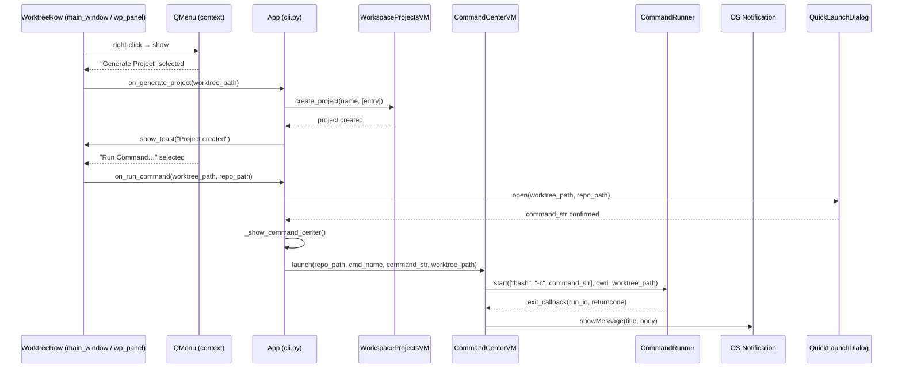

# Worktree Context Actions + Bash Execution + Notifications

## Overview

Three coordinated improvements to the worktree manager. First, worktree rows gain a right-click context menu in both the main worktree view and the Workspace Projects panel — the menu offers "Generate Project" (creates a single-worktree `.code-workspace` and shows visual confirmation) and "Run Command…" (opens a quick-launch dialog to type a bash command scoped to that worktree). Second, all commands are executed via `bash -c <cmd>` so that users can use pipes, subshell expansion, and any terminal idiom. Third, when any command finishes, crashes, or is cancelled, a system-level OS notification fires so users aren't watching the Command Center waiting for output.

---

## UI / Flow

### Worktree row — right-click context menu

Right-clicking any worktree row (in the main worktree list OR in the entries under a project in Workspace Projects) pops a native `QMenu`:

```
┌─────────────────────────┐
│  Generate Project        │
│  Run Command…            │
└─────────────────────────┘
```

Both items appear in both contexts. "Generate Project" is disabled for worktrees whose path is the repo root only if the same single-path project already exists (to avoid duplicates — deferred for now).

---

### Generate Project — success toast

After generating, a non-blocking in-app status label animates in below the toolbar for 3 seconds:

```
┌──────────────────────────────────────────────────────────────────────┐
│  Git Worktree Manager — my-app                              ⚙  🧹   │
│──────────────────────────────────────────────────────────────────────│
│  ✅ Project "feat-auth" created                                       │  ← fades in, auto-hides after 3s
│──────────────────────────────────────────────────────────────────────│
│  Worktrees                                               [+ New]     │
│                                                                      │
│  ● main          3d ago          [▼ main ▾]                          │
│  ○ feat-auth     1d ago          [▼ feat-auth ▾]  [✕]               │
└──────────────────────────────────────────────────────────────────────┘
```

The project is named after the worktree directory basename (e.g. `feat-auth`). If a project with that name already exists, the file is regenerated and the toast says "Project updated".

---

### Run Command… — quick-launch dialog

A small modal dialog. The worktree path and the derived repo name are pre-filled (read-only). The user types any bash command:

```
┌──────────────────────────────────────────────────────┐
│  Run Command                                          │
│──────────────────────────────────────────────────────│
│  Worktree:   ~/repos/my-app/feat-auth                │
│  Command:  [ echo $(git log --oneline -5)          ] │
│──────────────────────────────────────────────────────│
│                         [Cancel]  [Run]               │
└──────────────────────────────────────────────────────┘
```

Pressing Run:
1. Opens (or switches to) the Command Center panel.
2. Launches the command as a new pane titled `<basename> — <truncated cmd>`.

---

### Command Center — pane with notification

When a running pane's process ends (any cause), a notification fires **only if the Command Center is not the currently visible panel**:

- **Finished (exit 0):** "✅ `<cmd name>` finished"
- **Crashed (exit ≠ 0):** "❌ `<cmd name>` exited with code N"
- **Cancelled (user stop):** "⏹ `<cmd name>` stopped"

The notification uses `QSystemTrayIcon.showMessage()` if a tray icon is available, otherwise falls back to a `QMessageBox.information()` call (non-blocking via `QTimer.singleShot`).

Additionally, if the app does not have OS focus (i.e. the user is in another app), the dock icon bounces (`QApplication.alert(window, 0)`). If the app is focused, no bounce — just the panel switch and notification.

---

### Bash execution — transparent to the user

`CommandRunner.start()` wraps every command with `bash -c`, so the raw string the user typed is passed directly to the shell. The `RunHandle.command` field stores the raw string (not the list) so restart works correctly.

```
# Before
subprocess.Popen(shlex.split(command_str), cwd=..., ...)

# After
subprocess.Popen(["bash", "-c", command_str], cwd=..., ...)
```

---

## Architecture



**New / changed components:**

| Component | Change |
|---|---|
| `CommandRunner.start()` | Accept `command_str: str`, wrap with `["bash", "-c", command_str]`; drop `command: list` param |
| `CommandCenterViewModel.launch()` | Remove `shlex.split`; pass raw `command_str` to runner |
| `CommandCenterViewModel` | New `on_finished` callback; fires on every exit with status, name, returncode |
| `cli.App` | Wires `on_finished` → OS notification; passes `on_generate_project` / `on_run_command` to `MainWindow` and `WorkspaceProjectsPanel` |
| `MainWindow._add_row()` | Bind `contextMenuEvent` on each row widget → shows QMenu |
| `WorkspaceProjectsPanel._add_entry_row()` | Same — bind right-click on each entry widget |
| `QuickLaunchDialog` | New small dialog (worktree path label + command input + Run/Cancel) |

---

## Iteration Plan

### Iteration 0 — Walking Skeleton: Bash + Generate Project
**Delivers:** Right-clicking a worktree row in the main window shows a context menu; choosing "Generate Project" creates a single-worktree `.code-workspace` and shows a 3-second success toast. All commands now run via `bash -c`.
**Scope:**
- `CommandRunner.start()` accepts `command_str: str` and spawns `["bash", "-c", command_str]`
- `CommandCenterViewModel.launch()` removes `shlex.split`, passes raw string to runner
- `MainWindow._add_row()` binds right-click → `QMenu` with a single "Generate Project" action
- `cli.App` provides `on_generate_project(worktree_path, repo_path)` callback: creates a `WorkspaceProjectsViewModel`, calls `create_project`, shows toast on `MainWindow`
- Toast is a `QLabel` injected below the toolbar that auto-hides after 3 s via `QTimer`
**Explicitly out of scope:** "Run Command…" menu item, workspace projects panel right-click, notifications.

### Iteration 1 — Run Command from Worktree List
**Delivers:** Right-clicking a worktree row also offers "Run Command…"; clicking it opens a small dialog, and after the user types a bash command and hits Run, the app switches to the Command Center where the new pane appears.
**Scope:**
- "Run Command…" added to the existing context menu in `MainWindow`
- New `QuickLaunchDialog` (worktree path label + command `QLineEdit` + Cancel/Run buttons)
- `cli.App` provides `on_run_command(worktree_path, repo_path)` callback: opens dialog, on confirm calls `CommandCenterViewModel.launch()` then switches panel to Command Center
**Builds on:** Iteration 0 (bash execution already in place).
**Explicitly out of scope:** Workspace Projects panel right-click, notifications.

### Iteration 2 — Context Menu in Workspace Projects Panel
**Delivers:** Worktree entry rows inside the Workspace Projects panel also support the same right-click context menu (Generate Project + Run Command…).
**Scope:**
- `WorkspaceProjectsPanel._add_entry_row()` binds right-click → same `QMenu` (Generate Project, Run Command…)
- `WorkspaceProjectsPanel` receives `on_generate_project` and `on_run_command` callbacks from `cli.App`
- Same wiring as Iteration 0/1 — reuses existing callbacks
**Builds on:** Iterations 0 and 1.
**Explicitly out of scope:** Notifications.

### Iteration 3 — Command Finish Notifications
**Delivers:** When any command ends (success, crash, or cancel) and the Command Center is not already visible, the app shows an OS notification, switches to the Command Center, and bounces the dock icon if the app is not focused.
**Scope:**
- `CommandCenterViewModel` exposes `on_finished` callback: fires with `(run_id, cmd_name, status)` on every exit
- `cli.App` wires `on_finished`: checks if Command Center is current panel; if not → `QSystemTrayIcon.showMessage` (or `QMessageBox` fallback) + switch panel + `QApplication.alert(window, 0)` only if `!window.isActiveWindow()`
**Builds on:** Iterations 0–2.

## ✋ Manual Testing Gate — Iteration 0

> STOP. Do not proceed to Iteration 1 until every item below is checked off by the user.

- [ ] Launch the app, load a repo that has at least one non-main worktree, right-click on that worktree row — a context menu appears containing "Generate Project"
- [ ] Click "Generate Project" — a green toast "✅ Project \"<worktree-name>\" created" appears below the toolbar and disappears after ~3 seconds
- [ ] Verify the `.code-workspace` file exists at `~/.config/worktree-manager/workspaces/<worktree-name>.code-workspace`
- [ ] Open the Workspace Projects panel — the new project appears in the list with a single worktree entry matching the right-clicked worktree
- [ ] Right-click "Generate Project" a second time on the same worktree — toast says "✅ Project \"<name>\" updated" (file is regenerated)
- [ ] Right-click "Generate Project" on the main worktree — toast confirms a project is created for it too
- [ ] Open Command Center, launch any saved command — confirm it runs correctly (bash wrapping didn't break normal commands)
- [ ] In Command Center, launch a command with a pipe: `echo hello | tr a-z A-Z` — output shows `HELLO`
- [ ] In Command Center, launch a command with subshell: `echo $(git log --oneline -1)` — output shows the last commit hash/message

**How to confirm:** Run the app, perform each action above, and check off each item manually.
Reply "Iteration 0 confirmed" (or describe any failures) before I write the plan for Iteration 1.

---

## Decisions

- **Generate Project**: Toast only — generate the `.code-workspace` file and show a 3-second success toast. The user opens it from the Workspace Projects panel later.
- **Run Command output**: Switches the main panel to the Command Center so the new pane is immediately visible.
- **Notifications**: When a command finishes/crashes/is cancelled — if the Command Center is **not** already the visible panel: show an OS notification (`QSystemTrayIcon.showMessage` / `QMessageBox` fallback) and switch to the Command Center. Dock bounce (`QApplication.alert`) only fires if the app is not currently focused. If the user is already on the Command Center, do nothing extra.

## Open Questions

_(none — all resolved)_
