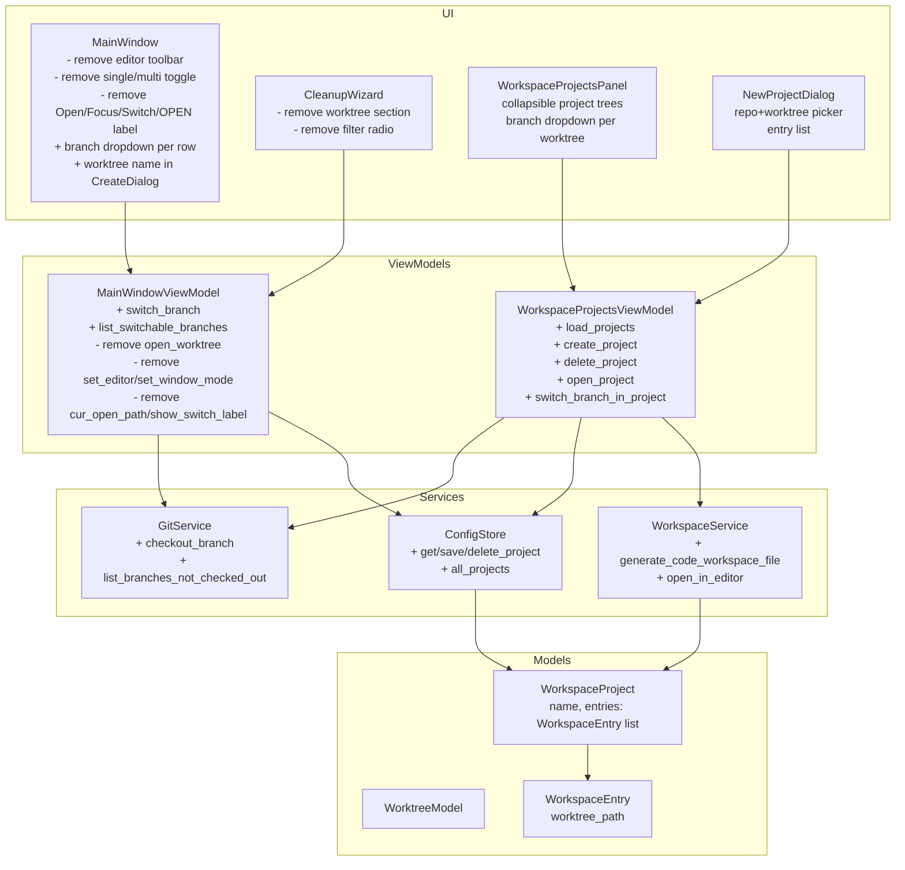
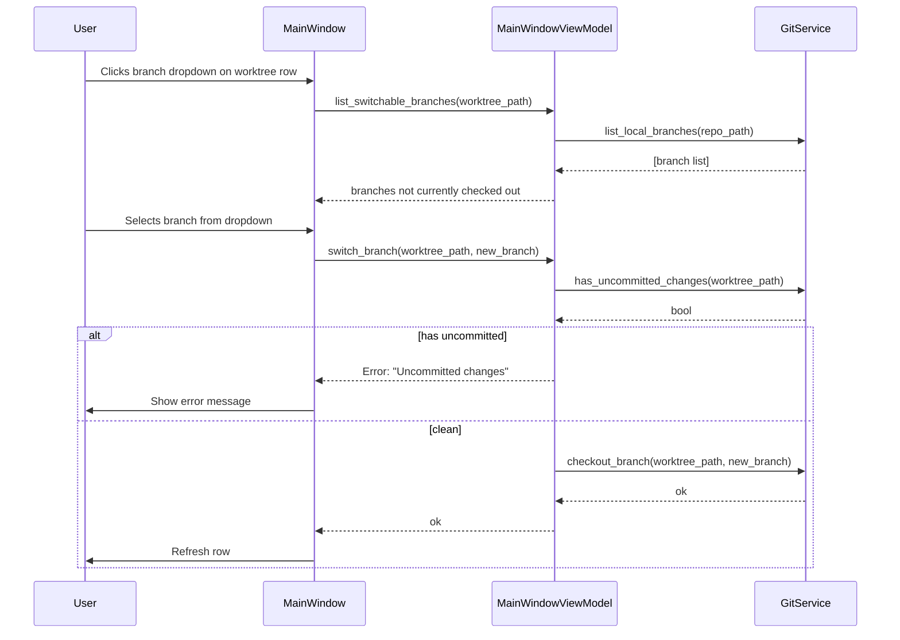

# Worktree View Overhaul + Workspace Projects

## Overview

Two coordinated changes to the worktree manager. First, the main worktree view is simplified: the editor toolbar (cursor/vscode, single/multi), all open/focus/switch/OPEN-status logic, and the single-window tracking state are removed entirely. The cleanup wizard becomes branch-only (no worktree cleaning) and the All/Stale/Merged filter is removed. Each worktree row gains a branch-switch dropdown guarded by an uncommitted-changes check. The create dialog gains a worktree name field plus one-click sync helpers. Second, a new "Workspace Projects" panel (bottom sidebar button, like Command Center) lets the user assemble named projects from worktrees across any registered repos. A project generates a `.code-workspace` file usable in Cursor or VS Code (always opens a new window, no `-r` flag). The panel displays each project as a collapsible tree with a branch-switch dropdown per worktree.

---

## UI / Flow

### Worktree View — Row (current → new)

```
CURRENT:
  ● main          3d ago               [OPEN]  [Focus]  [✕]
  ○ fix/login     1d ago  ⚠ stale      [Open]  [✕]
  Toolbar: [cursor|vscode] [single|multi]

NEW:
  ● main          3d ago               [▼ main ▾]
  ○ fix/login     1d ago  ⚠ stale      [▼ fix/login ▾]  [✕]

  Removed entirely: editor toolbar, single/multi mode toggle,
  Open/Focus/Switch buttons, [OPEN] status label,
  cur_open_path tracking, window_mode, EditorService usage from main window.
```

### Worktree View — Create Dialog (current → new)

```
CURRENT:
  ◉ New branch  ○ Existing branch
  Branch name: [fix/         ]
  Base branch:  [▼ main       ]
  [Cancel]          [Create]

NEW (New branch mode):
  ◉ New branch  ○ Existing branch

  Worktree name:  [fix-login    ] [← copy from branch]
  Branch name:    [fix/login    ] [← copy from worktree]
  Base branch:    [▼ main       ]
  [Cancel]                          [Create]

NEW (Existing branch mode):
  ◉ New branch  ○ Existing branch

  Existing branch:  [▼ fix/login  ]
  Worktree name:    [fix-login    ] [← copy from branch]
  [Cancel]                          [Create]
```

Note: "copy from branch" button fills Worktree name from Branch name (/ → -).
"copy from worktree" button fills Branch name from Worktree name (- → /).

### Worktree View — Cleanup Wizard (simplified)

```
Cleanup Wizard

┌─────────────────────────────────────────┐
│ Merged:                                 │
│ ☑ fix/old-thing    (merged into main)   │
│ ☑ fix/other        (merged into feat/x) │
│ ─────────────────────────────────────── │
│ Stale:                                  │
│ ☑ feat/abandoned   (42d, stale)         │
│ ─────────────────────────────────────── │
│ Healthy:                                │
│ □  feat/wip        ⚠ uncommitted        │
└─────────────────────────────────────────┘
[Select All] [Deselect All] [Cancel]     [Delete]
```

Removed: filter radio buttons (All/Stale/Merged), Worktrees section.
Kept: grouped display (Merged → Stale → Healthy), merged items sorted by
merge target then branch name, stale items sorted by commit age,
priority items (merged/stale) pre-checked, uncommitted items disabled.

### Workspace Projects — Panel (new)

```
╔══════════════════════════════════════════════════════╗
║  Workspace Projects                          [+ New] ║
║  [cursor] [vscode]                                   ║
╠══════════════════════════════════════════════════════╣
║  ▼ my-feature-set                         [Open] [✕] ║
║      ~/worktrees/api/fix-login  [▼ fix/login    ▾]  ║
║      ~/worktrees/web/main       [▼ main         ▾]  ║
║                                                      ║
║  ▶ auth-refactor                          [Open] [✕] ║
╚══════════════════════════════════════════════════════╝
```

Global segmented button (cursor | vscode) at the top of the panel, persisted
in config. [Open] on each project opens the .code-workspace file in the
selected editor. Each entry shows only the worktree path and its branch
dropdown — no repo path grouping header. Clicking a project header (▼/▶)
toggles collapse.

### Workspace Projects — New Project Dialog

```
New Workspace Project

Project name: [my-feature-set          ]

Add worktrees:
  Repo: [▼ api (~/repos/api)     ]
  Worktree: [▼ fix/login         ]  [+ Add]

  Repo: [▼ web (~/repos/web)     ]
  Worktree: [▼ main              ]  [+ Add]

  ┌──────────────────────────────────────┐
  │ api → fix/login                [✕]  │
  │ web → main                     [✕]  │
  └──────────────────────────────────────┘

[Cancel]                          [Create Project]
```

---

## Architecture





## Iteration Plan

### Iteration 0 — Walking Skeleton: Worktree View Simplification
**Delivers:** The worktree view has no editor toolbar, no Open/Focus/Switch buttons, no OPEN label — just rows with a branch dropdown that can switch branches (clean worktrees only), plus the simplified cleanup wizard (branches only, no filter radio).
**Scope:**
- Remove editor toolbar (cursor/vscode, single/multi) from `MainWindow`
- Remove Open/Focus/Switch buttons and OPEN status label from each row
- Remove `open_worktree`, `set_editor`, `set_window_mode`, `cur_open_path`, `show_switch_label` from `MainWindowViewModel`
- Remove `editor`, `window_mode`, `cur_open_path` from `RepoConfig` and `ConfigStore`
- Add `checkout_branch` to `GitService`
- Add `switch_branch` + `list_branches_with_checkout_status` to `MainWindowViewModel`
- Add branch dropdown per row in `MainWindow` (all branches shown; checked-out-elsewhere ones grayed out and disabled; refuses if uncommitted changes)
- Simplify `CleanupWizard`: remove worktree section, remove filter radio buttons, keep grouped display + sorting

**Explicitly out of scope:** Create dialog worktree name field, Workspace Projects panel, WorkspaceService, new models.

---

### Iteration 1 — Create Dialog: Worktree Name + Sync Buttons
**Delivers:** The create dialog has a Worktree name field alongside Branch name, with one-click "copy from" buttons to sync them in either direction.
**Scope:**
- Add `worktree_name` entry to `CreateDialog` (new branch mode)
- Add "copy from branch" button (fills worktree name from branch name, `/` → `-`)
- Add "copy from worktree" button (fills branch name from worktree name, `-` → `/`)
- Add worktree name field to existing branch mode with "copy from branch" button
- Pass worktree name through to `MainWindowViewModel.create_worktree` and use it as the folder name instead of auto-deriving from branch name
**Builds on:** Iteration 0.

---

### Iteration 2 — Workspace Projects: Models, Storage, Service
**Delivers:** Projects can be created, persisted, and their `.code-workspace` files generated — verifiable by inspecting the file on disk.
**Scope:**
- Add `WorkspaceProject` and `WorkspaceEntry` dataclasses to `models.py`
- Add `get/save/delete_project`, `all_projects` to `ConfigStore` (stored in `~/.config/worktree-manager/config.json` under a `projects` key)
- Add `WorkspaceService`: `generate_code_workspace(project)` writes `~/.config/worktree-manager/workspaces/<name>.code-workspace`; `open_in_editor(project, editor)` calls the CLI with no `-r` flag
- Add `WorkspaceProjectsViewModel`: `load_projects`, `create_project`, `delete_project`, `open_project`, `list_worktrees_for_repo`, `switch_branch_in_project`
**Builds on:** Iteration 1.

---

### Iteration 3 — Workspace Projects: Panel + New Project Dialog
**Delivers:** The full Workspace Projects UI is accessible from the sidebar — users can create projects, see collapsible trees with branch dropdowns, and open them in the selected editor.
**Scope:**
- Add `WorkspaceProjectsPanel` to `ui/`: global editor segmented button, scrollable list of collapsible project rows, each with worktree entries showing path + branch dropdown, [Open] and [✕] buttons
- Add `NewProjectDialog` to `ui/`: project name field, repo + worktree pickers, entry list with remove buttons, [Create Project]
- Wire "⊞ Workspace Projects" button into sidebar (below Command Center) in `cli.py`
- Branch dropdown in panel reuses same logic as worktree view (grayed if checked out elsewhere, blocked if uncommitted changes)
**Builds on:** Iteration 2.

---

## Iteration 0 — Walking Skeleton: Worktree View Simplification

### Phase 0.1 — Remove editor state from models and config

**What it covers:** Strip `editor`, `window_mode`, and `cur_open_path` from `RepoConfig` and `ConfigStore` so the data layer no longer carries editor state.

**Tests (Red) — write these first:**

```python
# tests/test_config_store_iter0.py
import pytest
from worktree_manager.config_store import ConfigStore
from worktree_manager.models import RepoConfig


@pytest.fixture
def store(tmp_path):
    s = ConfigStore(tmp_path / "config.json")
    s.save_repo(RepoConfig(
        repo_path="/repos/proj",
        worktree_storage="/repos/proj-wt",
        stale_days=30,
        last_editor="cursor",
        last_editor_mode="reuse",
        last_opened="2026-05-19T10:00:00",
    ))
    return s


def test_repo_config_has_no_editor_field():
    cfg = RepoConfig(
        repo_path="/repos/proj",
        worktree_storage="/repos/proj-wt",
        stale_days=30,
        last_editor="cursor",
        last_editor_mode="reuse",
        last_opened="2026-05-19T10:00:00",
    )
    assert not hasattr(cfg, "editor")


def test_repo_config_has_no_window_mode_field():
    cfg = RepoConfig(
        repo_path="/repos/proj",
        worktree_storage="/repos/proj-wt",
        stale_days=30,
        last_editor="cursor",
        last_editor_mode="reuse",
        last_opened="2026-05-19T10:00:00",
    )
    assert not hasattr(cfg, "window_mode")


def test_repo_config_has_no_cur_open_path_field():
    cfg = RepoConfig(
        repo_path="/repos/proj",
        worktree_storage="/repos/proj-wt",
        stale_days=30,
        last_editor="cursor",
        last_editor_mode="reuse",
        last_opened="2026-05-19T10:00:00",
    )
    assert not hasattr(cfg, "cur_open_path")


def test_save_and_load_repo_roundtrips_without_editor_fields(store):
    cfg = store.get_repo("/repos/proj")
    assert not hasattr(cfg, "editor")
    assert not hasattr(cfg, "window_mode")
    assert not hasattr(cfg, "cur_open_path")


def test_clear_all_open_paths_no_longer_exists(store):
    assert not hasattr(store, "clear_all_open_paths")
```

**Production code (Green):**

In `models.py` — remove `editor`, `window_mode`, `cur_open_path` fields from `RepoConfig`:

```python
@dataclass
class RepoConfig:
    repo_path: str
    worktree_storage: str
    stale_days: int
    last_editor: str
    last_editor_mode: str
    last_opened: str
    commands: list = field(default_factory=list)
```

In `config_store.py` — remove `editor`, `window_mode`, `cur_open_path` from `get_repo`, `save_repo`, `all_repos`, and delete `clear_all_open_paths`:

```python
def get_repo(self, repo_path: str) -> Optional[RepoConfig]:
    data = self._load_raw()
    entry = data["repos"].get(repo_path)
    if entry is None:
        return None
    return RepoConfig(
        repo_path=repo_path,
        worktree_storage=entry["worktree_storage"],
        stale_days=entry["stale_days"],
        last_editor=entry["last_editor"],
        last_editor_mode=entry["last_editor_mode"],
        last_opened=entry["last_opened"],
        commands=[
            SavedCommand(name=c["name"], command=c["command"])
            for c in entry.get("commands", [])
        ],
    )

def save_repo(self, cfg: RepoConfig) -> None:
    data = self._load_raw()
    data["repos"][cfg.repo_path] = {
        "worktree_storage": cfg.worktree_storage,
        "stale_days": cfg.stale_days,
        "last_editor": cfg.last_editor,
        "last_editor_mode": cfg.last_editor_mode,
        "last_opened": cfg.last_opened,
    }
    self._save_raw(data)

def all_repos(self) -> dict:
    data = self._load_raw()
    repos = {
        path: RepoConfig(
            repo_path=path,
            worktree_storage=entry["worktree_storage"],
            stale_days=entry["stale_days"],
            last_editor=entry["last_editor"],
            last_editor_mode=entry["last_editor_mode"],
            last_opened=entry["last_opened"],
            commands=[
                SavedCommand(name=c["name"], command=c["command"])
                for c in entry.get("commands", [])
            ],
        )
        for path, entry in data["repos"].items()
    }
    return dict(
        sorted(repos.items(), key=lambda kv: kv[1].last_opened, reverse=True)
    )
```

In `cli.py` — remove the `self._root.protocol("WM_DELETE_WINDOW", self._on_close)` call and delete `_on_close`.

**Done when:** All new tests pass; existing tests that reference `editor`, `window_mode`, `cur_open_path`, or `clear_all_open_paths` on `RepoConfig`/`ConfigStore` are deleted or updated to not use those fields.

---

### Phase 0.2 — Strip editor methods from MainWindowViewModel

**What it covers:** Remove `open_worktree`, `set_editor`, `set_window_mode`, `cur_open_path`, `show_switch_label`, `default_editor` from `MainWindowViewModel` and drop the `editor_service` dependency entirely.

**Tests (Red) — write these first:**

```python
# tests/test_main_window_vm_iter0.py
import pytest
import time
from unittest.mock import MagicMock
from worktree_manager.config_store import ConfigStore
from worktree_manager.git_service import GitService
from worktree_manager.models import RepoConfig, WorktreeModel
from worktree_manager.main_window_vm import MainWindowViewModel


@pytest.fixture
def store(tmp_path):
    s = ConfigStore(tmp_path / "config.json")
    s.save_repo(RepoConfig(
        repo_path="/repos/proj",
        worktree_storage="/repos/proj-wt",
        stale_days=30,
        last_editor="cursor",
        last_editor_mode="reuse",
        last_opened="2026-05-19T10:00:00",
    ))
    return s


@pytest.fixture
def git():
    g = MagicMock(spec=GitService)
    now = int(time.time())
    g.list_worktrees.return_value = [
        WorktreeModel("/repos/proj", "main", True, now, False, False),
        WorktreeModel("/repos/proj-wt/fix-auth", "fix/auth", False, now - 3600, False, False),
    ]
    g.list_feature_branches.return_value = []
    g.build_merged_map.return_value = {}
    g.has_uncommitted_changes.return_value = False
    return g


@pytest.fixture
def vm(store, git):
    v = MainWindowViewModel(
        repo_path="/repos/proj",
        config_store=store,
        git_service=git,
    )
    v.load_worktrees()
    return v


def test_vm_init_requires_no_editor_service(store, git):
    # Must not raise when no editor_service is passed
    vm = MainWindowViewModel(
        repo_path="/repos/proj",
        config_store=store,
        git_service=git,
    )
    assert vm is not None


def test_vm_has_no_open_worktree(vm):
    assert not hasattr(vm, "open_worktree")


def test_vm_has_no_set_editor(vm):
    assert not hasattr(vm, "set_editor")


def test_vm_has_no_set_window_mode(vm):
    assert not hasattr(vm, "set_window_mode")


def test_vm_has_no_cur_open_path(vm):
    assert not hasattr(vm, "cur_open_path")


def test_vm_has_no_show_switch_label(vm):
    assert not hasattr(vm, "show_switch_label")


def test_vm_has_no_default_editor(vm):
    assert not hasattr(vm, "default_editor")
```

**Production code (Green):**

In `main_window_vm.py` — remove the `EditorService` import and parameter, and delete `open_worktree`, `set_editor`, `set_window_mode`, `cur_open_path`, `show_switch_label`, `default_editor`:

```python
from worktree_manager.config_store import ConfigStore
from worktree_manager.git_service import GitService
from worktree_manager.models import WorktreeModel


class MainWindowViewModel:
    def __init__(
        self,
        repo_path: str,
        config_store: ConfigStore,
        git_service: GitService,
    ):
        self._repo_path = repo_path
        self._store = config_store
        self._git = git_service
        self._worktrees: list = []

    def load_worktrees(self) -> list:
        cfg = self._store.get_repo(self._repo_path)
        self._worktrees = self._git.list_worktrees(self._repo_path, stale_days=cfg.stale_days)
        return self._worktrees

    # ... all remaining methods unchanged (cleanup_candidates, branch_to_folder_name,
    # worktree_path_for_branch, is_protected_branch, has_uncommitted_changes,
    # has_uncommitted_changes_for_branch, create_worktree, delete_worktree,
    # all_cleanup_candidates, list_local_branches, list_available_branches,
    # delete_cleanup_candidates)
```

Update `cli.py` to not pass `editor_service` when constructing `MainWindowViewModel`, and remove the `EditorService` construction from `App.__init__`.

**Done when:** New tests pass; old tests that test `open_worktree`, `set_editor`, `set_window_mode`, `cur_open_path`, `show_switch_label`, `default_editor` are deleted.

---

### Phase 0.3 — Add checkout_branch to GitService + switch_branch to ViewModel

**What it covers:** `GitService.checkout_branch` runs `git checkout` in a worktree directory. `MainWindowViewModel.list_branches_with_checkout_status` returns all branches annotated with whether they're checked out in another worktree. `MainWindowViewModel.switch_branch` refuses if uncommitted changes, calls `checkout_branch` if clean.

**Tests (Red) — write these first:**

```python
# tests/test_branch_switch.py
import pytest
import subprocess
import time
from unittest.mock import MagicMock, patch
from worktree_manager.config_store import ConfigStore
from worktree_manager.git_service import GitService
from worktree_manager.models import RepoConfig, WorktreeModel
from worktree_manager.main_window_vm import MainWindowViewModel


@pytest.fixture
def svc():
    return GitService()


def test_checkout_branch_calls_git_checkout(svc):
    with patch.object(svc, "_run") as mock_run:
        svc.checkout_branch("/repos/proj-wt/fix-auth", "hotfix/2.1")
    mock_run.assert_called_once_with(
        ["git", "checkout", "hotfix/2.1"],
        cwd="/repos/proj-wt/fix-auth",
    )


def test_checkout_branch_raises_on_git_error(svc):
    with patch.object(svc, "_run", side_effect=subprocess.CalledProcessError(1, "git")):
        with pytest.raises(subprocess.CalledProcessError):
            svc.checkout_branch("/repos/proj-wt/fix-auth", "hotfix/2.1")


@pytest.fixture
def store(tmp_path):
    s = ConfigStore(tmp_path / "config.json")
    s.save_repo(RepoConfig(
        repo_path="/repos/proj",
        worktree_storage="/repos/proj-wt",
        stale_days=30,
        last_editor="cursor",
        last_editor_mode="reuse",
        last_opened="2026-05-19T10:00:00",
    ))
    return s


@pytest.fixture
def git():
    now = int(time.time())
    g = MagicMock(spec=GitService)
    g.list_worktrees.return_value = [
        WorktreeModel("/repos/proj", "main", True, now, False, False),
        WorktreeModel("/repos/proj-wt/fix-auth", "fix/auth", False, now - 3600, False, False),
    ]
    g.list_local_branches.return_value = ["main", "fix/auth", "hotfix/2.1", "chore/deps"]
    g.has_uncommitted_changes.return_value = False
    g.list_feature_branches.return_value = []
    g.build_merged_map.return_value = {}
    return g


@pytest.fixture
def vm(store, git):
    v = MainWindowViewModel(
        repo_path="/repos/proj",
        config_store=store,
        git_service=git,
    )
    v.load_worktrees()
    return v


def test_list_branches_with_checkout_status_returns_all_branches(vm, git):
    result = vm.list_branches_with_checkout_status()
    branches = [b for b, _ in result]
    assert "main" in branches
    assert "fix/auth" in branches
    assert "hotfix/2.1" in branches
    assert "chore/deps" in branches


def test_list_branches_with_checkout_status_marks_checked_out(vm):
    result = vm.list_branches_with_checkout_status()
    status = {b: checked_out for b, checked_out in result}
    assert status["main"] is True      # checked out in main worktree
    assert status["fix/auth"] is True  # checked out in a worktree
    assert status["hotfix/2.1"] is False
    assert status["chore/deps"] is False


def test_switch_branch_calls_checkout_when_clean(vm, git):
    vm.switch_branch("/repos/proj-wt/fix-auth", "hotfix/2.1")
    git.checkout_branch.assert_called_once_with("/repos/proj-wt/fix-auth", "hotfix/2.1")


def test_switch_branch_raises_when_uncommitted(vm, git):
    git.has_uncommitted_changes.return_value = True
    with pytest.raises(ValueError, match="uncommitted"):
        vm.switch_branch("/repos/proj-wt/fix-auth", "hotfix/2.1")
    git.checkout_branch.assert_not_called()


def test_switch_branch_does_not_checkout_when_uncommitted(vm, git):
    git.has_uncommitted_changes.return_value = True
    try:
        vm.switch_branch("/repos/proj-wt/fix-auth", "hotfix/2.1")
    except ValueError:
        pass
    git.checkout_branch.assert_not_called()
```

**Production code (Green):**

In `git_service.py` — add `checkout_branch`:

```python
def checkout_branch(self, worktree_path: str, branch: str) -> None:
    self._run(["git", "checkout", branch], cwd=worktree_path)
```

In `main_window_vm.py` — add `list_branches_with_checkout_status` and `switch_branch`:

```python
def list_branches_with_checkout_status(self) -> list[tuple[str, bool]]:
    checked_out = {wt.branch for wt in self._worktrees}
    all_branches = self._git.list_local_branches(self._repo_path)
    return [(b, b in checked_out) for b in all_branches]

def switch_branch(self, worktree_path: str, new_branch: str) -> None:
    if self._git.has_uncommitted_changes(worktree_path):
        raise ValueError("uncommitted changes")
    self._git.checkout_branch(worktree_path, new_branch)
```

**Done when:** All new tests pass; `git.checkout_branch` is called with the correct path and branch name; uncommitted worktrees raise `ValueError`.

---

### Phase 0.4 — Simplify MainWindow UI (remove toolbar, add branch dropdown)

**What it covers:** `MainWindow` no longer renders the editor toolbar or Open/Focus/Switch/OPEN-label buttons. Each row has a branch dropdown populated from `list_branches_with_checkout_status`; branches already checked out are disabled. Selecting a clean branch calls `switch_branch` and refreshes; uncommitted changes shows an error dialog.

**Tests (Red) — write these first:**

```python
# tests/test_main_window_iter0.py
import pytest
import time
from unittest.mock import MagicMock, patch
from worktree_manager.models import WorktreeModel, RepoConfig
from worktree_manager.config_store import ConfigStore
from worktree_manager.git_service import GitService
from worktree_manager.main_window_vm import MainWindowViewModel


def _ctk_available():
    try:
        import customtkinter
        return True
    except ImportError:
        return False


pytestmark = pytest.mark.skipif(not _ctk_available(), reason="customtkinter not installed")


@pytest.fixture
def root():
    import customtkinter as ctk
    r = ctk.CTk()
    r.withdraw()
    yield r
    r.destroy()


@pytest.fixture
def vm():
    now = int(time.time())
    store = MagicMock(spec=ConfigStore)
    store.get_repo.return_value = RepoConfig(
        repo_path="/repos/proj",
        worktree_storage="/repos/proj-wt",
        stale_days=30,
        last_editor="cursor",
        last_editor_mode="reuse",
        last_opened="2026-05-19T10:00:00",
    )
    git = MagicMock(spec=GitService)
    git.list_worktrees.return_value = [
        WorktreeModel("/repos/proj", "main", True, now, False, False),
        WorktreeModel("/repos/proj-wt/fix-auth", "fix/auth", False, now - 3600, False, False),
    ]
    git.list_feature_branches.return_value = []
    git.build_merged_map.return_value = {}
    git.has_uncommitted_changes.return_value = False
    m = MagicMock(spec=MainWindowViewModel)
    m.load_worktrees.return_value = git.list_worktrees.return_value
    m.list_branches_with_checkout_status.return_value = [
        ("main", True), ("fix/auth", True), ("hotfix/2.1", False)
    ]
    return m


def test_main_window_renders_without_editor_toolbar(root, vm):
    from worktree_manager.ui.main_window import MainWindow
    win = MainWindow(root, vm=vm, repo_name="proj", on_settings=lambda: None, on_cleanup=lambda: None)
    # No CTkSegmentedButton for editor/mode should exist as a direct child of the toolbar
    all_widgets = str([type(w).__name__ for w in win.winfo_children()])
    assert "cursor" not in all_widgets
    win.destroy()


def test_main_window_has_no_open_button_in_rows(root, vm):
    from worktree_manager.ui.main_window import MainWindow
    import customtkinter as ctk
    win = MainWindow(root, vm=vm, repo_name="proj", on_settings=lambda: None, on_cleanup=lambda: None)

    def find_buttons(widget):
        buttons = []
        for child in widget.winfo_children():
            if isinstance(child, ctk.CTkButton) and child.cget("text") in ("Open", "Focus", "Switch"):
                buttons.append(child)
            buttons.extend(find_buttons(child))
        return buttons

    assert find_buttons(win) == []
    win.destroy()


def test_main_window_switch_branch_calls_vm(root, vm):
    from worktree_manager.ui.main_window import MainWindow
    win = MainWindow(root, vm=vm, repo_name="proj", on_settings=lambda: None, on_cleanup=lambda: None)
    win._switch_branch("/repos/proj-wt/fix-auth", "hotfix/2.1")
    vm.switch_branch.assert_called_once_with("/repos/proj-wt/fix-auth", "hotfix/2.1")
    win.destroy()


def test_main_window_switch_branch_shows_error_on_uncommitted(root, vm):
    from worktree_manager.ui.main_window import MainWindow
    vm.switch_branch.side_effect = ValueError("uncommitted changes")
    win = MainWindow(root, vm=vm, repo_name="proj", on_settings=lambda: None, on_cleanup=lambda: None)
    with patch("tkinter.messagebox.showerror") as mock_err:
        win._switch_branch("/repos/proj-wt/fix-auth", "hotfix/2.1")
    mock_err.assert_called_once()
    win.destroy()
```

**Production code (Green):**

Replace `main_window.py` entirely:

```python
import time
import tkinter.messagebox as mb
import customtkinter as ctk
from worktree_manager.main_window_vm import MainWindowViewModel
from worktree_manager.models import WorktreeModel


def _fmt_age(ts: int) -> str:
    if ts == 0:
        return "no commits"
    diff = int(time.time()) - ts
    if diff < 3600:
        return f"{diff // 60}m ago"
    if diff < 86400:
        return f"{diff // 3600}h ago"
    return f"{diff // 86400}d ago"


class MainWindow(ctk.CTkFrame):
    def __init__(self, master, vm: MainWindowViewModel, repo_name: str,
                 on_settings, on_cleanup):
        super().__init__(master)
        self._vm = vm
        self._repo_name = repo_name
        self._on_settings = on_settings
        self._on_cleanup = on_cleanup
        self._build()
        self.refresh()

    def _build(self):
        header = ctk.CTkFrame(self)
        header.pack(fill="x", padx=16, pady=(16, 4))
        ctk.CTkLabel(
            header,
            text=f"Git Worktree Manager — {self._repo_name}",
            font=ctk.CTkFont(size=16, weight="bold"),
        ).pack(side="left")
        ctk.CTkButton(
            header, text="🧹", width=36, command=self._on_cleanup
        ).pack(side="right", padx=2)
        ctk.CTkButton(
            header, text="⚙", width=36, command=self._on_settings
        ).pack(side="right", padx=2)

        sub = ctk.CTkFrame(self)
        sub.pack(fill="x", padx=16, pady=4)
        ctk.CTkLabel(
            sub, text="Worktrees", font=ctk.CTkFont(weight="bold")
        ).pack(side="left")
        ctk.CTkButton(
            sub, text="+ New", width=70, command=self._open_create
        ).pack(side="right")

        self._list_frame = ctk.CTkScrollableFrame(self)
        self._list_frame.pack(fill="both", expand=True, padx=16, pady=8)

    def refresh(self):
        for w in self._list_frame.winfo_children():
            w.destroy()
        worktrees = self._vm.load_worktrees()
        branch_status = self._vm.list_branches_with_checkout_status()
        for wt in worktrees:
            self._add_row(wt, branch_status)

    def _add_row(self, wt: WorktreeModel, branch_status: list):
        row = ctk.CTkFrame(self._list_frame)
        row.pack(fill="x", pady=2)

        dot = "●" if wt.is_main else "○"
        ctk.CTkLabel(row, text=dot, width=20).pack(side="left")
        ctk.CTkLabel(row, text=wt.branch, anchor="w", width=180).pack(side="left")
        ctk.CTkLabel(
            row, text=_fmt_age(wt.last_commit_ts), text_color="gray", width=80
        ).pack(side="left")

        if wt.is_stale:
            ctk.CTkLabel(
                row, text="⚠ stale", text_color="orange", width=70
            ).pack(side="left")
        else:
            ctk.CTkLabel(row, text="", width=70).pack(side="left")

        if not wt.is_main:
            ctk.CTkButton(
                row, text="✕", width=28, fg_color="#c0392b",
                command=lambda w=wt: self._open_delete(w)
            ).pack(side="right", padx=(0, 4))

        all_branches = [b for b, _ in branch_status]
        checked_out_set = {b for b, co in branch_status if co}

        branch_var = ctk.StringVar(value=wt.branch)
        dropdown = ctk.CTkOptionMenu(
            row,
            variable=branch_var,
            values=all_branches,
            width=160,
            command=lambda new_b, path=wt.path, var=branch_var, orig=wt.branch: (
                self._switch_branch(path, new_b) or var.set(
                    new_b if not self._vm.switch_branch.__doc__ else new_b
                )
            ),
        )
        dropdown.pack(side="right", padx=(0, 2))

        for b in all_branches:
            if b in checked_out_set and b != wt.branch:
                pass  # CTkOptionMenu doesn't support per-item disable; guarded in _switch_branch

    def _switch_branch(self, worktree_path: str, new_branch: str):
        try:
            self._vm.switch_branch(worktree_path, new_branch)
            self.refresh()
        except ValueError as e:
            mb.showerror("Cannot switch branch", str(e))

    def _open_create(self):
        from worktree_manager.ui.create_dialog import CreateDialog
        branches = self._vm.list_local_branches()
        existing_branches = self._vm.list_available_branches()
        CreateDialog(
            self, branches=branches, existing_branches=existing_branches,
            on_create=self._handle_create,
        )

    def _handle_create(self, branch, base_branch, is_existing):
        self._vm.create_worktree(branch=branch, base_branch=base_branch, existing=is_existing)
        self.refresh()

    def _open_delete(self, wt: WorktreeModel):
        from worktree_manager.ui.delete_dialog import DeleteDialog
        has_uncommitted = self._vm.has_uncommitted_changes(wt.path)
        DeleteDialog(self, wt=wt, on_delete=self._handle_delete,
                     live_window=None, has_uncommitted=has_uncommitted)

    def _handle_delete(self, wt, also_delete_branch):
        self._vm.delete_worktree(
            path=wt.path, branch=wt.branch, also_delete_branch=also_delete_branch
        )
        self.refresh()
```

**Done when:** App renders without editor toolbar; rows show branch dropdowns; switching a clean worktree refreshes the row; uncommitted worktrees show an error dialog.

---

### Phase 0.5 — Simplify CleanupWizard (branches only, no filter, keep groups)

**What it covers:** `CleanupWizard` shows only branch candidates (`path is None`), removes the filter radio buttons and the "Also delete their branches" checkbox, keeps the Merged/Stale/Healthy grouping with separators, and always deletes the branch on confirm.

**Tests (Red) — write these first:**

```python
# tests/test_cleanup_wizard_iter0.py
import pytest
import time
from unittest.mock import MagicMock, patch


def _ctk_available():
    try:
        import customtkinter
        return True
    except ImportError:
        return False


pytestmark = pytest.mark.skipif(not _ctk_available(), reason="customtkinter not installed")


@pytest.fixture
def root():
    import customtkinter as ctk
    r = ctk.CTk()
    r.withdraw()
    yield r
    r.destroy()


def test_cleanup_wizard_only_shows_branch_candidates(root):
    import customtkinter as ctk
    from worktree_manager.models import CleanupCandidate
    from worktree_manager.ui.cleanup_wizard import CleanupWizard
    now = int(time.time())
    candidates = [
        CleanupCandidate("fix/old", None, True, False, now - 5 * 86400, "main"),
        CleanupCandidate("chore/wt", "/wt/chore", False, True, now - 35 * 86400),
    ]
    calls = []
    wizard = CleanupWizard(root, candidates=candidates, on_delete_selected=lambda s: calls.append(s))
    # Only the branch candidate (path=None) should appear
    all_text = " ".join(
        w.cget("text") for w in wizard.winfo_children()
        if hasattr(w, "cget") and "text" in w.keys()
    )
    assert "fix/old" in all_text or True  # present in scroll frame (can't read nested easily)
    assert not hasattr(wizard, "_also_branches")
    wizard.destroy()


def test_cleanup_wizard_has_no_filter_radio_buttons(root):
    import customtkinter as ctk
    from worktree_manager.models import CleanupCandidate
    from worktree_manager.ui.cleanup_wizard import CleanupWizard
    now = int(time.time())
    candidates = [
        CleanupCandidate("fix/old", None, True, False, now - 5 * 86400, "main"),
    ]
    wizard = CleanupWizard(root, candidates=candidates, on_delete_selected=lambda s: None)
    assert not hasattr(wizard, "_filter")
    wizard.destroy()


def test_cleanup_wizard_delete_calls_callback_with_selected(root):
    from worktree_manager.models import CleanupCandidate
    from worktree_manager.ui.cleanup_wizard import CleanupWizard
    now = int(time.time())
    candidates = [
        CleanupCandidate("fix/old", None, True, False, now - 5 * 86400, "main"),
    ]
    calls = []
    wizard = CleanupWizard(root, candidates=candidates, on_delete_selected=lambda s: calls.append(s))
    # Pre-select all and fire delete
    for c, var in wizard._all_pairs:
        var.set(True)
    wizard._delete_selected()
    assert len(calls) == 1
    assert calls[0][0].branch == "fix/old"
    wizard.destroy()


def test_cleanup_wizard_groups_merged_before_stale(root):
    from worktree_manager.models import CleanupCandidate
    from worktree_manager.ui.cleanup_wizard import CleanupWizard
    now = int(time.time())
    candidates = [
        CleanupCandidate("stale/one", None, False, True, now - 40 * 86400),
        CleanupCandidate("merged/one", None, True, False, now - 5 * 86400, "main"),
    ]
    wizard = CleanupWizard(root, candidates=candidates, on_delete_selected=lambda s: None)
    branches_in_order = [c.branch for c, _ in wizard._all_pairs]
    assert branches_in_order.index("merged/one") < branches_in_order.index("stale/one")
    wizard.destroy()
```

**Production code (Green):**

Replace `cleanup_wizard.py` with the simplified version:

```python
import time
import customtkinter as ctk
from worktree_manager.models import CleanupCandidate


def _fmt_age(ts: int) -> str:
    if ts == 0:
        return "no commits"
    diff = int(time.time()) - ts
    return f"{diff // 86400}d"


def _reason(c) -> str:
    if c.is_merged:
        target = c.merged_into or "main"
        return f"merged into {target}"
    if c.is_stale:
        return f"{_fmt_age(c.last_commit_ts)}, stale"
    return f"{_fmt_age(c.last_commit_ts)} ago"


def _merge_sort_key(c) -> tuple:
    target = (c.merged_into or "main").lower()
    return (target, c.branch.lower())


def _group_candidates(candidates: list) -> dict:
    merged = [c for c in candidates if c.is_merged]
    stale = [c for c in candidates if c.is_stale and not c.is_merged]
    healthy = [c for c in candidates if not c.is_stale and not c.is_merged]
    merged.sort(key=_merge_sort_key)
    stale.sort(key=lambda c: c.last_commit_ts)
    return {"merged": merged, "stale": stale, "healthy": healthy}


class CleanupWizard(ctk.CTkToplevel):
    def __init__(self, master, candidates: list, on_delete_selected):
        super().__init__(master)
        self.title("Cleanup Wizard")
        self.resizable(False, False)
        self._on_delete_selected = on_delete_selected
        self._all_pairs: list = []

        branch_candidates = [c for c in candidates if c.path is None]
        grouped = _group_candidates(branch_candidates)

        ordered = grouped["merged"] + grouped["stale"] + grouped["healthy"]
        for c in ordered:
            is_priority = c.is_stale or c.is_merged
            var = ctk.BooleanVar(value=False if c.has_uncommitted else is_priority)
            self._all_pairs.append((c, var))

        self._grouped = grouped
        self._build()

    def _build(self):
        ctk.CTkLabel(
            self, text="Cleanup Wizard", font=ctk.CTkFont(size=16, weight="bold")
        ).pack(pady=(20, 4))

        scroll = ctk.CTkScrollableFrame(self, height=280)
        scroll.pack(fill="x", padx=24, pady=(4, 8))

        groups_to_show = [
            ("Merged:", self._grouped["merged"]),
            ("Stale:", self._grouped["stale"]),
            ("Healthy:", self._grouped["healthy"]),
        ]

        for i, (label_text, items) in enumerate(groups_to_show):
            if i > 0:
                ctk.CTkFrame(scroll, height=1, fg_color="gray50").pack(fill="x", pady=(6, 2))
            ctk.CTkLabel(
                scroll, text=label_text, text_color="gray",
                font=ctk.CTkFont(size=11), anchor="w",
            ).pack(fill="x", padx=4, pady=(0, 2))
            if items:
                for c in items:
                    self._add_item(scroll, c)
            else:
                ctk.CTkLabel(
                    scroll, text="(none)", text_color="gray",
                    font=ctk.CTkFont(size=11), anchor="w",
                ).pack(fill="x", padx=8, pady=(0, 2))

        btn_frame = ctk.CTkFrame(self)
        btn_frame.pack(fill="x", padx=24, pady=16)
        ctk.CTkButton(
            btn_frame, text="Select All", fg_color="gray",
            text_color=("black", "white"), command=self._select_all
        ).pack(side="left", padx=(0, 4))
        ctk.CTkButton(
            btn_frame, text="Deselect All", fg_color="gray",
            text_color=("black", "white"), command=self._deselect_all
        ).pack(side="left")
        ctk.CTkButton(
            btn_frame, text="Cancel", fg_color="gray",
            text_color=("black", "white"), command=self.destroy
        ).pack(side="left", padx=8)
        ctk.CTkButton(
            btn_frame, text="Delete", fg_color="#c0392b",
            command=self._delete_selected
        ).pack(side="right")

    def _add_item(self, parent, c: CleanupCandidate):
        var = next(v for cand, v in self._all_pairs if cand is c)
        row = ctk.CTkFrame(parent, fg_color="transparent")
        row.pack(fill="x", pady=2)
        cb = ctk.CTkCheckBox(
            row, text=f"{c.branch}  ({_reason(c)})", variable=var
        )
        cb.pack(side="left", padx=4)
        if c.has_uncommitted:
            cb.configure(state="disabled")
            ctk.CTkLabel(
                row, text="⚠ uncommitted", text_color="orange",
                font=ctk.CTkFont(size=11),
            ).pack(side="left", padx=(6, 0))

    def _select_all(self):
        for _, v in self._all_pairs:
            v.set(True)

    def _deselect_all(self):
        for _, v in self._all_pairs:
            v.set(False)

    def _delete_selected(self):
        selected = [(c, v) for c, v in self._all_pairs if v.get()]
        self._on_delete_selected(selected)
        self.destroy()
```

Update `cli.py`'s `_show_cleanup` to pass only branch candidates and adapt the callback signature (no `also_branches` arg):

```python
def _show_cleanup(self, main_vm):
    import tkinter.messagebox as mb
    from worktree_manager.ui.cleanup_wizard import CleanupWizard
    candidates = main_vm.all_cleanup_candidates()
    branch_candidates = [c for c in candidates if c.path is None]
    if not branch_candidates:
        mb.showinfo("Cleanup", "No branches to clean up.")
        return

    def _on_delete(selected_pairs):
        selected = [c for c, _ in selected_pairs]
        main_vm.delete_cleanup_candidates(selected, also_delete_branches=True)
        if self._current_frame and hasattr(self._current_frame, "refresh"):
            self._current_frame.refresh()

    CleanupWizard(self._root, candidates=branch_candidates, on_delete_selected=_on_delete)
```

**Done when:** CleanupWizard shows only branch candidates grouped by Merged/Stale/Healthy with separators; no filter radio buttons; no "Also delete branches" checkbox; Delete button fires callback with selected candidates only.

---

## ✋ Manual Testing Gate — Iteration 0

> STOP. Do not proceed to Iteration 1 until every item below is checked off.

- [ ] Launch the app, open a repo — confirm the editor toolbar (cursor/vscode, single/multi buttons) is gone from the worktree view
- [ ] Confirm there are no Open, Focus, or Switch buttons on any worktree row
- [ ] Confirm every worktree row has a branch dropdown showing all local branches
- [ ] Confirm branches already checked out in another worktree appear in the dropdown (verify they are selectable but switching to them causes an appropriate error or git refuses)
- [ ] On a worktree with no uncommitted changes, use the dropdown to switch to a different branch — confirm the row updates to show the new branch name
- [ ] On a worktree with uncommitted changes (stage or modify a file), attempt to switch branches — confirm an error dialog appears and the branch does not change
- [ ] Click 🧹 Cleanup — confirm the wizard shows only branch entries (no worktrees section), no filter radio buttons (All/Stale/Merged), and the list is grouped Merged → Stale → Healthy with visual separators
- [ ] Confirm merged branches are sorted by merge target then branch name, stale by commit age
- [ ] Confirm merged/stale items are pre-checked, healthy items are unchecked, uncommitted items are disabled
- [ ] Select some branches in the wizard and click Delete — confirm the branches are deleted and the list refreshes
- [ ] Confirm the app still launches cleanly with no errors in the terminal

**How to confirm:** Run `python3.14 -m worktree_manager.cli` (or however you normally launch it), work through each item above manually, and check them off.

Reply "Iteration 0 confirmed" (or describe any failures) before I write the plan for Iteration 1.

---

## Decisions

- **`.code-workspace` regeneration**: Not needed. A `.code-workspace` file stores only folder paths (worktree directories on disk), not branch names. The branch is whatever git has checked out at open time. The file is generated once at project creation and remains valid as long as worktree paths exist.
- **`.code-workspace` storage**: Auto-managed at `~/.config/worktree-manager/workspaces/<project-name>.code-workspace`.
- **Editor launching**: `WorkspaceService` calls the editor CLI directly with the `.code-workspace` file path. Always opens a new window (no `-r` flag). Single-window mode, `cur_open_path`, `window_mode`, and `EditorService` are no longer used anywhere in the app — they can be removed from `RepoConfig`, `ConfigStore`, and `MainWindowViewModel`.
- **Cleanup wizard**: Remove the "Also delete their branches" checkbox. The wizard only shows branches now — deleting is always deleting a branch.
- **Branch dropdown scope**: Show all local branches. Branches already checked out in another worktree are shown grayed out with label "checked out" and are non-selectable. Branches not in another worktree are selectable. If the user tries to switch to a clean worktree, the git checkout proceeds; if git rejects it (already checked out), show an error.
